# Lofts des Arts Web Platform

<div align="center">

[](https://github.com/your-username/loftsdesarts)
[](https://nextjs.org/)
[](https://www.typescriptlang.org/)
[](https://tailwindcss.com/)
[](https://supabase.io/)
[](https://ui.shadcn.com/)
[](LICENSE)
[](https://github.com/your-username/loftsdesarts/actions)
[](https://replit.com/)
[](https://github.com/your-username/loftsdesarts/pulls)
[](https://github.com/your-username/loftsdesarts/commits/main)
[](https://en.wikipedia.org/wiki/Quebec)


</div>

<div align="center">
  <a href="docs/user-guides/README_FR.md">
    
    <br/>
    <h3>Documentation Française Disponible</h3>
  </a>
</div>

## Overview

The Lofts des Arts Web Platform is a comprehensive management system for luxury condominium buildings, specifically designed for the "Lofts des Arts" located at 1625 Clark, Montreal. This Next.js 14 application provides administrators and residents with tools for building management, communication, document sharing, and community engagement.

## Current Status

- **Phase 1 (Foundation)**: ✅ Complete (April 1, 2025)
- **Phase 2 (Admin Features)**: ✅ Complete (April 5, 2025)
- **Phase 3 (Resident Portal)**: 🔄 15% Complete - In Progress

## Website Flow Chart

```mermaid
flowchart TD
    %% Main sections
    PublicPages[Public Pages]
    Auth[Authentication]
    AdminPortal[Admin Portal]
    ResidentPortal[Resident Portal]
    
    %% Public pages
    PublicPages --> Home[Home Page]
    PublicPages --> Gallery[Gallery]
    PublicPages --> About[About Us]
    PublicPages --> Contact[Contact Form]
    
    %% Authentication flow
    Home --> Auth
    Auth --> Login[Login Page]
    Auth --> RoleCheck{Role Check}
    
    %% Admin portal section
    RoleCheck -->|Admin| AdminPortal
    RoleCheck -->|Doorman| DoormanDashboard[Doorman Dashboard]
    RoleCheck -->|Resident| ResidentPortal
    
    %% Admin portal pages
    AdminPortal --> AdminDashboard[Admin Dashboard]
    AdminDashboard --> DocumentMgmt[Document Management]
    AdminDashboard --> UserMgmt[User Management]
    AdminDashboard --> ResidentMgmt[Resident Management]
    AdminDashboard --> BuildingMgmt[Building Management]
    AdminDashboard --> Analytics[Analytics Dashboard]
    AdminDashboard --> Settings[System Settings]
    
    %% Resident management subsection
    ResidentMgmt --> ResidentDirectory[Resident Directory]
    ResidentMgmt --> UnitManagement[Unit Management]
    
    %% Document management subsection
    DocumentMgmt --> DocUpload[Document Upload]
    DocumentMgmt --> DocCategories[Document Categories]
    DocumentMgmt --> DocPermissions[Document Permissions]
    
    %% Package management
    DoormanDashboard --> PackageMgmt[Package Management]
    PackageMgmt --> PackageReg[Package Registration]
    PackageMgmt --> PackageStatus[Package Status]
    PackageMgmt --> PackageNotify[Resident Notification]
    
    %% Resident portal (in progress)
    ResidentPortal -->|In Progress| ResidentDash[Resident Dashboard]
    ResidentDash -->|In Progress| ResidentProfile[Resident Profile]
    ResidentDash -->|In Progress| BuildingInfo[Building Information]
    ResidentDash -->|In Progress| Packages[Package Notifications]
    ResidentDash -->|In Progress| Maintenance[Maintenance Requests]
    ResidentDash -->|In Progress| CommunityBoard[Community Board]
    
    %% Access levels
    classDef public fill:#black,stroke:#333,stroke-width:1px
    classDef admin fill:#c33,stroke:#633,stroke-width:1px
    classDef doorman fill:#36c,stroke:#36c,stroke-width:1px
    classDef resident fill:#293,stroke:#293,stroke-width:1px
    classDef inProgress fill:#999,stroke:#666,stroke-width:1px,stroke-dasharray: 5 5
    
    class Home,Gallery,About,Contact,Login public
    class AdminDashboard,DocumentMgmt,UserMgmt,ResidentMgmt,BuildingMgmt,Analytics,Settings,ResidentDirectory,UnitManagement,DocUpload,DocCategories,DocPermissions admin
    class DoormanDashboard,PackageMgmt,PackageReg,PackageStatus,PackageNotify doorman
    class ResidentDash,ResidentProfile,BuildingInfo,Packages,Maintenance,CommunityBoard resident
    class ResidentDash,ResidentProfile,BuildingInfo,Packages,Maintenance,CommunityBoard inProgress
```



## User Guides

<div align="center">
<table>
  <tr>
    <td align="center">
      <a href="docs/user-guides/admin/README.md">
        
        <br/>
        <b>Admin Guide</b>
      </a>
      <p>For building administrators and management</p>
    </td>
    <td align="center">
      <a href="docs/user-guides/resident/README.md">
        
        <br/>
        <b>Resident Guide</b>
      </a>
      <p>For building residents and owners</p>
    </td>
    <td align="center">
      <a href="docs/user-guides/roles/doorman/README.md">
        
        <br/>
        <b>Doorman Guide</b>
      </a>
      <p>For building staff and concierge</p>
    </td>
  </tr>
</table>
</div>

### Feature-Specific Guides

* 📄 [Document Management System](docs/user-guides/features/document-management/overview.md)
* 📦 [Package Management System](docs/user-guides/features/package-management/overview.md)
* 💬 [Messaging System](docs/user-guides/features/messaging-system/overview.md)
* 🔐 [RBAC: Role-Based Access Control](docs/user-guides/features/rbac/overview.md)

## Key Features

### Implemented Features

- **Authentication System**
  - Role-based access control with 6 distinct user roles
  - Secure login and session management
  - Account recovery and security policies

- **Admin Dashboard**
  - Personalized welcome with time-of-day greeting
  - Quick access to key management functions
  - Activity summaries and metrics

- **Document Management**
  - Secure file upload and storage
  - Category-based organization
  - Version control and access management
  - Document preview and sharing

- **User Management**
  - User creation and role assignment
  - Permission management
  - Account status controls
  - Activity logging and audit trails

- **Building and Residents Management**
  - Building structure data with multi-building support
  - 96 residential and commercial units database
  - Resident profiles with comprehensive contact information
  - Owner vs. tenant designation
  - Primary resident tracking
  - Move-in/move-out date management
  - Unit occupancy status tracking
  - Language and communication preferences
  - Data import/export capabilities
  - Tab-based management interface
  - Search and filtering functionalities

- **Package Management Components**
  - Package registration with barcode scanning
  - QR code generation for package tracking
  - Notification preference settings
  - Package status tracking workflow

- **Multilingual Support**
  - English and French language options
  - Language toggle throughout interface
  - Localized content and notifications

- **Theme System**
  - Consistent light/dark mode across all admin pages
  - Theme-aware UI components
  - Smooth theme transitions
  - Admin-only theme controls

- **Analytics Dashboard**
  - Visitor metrics and reporting
  - Inquiry tracking statistics
  - System status monitoring
  - Visual data presentation

### In Progress Features

- Resident portal authentication
- Profile management for residents
- Enhanced messaging system interface
- Board announcement system
- Real-time notification center
- Maintenance request system
- Building information repository

## Technology Stack

```typescript
{
  frontend: {
    framework: 'Next.js 14',
    language: 'TypeScript 5.0',
    state: 'Zustand',
    styling: 'Tailwind CSS',
    ui: 'Shadcn/ui',
    routing: 'App Router',
    auth: 'Supabase Auth',
    forms: 'react-hook-form + zod',
    query: 'TanStack Query v5'
  },
  backend: {
    database: 'Supabase',
    api: 'REST + WebSocket',
    analytics: 'Custom + Recharts',
    caching: 'Redis',
    search: 'PostgreSQL + PostGIS',
    ai: ['TensorFlow.js', 'OpenCV', 'DeepSeek', 'OpenAI']
  },
  infrastructure: {
    hosting: 'Replit',
    ci_cd: 'GitHub Actions',
    monitoring: 'Sentry',
    performance: 'Lighthouse',
    security: 'Supabase RLS + Custom RBAC',
    storage: 'Supabase Storage'
  }
}
```

## Getting Started

### Prerequisites

- Node.js 18.0 or later
- npm or yarn
- Supabase account
- Git

### Installation

1. Clone the repository:
   ```bash
   git clone https://github.com/your-username/loftsdesarts.git
   cd loftsdesarts
   ```

2. Install dependencies:
   ```bash
   npm install
   # or
   yarn install
   ```

3. Set up environment variables:
   ```bash
   cp .env.example .env.local
   ```
   Then edit `.env.local` to add your Supabase credentials and other configurations.

4. Run the development server:
   ```bash
   npm run dev
   # or
   yarn dev
   ```

5. Open [http://localhost:3000](http://localhost:3000) in your browser.

### Database Setup

1. Initialize the Supabase project:
   ```bash
   npx supabase init
   ```

2. Run the database setup scripts:
   ```bash
   bash scripts/setup_lda_data.sh
   ```

This script will populate your database with the building structure for Lofts des Arts, including all floors and units, as well as sample resident data for testing.

## Project Structure

```
├── public/              # Static assets
├── scripts/             # Setup and utility scripts
├── sql/                 # SQL scripts for database setup
│   ├── building_data_setup.sql    # Building and units data
│   ├── resident_data_setup.sql    # Resident sample data
│   └── ...
├── src/
│   ├── app/             # Next.js 14 App Router pages
│   │   ├── admin/       # Admin section pages
│   │   │   ├── residents/    # Residents management
│   │   │   ├── documents/    # Document management
│   │   │   ├── users/        # User management
│   │   │   └── ...
│   │   ├── auth/        # Authentication pages
│   │   └── ...
│   ├── components/      # React components
│   │   ├── admin/       # Admin-specific components
│   │   ├── auth/        # Authentication components
│   │   ├── documents/   # Document management components
│   │   ├── layout/      # Layout components
│   │   ├── residents/   # Resident management components
│   │   └── ui/          # Reusable UI components
│   ├── contexts/        # React contexts
│   ├── hooks/           # Custom React hooks
│   ├── lib/             # Utility functions and libraries
│   ├── middleware/      # Next.js middleware
│   ├── services/        # Service layer for API calls
│   ├── store/           # Zustand store configurations
│   ├── styles/          # Global styles
│   ├── types/           # TypeScript type definitions
│   └── utils/           # Utility functions
├── .env.example         # Example environment variables
├── next.config.js       # Next.js configuration
├── package.json         # Project dependencies
├── postcss.config.js    # PostCSS configuration
├── tailwind.config.js   # Tailwind CSS configuration
└── tsconfig.json        # TypeScript configuration
```

## Documentation

Our comprehensive documentation is organized into the following sections:

### Project Management
- [Project Roadmap](docs/project-management/ROADMAP.md) - Development timeline and milestones
- [Project Status](docs/project-management/STATUS.md) - Current project status and progress tracking
- [Statement of Work](docs/project-management/SOW.md) - Detailed project scope and deliverables
- [Session 6 Resources](docs/project-management/session-6/session-6-resources.md) - Current session resources

### Technical Documentation
- [Architecture](docs/architecture/architecture.md) - System architecture and design
- [API Documentation](docs/api/api.md) - API endpoints and usage
- [Component Documentation](docs/components/components.md) - React component library
- [Design System](docs/design/design.md) - Design guidelines and UI principles

### Database Documentation
- [Database Schema](docs/database/database.md) - Main database structure
- [Messaging System](docs/database/messaging-system.md) - Messaging database schema
- [Package System](docs/database/package-system.md) - Package management database schema
- [RBAC System](docs/database/rbac-system.md) - Role-based access control documentation

### User Guides
- [User Guides](docs/user-guides/README.md) - End-user documentation
- [Admin Guides](docs/user-guides/admin/README.md) - Administrator documentation
- [Resident Guides](docs/user-guides/resident/README.md) - Resident portal documentation
- [Feature Guides](docs/user-guides/features/) - Feature-specific documentation

### Development
- [Development Guidelines](docs/development/README.md) - Development standards and practices
- [Setup Instructions](docs/development/setup/) - Project setup documentation
- [Testing Guidelines](docs/development/testing/) - Testing strategies and procedures

### Project Structure
- [Documentation Index](docs/README.md) - Complete documentation index
- [Project Structure](docs/project-structure/) - Generated project structure documentation (after running `npm run generate-trees`)

### Changelog
- [Changelog](CHANGELOG.md) - Record of all notable changes to the project

## Project Documentation

### Project Structure Documentation

To help keep track of the project's structure, we've included a script that automatically generates directory tree documentation. This is especially useful for maintaining documentation as the project evolves.

To generate the project structure documentation:

```bash
npm run generate-trees
```

This will:
1. Create a `/docs/project-structure/` directory if it doesn't exist
2. Generate Markdown files with tree representations of key project sections
3. Create an index file that links to all tree structure documentation

The generated documentation includes:
- App structure (Next.js routes and pages)
- Components structure
- Library structure (utilities and hooks)
- Documentation structure
- Overall project structure

Run this script at the end of each development session to keep the documentation up to date.

## License

This project is proprietary and confidential. Unauthorized copying, distribution, or use is strictly prohibited.

© 2025 Anonymous Contractor - AKA Joel Yaffe. All rights reserved.

