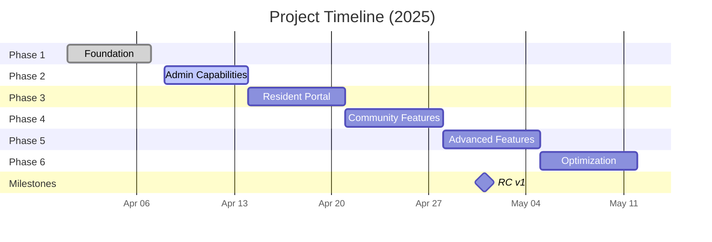

# Lofts des Arts Condominiums

[](https://github.com/mrj0nesmtl/loftsdesarts/blob/main/CHANGELOG.md)
[](https://github.com/mrj0nesmtl/loftsdesarts/blob/main/STATUS.md)
[](https://nextjs.org/)
[](https://www.typescriptlang.org/)
[](https://tailwindcss.com/)
[](https://supabase.io/)
[](LICENSE)

A modern, elegant website for Lofts des Arts Condominiums located in Montreal, Quebec.

**🌐 [Live Site](https://loftsdesarts.replit.app)**

> **Last Updated:** April 5, 2025 | **Release Candidate v1 Target:** May 1-7, 2025

## Overview

This website serves as the digital presence for Lofts des Arts Condominiums, featuring:
- Cinematic landing page with looping hero video (future release)
- Information about the building, history and amenities
- Photo gallery showcasing the property
- Contact information for the Board of Directors
- Admin dashboard for board members and staff (contact form submissions, website content management, and parcel delivery tracking)
- Document management system for storing and sharing important files
- Dark/Light theme toggle for personalized user experience
- Internal messaging system for resident and management communication
- Package management with QR code tracking
- Role-based access control (RBAC) system for granular permissions

## Project Status

### Current Phase: 2.5 - Extended Admin + Messaging Initialization (85% Complete)
- ✅ Document management system fully implemented
- ✅ User management and RBAC system completed
- ✅ Database schema for messaging and package systems created
- ✅ Role-based permission enforcement across all interfaces
- ✅ Basic messaging components implemented
- 🔄 Advanced messaging features in development (threading, scheduling)
- 🔄 Package tracking and notification system in progress (80% complete)
- 🔄 Resident management module in development



## Project Vision

> "Celebrating community living in the heart of Montreal"

The site delivers an elegant, sophisticated experience with an aesthetic that reflects the industrial-chic character of Lofts des Arts. It features high-quality visuals of the building, common areas, and surrounding neighborhood to showcase the unique living experience offered by this condominium.

## Architecture

- **Frontend**: Next.js 14, TypeScript, Tailwind CSS, Shadcn/ui
- **Backend**: Supabase (Auth, Storage, Database, Realtime)
- **Deployment**: Replit
- **Theme System**: Context-based theme provider with localStorage persistence
- **File Storage**: Supabase Storage with custom folder management
- **Messaging**: Supabase Realtime with WebSockets for instant delivery
- **Email Notifications**: SendGrid integration for automated alerts
- **QR Code**: Client and server-side generation and scanning with validation
- **State Management**: Zustand for global application state
- **Access Control**: Custom RBAC implementation with Supabase RLS policies
- **Form Handling**: React Hook Form with Zod validation schemas

## Key Features

### Public-Facing
- **Landing Page** - Featuring hero video and key information about the condominium
- **About Page** - Building history, amenities, and surrounding neighborhood
- **Gallery** - Photo gallery showcasing the condominium's architecture, common spaces, and views
- **Contact** - Contact form for inquiries to the board of directors
- **Theme Toggle** - Dark/Light mode for personalized browsing experience

### Admin Dashboard
- **Authentication**: Secure login for board members and staff
- **Dashboard**: Overview of recent activity and key metrics
- **Inquiries**: View, manage, and respond to contact form submissions
- **Content Management**: Edit the website content and gallery
- **Document Management**: Store, organize, and share important condominium documents
- **Package Tracking**: Comprehensive system for managing resident deliveries
- **Resident Management**: Comprehensive resident information system with CSV import
- **Internal Messaging**: Real-time communication between management and residents
- **Role-Based Access Control**: Granular permission system with six user roles
- **Mobile-Optimized**: Responsive design for managing condominium affairs on the go

### Document Management System
- **Folder Organization**: Create and manage a hierarchical folder structure
- **File Operations**: Upload, download, preview, share, duplicate, and delete files
- **Preview Support**: View images and PDFs directly in the browser
- **Sharing**: Generate expiring links to share documents
- **Metadata**: View file size, type, and creation information
- **Mobile Support**: Fully responsive for on-the-go document access
- **Permission Controls**: Document access based on user roles and permissions

### Messaging & Communication System
- **Real-time Chat**: Instant message delivery via WebSockets (< 2s latency)
- **Group Conversations**: Communication channels for building areas or committees
- **Announcements**: Building-wide or targeted notifications with priority levels
- **File Attachments**: Share documents directly in conversations (up to 10MB)
- **Read Receipts**: Confirm message delivery and reading status
- **Message Threading**: Organized responses to specific messages
- **Rich Text Formatting**: Support for formatting, links, and embedded content
- **Message Scheduling**: Plan future announcements and communications
- **Emoji Reactions**: Quick response capabilities for efficient communication
- **Message Search**: Comprehensive search across all conversations with filters
- **Mobile Experience**: Fully optimized for mobile devices with push notifications

### Package Management System
- **Package Logging**: Simple interface for staff to record incoming packages
- **QR Code Tracking**: Unique QR codes for secure package identification
- **Resident Notifications**: Automatic alerts when packages arrive (email and in-app)
- **Pickup Confirmation**: Digital signature and verification process
- **Tracking History**: Complete audit trail of package status changes
- **Package Analytics**: Insights into delivery patterns and volume trends
- **Photo Capture**: Visual confirmation of package condition on arrival
- **Location Tracking**: Package storage location mapping for quick retrieval
- **Carrier Integration**: Support for major shipping carriers' tracking numbers
- **Expiration Alerts**: Automated reminders for unclaimed packages

### Role-Based Access Control (RBAC) System
- **Granular Permissions**: Fine-grained control over system access
- **Role Hierarchy**: Structured permission inheritance and organization
- **Dynamic UI**: Interface elements adapt based on user permissions
- **Audit Logging**: Comprehensive tracking of permission changes
- **Self-service Portal**: User profile management with role visualization
- **Role Templates**: Pre-defined permission sets for common user types
- **Custom Roles**: Create specialized roles for unique access requirements
- **Permission Testing**: Simulation tools for verifying access rules

## Documentation

This project includes comprehensive documentation to guide development and usage:

- [Project Status](STATUS.md) - Current development status and progress tracking
- [Changelog](CHANGELOG.md) - History of changes and versions
- [Roadmap](ROADMAP.md) - Development plan and timeline for future features
- [Statement of Work](docs/project-management/SOW.md) - Detailed project scope and deliverables
- [Request for Product](docs/project-management/RFP.md) - Original project requirements
- [Developer Documentation](docs/README.md) - Comprehensive guide for developers
- [Database Schema](docs/database/database.md) - Database architecture and relationships
- [Messaging System](docs/database/messaging-system.md) - Messaging system documentation
- [Package System](docs/database/package-system.md) - Package tracking system documentation
- [RBAC System](docs/database/rbac-system.md) - Role-based access control documentation
- [Component Library](docs/components/components.md) - UI component documentation
- [Design System](docs/design/design.md) - Visual design language and principles

## Installation
```bash
git clone https://github.com/mrj0nesmtl/loftsdesarts.git
cd loftsdesarts
npm install
npm run dev
```

For network access (mobile testing):
```bash
npm run dev:network
```

## Environment Setup
Create a `.env.local` file in the project root with the following variables:
```
NEXT_PUBLIC_SUPABASE_URL=your_supabase_url
NEXT_PUBLIC_SUPABASE_ANON_KEY=your_supabase_anon_key
SENDGRID_API_KEY=your_sendgrid_key
NEXT_PUBLIC_APP_URL=http://localhost:3000
```

## Development Timeline

The project is following a phased approach:

- **Phase 1**: Foundation - Core website and admin functionality ✅
- **Phase 2**: Extended Admin - Document management, RBAC, and enhanced analytics 🔵
- **Phase 3**: Resident Portal - Resident accounts, messaging, and package tracking 🟡
- **Phase 4**: Community Features - Events and amenities booking
- **Phase 5**: Advanced Features - Mobile app and integrations
- **Phase 6**: Optimization - Performance and usability improvements

See [ROADMAP.md](ROADMAP.md) for the detailed development plan.

## License

This project is licensed under the MIT License - see the [LICENSE](LICENSE) file for details.
