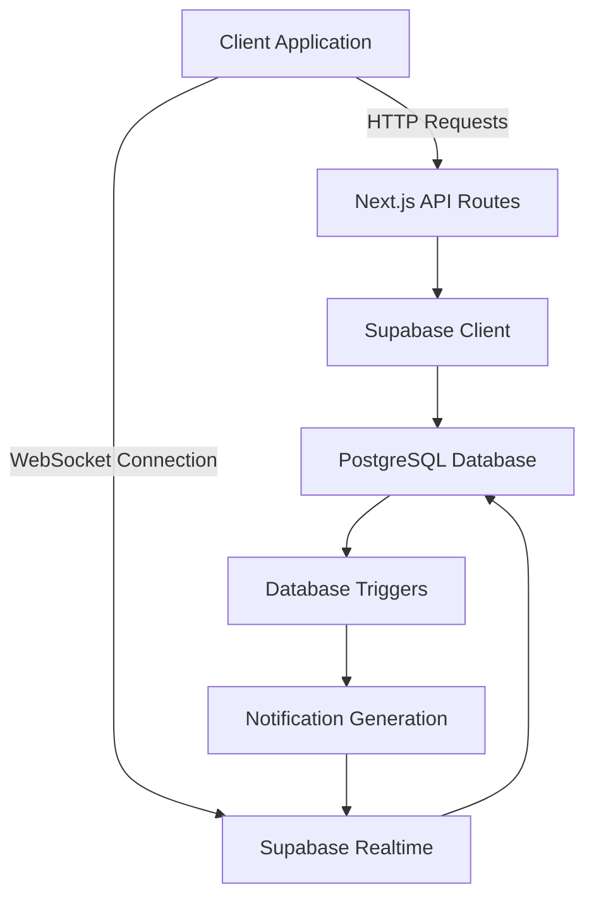
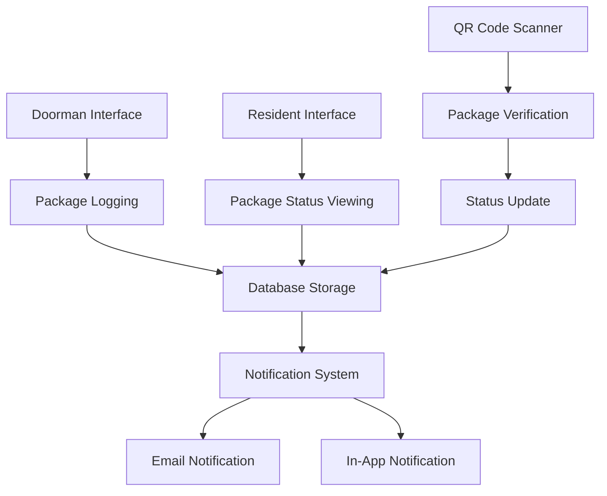
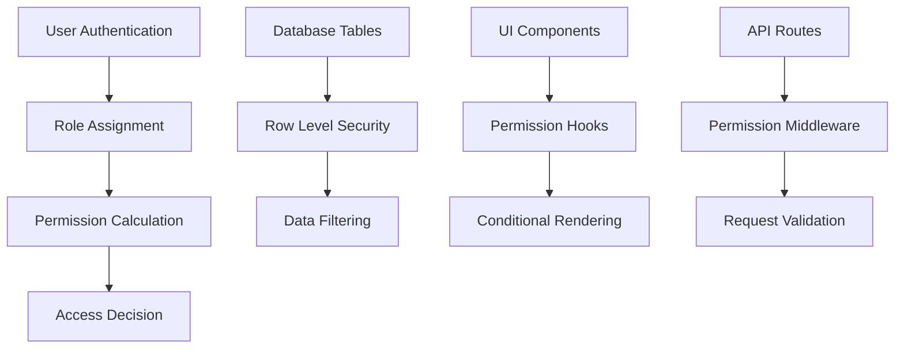
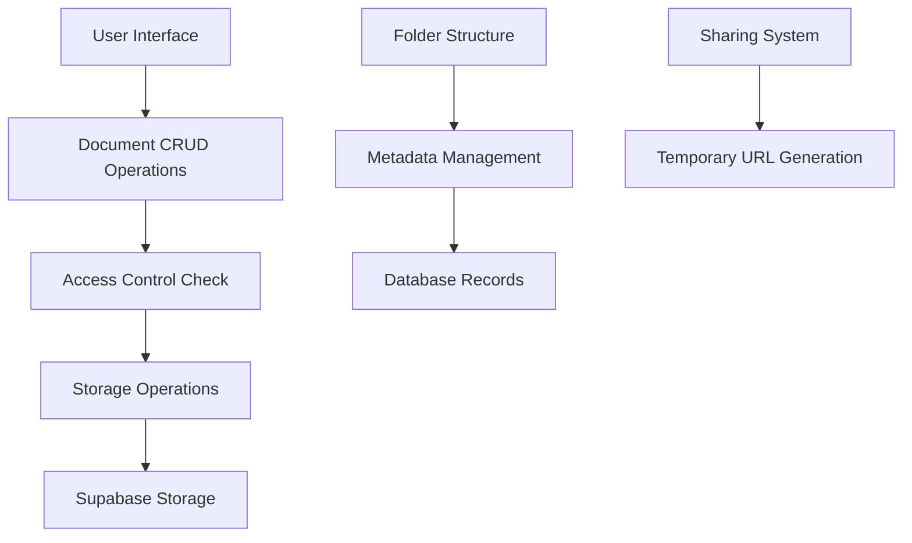
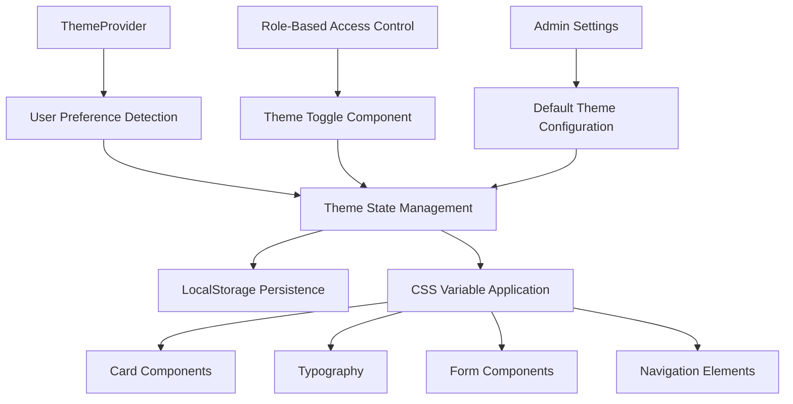
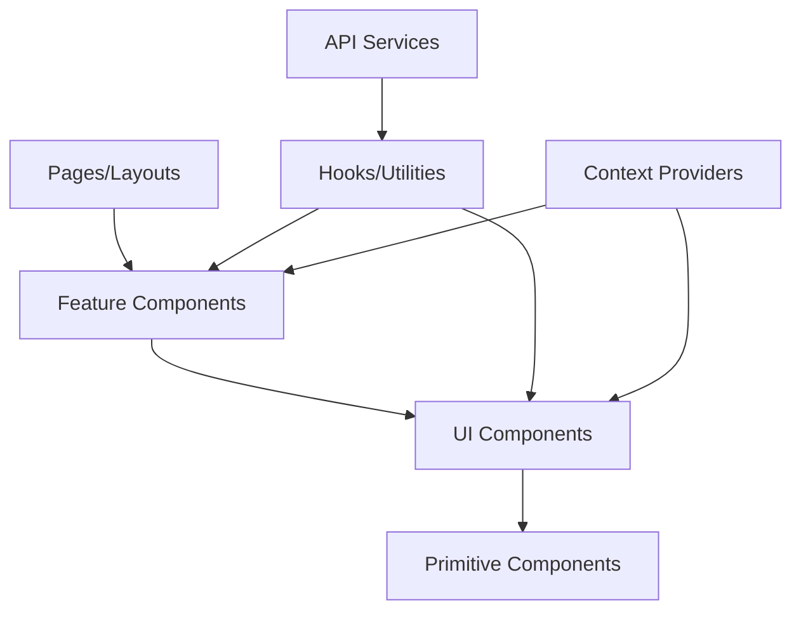

# Architecture Documentation

This directory contains comprehensive documentation of the Lofts des Arts platform architecture, including system design, infrastructure, and technical decisions.

*Last Updated: April 6, 2025 | Version: 0.4.0*

## Directory Structure

- `/diagrams/` - Architectural diagrams and visual representations
  - `/diagrams/system/` - System-level architecture diagrams
  - `/diagrams/data-flow/` - Data flow diagrams for key processes
  - `/diagrams/sequence/` - Sequence diagrams for complex operations
  - `/diagrams/component/` - Component-level architecture diagrams
  - `/diagrams/theme/` - Theme system architecture diagrams
- `/decisions/` - Architecture Decision Records (ADRs)
- `/infrastructure/` - Infrastructure and deployment architecture
- `/patterns/` - Design patterns and architectural patterns
- `/security/` - Security architecture and considerations
- `/performance/` - Performance architecture and optimizations
- `/subsystems/` - Detailed architecture of specific subsystems
  - `/subsystems/messaging/` - Messaging system architecture
  - `/subsystems/package-management/` - Package management architecture
  - `/subsystems/rbac/` - Role-based access control architecture
  - `/subsystems/document-management/` - Document management architecture
  - `/subsystems/theme/` - Theme system architecture

## System Overview

The Lofts des Arts platform follows a modern web application architecture with the following key characteristics:

- **Next.js App Router**: Server-side rendering and client components
- **TypeScript**: Strong typing throughout the application
- **Supabase**: Backend-as-a-Service for database, authentication, and storage
- **Replit**: Hosting and deployment platform
- **TanStack Query**: Data fetching and state management
- **Shadcn/UI + Tailwind CSS**: Component library and styling
- **WebSocket Communication**: Real-time messaging and notifications
- **QR Code System**: Package tracking and verification
- **RBAC System**: Fine-grained access control
- **Theme System**: Comprehensive light/dark mode with admin-only controls

## Architecture Diagrams

Key architecture diagrams include:

- [System Context Diagram](./diagrams/system/system-context.png)
- [Container Diagram](./diagrams/system/container-diagram.png)
- [Component Diagram](./diagrams/component/component-diagram.png)
- [Deployment Diagram](./diagrams/system/deployment-diagram.png)
- [Data Flow Diagram](./diagrams/data-flow/data-flow-overview.png)
- [RBAC System Architecture](./diagrams/component/rbac-architecture.png)
- [Messaging System Architecture](./diagrams/component/messaging-architecture.png)
- [Package Management Architecture](./diagrams/component/package-architecture.png)

## Architectural Principles

The architecture follows these core principles:

1. **Server-first approach**: Utilize server components where possible
2. **Progressive enhancement**: Core functionality works without JavaScript
3. **Type safety**: Strong typing across the entire codebase
4. **Security by design**: Security considered at every level
5. **Resilience**: Graceful degradation and error recovery
6. **Performance**: Optimized for speed and efficiency
7. **Accessibility**: WCAG 2.1 AA compliance
8. **Real-time capability**: Live data updates where appropriate
9. **Mobile-first design**: Responsive from the ground up
10. **Secure by default**: Least privilege access control

## Core Technologies

### Frontend

- **Next.js 14**: React framework with App Router for routing and rendering
- **TypeScript**: Type-safe JavaScript
- **TanStack Query**: Data fetching, caching, and state management
- **Shadcn/UI**: Component library built on Radix UI primitives
- **Tailwind CSS**: Utility-first CSS framework
- **Zustand**: Lightweight state management
- **Theme System**: Context-based theme provider with light/dark mode, role-restricted access, and admin-only controls
- **QR Code Generation/Scanning**: Client-side QR code handling
- **WebSocket Client**: Real-time communication
- **Zod**: Runtime type validation and form handling
- **React Hook Form**: Form state management and validation

### Backend

- **Supabase**: PostgreSQL database with built-in services
- **Next.js API Routes**: Serverless API endpoints
- **PostgreSQL**: Relational database
- **Row Level Security**: Database-level access control
- **Supabase Auth**: Authentication and authorization
- **Supabase Storage**: File storage and management
- **Supabase Realtime**: WebSocket-based real-time updates
- **Supabase Functions**: Edge functions for serverless logic
- **SendGrid**: Email delivery service
- **Postgres Functions**: Database-level custom functions

### Infrastructure

- **Replit**: Hosting and deployment
- **GitHub Actions**: CI/CD pipeline
- **Sentry**: Error monitoring
- **Lighthouse**: Performance monitoring
- **Redis**: Caching (future)

## Data Architecture

The system uses a PostgreSQL database with the following key characteristics:

- **Schema-based design**: Clear separation of concerns
- **Row Level Security**: Fine-grained access control
- **Foreign key relationships**: Data integrity
- **Indexing**: Performance optimization
- **Full-text search**: Efficient content searching
- **Triggers and stored procedures**: Complex database operations
- **Real-time notifications**: WebSocket-enabled tables

Key data entities include:

- Users (managed by Supabase Auth)
- Profiles (linked to users)
- Roles and Permissions (RBAC system)
- Building Units and Residents
- Conversations and Messages
- Packages and Package History
- Documents and Folders
- Media Assets
- Contact Inquiries

## Messaging System Architecture

The messaging system provides real-time communication between residents, building staff, and management, featuring:

### Key Components

1. **Database Tables**:
   - `conversations`: Main container for messages
   - `conversation_participants`: Links users to conversations
   - `messages`: Individual messages
   - `message_attachments`: Files attached to messages
   - `message_reads`: Read receipt tracking

2. **Real-time Communication Flow**:
   - Client connects to Supabase Realtime via WebSocket
   - Changes to relevant tables trigger real-time events
   - Client receives updates and renders new messages

3. **Message Delivery Process**:
   - Message is inserted into the database
   - Database trigger updates the conversation's `last_message_at`
   - Real-time event is dispatched to all participants
   - Recipients mark messages as read, generating read receipts

4. **Security**:
   - Row Level Security ensures users can only access authorized conversations
   - Messages are validated for content safety
   - Attachments are scanned and stored securely
   - User permissions are verified for all operations

## Package Management Architecture

The package management system enables tracking of resident packages from delivery to pickup:

### Key Components

1. **Database Tables**:
   - `packages`: Core package information
   - `package_history`: Status change tracking
   - `package_notifications`: Notification records
   - `carriers`: Shipping carrier information

2. **QR Code System**:
   - Unique QR codes generated for each package
   - Mobile scanning for quick package verification
   - Secure package identification without exposing sensitive data

3. **Notification Flow**:
   - Package logged by doorman
   - System checks resident notification preferences
   - Notifications dispatched via preferred channels
   - Status updates trigger additional notifications

4. **Security**:
   - Role-based access restricts package management to authorized staff
   - Residents can only view their own packages
   - All operations are logged for audit purposes
   - QR codes contain non-sensitive identifiers only

## Role-Based Access Control Architecture

The RBAC system provides fine-grained access control across the platform:

### Key Components

1. **Database Tables**:
   - `roles`: Role definitions
   - `permissions`: Permission definitions
   - `role_permissions`: Maps permissions to roles
   - `user_roles`: Maps users to roles

2. **Permission Checking Flow**:
   - User authenticates with the system
   - System retrieves user's roles and calculates effective permissions
   - Access decisions made based on permission checks
   - UI elements conditionally rendered based on permissions

3. **Implementation Layers**:
   - Database level: Row Level Security policies
   - API level: Permission middleware for endpoints
   - UI level: Permission hooks for conditional rendering

4. **Security**:
   - Hierarchical role structure prevents privilege escalation
   - Temporary roles with expiration dates
   - Permission audit logging
   - Regular permission reviews

## Document Management Architecture

The document management system provides secure storage and organization of condominium documents:

### Key Components

1. **Database Tables**:
   - `documents`: Document metadata
   - `folders`: Folder structure
   - `document_permissions`: Access control settings

2. **Storage Organization**:
   - Hierarchical folder structure
   - Metadata stored in database
   - Files stored in Supabase Storage

3. **Access Control**:
   - Role-based document visibility
   - Folder-level permissions
   - Document-specific sharing capabilities

4. **File Operations**:
   - Secure upload with type validation
   - Preview generation for common formats
   - Version control for important documents

## Security Architecture

Security is implemented at multiple levels:

### Authentication

- **Supabase Auth**: JWT-based authentication
- **Password Policies**: Strong password requirements
- **MFA Support**: Two-factor authentication for sensitive roles
- **Session Management**: Secure session handling with appropriate timeouts

### Authorization

- **RBAC System**: Role-based access control with fine-grained permissions
- **Row Level Security**: Database-level access control
- **API Middleware**: Permission checks at the API layer
- **UI Restrictions**: Conditional rendering based on permissions

### Data Protection

- **HTTPS**: Encrypted communication
- **Input Validation**: Zod schema validation for all inputs
- **Output Sanitization**: Prevent XSS and injection attacks
- **CORS Policy**: Strict cross-origin resource sharing
- **CSP Headers**: Content Security Policy implementation
- **Rate Limiting**: Protection against abuse and brute force

### Audit and Compliance

- **Activity Logging**: Comprehensive audit trail of important actions
- **Security Monitoring**: Regular review of access patterns
- **Vulnerability Scanning**: Automated security testing
- **Compliance Checks**: Regular security assessment

## Theme Architecture

The platform implements a comprehensive theming system with the following characteristics:

- **Context-based Provider**: React context for theme state management
- **Light/Dark Modes**: Complete design system for both light and dark themes
- **User Preferences**: Theme selection based on user preference
- **Role-Based Access**: Theme toggle restricted to administrative interfaces only
- **Persistence**: Local storage for saved theme preferences
- **System Detection**: Default theme based on user's system preferences
- **CSS Variables**: Theme values implemented as CSS variables for consistency
- **Hydration Safe**: Designed to prevent hydration mismatches between server and client
- **Transition Effects**: Smooth transitions between theme modes
- **Component Consistency**: Unified theming across all UI components
- **Theme-Aware Classes**: Components use standardized class naming for theme compatibility
- **Admin Dashboard Integration**: Centralized theme controls in admin settings
- **Public/Admin Separation**: Different theme controls for public and admin interfaces

The theme implementation follows these design principles:

1. **Consistency First**: All UI components use the same theme-aware class structure
2. **Admin Control**: Theme toggling limited to administrative users
3. **Transparent Transitions**: Theme changes occur with smooth visual transitions
4. **Semantic Variables**: Theme values use meaningful CSS variable names
5. **Fallback Support**: Graceful degradation for browsers without CSS variable support
6. **Component Isolation**: Components remain functional regardless of theme context

### Theme System Implementation

### Theme Transition System

The transition system ensures smooth visual changes when switching themes:

1. User triggers theme change via admin interface
2. Theme state updates in React context
3. CSS variables change with transition properties
4. Component backgrounds, text, and borders animate to new values
5. LocalStorage updates for persistence
6. Theme preference is tied to user profile (planned feature)

### Theme Class Structure

Components follow a consistent class naming pattern:

- `bg-card`: Card and container backgrounds
- `bg-muted`: Secondary or muted backgrounds
- `text-primary`: Primary text content
- `text-muted-foreground`: Secondary or less important text
- `border-border`: Border elements
- `theme-transition`: Applied to elements that should transition smoothly

This consistent naming enables all components to respond uniformly to theme changes without individual component modifications.

## Performance Architecture

Performance optimization strategies include:

- **Server Components**: Reduced client-side JavaScript
- **Static Generation**: Pre-rendered content where appropriate
- **Incremental Static Regeneration**: Updated static content
- **Image Optimization**: Next.js Image component
- **Code Splitting**: Optimized bundle sizes
- **Caching**: Supabase data caching and HTTP caching
- **Connection Pooling**: Efficient database connection management
- **Query Optimization**: Carefully designed database queries
- **Lazy Loading**: Components and resources loaded as needed
- **Resource Compression**: Minimized asset sizes
- **Tree Shaking**: Elimination of unused code

## Scalability Considerations

The architecture is designed to scale in the following ways:

- **Horizontal Scaling**: Adding more compute resources
- **Database Scaling**: PostgreSQL scaling options
- **Static Content**: CDN distribution
- **Caching**: Multi-level caching strategy
- **Edge Functions**: Geographically distributed processing
- **Microservices**: Future decomposition into specialized services
- **Load Balancing**: Distribution of traffic across instances

## Architecture Decision Records

Significant architectural decisions are documented as Architecture Decision Records (ADRs) in the [decisions directory](./decisions/).

Key decisions include:

- [ADR-001: Adoption of Next.js App Router](./decisions/adr-001-nextjs-app-router.md)
- [ADR-002: Supabase as Backend-as-a-Service](./decisions/adr-002-supabase-backend.md)
- [ADR-003: Shadcn/UI Component Library](./decisions/adr-003-shadcn-ui.md)
- [ADR-004: TanStack Query for Data Management](./decisions/adr-004-tanstack-query.md)
- [ADR-005: Role-Based Access Control Implementation](./decisions/adr-005-rbac-implementation.md)
- [ADR-006: Real-time Messaging Architecture](./decisions/adr-006-messaging-architecture.md)
- [ADR-007: Package Management System Design](./decisions/adr-007-package-system.md)
- [ADR-008: Document Management System](./decisions/adr-008-document-system.md)
- [ADR-009: Theme System Architecture](./decisions/adr-009-theme-system.md)

## Messaging System Implementation

The messaging system is implemented using the following technologies and patterns:

### Client-Side Components

- **Conversation List**: Displays all user conversations with previews
- **Message Thread**: Shows messages within a selected conversation
- **Message Composer**: Interface for creating and sending messages
- **Attachment Handler**: Manages file attachments to messages
- **Real-time Listener**: WebSocket connection for live updates

### Server-Side Implementation

- **Message Processing**: Validates and stores new messages
- **Participant Management**: Handles conversation membership
- **Attachment Storage**: Secures and organizes message attachments
- **Notification Dispatch**: Alerts users to new messages

### Data Flow

1. User composes a message and clicks send
2. Client validates message content
3. API request submits message to server
4. Server stores message and updates conversation metadata
5. WebSocket events notify all participants
6. Recipients' interfaces update in real-time
7. Read receipts are recorded when messages are viewed

## Package Management Implementation

The package management system is implemented using the following components:

### Staff Interface

- **Package Logging Form**: Input fields for package details
- **QR Code Generator**: Creates scannable package identifiers
- **Status Management**: Updates package status through lifecycle
- **Resident Search**: Quickly finds the correct recipient

### Resident Interface

- **Package List**: Shows all packages for the resident
- **Package Details**: Full information about each package
- **Notification Preferences**: Settings for delivery alerts
- **QR Code Display**: Shows code for pickup verification

### Workflow

1. Package arrives at building
2. Doorman logs package details and recipient
3. System generates unique QR code
4. Resident receives notification of package arrival
5. Resident comes to pick up package
6. Doorman scans QR code to verify package
7. Package status is updated to "Delivered"
8. Complete history is maintained for audit purposes

## Role-Based Access Control Implementation

The RBAC system is implemented with multiple layers:

### Database Layer

- **Role Definitions**: Clear hierarchy of user roles
- **Permission Mappings**: Granular permissions assigned to roles
- **Row Level Security**: Database-level access control
- **Permission Functions**: Efficient permission checking

### API Layer

- **Permission Middleware**: Route protection based on permissions
- **Role Verification**: User role validation for operations
- **Error Handling**: Clear permission denied responses
- **Audit Logging**: Tracking of permission checks

### UI Layer

- **Permission Hooks**: React hooks for permission checking
- **Conditional Rendering**: UI elements shown based on permissions
- **Role Guards**: Component wrappers to restrict access
- **Error States**: Graceful handling of unauthorized access

## Future Architecture Considerations

Planned architectural enhancements include:

- Redis caching integration
- WebSocket real-time updates expansion
- AI-powered content features
- Enhanced search capabilities
- Multi-region deployment
- Voice and video message support
- Native mobile application architecture
- Automated testing infrastructure
- Performance monitoring system
- Analytics architecture
- Backup and disaster recovery improvements
- Microservices decomposition for selected features

## Architecture Challenges and Solutions

| Challenge | Solution | Implementation |
|-----------|----------|----------------|
| Real-time data synchronization | WebSocket connections with Supabase Realtime | Conversation and message subscriptions with optimistic UI updates |
| Access control complexity | Multi-layered RBAC system with permission caching | Database RLS + API middleware + UI permission hooks |
| Mobile responsiveness with rich features | Progressive enhancement and adaptive layouts | Mobile-first design with feature detection and fallbacks |
| Data consistency across interfaces | Single source of truth with TanStack Query | Server-validated data with optimistic UI updates |
| Large document management | Chunked uploads and streaming downloads | Progressive file upload with progress indicators |
| Package tracking accuracy | QR code system with verification | Unique identifiers with cryptographic verification |
| Performance with real-time features | Selective subscription and efficient rendering | Component-level optimization and subscription management |
| Multi-language support | Internationalization infrastructure | Server components with language detection |

## Component Architecture

The application uses a layered component architecture:

1. **Pages/Layouts**: Route-specific components and layouts
2. **Feature Components**: Domain-specific components (e.g., ConversationList, PackageForm)
3. **UI Components**: Reusable, styled components (e.g., Card, Modal)
4. **Primitive Components**: Base-level UI elements (e.g., Button, Input)
5. **Hooks/Utilities**: Reusable logic (e.g., usePermission, useConversation)
6. **Context Providers**: State management (e.g., ThemeProvider, AuthProvider)
7. **API Services**: Data access layer (e.g., messageService, packageService)

## Deployment Architecture

The deployment architecture includes:

- **Replit Infrastructure**: Primary hosting platform
- **GitHub-based CI/CD**: Automated testing and deployment
- **Multi-environment Setup**: Development, staging, and production
- **Feature Branch Previews**: Temporary deployments for PR review
- **Automated Testing**: Integration and unit tests in pipeline
- **Monitoring System**: Real-time performance and error tracking
- **Backup System**: Regular data backups and recovery procedures

## References

- [Next.js Documentation](https://nextjs.org/docs)
- [Supabase Documentation](https://supabase.com/docs)
- [TanStack Query Documentation](https://tanstack.com/query/latest/docs/react/overview)
- [C4 Model for Architecture Documentation](https://c4model.com/)
- [OWASP Web Security Guidelines](https://owasp.org/www-project-web-security-testing-guide/)
- [Web Accessibility Initiative (WAI)](https://www.w3.org/WAI/)
- [Node.js Best Practices](https://github.com/goldbergyoni/nodebestpractices)
- [React Patterns](https://reactpatterns.com/) 