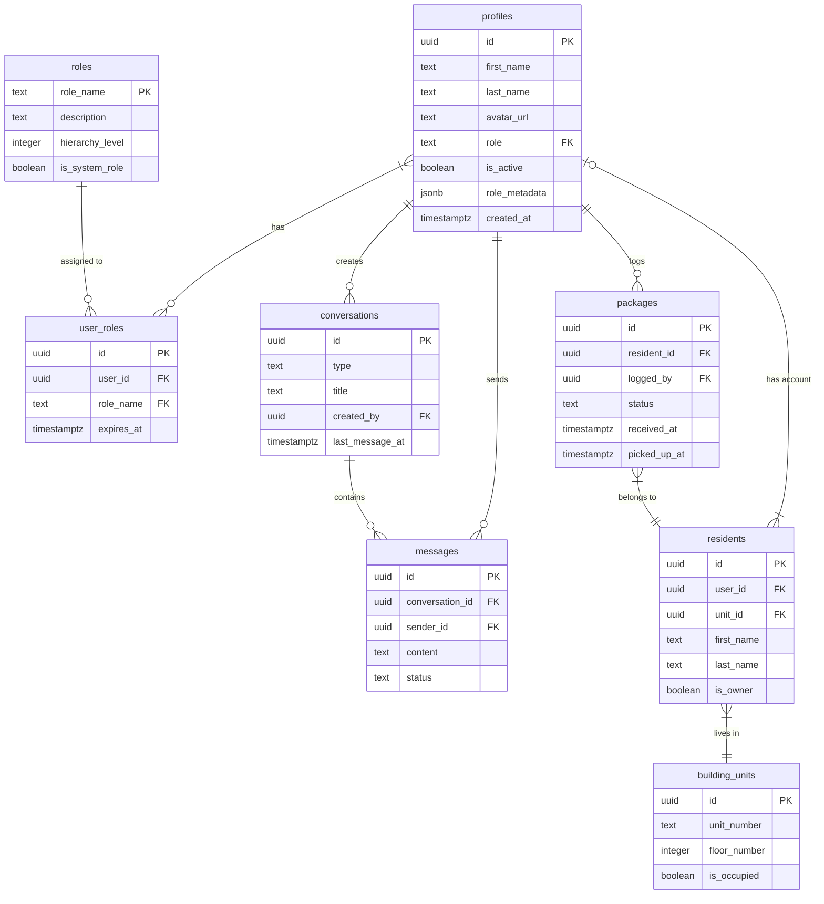

# Database Documentation

This directory contains comprehensive documentation for the Lofts des Arts database architecture, schema design, and data access patterns.

*Last Updated: April 5, 2025 | Version: 0.2.0*

## Directory Structure

- `/schema/` - Database schema definitions and ERD diagrams
- `/migrations/` - Documentation for database migrations
- `/queries/` - Common SQL queries and examples
- `/access-patterns/` - Data access patterns and optimization strategies
- `/security/` - Row Level Security (RLS) policies and configuration
- `/messaging-system.md` - Real-time messaging system documentation
- `/package-system.md` - Package management system documentation
- `/rbac-system.md` - Role-based access control system documentation
- `/backup/` - Backup and recovery procedures

## Database Overview

The Lofts des Arts platform uses Supabase with PostgreSQL as its database, providing:

- Relational data storage with strong consistency
- Row Level Security for fine-grained access control
- Full-text search capabilities
- Real-time data subscriptions for messaging and notifications
- Automated backups and point-in-time recovery
- WebSocket connections for live updates
- Stored procedures and triggers for complex operations

## Database Schema

The database is organized into several key schemas:

- `public`: Primary application data
- `auth`: Managed by Supabase Auth
- `storage`: Managed by Supabase Storage
- `realtime`: Support for WebSocket subscriptions
- `extensions`: PostgreSQL extensions for enhanced functionality

### Core Tables

The main tables in the database include:

#### Users and Profiles

- `auth.users`: Managed by Supabase Auth, contains user authentication data
- `public.profiles`: Extended user profile information
  - Linked to `auth.users` via `id` foreign key
  - Contains display name, avatar, role, and preferences
- `public.roles`: Role definitions for RBAC system
- `public.user_roles`: Role assignments for users
- `public.permissions`: Permission definitions 
- `public.role_permissions`: Permission assignments to roles

#### Content Management

- `public.pages`: Static page content with multilingual support
- `public.media`: Media assets and metadata
- `public.documents`: Document storage with metadata
- `public.folders`: Folder organization for documents
- `public.document_permissions`: Access control for documents

#### Building Management

- `public.building_units`: Units/apartments in the building
- `public.residents`: Information about building residents
- `public.resident_notification_preferences`: Communication preferences
- `public.maintenance_requests`: Service and maintenance tickets
- `public.announcements`: Building-wide announcements and notices

#### Communication

- `public.contact_inquiries`: Contact form submissions and inquiries
- `public.conversations`: Messaging system conversation containers
- `public.conversation_participants`: User participation in conversations
- `public.messages`: Individual messages within conversations
- `public.message_attachments`: Files attached to messages
- `public.message_reads`: Read receipt tracking for messages
- `public.notifications`: System and user notifications

#### Package Management

- `public.packages`: Package tracking information
- `public.package_history`: Status change history for packages
- `public.package_notifications`: Notifications sent about packages
- `public.carriers`: Shipping carrier information
- `public.resident_notification_preferences`: Delivery notification settings

### Entity Relationship Diagram

The main entity relationships are documented in the [Entity Relationship Diagram](./schema/erd.png).



## Row Level Security

Row Level Security (RLS) is implemented at the database level to enforce access control:

### RLS Policies

#### Profiles Table

- `profiles_public_read`: Anyone can read basic profile information
- `profiles_owner_update`: Users can update their own profiles
- `profiles_admin_all`: Administrators have full access to all profiles

#### Conversations Table

- `conversations_participants_select`: Users can only view conversations they participate in
- `conversations_create`: Any authenticated user can create conversations
- `conversations_participant_update`: Only conversation participants can update conversations
- `conversations_owner_delete`: Only conversation owners can delete conversations

#### Packages Table

- `packages_admin_doorman_all`: Administrators and doormen can manage all packages
- `packages_resident_view_own`: Residents can only view their own packages
- `packages_doorman_create`: Only doormen can create new package records
- `packages_doorman_admin_update`: Only doormen and administrators can update packages

Detailed policy definitions can be found in the [RLS Policies documentation](./security/rls-policies.md).

### RLS Policy Implementation Examples

#### Conversation Table Policies

```sql
-- Enable RLS on the conversations table
ALTER TABLE public.conversations ENABLE ROW LEVEL SECURITY;

-- Users can view conversations they are participants in
CREATE POLICY "Users can view conversations they are part of"
  ON conversations FOR SELECT
  USING (
    id IN (
      SELECT conversation_id FROM conversation_participants WHERE user_id = auth.uid()
    )
    OR 
    (type = 'announcement' AND EXISTS (
      SELECT 1 FROM profiles WHERE id = auth.uid() AND role IN ('ADMIN', 'MANAGER', 'BOARD_MEMBER')
    ))
  );

-- Users can create new conversations
CREATE POLICY "Users can create conversations"
  ON conversations FOR INSERT
  WITH CHECK (created_by = auth.uid());

-- Only owners and admins can update conversations
CREATE POLICY "Conversation owners and admins can update conversations"
  ON conversations FOR UPDATE
  USING (
    EXISTS (
      SELECT 1 FROM conversation_participants 
      WHERE conversation_id = id 
      AND user_id = auth.uid() 
      AND role IN ('owner', 'admin')
    )
    OR
    (type = 'announcement' AND EXISTS (
      SELECT 1 FROM profiles WHERE id = auth.uid() AND role IN ('ADMIN', 'MANAGER')
    ))
  );
```

## Database Access Patterns

### Data Access Methods

The application accesses the database through:

1. **Supabase JavaScript Client**:
   - Used for client-side queries with RLS applied
   - Provides real-time subscriptions for live updates
   - Handles WebSocket connections for messaging

2. **Server-Side API Routes**:
   - Uses Supabase Admin client for privileged operations
   - Implements additional business logic and validation
   - Executes complex queries and transactions

3. **Direct SQL** (migrations and maintenance):
   - Used for schema migrations
   - Used for administrative tasks
   - Executes stored procedures and complex operations

### Common Query Patterns

Examples of common query patterns:

#### Fetching Profile Data

```typescript
// Client-side with RLS applied
const { data, error } = await supabase
  .from('profiles')
  .select('id, first_name, last_name, avatar_url, role, role_metadata')
  .eq('id', userId);
```

#### Fetching User Conversations with Latest Messages

```typescript
// Get user's conversations with latest message preview
const { data, error } = await supabase
  .from('conversations')
  .select(`
    id,
    type,
    title,
    created_at,
    last_message_at,
    conversation_participants!inner(user_id),
    messages(
      id, 
      content,
      created_at,
      sender_id,
      profiles(first_name, last_name, avatar_url)
    )
  `)
  .eq('conversation_participants.user_id', userId)
  .order('last_message_at', { ascending: false })
  .limit(1, { foreignTable: 'messages' });
```

#### Creating a New Package

```typescript
// Log a new package with doorman user
const { data, error } = await supabase
  .from('packages')
  .insert({
    resident_id: residentId,
    logged_by: auth.uid(),
    carrier_id: carrierId,
    tracking_number: trackingNumber,
    description: description,
    status: 'RECEIVED',
    received_at: new Date().toISOString(),
    notification_sent: false
  });
```

#### Checking User Permissions

```typescript
// Using custom RPC function to check permissions
const { data, error } = await supabase.rpc('has_permission', {
  user_id: userId,
  permission_name: 'documents:create'
});

// Proceed if data === true
```

More query examples can be found in the [Query Examples](./queries/README.md) section.

## Real-time Subscriptions

The database supports real-time data subscriptions through Supabase Realtime:

```typescript
// Subscribe to new messages in a conversation
const subscription = supabase
  .channel(`conversation:${conversationId}`)
  .on(
    'postgres_changes',
    {
      event: 'INSERT',
      schema: 'public',
      table: 'messages',
      filter: `conversation_id=eq.${conversationId}`
    },
    (payload) => {
      // Handle new message
      console.log('New message:', payload.new);
    }
  )
  .subscribe();
```

## Database Functions and Triggers

Custom PostgreSQL functions and triggers enhance database functionality:

### Permission Checking Functions

```sql
-- Function to check if a user has a specific permission
CREATE OR REPLACE FUNCTION public.has_permission(user_id UUID, permission_name TEXT)
RETURNS BOOLEAN AS $$
BEGIN
  RETURN (
    -- Check for direct permission assignment
    EXISTS (
      SELECT 1 FROM public.user_permissions up
      JOIN public.permissions p ON up.permission_id = p.id
      WHERE up.user_id = $1
      AND p.name = $2
      AND (up.expires_at IS NULL OR up.expires_at > now())
    )
    OR
    -- Check for permission via role
    EXISTS (
      SELECT 1 FROM public.user_roles ur
      JOIN public.role_permissions rp ON ur.role_name = rp.role_name
      JOIN public.permissions p ON rp.permission_id = p.id
      WHERE ur.user_id = $1
      AND p.name = $2
      AND (ur.expires_at IS NULL OR ur.expires_at > now())
    )
  );
END;
$$ LANGUAGE plpgsql SECURITY DEFINER;
```

### Package History Trigger

```sql
-- Function to update package history on status change
CREATE OR REPLACE FUNCTION update_package_history()
RETURNS TRIGGER AS $$
BEGIN
  IF OLD.status IS NULL OR NEW.status != OLD.status THEN
    INSERT INTO package_history (package_id, status, changed_by)
    VALUES (NEW.id, NEW.status, auth.uid());
  END IF;
  RETURN NEW;
END;
$$ LANGUAGE plpgsql SECURITY DEFINER;

-- Trigger to update package history
CREATE TRIGGER update_package_history
AFTER UPDATE ON packages
FOR EACH ROW
EXECUTE FUNCTION update_package_history();
```

## Database Migrations

Database migrations are managed through SQL scripts and Supabase migrations:

- Migration scripts are stored in the `/sql` directory
- Each migration is versioned and applied sequentially
- Migrations are tracked in version control
- Database schema is validated before deployment

The migration process follows these steps:

1. Development of migration script locally
2. Testing in development environment
3. Peer review of migration code
4. Application to staging environment for testing
5. Production deployment during maintenance window

The migration process is documented in [Migration Procedures](./migrations/README.md).

## Indexes and Performance

The database uses the following indexes for performance optimization:

- Primary keys on all tables
- Foreign key indexes for relationships
- Full-text search indexes for text columns
- Custom indexes for frequent query patterns
- Composite indexes for multi-column filtering
- Expression indexes for computed values

```sql
-- Examples of performance-optimizing indexes
CREATE INDEX idx_conversations_last_message_at ON conversations(last_message_at DESC);
CREATE INDEX idx_messages_conversation_created_at ON messages(conversation_id, created_at DESC);
CREATE INDEX idx_packages_resident_status ON packages(resident_id, status);
CREATE INDEX idx_user_roles_user_role ON user_roles(user_id, role_name);
CREATE INDEX idx_message_content_search ON messages USING GIN (to_tsvector('english', content));
```

Performance optimization strategies are documented in [Performance Tuning](./access-patterns/performance.md).

## Backup and Recovery

The database backup strategy includes:

- Automated daily backups via Supabase
- Point-in-time recovery capability
- Manual backup procedures for critical operations
- Weekly validated recovery tests
- Offsite backup storage for disaster recovery
- 90-day retention policy for backups

Backup procedures are documented in [Backup and Recovery](./backup/README.md).

## Security Considerations

Database security is implemented through multiple layers:

- Connection encryption (SSL/TLS)
- Row Level Security policies
- Password policies and hashing
- Role-based access control
- Audit logging
- Prepared statements to prevent SQL injection
- Regular security scanning and vulnerability testing
- Principle of least privilege for database roles

### Database Security Best Practices

1. **Never expose database credentials in client-side code**
2. **Use RLS policies to restrict data access**
3. **Implement proper input validation before database operations**
4. **Set appropriate timeout policies for database connections**
5. **Regularly audit database access patterns**
6. **Use parameterized queries to prevent SQL injection**
7. **Encrypt sensitive data at rest**
8. **Implement rate limiting for database operations**

Security practices are documented in [Security Best Practices](./security/README.md).

## Future Enhancements

Planned database enhancements include:

- Real-time notifications for admin users
- Enhanced search capabilities with specialized indexes
- Archiving strategies for historical data
- Performance optimization for increased scale
- Automated database health monitoring
- Multi-region database replication
- Enhanced analytics and reporting capabilities
- Machine learning integration for anomaly detection

## Troubleshooting

Common database issues and their solutions are documented in [Troubleshooting Guide](./troubleshooting.md).

### Common Database Errors

| Error | Possible Cause | Solution |
|-------|----------------|----------|
| `new row violates row-level security policy` | Missing or incorrect RLS policy | Check user's role and permissions, verify RLS policies |
| `duplicate key value violates unique constraint` | Attempting to insert duplicate record | Implement upsert pattern or check for existing record |
| `relation does not exist` | Table not created or wrong schema | Verify schema name and table existence |
| `permission denied for table` | Insufficient database permissions | Check user role and grant appropriate permissions |
| `connection timeout` | Database overload or network issues | Implement connection pooling and retry logic |

## References

- [Supabase Documentation](https://supabase.com/docs)
- [PostgreSQL Documentation](https://www.postgresql.org/docs/)
- [SQL Style Guide](./sql-style-guide.md)
- [Supabase Row Level Security Guide](https://supabase.com/docs/guides/auth/row-level-security)
- [PostgreSQL Performance Optimization](https://www.postgresql.org/docs/current/performance-tips.html)
- [Database Security Best Practices](https://www.postgresql.org/docs/current/security.html) 