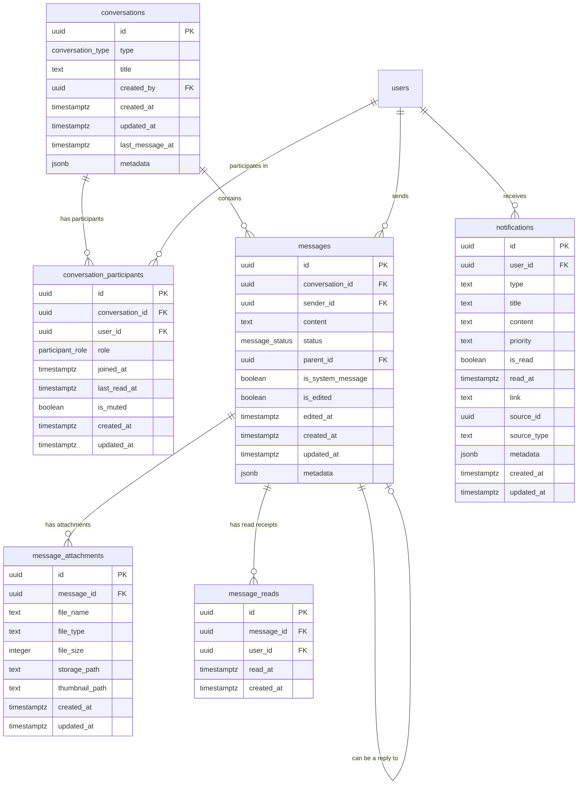

# Messaging System Database Documentation

*Last Updated: April 6, 2025 | Version: 0.4.0*

This document provides comprehensive documentation for the Lofts des Arts messaging system database schema, including table structures, relationships, security policies, and usage patterns.

## Overview

The messaging system enables real-time communication between residents, building staff, and management. It supports direct messaging, group conversations, announcements, and system notifications, with features for file attachments and read receipts.

## Database Schema



## Table Descriptions

### `conversations`

Stores the main conversation containers for messages.

| Column | Type | Description |
|--------|------|-------------|
| `id` | UUID | Primary key |
| `type` | conversation_type | Type of conversation (direct, group, announcement, system) |
| `title` | TEXT | Optional title for group/announcement conversations |
| `created_by` | UUID | Foreign key to auth.users, creator of the conversation |
| `created_at` | TIMESTAMPTZ | Creation timestamp |
| `updated_at` | TIMESTAMPTZ | Last update timestamp |
| `last_message_at` | TIMESTAMPTZ | Timestamp of the last message |
| `metadata` | JSONB | Additional conversation settings and metadata |

### `conversation_participants`

Maps users to conversations they participate in.

| Column | Type | Description |
|--------|------|-------------|
| `id` | UUID | Primary key |
| `conversation_id` | UUID | Foreign key to conversations |
| `user_id` | UUID | Foreign key to auth.users |
| `role` | participant_role | Role in the conversation (owner, admin, member) |
| `joined_at` | TIMESTAMPTZ | When the user joined the conversation |
| `last_read_at` | TIMESTAMPTZ | When the user last read the conversation |
| `is_muted` | BOOLEAN | Whether the user has muted notifications |
| `created_at` | TIMESTAMPTZ | Creation timestamp |
| `updated_at` | TIMESTAMPTZ | Last update timestamp |

### `messages`

Stores individual messages within conversations.

| Column | Type | Description |
|--------|------|-------------|
| `id` | UUID | Primary key |
| `conversation_id` | UUID | Foreign key to conversations |
| `sender_id` | UUID | Foreign key to auth.users |
| `content` | TEXT | Message content |
| `status` | message_status | Message status (sent, delivered, read) |
| `parent_id` | UUID | Foreign key to messages for threaded replies |
| `is_system_message` | BOOLEAN | Whether it's an automated system message |
| `is_edited` | BOOLEAN | Whether the message has been edited |
| `edited_at` | TIMESTAMPTZ | When the message was last edited |
| `created_at` | TIMESTAMPTZ | Creation timestamp |
| `updated_at` | TIMESTAMPTZ | Last update timestamp |
| `metadata` | JSONB | Additional message metadata |

### `message_attachments`

Stores files attached to messages.

| Column | Type | Description |
|--------|------|-------------|
| `id` | UUID | Primary key |
| `message_id` | UUID | Foreign key to messages |
| `file_name` | TEXT | Original file name |
| `file_type` | TEXT | MIME type of the file |
| `file_size` | INTEGER | File size in bytes |
| `storage_path` | TEXT | Path in Supabase Storage |
| `thumbnail_path` | TEXT | Optional path to thumbnail for images |
| `created_at` | TIMESTAMPTZ | Creation timestamp |
| `updated_at` | TIMESTAMPTZ | Last update timestamp |

### `message_reads`

Tracks read receipts for messages.

| Column | Type | Description |
|--------|------|-------------|
| `id` | UUID | Primary key |
| `message_id` | UUID | Foreign key to messages |
| `user_id` | UUID | Foreign key to auth.users |
| `read_at` | TIMESTAMPTZ | When the message was read |
| `created_at` | TIMESTAMPTZ | Creation timestamp |

### `notifications`

Stores system and user notifications.

| Column | Type | Description |
|--------|------|-------------|
| `id` | UUID | Primary key |
| `user_id` | UUID | Foreign key to auth.users |
| `type` | TEXT | Notification type (new_message, mention, reply, etc.) |
| `title` | TEXT | Notification title |
| `content` | TEXT | Notification content |
| `priority` | TEXT | Priority level (low, medium, high, urgent) |
| `is_read` | BOOLEAN | Whether the notification has been read |
| `read_at` | TIMESTAMPTZ | When the notification was read |
| `link` | TEXT | Optional link to navigate to |
| `source_id` | UUID | ID of the source object (message, conversation) |
| `source_type` | TEXT | Type of the source object |
| `metadata` | JSONB | Additional notification data |
| `created_at` | TIMESTAMPTZ | Creation timestamp |
| `updated_at` | TIMESTAMPTZ | Last update timestamp |

## Enumerated Types

### `conversation_type`

Defines the types of conversations possible in the system.

```sql
CREATE TYPE conversation_type AS ENUM (
  'direct', -- One-to-one conversation between two users
  'group', -- Group conversation with multiple participants
  'announcement', -- Broadcast messages from admin/board to users
  'system' -- System messages (notifications, alerts)
);
```

### `message_status`

Defines the delivery status of messages.

```sql
CREATE TYPE message_status AS ENUM (
  'sent',
  'delivered',
  'read'
);
```

### `participant_role`

Defines the possible roles within a conversation.

```sql
CREATE TYPE participant_role AS ENUM (
  'owner',
  'admin',
  'member'
);
```

## Indexes

The following indexes are implemented for query performance:

```sql
-- Conversations table indexes
CREATE INDEX conversations_created_by_idx ON conversations(created_by);
CREATE INDEX conversations_updated_at_idx ON conversations(updated_at);
CREATE INDEX conversations_last_message_idx ON conversations(last_message_at);

-- Conversation participants indexes
CREATE INDEX conversation_participants_conversation_id_idx ON conversation_participants(conversation_id);
CREATE INDEX conversation_participants_user_id_idx ON conversation_participants(user_id);
CREATE INDEX conversation_participants_last_read_at_idx ON conversation_participants(last_read_at);

-- Messages indexes
CREATE INDEX messages_conversation_id_idx ON messages(conversation_id);
CREATE INDEX messages_sender_id_idx ON messages(sender_id);
CREATE INDEX messages_parent_id_idx ON messages(parent_id);
CREATE INDEX messages_created_at_idx ON messages(created_at);

-- Message attachments index
CREATE INDEX message_attachments_message_id_idx ON message_attachments(message_id);

-- Message reads indexes
CREATE INDEX message_reads_message_id_idx ON message_reads(message_id);
CREATE INDEX message_reads_user_id_idx ON message_reads(user_id);

-- Notifications indexes
CREATE INDEX notifications_user_id_idx ON notifications(user_id);
CREATE INDEX notifications_is_read_idx ON notifications(is_read);
CREATE INDEX notifications_created_at_idx ON notifications(created_at);
CREATE INDEX notifications_priority_idx ON notifications(priority);
CREATE INDEX notifications_source_id_idx ON notifications(source_id);
```

## Row Level Security (RLS) Policies

### Conversations Table

```sql
-- Users can view conversations they are part of
CREATE POLICY "Users can view conversations they are part of"
  ON conversations FOR SELECT
  USING (
    id IN (
      SELECT conversation_id FROM conversation_participants WHERE user_id = auth.uid()
    )
    OR 
    (type = 'announcement' AND EXISTS (
      SELECT 1 FROM profiles WHERE id = auth.uid() AND role IN ('ADMIN', 'BOARD', 'SYNDIC')
    ))
  );

-- Users can create conversations
CREATE POLICY "Users can create conversations"
  ON conversations FOR INSERT
  WITH CHECK (created_by = auth.uid());

-- Conversation owners and admins can update conversations
CREATE POLICY "Conversation owners and admins can update conversations"
  ON conversations FOR UPDATE
  USING (
    EXISTS (
      SELECT 1 FROM conversation_participants 
      WHERE conversation_id = id 
      AND user_id = auth.uid() 
      AND role IN ('owner', 'admin')
    )
    OR
    (type = 'announcement' AND EXISTS (
      SELECT 1 FROM profiles WHERE id = auth.uid() AND role IN ('ADMIN', 'BOARD', 'SYNDIC')
    ))
  );

-- Conversation owners can delete conversations
CREATE POLICY "Conversation owners can delete conversations"
  ON conversations FOR DELETE
  USING (
    EXISTS (
      SELECT 1 FROM conversation_participants 
      WHERE conversation_id = id 
      AND user_id = auth.uid() 
      AND role = 'owner'
    )
    OR
    (type = 'announcement' AND EXISTS (
      SELECT 1 FROM profiles WHERE id = auth.uid() AND role = 'ADMIN'
    ))
  );
```

Similar RLS policies are implemented for all messaging-related tables, ensuring data access is properly restricted based on user roles and ownership.

## Access Patterns

### Common Query Patterns

#### Fetching Conversations for a User

```typescript
const { data: conversations, error } = await supabase
  .from('conversations')
  .select(`
    id,
    type,
    title,
    created_at,
    updated_at,
    last_message_at,
    conversation_participants!inner(user_id),
    messages(
      id,
      content,
      created_at,
      sender_id,
      profiles(display_name, avatar_url)
    )
  `)
  .eq('conversation_participants.user_id', userId)
  .order('last_message_at', { ascending: false })
  .limit(1, { foreignTable: 'messages' });
```

#### Fetching Messages in a Conversation

```typescript
const { data: messages, error } = await supabase
  .from('messages')
  .select(`
    id,
    content,
    created_at,
    status,
    is_edited,
    sender_id,
    profiles(display_name, avatar_url),
    message_attachments(id, file_name, file_type, file_size, storage_path)
  `)
  .eq('conversation_id', conversationId)
  .order('created_at', { ascending: false })
  .range(0, 49);
```

#### Marking a Message as Read

```typescript
const { error } = await supabase
  .from('message_reads')
  .upsert({
    message_id: messageId,
    user_id: userId,
    read_at: new Date().toISOString()
  }, {
    onConflict: 'message_id,user_id'
  });
```

## Real-time Subscriptions

The messaging system leverages Supabase Realtime for instant message delivery and updates.

```typescript
// Subscribe to new messages in a conversation
const subscription = supabase
  .channel(`conversation:${conversationId}`)
  .on(
    'postgres_changes',
    {
      event: 'INSERT',
      schema: 'public',
      table: 'messages',
      filter: `conversation_id=eq.${conversationId}`
    },
    (payload) => {
      // Handle new message
      console.log('New message:', payload.new);
    }
  )
  .subscribe();
```

## Data Lifecycle

1. **Creation**: New conversation created → participants added → initial message sent
2. **Active Use**: Messages exchanged → read receipts tracked → attachments shared
3. **Management**: Participants added/removed → roles changed → messages edited/deleted
4. **Archiving**: Inactive conversations archived → data retained for compliance

## Security Considerations

- All user interactions are secured through RLS policies
- Attachments are stored in secure buckets with proper access controls
- Message content is validated to prevent XSS and injection attacks
- Rate limiting is applied to prevent abuse of the messaging system
- Sensitive operations (deleting messages, removing participants) are restricted by role

## Implementation Notes

- The messaging system supports both synchronous and asynchronous communication
- Real-time updates are delivered via WebSockets
- Attachments are processed and stored with content verification
- Read receipts are tracked at both the message and conversation level
- System supports threaded replies and organized conversations

## Future Enhancements

- End-to-end encryption for sensitive communications
- Enhanced search capabilities with full-text indexing
- Message translation for multi-language support
- Automated moderation of content
- Message scheduling for future delivery

## References

- [Supabase Realtime Documentation](https://supabase.com/docs/guides/realtime)
- [PostgreSQL JSONB Documentation](https://www.postgresql.org/docs/current/datatype-json.html)
- [Row Level Security Guide](https://supabase.com/docs/guides/auth/row-level-security) 