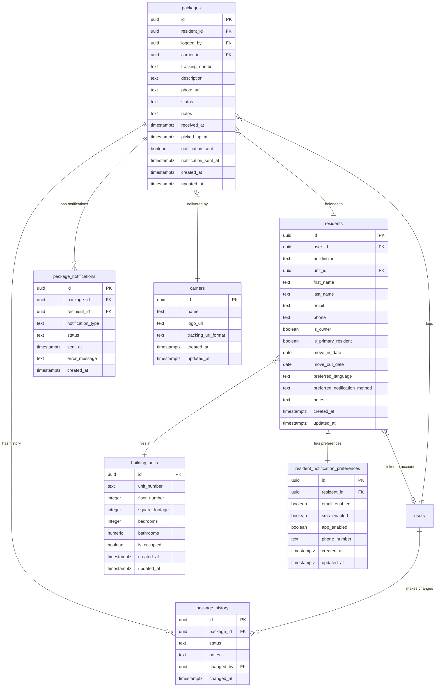
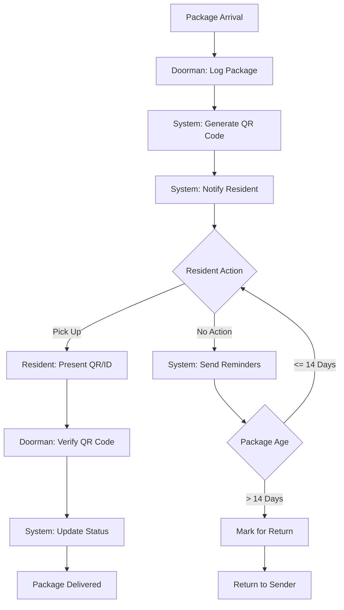

# Package Management System Database Documentation

*Last Updated: April 5, 2025 | Version: 0.2.0*

This document provides comprehensive documentation for the Lofts des Arts package management system database schema, including table structures, relationships, security policies, and usage patterns.

## Overview

The package management system enables efficient tracking of resident packages from delivery to pickup. It includes features for package logging, QR code generation, resident notifications, and status tracking throughout the package lifecycle.

## Database Schema



## Table Descriptions

### `packages`

Stores information about packages received for residents.

| Column | Type | Description |
|--------|------|-------------|
| `id` | UUID | Primary key |
| `resident_id` | UUID | Foreign key to auth.users (resident receiving the package) |
| `logged_by` | UUID | Foreign key to auth.users (staff who logged the package) |
| `carrier_id` | UUID | Foreign key to carriers (optional) |
| `tracking_number` | TEXT | Tracking number provided by carrier |
| `description` | TEXT | Package description |
| `photo_url` | TEXT | URL to package photo (optional) |
| `status` | TEXT | Current status (received, notified, picked_up, expired) |
| `notes` | TEXT | Additional notes about the package |
| `received_at` | TIMESTAMPTZ | When the package was received |
| `picked_up_at` | TIMESTAMPTZ | When the package was picked up (optional) |
| `notification_sent` | BOOLEAN | Whether notification was sent to resident |
| `notification_sent_at` | TIMESTAMPTZ | When the notification was sent |
| `created_at` | TIMESTAMPTZ | Creation timestamp |
| `updated_at` | TIMESTAMPTZ | Last update timestamp |

### `package_history`

Tracks status changes and actions taken on packages.

| Column | Type | Description |
|--------|------|-------------|
| `id` | UUID | Primary key |
| `package_id` | UUID | Foreign key to packages |
| `status` | TEXT | Status at this point in history |
| `notes` | TEXT | Notes about the status change |
| `changed_by` | UUID | Foreign key to auth.users (staff who made the change) |
| `changed_at` | TIMESTAMPTZ | When the status was changed |

### `package_notifications`

Records notifications sent to residents about packages.

| Column | Type | Description |
|--------|------|-------------|
| `id` | UUID | Primary key |
| `package_id` | UUID | Foreign key to packages |
| `recipient_id` | UUID | Foreign key to auth.users (notification recipient) |
| `notification_type` | TEXT | Type of notification (email, sms, app) |
| `status` | TEXT | Status of notification (pending, sent, failed) |
| `sent_at` | TIMESTAMPTZ | When the notification was sent |
| `error_message` | TEXT | Error message if notification failed |
| `created_at` | TIMESTAMPTZ | Creation timestamp |

### `carriers`

Stores information about package carriers/couriers.

| Column | Type | Description |
|--------|------|-------------|
| `id` | UUID | Primary key |
| `name` | TEXT | Carrier name |
| `logo_url` | TEXT | URL to carrier logo |
| `tracking_url_format` | TEXT | URL format with {tracking_number} placeholder |
| `created_at` | TIMESTAMPTZ | Creation timestamp |
| `updated_at` | TIMESTAMPTZ | Last update timestamp |

### `resident_notification_preferences`

Stores residents' notification preferences.

| Column | Type | Description |
|--------|------|-------------|
| `id` | UUID | Primary key |
| `resident_id` | UUID | Foreign key to auth.users |
| `email_enabled` | BOOLEAN | Whether email notifications are enabled |
| `sms_enabled` | BOOLEAN | Whether SMS notifications are enabled |
| `app_enabled` | BOOLEAN | Whether in-app notifications are enabled |
| `phone_number` | TEXT | Phone number for SMS notifications |
| `created_at` | TIMESTAMPTZ | Creation timestamp |
| `updated_at` | TIMESTAMPTZ | Last update timestamp |

### `building_units`

Stores information about the building units/apartments.

| Column | Type | Description |
|--------|------|-------------|
| `id` | UUID | Primary key |
| `unit_number` | TEXT | Unit identifier |
| `floor_number` | INTEGER | Floor the unit is on |
| `square_footage` | INTEGER | Size of the unit in square feet |
| `bedrooms` | INTEGER | Number of bedrooms |
| `bathrooms` | NUMERIC(3,1) | Number of bathrooms |
| `is_occupied` | BOOLEAN | Whether the unit is currently occupied |
| `created_at` | TIMESTAMPTZ | Creation timestamp |
| `updated_at` | TIMESTAMPTZ | Last update timestamp |

### `residents`

Stores information about building residents.

| Column | Type | Description |
|--------|------|-------------|
| `id` | UUID | Primary key |
| `user_id` | UUID | Foreign key to auth.users (optional) |
| `building_id` | TEXT | Building identifier (for multi-building systems) |
| `unit_id` | UUID | Foreign key to building_units |
| `first_name` | TEXT | Resident's first name |
| `last_name` | TEXT | Resident's last name |
| `email` | TEXT | Resident's email address |
| `phone` | TEXT | Resident's phone number |
| `is_owner` | BOOLEAN | Whether the resident owns their unit |
| `is_primary_resident` | BOOLEAN | Whether this is the primary resident for the unit |
| `move_in_date` | DATE | When the resident moved in |
| `move_out_date` | DATE | When the resident moved out (if applicable) |
| `preferred_language` | TEXT | Resident's preferred language |
| `preferred_notification_method` | TEXT | Preferred method of communication |
| `notes` | TEXT | Additional notes about the resident |
| `created_at` | TIMESTAMPTZ | Creation timestamp |
| `updated_at` | TIMESTAMPTZ | Last update timestamp |

## Enums and Status Values

### Package Status Values

```sql
CREATE TYPE package_status_enum AS ENUM (
  'PENDING',   -- Just registered, not yet received
  'RECEIVED',  -- Received by building staff
  'NOTIFIED',  -- Resident has been notified
  'DELIVERED', -- Delivered to resident
  'RETURNED'   -- Returned to sender
);
```

## Indexes

The following indexes are implemented for query performance:

```sql
-- Packages indexes
CREATE INDEX idx_packages_resident_id ON packages(resident_id);
CREATE INDEX idx_packages_logged_by ON packages(logged_by);
CREATE INDEX idx_packages_status ON packages(status);
CREATE INDEX idx_packages_created_at ON packages(created_at DESC);

-- Package notifications indexes
CREATE INDEX idx_package_notifications_package_id ON package_notifications(package_id);
CREATE INDEX idx_package_notifications_recipient_id ON package_notifications(recipient_id);

-- Package history indexes
CREATE INDEX idx_package_history_package_id ON package_history(package_id);
CREATE INDEX idx_package_history_changed_at ON package_history(changed_at DESC);

-- Resident notification preferences index
CREATE INDEX idx_resident_notification_preferences_resident_id ON resident_notification_preferences(resident_id);

-- Building units and residents indexes
CREATE INDEX idx_residents_building_id ON residents(building_id);
CREATE INDEX idx_residents_unit_id ON residents(unit_id);
CREATE INDEX idx_residents_user_id ON residents(user_id);
CREATE INDEX idx_residents_email ON residents(email);
CREATE INDEX idx_residents_last_name ON residents(last_name);
CREATE INDEX idx_building_units_unit_number ON building_units(unit_number);
```

## Row Level Security (RLS) Policies

### Packages Table

```sql
-- Doormen and admins can view all packages
CREATE POLICY "Doormen and admins can view all packages"
  ON packages FOR SELECT
  USING ((SELECT role FROM profiles WHERE id = auth.uid()) IN ('DOORMAN', 'ADMIN', 'MANAGER'));

-- Residents can view their own packages
CREATE POLICY "Residents can view their own packages"
  ON packages FOR SELECT
  USING (resident_id = auth.uid());

-- Doormen and admins can insert packages
CREATE POLICY "Doormen and admins can insert packages"
  ON packages FOR INSERT
  TO authenticated
  WITH CHECK ((SELECT role FROM profiles WHERE id = auth.uid()) IN ('DOORMAN', 'ADMIN', 'MANAGER') AND logged_by = auth.uid());

-- Doormen and admins can update packages
CREATE POLICY "Doormen and admins can update packages"
  ON packages FOR UPDATE
  TO authenticated
  USING ((SELECT role FROM profiles WHERE id = auth.uid()) IN ('DOORMAN', 'ADMIN', 'MANAGER'));
```

Similar RLS policies are implemented for all package-related tables, ensuring data access is properly restricted based on user roles and ownership.

## Triggers and Functions

### Package History Tracking

```sql
-- Function to update package history on status change
CREATE OR REPLACE FUNCTION update_package_history()
RETURNS TRIGGER AS $$
BEGIN
  IF OLD.status IS NULL OR NEW.status != OLD.status THEN
    INSERT INTO package_history (package_id, status, changed_by)
    VALUES (NEW.id, NEW.status, auth.uid());
  END IF;
  RETURN NEW;
END;
$$ LANGUAGE plpgsql SECURITY DEFINER;

-- Trigger to update package history
CREATE TRIGGER update_package_history
AFTER UPDATE ON packages
FOR EACH ROW
EXECUTE FUNCTION update_package_history();

-- Function to create initial package history on new package
CREATE OR REPLACE FUNCTION create_initial_package_history()
RETURNS TRIGGER AS $$
BEGIN
  INSERT INTO package_history (package_id, status, changed_by)
  VALUES (NEW.id, NEW.status, NEW.logged_by);
  RETURN NEW;
END;
$$ LANGUAGE plpgsql SECURITY DEFINER;

-- Trigger to create initial package history
CREATE TRIGGER create_initial_package_history
AFTER INSERT ON packages
FOR EACH ROW
EXECUTE FUNCTION create_initial_package_history();
```

## Access Patterns

### Common Query Patterns

#### Fetching Packages for a Doorman

```typescript
const { data: packages, error } = await supabase
  .from('packages')
  .select(`
    id,
    tracking_number,
    description,
    status,
    received_at,
    notification_sent,
    residents(
      first_name,
      last_name,
      unit_id,
      building_units(unit_number)
    ),
    carriers(name, tracking_url_format)
  `)
  .in('status', ['RECEIVED', 'NOTIFIED'])
  .order('received_at', { ascending: false });
```

#### Fetching a Resident's Packages

```typescript
const { data: residentPackages, error } = await supabase
  .from('packages')
  .select(`
    id,
    tracking_number,
    description,
    status,
    received_at,
    picked_up_at,
    carriers(name, tracking_url_format, logo_url),
    package_history(status, changed_at, changed_by, profiles(first_name, last_name))
  `)
  .eq('resident_id', userId)
  .order('received_at', { ascending: false });
```

#### Creating a New Package

```typescript
const { data, error } = await supabase
  .from('packages')
  .insert({
    resident_id: residentId,
    logged_by: staffId,
    carrier_id: carrierId,
    tracking_number: trackingNumber,
    description: description,
    status: 'RECEIVED',
    received_at: new Date().toISOString(),
    notification_sent: false
  });
```

#### Updating Package Status

```typescript
const { data, error } = await supabase
  .from('packages')
  .update({
    status: 'DELIVERED',
    picked_up_at: new Date().toISOString()
  })
  .eq('id', packageId);
```

## QR Code Generation

The package management system uses QR codes for efficient package tracking:

```typescript
import QRCode from 'qrcode.react';

// Generate QR code for a package
const generatePackageQR = (packageId) => {
  const qrValue = `${window.location.origin}/packages/verify/${packageId}`;
  
  return (
    <QRCode 
      value={qrValue}
      size={128}
      level="H" // High error correction
      includeMargin={true}
    />
  );
};
```

## Notification System

### Notification Generation

When a package is received, notifications are generated based on the resident's preferences:

```typescript
// Pseudocode for notification generation
const generateNotifications = async (packageId, residentId) => {
  // Get resident's preferences
  const { data: preferences } = await supabase
    .from('resident_notification_preferences')
    .select('*')
    .eq('resident_id', residentId)
    .single();
    
  // Generate appropriate notifications
  if (preferences.email_enabled) {
    await createNotification(packageId, residentId, 'email');
  }
  
  if (preferences.sms_enabled) {
    await createNotification(packageId, residentId, 'sms');
  }
  
  if (preferences.app_enabled) {
    await createNotification(packageId, residentId, 'app');
  }
  
  // Mark package as notified
  await supabase
    .from('packages')
    .update({
      status: 'NOTIFIED',
      notification_sent: true,
      notification_sent_at: new Date().toISOString()
    })
    .eq('id', packageId);
};

const createNotification = async (packageId, residentId, type) => {
  return await supabase
    .from('package_notifications')
    .insert({
      package_id: packageId,
      recipient_id: residentId,
      notification_type: type,
      status: 'pending'
    });
};
```

## Package Workflow



## Data Lifecycle

1. **Logging**: Package received → logged in system → QR code generated
2. **Notification**: Resident preferences checked → notifications sent
3. **Tracking**: Package status updated → history recorded
4. **Pickup**: Resident presents QR code → verification → pickup recorded
5. **Reporting**: Package data aggregated → analytics generated

## Security Considerations

- Access to package data is restricted by RLS policies
- Package QR codes contain unique identifiers, not personal data
- Notifications are sent only through authorized channels
- Package operations are logged for auditing purposes
- Sensitive resident data is protected by strict access controls

## Implementation Notes

- The system handles both physical and digital package tracking
- QR codes ensure accurate package identification
- History tracking provides a complete audit trail
- Multi-channel notifications increase resident awareness
- Integration with carriers provides tracking information

## Future Enhancements

- Automated carrier detection from tracking numbers
- SMS delivery with Twilio integration
- Package photo capture for condition verification
- Machine learning for package size estimation
- Digital signature capture for package pickup
- Batch processing for multiple packages

## References

- [QR Code Generation Library](https://github.com/zpao/qrcode.react)
- [Supabase Storage Documentation](https://supabase.com/docs/guides/storage)
- [PostgreSQL Trigger Documentation](https://www.postgresql.org/docs/current/trigger-definition.html) 