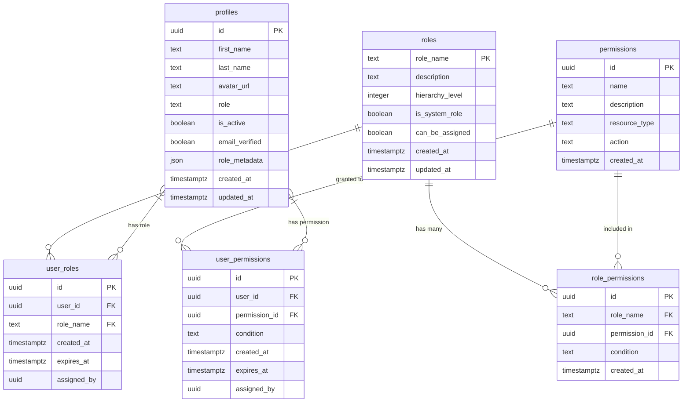
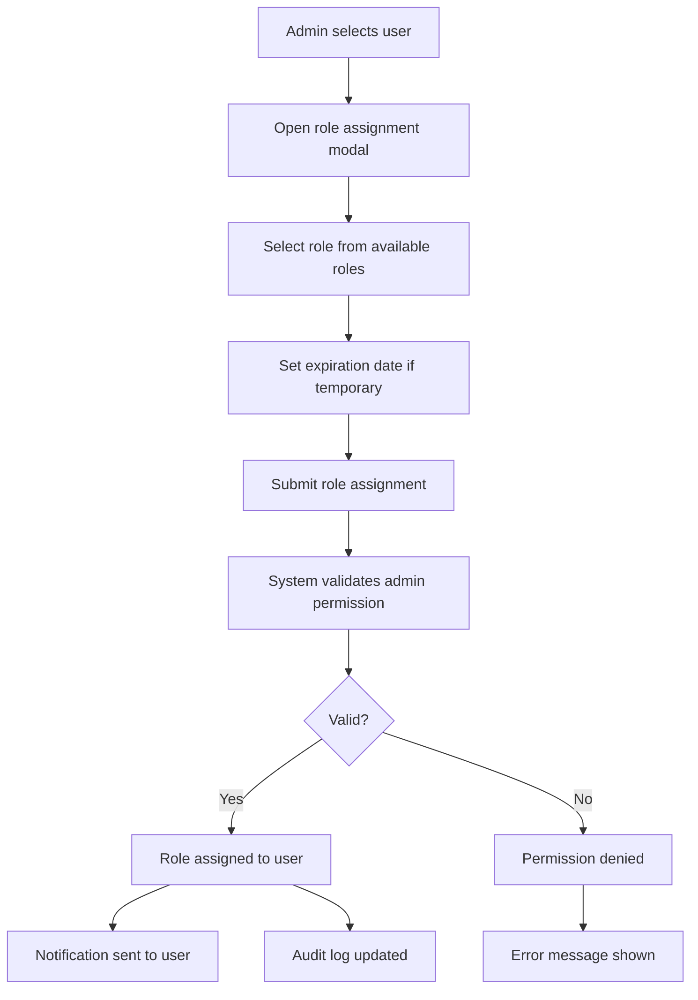

# Role-Based Access Control (RBAC) System Documentation

*Last Updated: April 6, 2025 | Version: 0.4.0*

This document provides comprehensive documentation for the Lofts des Arts RBAC system, including the database schema, role definitions, permission mappings, and implementation details.

## Overview

The RBAC system enables fine-grained access control across the Lofts des Arts platform based on user roles and responsibilities. It ensures that users can only access and modify resources appropriate to their position within the condominium management structure.

## Database Schema



## Table Descriptions

### `profiles`

Contains user profile information including their assigned primary role.

| Column | Type | Description |
|--------|------|-------------|
| `id` | UUID | Primary key (links to auth.users id) |
| `first_name` | TEXT | User's first name |
| `last_name` | TEXT | User's last name |
| `avatar_url` | TEXT | URL to user's profile image |
| `role` | TEXT | User's primary role |
| `is_active` | BOOLEAN | Whether the user account is active |
| `email_verified` | BOOLEAN | Whether the user's email is verified |
| `role_metadata` | JSON | Additional metadata about the user's role |
| `created_at` | TIMESTAMPTZ | Creation timestamp |
| `updated_at` | TIMESTAMPTZ | Last update timestamp |

### `roles`

Defines the available roles in the system.

| Column | Type | Description |
|--------|------|-------------|
| `role_name` | TEXT | Primary key - unique role identifier |
| `description` | TEXT | Description of the role |
| `hierarchy_level` | INTEGER | Numeric level in role hierarchy (lower = higher authority) |
| `is_system_role` | BOOLEAN | Whether this is a core system role that cannot be deleted |
| `can_be_assigned` | BOOLEAN | Whether this role can be assigned to users |
| `created_at` | TIMESTAMPTZ | Creation timestamp |
| `updated_at` | TIMESTAMPTZ | Last update timestamp |

### `permissions`

Defines granular permissions for system operations.

| Column | Type | Description |
|--------|------|-------------|
| `id` | UUID | Primary key |
| `name` | TEXT | Unique permission name |
| `description` | TEXT | Description of what the permission allows |
| `resource_type` | TEXT | Type of resource this permission applies to |
| `action` | TEXT | Action allowed (create, read, update, delete, etc.) |
| `created_at` | TIMESTAMPTZ | Creation timestamp |

### `role_permissions`

Maps permissions to roles with optional conditions.

| Column | Type | Description |
|--------|------|-------------|
| `id` | UUID | Primary key |
| `role_name` | TEXT | Foreign key to roles |
| `permission_id` | UUID | Foreign key to permissions |
| `condition` | TEXT | Optional SQL condition to further restrict access |
| `created_at` | TIMESTAMPTZ | Creation timestamp |

### `user_roles`

Maps users to their assigned roles.

| Column | Type | Description |
|--------|------|-------------|
| `id` | UUID | Primary key |
| `user_id` | UUID | Foreign key to auth.users |
| `role_name` | TEXT | Foreign key to roles |
| `created_at` | TIMESTAMPTZ | Creation timestamp |
| `expires_at` | TIMESTAMPTZ | Optional expiration date for temporary roles |
| `assigned_by` | UUID | User ID of the administrator who assigned this role |

### `user_permissions`

Maps users to directly assigned permissions (bypassing roles).

| Column | Type | Description |
|--------|------|-------------|
| `id` | UUID | Primary key |
| `user_id` | UUID | Foreign key to auth.users |
| `permission_id` | UUID | Foreign key to permissions |
| `condition` | TEXT | Optional SQL condition to further restrict access |
| `created_at` | TIMESTAMPTZ | Creation timestamp |
| `expires_at` | TIMESTAMPTZ | Optional expiration date for temporary permissions |
| `assigned_by` | UUID | User ID of the administrator who assigned this permission |

## Core Roles and Hierarchies

The Lofts des Arts RBAC system uses the following role hierarchy (from highest to lowest authority):

| Role | Hierarchy Level | Description |
|------|----------------|-------------|
| `SUPER_ADMIN` | 1 | System administrator with complete control over all functions |
| `ADMIN` | 2 | Condominium administrator with broad management capabilities |
| `MANAGER` | 3 | Building manager with operational oversight |
| `BOARD_MEMBER` | 4 | Board member with governance responsibilities |
| `STAFF` | 5 | Building staff with limited operational access |
| `DOORMAN` | 6 | Lobby staff responsible for security and packages |
| `CONTRACTOR` | 7 | External service provider with limited access |
| `RESIDENT_OWNER` | 8 | Condominium owner with resident rights |
| `RESIDENT_TENANT` | 9 | Tenant with basic resident access |
| `GUEST` | 10 | Temporary visitor with minimal access |

## Permission Types

Permissions are defined using a `resource:action` naming convention. Core permission types include:

| Resource Type | Actions | Description |
|--------------|---------|-------------|
| `users` | create, read, update, delete | User account management |
| `profiles` | read, update | Profile information access |
| `units` | create, read, update, delete | Building unit management |
| `documents` | create, read, update, delete, publish | Document management |
| `announcements` | create, read, update, delete | Building announcements |
| `meetings` | create, read, update, delete, attend | Board/resident meetings |
| `maintenance` | create, read, update, delete, approve | Maintenance request management |
| `packages` | create, read, update, delete | Package tracking system |
| `payments` | create, read, update, delete | Financial transactions |
| `amenities` | create, read, update, delete, book | Building amenity management |
| `messages` | create, read, update, delete | Internal messaging system |
| `settings` | read, update | System configuration |

## SQL Schema Definitions

```sql
-- Roles Table
CREATE TABLE public.roles (
    role_name TEXT PRIMARY KEY,
    description TEXT NOT NULL,
    hierarchy_level INTEGER NOT NULL,
    is_system_role BOOLEAN NOT NULL DEFAULT false,
    can_be_assigned BOOLEAN NOT NULL DEFAULT true,
    created_at TIMESTAMPTZ NOT NULL DEFAULT now(),
    updated_at TIMESTAMPTZ NOT NULL DEFAULT now()
);

-- Permissions Table
CREATE TABLE public.permissions (
    id UUID PRIMARY KEY DEFAULT gen_random_uuid(),
    name TEXT NOT NULL UNIQUE,
    description TEXT NOT NULL,
    resource_type TEXT NOT NULL,
    action TEXT NOT NULL,
    created_at TIMESTAMPTZ NOT NULL DEFAULT now(),
    UNIQUE(resource_type, action)
);

-- Role Permissions Mapping
CREATE TABLE public.role_permissions (
    id UUID PRIMARY KEY DEFAULT gen_random_uuid(),
    role_name TEXT NOT NULL REFERENCES public.roles(role_name) ON DELETE CASCADE,
    permission_id UUID NOT NULL REFERENCES public.permissions(id) ON DELETE CASCADE,
    condition TEXT, -- Optional SQL condition
    created_at TIMESTAMPTZ NOT NULL DEFAULT now(),
    UNIQUE(role_name, permission_id)
);

-- User Roles Mapping
CREATE TABLE public.user_roles (
    id UUID PRIMARY KEY DEFAULT gen_random_uuid(),
    user_id UUID NOT NULL REFERENCES auth.users(id) ON DELETE CASCADE,
    role_name TEXT NOT NULL REFERENCES public.roles(role_name) ON DELETE CASCADE,
    created_at TIMESTAMPTZ NOT NULL DEFAULT now(),
    expires_at TIMESTAMPTZ,
    assigned_by UUID REFERENCES auth.users(id),
    UNIQUE(user_id, role_name)
);

-- User Direct Permissions (for exceptions)
CREATE TABLE public.user_permissions (
    id UUID PRIMARY KEY DEFAULT gen_random_uuid(),
    user_id UUID NOT NULL REFERENCES auth.users(id) ON DELETE CASCADE,
    permission_id UUID NOT NULL REFERENCES public.permissions(id) ON DELETE CASCADE,
    condition TEXT, -- Optional SQL condition
    created_at TIMESTAMPTZ NOT NULL DEFAULT now(),
    expires_at TIMESTAMPTZ,
    assigned_by UUID REFERENCES auth.users(id),
    UNIQUE(user_id, permission_id)
);

-- Add role field to profiles
ALTER TABLE public.profiles ADD COLUMN role TEXT REFERENCES public.roles(role_name);
ALTER TABLE public.profiles ADD COLUMN role_metadata JSONB DEFAULT '{}'::JSONB;
```

## Predefined Roles and Permissions

The system is initialized with core roles and associated permissions:

```sql
-- Insert core roles
INSERT INTO public.roles (role_name, description, hierarchy_level, is_system_role) VALUES
('SUPER_ADMIN', 'System administrator with complete access', 1, true),
('ADMIN', 'Condominium administrator', 2, true),
('MANAGER', 'Building manager', 3, true),
('BOARD_MEMBER', 'Condominium board member', 4, true),
('STAFF', 'Building staff member', 5, true),
('DOORMAN', 'Building doorman/security', 6, true),
('CONTRACTOR', 'External service provider', 7, true),
('RESIDENT_OWNER', 'Unit owner resident', 8, true),
('RESIDENT_TENANT', 'Tenant resident', 9, true),
('GUEST', 'Temporary visitor', 10, true);

-- Insert core permissions (examples)
INSERT INTO public.permissions (name, description, resource_type, action) VALUES
('users:create', 'Create user accounts', 'users', 'create'),
('users:read', 'View user information', 'users', 'read'),
('users:update', 'Update user information', 'users', 'update'),
('users:delete', 'Delete user accounts', 'users', 'delete'),
('documents:create', 'Create documents', 'documents', 'create'),
('documents:read', 'View documents', 'documents', 'read'),
('documents:update', 'Update documents', 'documents', 'update'),
('documents:delete', 'Delete documents', 'documents', 'delete'),
('documents:publish', 'Publish documents', 'documents', 'publish'),
-- Additional permissions would be defined here...
('packages:create', 'Log incoming packages', 'packages', 'create'),
('packages:read', 'View package information', 'packages', 'read'),
('packages:update', 'Update package status', 'packages', 'update'),
('packages:delete', 'Delete package records', 'packages', 'delete'),
('messages:create', 'Send messages', 'messages', 'create'),
('messages:read', 'Read messages', 'messages', 'read'),
('messages:update', 'Update message status', 'messages', 'update'),
('messages:delete', 'Delete messages', 'messages', 'delete');
```

## Row Level Security (RLS) Policies

RLS policies enforce access restrictions at the database level using the RBAC framework:

### Profiles Table RLS

```sql
-- Enable RLS on the profiles table
ALTER TABLE public.profiles ENABLE ROW LEVEL SECURITY;

-- Admins and managers can view all profiles
CREATE POLICY "Admins and managers can view all profiles" 
ON public.profiles FOR SELECT 
USING (
    EXISTS (
        SELECT 1 FROM public.user_roles ur
        WHERE ur.user_id = auth.uid() 
        AND ur.role_name IN ('SUPER_ADMIN', 'ADMIN', 'MANAGER')
        AND (ur.expires_at IS NULL OR ur.expires_at > now())
    )
);

-- Users can view their own profile
CREATE POLICY "Users can view their own profile" 
ON public.profiles FOR SELECT 
USING (id = auth.uid());

-- Admins can modify any profile
CREATE POLICY "Admins can modify any profile" 
ON public.profiles FOR UPDATE 
USING (
    EXISTS (
        SELECT 1 FROM public.user_roles ur
        WHERE ur.user_id = auth.uid() 
        AND ur.role_name IN ('SUPER_ADMIN', 'ADMIN')
        AND (ur.expires_at IS NULL OR ur.expires_at > now())
    )
);

-- Users can modify their own profile
CREATE POLICY "Users can modify their own profile" 
ON public.profiles FOR UPDATE 
USING (id = auth.uid());
```

### Documents Table RLS (Example)

```sql
-- Enable RLS on the documents table
ALTER TABLE public.documents ENABLE ROW LEVEL SECURITY;

-- Administrators can access all documents
CREATE POLICY "Administrators can access all documents" 
ON public.documents FOR ALL 
USING (
    EXISTS (
        SELECT 1 FROM public.user_roles ur
        WHERE ur.user_id = auth.uid() 
        AND ur.role_name IN ('SUPER_ADMIN', 'ADMIN')
        AND (ur.expires_at IS NULL OR ur.expires_at > now())
    )
);

-- Users can view published documents
CREATE POLICY "Users can view published documents" 
ON public.documents FOR SELECT 
USING (
    is_published = true AND
    (
        visibility = 'public' OR
        (
            visibility = 'residents' AND
            EXISTS (
                SELECT 1 FROM public.user_roles ur
                WHERE ur.user_id = auth.uid() 
                AND ur.role_name IN ('RESIDENT_OWNER', 'RESIDENT_TENANT')
                AND (ur.expires_at IS NULL OR ur.expires_at > now())
            )
        ) OR
        (
            visibility = 'owners' AND
            EXISTS (
                SELECT 1 FROM public.user_roles ur
                WHERE ur.user_id = auth.uid() 
                AND ur.role_name = 'RESIDENT_OWNER'
                AND (ur.expires_at IS NULL OR ur.expires_at > now())
            )
        ) OR
        (
            visibility = 'board' AND
            EXISTS (
                SELECT 1 FROM public.user_roles ur
                WHERE ur.user_id = auth.uid() 
                AND ur.role_name IN ('BOARD_MEMBER', 'MANAGER', 'ADMIN')
                AND (ur.expires_at IS NULL OR ur.expires_at > now())
            )
        )
    )
);

-- Board members can create and edit board documents
CREATE POLICY "Board members can create and edit board documents" 
ON public.documents FOR INSERT WITH CHECK (
    EXISTS (
        SELECT 1 FROM public.user_roles ur
        WHERE ur.user_id = auth.uid() 
        AND ur.role_name IN ('BOARD_MEMBER', 'MANAGER', 'ADMIN')
        AND (ur.expires_at IS NULL OR ur.expires_at > now())
    )
);

-- Similar policies for UPDATE and DELETE would be defined here...
```

## Database Functions for Permission Checking

These functions allow for efficient permission checking within the database:

```sql
-- Function to check if a user has a specific role
CREATE OR REPLACE FUNCTION public.has_role(user_id UUID, role_name TEXT)
RETURNS BOOLEAN AS $$
BEGIN
    RETURN EXISTS (
        SELECT 1 FROM public.user_roles ur
        WHERE ur.user_id = $1
        AND ur.role_name = $2
        AND (ur.expires_at IS NULL OR ur.expires_at > now())
    );
END;
$$ LANGUAGE plpgsql SECURITY DEFINER;

-- Function to check if a user has a role at or above a certain hierarchy level
CREATE OR REPLACE FUNCTION public.has_role_level(user_id UUID, hierarchy_level INTEGER)
RETURNS BOOLEAN AS $$
BEGIN
    RETURN EXISTS (
        SELECT 1 FROM public.user_roles ur
        JOIN public.roles r ON ur.role_name = r.role_name
        WHERE ur.user_id = $1
        AND r.hierarchy_level <= $2
        AND (ur.expires_at IS NULL OR ur.expires_at > now())
    );
END;
$$ LANGUAGE plpgsql SECURITY DEFINER;

-- Function to check if a user has a specific permission
CREATE OR REPLACE FUNCTION public.has_permission(user_id UUID, permission_name TEXT)
RETURNS BOOLEAN AS $$
BEGIN
    RETURN (
        -- Check for direct permission assignment
        EXISTS (
            SELECT 1 FROM public.user_permissions up
            JOIN public.permissions p ON up.permission_id = p.id
            WHERE up.user_id = $1
            AND p.name = $2
            AND (up.expires_at IS NULL OR up.expires_at > now())
        )
        OR
        -- Check for permission via role
        EXISTS (
            SELECT 1 FROM public.user_roles ur
            JOIN public.role_permissions rp ON ur.role_name = rp.role_name
            JOIN public.permissions p ON rp.permission_id = p.id
            WHERE ur.user_id = $1
            AND p.name = $2
            AND (ur.expires_at IS NULL OR ur.expires_at > now())
        )
    );
END;
$$ LANGUAGE plpgsql SECURITY DEFINER;
```

## Client-Side Integration

### TypeScript Interface

```typescript
// Role and permission types
export type UserRole = 
  | 'SUPER_ADMIN'
  | 'ADMIN'
  | 'MANAGER'
  | 'BOARD_MEMBER'
  | 'STAFF'
  | 'DOORMAN'
  | 'CONTRACTOR'
  | 'RESIDENT_OWNER'
  | 'RESIDENT_TENANT'
  | 'GUEST';

export type ResourceType =
  | 'users'
  | 'profiles'
  | 'units'
  | 'documents'
  | 'announcements'
  | 'meetings'
  | 'maintenance'
  | 'packages'
  | 'payments'
  | 'amenities'
  | 'messages'
  | 'settings';

export type PermissionAction =
  | 'create'
  | 'read'
  | 'update'
  | 'delete'
  | 'publish'
  | 'approve'
  | 'attend'
  | 'book';

export type Permission = `${ResourceType}:${PermissionAction}`;

// Permission checking hook
export const useHasPermission = (permission: Permission): boolean => {
  const { data: session } = useSession();
  const userId = session?.user?.id;
  const [hasPermission, setHasPermission] = useState<boolean>(false);

  useEffect(() => {
    if (!userId) return;

    const checkPermission = async () => {
      const { data, error } = await supabase.rpc('has_permission', {
        user_id: userId,
        permission_name: permission,
      });

      if (error) {
        console.error('Error checking permission:', error);
        return;
      }

      setHasPermission(data || false);
    };

    checkPermission();
  }, [userId, permission]);

  return hasPermission;
};

// Role checking hook
export const useHasRole = (role: UserRole | UserRole[]): boolean => {
  const { data: session } = useSession();
  const userId = session?.user?.id;
  const [hasRole, setHasRole] = useState<boolean>(false);
  
  useEffect(() => {
    if (!userId) return;
    
    const checkRole = async () => {
      const roles = Array.isArray(role) ? role : [role];
      
      for (const r of roles) {
        const { data, error } = await supabase.rpc('has_role', {
          user_id: userId,
          role_name: r,
        });
        
        if (error) {
          console.error('Error checking role:', error);
          continue;
        }
        
        if (data === true) {
          setHasRole(true);
          return;
        }
      }
      
      setHasRole(false);
    };
    
    checkRole();
  }, [userId, role]);
  
  return hasRole;
};

// Role-restricted component
export const RoleGuard = ({ 
  children, 
  roles, 
  fallback = null 
}: { 
  children: React.ReactNode;
  roles: UserRole | UserRole[];
  fallback?: React.ReactNode;
}) => {
  const hasRole = useHasRole(roles);
  
  if (!hasRole) return fallback;
  
  return <>{children}</>;
};

// Permission-restricted component
export const PermissionGuard = ({ 
  children, 
  permissions, 
  requireAll = false,
  fallback = null 
}: { 
  children: React.ReactNode;
  permissions: Permission | Permission[];
  requireAll?: boolean;
  fallback?: React.ReactNode;
}) => {
  const permissionList = Array.isArray(permissions) ? permissions : [permissions];
  const hasPermissions = permissionList.map(p => useHasPermission(p));
  
  const allowed = requireAll 
    ? hasPermissions.every(Boolean) 
    : hasPermissions.some(Boolean);
  
  if (!allowed) return fallback;
  
  return <>{children}</>;
};
```

## Server-Side Integration

### Server Middleware

```typescript
// Middleware to check permission
export const withPermission = (permission: Permission) => {
  return async (req: NextRequest, res: NextResponse) => {
    const { supabaseServer } = createSupabaseServer();
    const { data: { session } } = await supabaseServer.auth.getSession();
    
    if (!session) {
      return NextResponse.json({ error: 'Unauthorized' }, { status: 401 });
    }
    
    const { data: hasPermission, error } = await supabaseServer.rpc('has_permission', {
      user_id: session.user.id,
      permission_name: permission,
    });
    
    if (error || !hasPermission) {
      return NextResponse.json({ error: 'Forbidden' }, { status: 403 });
    }
    
    return NextResponse.next();
  };
};

// Middleware to check role
export const withRole = (role: UserRole | UserRole[]) => {
  return async (req: NextRequest, res: NextResponse) => {
    const { supabaseServer } = createSupabaseServer();
    const { data: { session } } = await supabaseServer.auth.getSession();
    
    if (!session) {
      return NextResponse.json({ error: 'Unauthorized' }, { status: 401 });
    }
    
    const roles = Array.isArray(role) ? role : [role];
    let hasRole = false;
    
    for (const r of roles) {
      const { data, error } = await supabaseServer.rpc('has_role', {
        user_id: session.user.id,
        role_name: r,
      });
      
      if (data === true) {
        hasRole = true;
        break;
      }
    }
    
    if (!hasRole) {
      return NextResponse.json({ error: 'Forbidden' }, { status: 403 });
    }
    
    return NextResponse.next();
  };
};
```

## Role Assignment Workflow



## Permission Systems Integration

The RBAC system integrates with various components:

1. **Route Protection**: Server-side middleware validates access to protected routes
2. **UI Component Visibility**: Components are conditionally rendered based on permissions
3. **API Endpoints**: Access to backend APIs is controlled by permission checks
4. **Database Queries**: RLS policies enforce data access restrictions
5. **Audit Logging**: Role and permission changes are tracked for compliance

## Security Considerations

- RBAC functions use `SECURITY DEFINER` to ensure consistent evaluation
- Role assignments include audit trails (who assigned, when, expiration)
- Temporary role capabilities prevent permanent privilege escalation
- Role hierarchy prevents lower-level administrators from modifying higher-level roles
- Regular security audits track role assignments and permission changes

## User Experience

Users only see UI elements and options they have permission to access:

```typescript
// Example of conditional rendering in a component
const DocumentsPage = () => {
  const canCreateDocuments = useHasPermission('documents:create');
  const canDeleteDocuments = useHasPermission('documents:delete');
  
  return (
    <div>
      <h1>Documents</h1>
      
      {canCreateDocuments && (
        <Button onClick={handleCreateDocument}>
          Create New Document
        </Button>
      )}
      
      <DocumentList 
        showDeleteButton={canDeleteDocuments}
      />
    </div>
  );
};
```

## Implementation Best Practices

1. **Least Privilege**: Assign the minimum permissions necessary for each role
2. **Permission Granularity**: Define fine-grained permissions for precise access control
3. **Role Inheritance**: Higher-level roles automatically include permissions from lower roles
4. **Context-Sensitive Access**: Use condition clauses for complex access patterns
5. **Regular Audits**: Periodically review role assignments and permission grants
6. **Permission Checking**: Always verify permissions before performing sensitive operations
7. **UI Integration**: Hide UI elements for actions users cannot perform

## Future Enhancements

- Dynamic permission generation for custom resources
- Role-based dashboard customization
- Permission delegation capabilities
- Advanced audit log visualization
- Machine learning for anomalous permission usage detection
- Custom permission policy framework
- Fine-grained resource-level permissions
- Time-based access controls

## References

- [PostgreSQL RLS Documentation](https://www.postgresql.org/docs/current/ddl-rowsecurity.html)
- [Supabase Auth Documentation](https://supabase.com/docs/guides/auth)
- [NIST RBAC Standard](https://csrc.nist.gov/projects/role-based-access-control)
- [OWASP Access Control Cheat Sheet](https://cheatsheetseries.owasp.org/cheatsheets/Access_Control_Cheat_Sheet.html) 