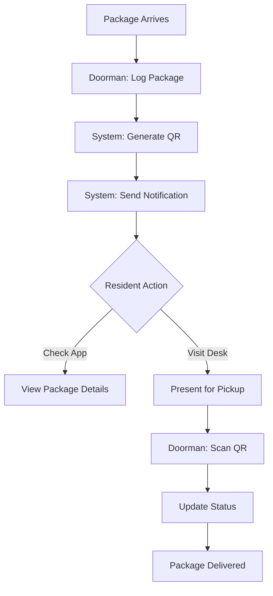
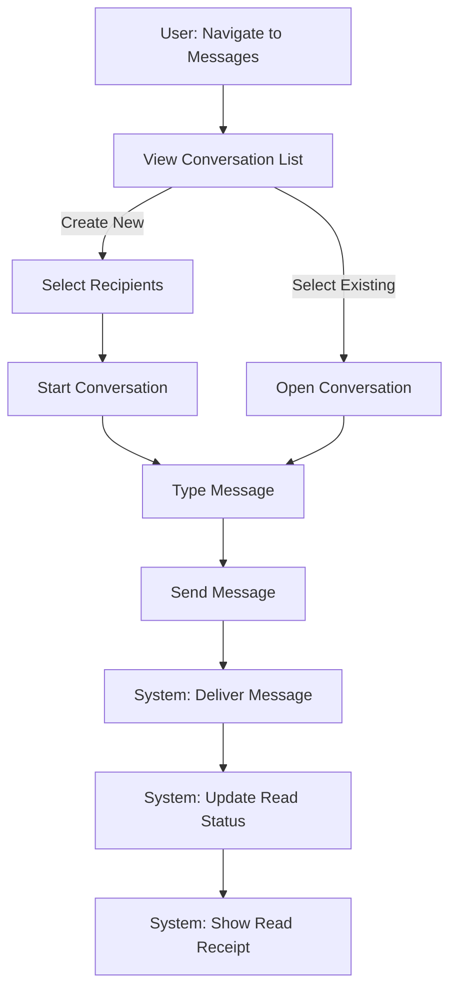
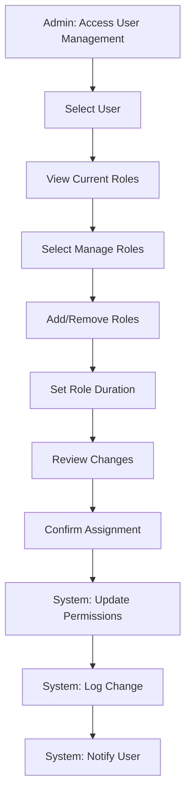

# Design Documentation

This directory contains comprehensive documentation for the Lofts des Arts platform design system, visual language, and user experience principles.

*Last Updated: April 5, 2025 | Version: 0.2.0*

## Directory Structure

- `/design-system/` - Core design system documentation
- `/brand/` - Brand identity guidelines
- `/ui-components/` - UI component design specifications
- `/wireframes/` - Low and high-fidelity wireframes
- `/mockups/` - Visual design mockups
- `/prototypes/` - Design prototypes and interactive mockups
- `/accessibility/` - Accessibility design guidelines
- `/user-research/` - User research findings and insights
- `/assets/` - Design assets and resources
- `/user-flows/` - User journey and flow diagrams
- `/messaging/` - Messaging system design
- `/package-management/` - Package management system design
- `/rbac/` - Role-based access control design

## Design System

The Lofts des Arts design system provides a unified framework for creating consistent, accessible, and visually cohesive user experiences across the platform.

### Brand Identity

- **Logo and Wordmark**: Usage guidelines, placement, sizing, and clear space requirements
- **Color Palette**: Primary, secondary, and accent colors with accessibility ratings
- **Typography**: Font families, sizes, weights, line heights, and hierarchies
- **Iconography**: Custom icon set and usage guidelines
- **Photography**: Style guide, image guidelines, and art direction
- **Voice and Tone**: Content style guidelines

[View Brand Guidelines](./brand/README.md)

### Core Design Tokens

Design tokens are the foundational variables that drive the visual design:

#### Colors

```css
:root {
  /* Primary palette */
  --color-primary: #7f1d1d;      /* Red 900 */
  --color-primary-dark: #2C5F7F; 
  --color-primary-light: #ef4444; /* Red 500 */
  
  /* Secondary palette */
  --color-secondary: #18181b;     /* Zinc 900 */
  --color-accent: #E6BC63;
  
  /* Neutral palette */
  --color-neutral-50: #F9F9F9;
  --color-neutral-100: #F3F4F6;
  --color-neutral-200: #E5E7EB;
  --color-neutral-300: #D1D5DB;
  --color-neutral-400: #9CA3AF;
  --color-neutral-500: #6B7280;
  --color-neutral-600: #4B5563;
  --color-neutral-700: #374151;
  --color-neutral-800: #1F2937;
  --color-neutral-900: #111827;
  
  /* Functional colors */
  --color-background: #fafafa;    /* White */
  --color-text: #18181b;          /* Zinc 900 */
  --color-text-secondary: #71717a; /* Zinc 500 */
  --color-error: #dc2626;         /* Red 600 */
  --color-success: #16a34a;       /* Green 600 */
  
  /* Status colors */
  --color-status-pending: #f59e0b;  /* Amber 500 */
  --color-status-received: #3b82f6; /* Blue 500 */
  --color-status-notified: #8b5cf6; /* Violet 500 */
  --color-status-delivered: #10b981; /* Emerald 500 */
  --color-status-returned: #ef4444; /* Red 500 */
  
  /* Message status colors */
  --color-message-sent: #9ca3af;   /* Gray 400 */
  --color-message-delivered: #6b7280; /* Gray 500 */
  --color-message-read: #3b82f6;   /* Blue 500 */
  --color-message-error: #ef4444;  /* Red 500 */
  
  /* Theme colors - dynamically applied */
  --background: 255 255 255; /* white - light mode */
  --foreground: 34 34 34; /* dark gray for text - light mode */
  
  /* Dark mode variables are applied via .dark class selector */
}

.dark {
  --background: 0 0 0; /* black - dark mode */
  --foreground: 255 255 255; /* white text - dark mode */
  --color-status-pending: #b45309; /* Amber 700 - dark mode */
  --color-status-received: #2563eb; /* Blue 600 - dark mode */
  --color-status-notified: #7c3aed; /* Violet 600 - dark mode */
  --color-status-delivered: #059669; /* Emerald 600 - dark mode */
  --color-status-returned: #dc2626; /* Red 600 - dark mode */
}
```

#### Spacing

```css
:root {
  --spacing-px: 1px;
  --spacing-0: 0;
  --spacing-0-5: 0.125rem; /* 2px */
  --spacing-1: 0.25rem;    /* 4px */
  --spacing-1-5: 0.375rem; /* 6px */
  --spacing-2: 0.5rem;     /* 8px */
  --spacing-3: 0.75rem;    /* 12px */
  --spacing-4: 1rem;       /* 16px */
  --spacing-5: 1.25rem;    /* 20px */
  --spacing-6: 1.5rem;     /* 24px */
  --spacing-8: 2rem;       /* 32px */
  --spacing-10: 2.5rem;    /* 40px */
  --spacing-12: 3rem;      /* 48px */
  --spacing-16: 4rem;      /* 64px */
  --spacing-20: 5rem;      /* 80px */
  --spacing-24: 6rem;      /* 96px */
  --spacing-32: 8rem;      /* 128px */
  --spacing-40: 10rem;     /* 160px */
  --spacing-48: 12rem;     /* 192px */
  --spacing-56: 14rem;     /* 224px */
  --spacing-64: 16rem;     /* 256px */
  
  /* Breakpoints */
  --breakpoint-sm: 640px;  /* Mobile landscape */
  --breakpoint-md: 768px;  /* Tablets */
  --breakpoint-lg: 1024px; /* Small desktops */
  --breakpoint-xl: 1280px; /* Large desktops */
  --breakpoint-2xl: 1536px; /* Extra large screens */
}
```

#### Typography

```css
:root {
  /* Font families */
  --font-sans: 'Inter', -apple-system, BlinkMacSystemFont, 'Segoe UI', Roboto, 'Helvetica Neue', Arial, sans-serif;
  --font-serif: 'Georgia', 'Times New Roman', serif;
  --font-mono: 'Roboto Mono', SFMono-Regular, Menlo, Monaco, Consolas, monospace;
  
  /* Font sizes */
  --font-size-xs: 0.75rem;    /* 12px */
  --font-size-sm: 0.875rem;   /* 14px */
  --font-size-base: 1rem;     /* 16px */
  --font-size-lg: 1.125rem;   /* 18px */
  --font-size-xl: 1.25rem;    /* 20px */
  --font-size-2xl: 1.5rem;    /* 24px */
  --font-size-3xl: 1.875rem;  /* 30px */
  --font-size-4xl: 2.25rem;   /* 36px */
  --font-size-5xl: 3rem;      /* 48px */
  --font-size-6xl: 3.75rem;   /* 60px */
  
  /* Font weights */
  --font-weight-thin: 100;
  --font-weight-extralight: 200;
  --font-weight-light: 300;
  --font-weight-normal: 400;
  --font-weight-medium: 500;
  --font-weight-semibold: 600;
  --font-weight-bold: 700;
  --font-weight-extrabold: 800;
  --font-weight-black: 900;
}
```

### Component Design

The design system includes specifications for all UI components:

- **Buttons**: Primary, secondary, outline, ghost variations
- **Navigation**: Header, footer, mobile menu, breadcrumbs
- **Forms**: Inputs, selects, checkboxes, radio buttons, switches
- **Cards**: Different content card layouts and variations
- **Feedback**: Alerts, notifications, modals, toasts
- **Media**: Image displays, carousels, galleries
- **Tables**: Data tables and grid displays
- **Conversation UI**: Message bubbles, conversation lists, typing indicators
- **Package Cards**: Package tracking and status cards
- **Role Badges**: Visual indicators for user roles
- **Permission Indicators**: Visual cues for permission status

[View Component Designs](./ui-components/README.md)

### Theme Support

The design system supports multiple themes and appearance modes:

- **Light Theme**: Default theme for public-facing pages
- **Dark Theme**: Dark mode option with appropriate contrast and color adjustments
- **High Contrast Theme**: Enhanced contrast option for accessibility

The theming system is implemented with:
- CSS variables for dynamic value updates
- Context-based theme provider in React
- Local storage persistence of user preferences
- System preference detection as default
- Smooth transitions between theme modes

## Responsive Design

The design follows a mobile-first approach with responsive breakpoints:

- **Mobile**: < 640px
- **Tablet**: 640px - 1023px
- **Desktop**: 1024px - 1279px
- **Large Desktop**: ≥ 1280px

Responsive design principles include:

- Flexible layouts using CSS Grid and Flexbox
- Fluid typography with clamp() functions
- Adaptive component layouts
- Touch-friendly interaction targets
- Component adaptations for different screen sizes
- Consideration for different input methods (touch vs. mouse)

## User Experience

### User Personas

The platform is designed for the following primary personas:

- **Prospective Buyers**: Individuals looking for property information
- **Current Residents**: Condominium owners and residents
- **Property Managers**: Administrative staff and property managers
- **Board Members**: Condominium board members with administrative access
- **Building Staff**: Doormen, maintenance workers, and other staff members
- **Contractors**: External service providers with limited access

[View User Personas](./user-research/personas.md)

### User Journeys

Key user journeys through the application:

- **Discovery Journey**: Prospective buyers exploring the property
- **Contact Journey**: Visitors submitting inquiries
- **Resident Access Journey**: Residents accessing protected resources
- **Administrative Journey**: Staff managing content and inquiries
- **Package Journey**: Package delivery, notification, and pickup workflow
- **Messaging Journey**: Conversation initiation, messaging, and notification flow
- **Role Assignment Journey**: Administrative flow for permission management

[View User Journeys](./user-research/journeys.md)

### Information Architecture

The site structure and content organization follows:

- Clear hierarchical structure
- Intuitive navigation patterns
- Logical content grouping
- Progressive disclosure of complex information
- Consistent labeling and terminology
- Role-based navigation adaptation
- Permission-aware content display

### Interaction Models

The platform follows these interaction principles:

- **Progressive Disclosure**: Revealing information as needed
- **Contextual Actions**: Displaying relevant actions in context
- **Feedback Loops**: Providing clear feedback for user actions
- **Error Prevention**: Designing to prevent errors before they occur
- **Graceful Recovery**: Helping users recover when errors occur
- **Real-time Updates**: Immediate feedback for collaborative actions
- **Permission-aware Interfaces**: Adapting UI based on user permissions

### Accessibility Guidelines

The platform adheres to WCAG 2.1 AA standards:

- **Perceivable**: Information presented in ways all users can perceive
- **Operable**: Interface elements operable by all users
- **Understandable**: Information and operation understandable to all users
- **Robust**: Content interpreted reliably by various user agents

## Messaging System Design

The messaging system follows specific design principles to ensure effective communication:

### Conversation Layout

```
┌──────────────────────────────┬──────────────────────────────────────────┐
│                              │                                          │
│  Conversation List           │  Message Thread                          │
│  ┌────────────────────────┐  │  ┌────────────────────────────────────┐  │
│  │ Recent Conversations   │  │  │ Conversation Header               │  │
│  │                        │  │  │ ┌──────────────────────────────┐  │  │
│  │ ┌──────────────────┐   │  │  │ │ Recipient Name             ↓ │  │  │
│  │ │ Conversation 1   │   │  │  │ └──────────────────────────────┘  │  │
│  │ └──────────────────┘   │  │  │                                  │  │
│  │                        │  │  │ ┌──────────────────────────────┐  │  │
│  │ ┌──────────────────┐   │  │  │ │ Message Bubbles              │  │  │
│  │ │ Conversation 2   │   │  │  │ │                              │  │  │
│  │ └──────────────────┘   │  │  │ │ ┌─────────────────────────┐  │  │  │
│  │                        │  │  │ │ │ Sender Message          │  │  │  │
│  │ ┌──────────────────┐   │  │  │ │ └─────────────────────────┘  │  │  │
│  │ │ Conversation 3   │   │  │  │ │                              │  │  │
│  │ └──────────────────┘   │  │  │ │ ┌─────────────────────────┐  │  │  │
│  │                        │  │  │ │ │ Recipient Message       │  │  │  │
│  └────────────────────────┘  │  │ │ └─────────────────────────┘  │  │  │
│                              │  │ │                              │  │  │
│                              │  │ └──────────────────────────────┘  │  │
│                              │  │                                  │  │
│                              │  │ ┌────────────────────────────────┐  │
│                              │  │ │ Message Composer               │  │
│                              │  │ │ ┌────────────────────────────┐ │  │
│                              │  │ │ │ Type a message...          │ │  │
│                              │  │ │ └────────────────────────────┘ │  │
│                              │  │ └────────────────────────────────┘  │
│                              │  │                                    │ │
└──────────────────────────────┴──────────────────────────────────────────┘
```

### Message Bubbles

Different message types have distinct visual treatments:

- **Self Messages**: Right-aligned, primary color background
- **Other User Messages**: Left-aligned, neutral background
- **System Messages**: Center-aligned, subtle background
- **Error Messages**: Highlighted with error state styling

### Conversation States

Visual indicators for conversation states:

- **New Message**: Unread count badge
- **Read Receipt**: Checkmark icon with status color
- **Typing Indicator**: Animated dots for real-time feedback
- **Attachment Indicator**: Paper clip icon with count

### Responsive Adaptations

- **Mobile**: Stack layout with conversation list toggling to thread view
- **Tablet**: Side-by-side with collapsible conversation list
- **Desktop**: Full two-column layout with additional details panel

### Accessibility Considerations

- **Screen Reader Announcements**: New message notifications
- **Keyboard Navigation**: Complete thread navigation via keyboard
- **Focus Management**: Proper focus handling in conversation switching
- **Alternative Text**: For message attachments and visual elements

[View Messaging Design Specifications](./messaging/README.md)

## Package Management Design

The package management system follows a user-centered design approach:

### Package Cards

```
┌─────────────────────────────────────────────────────────┐
│ Package #12345                                          │
│ ┌─────────────┐                                         │
│ │             │  Resident: John Doe (Unit 303)          │
│ │  Carrier    │  Received: April 2, 2025                │
│ │    Logo     │                                         │
│ │             │  Status: NOTIFIED                       │
│ └─────────────┘  ┌────────────────────┐                 │
│                  │     NOTIFIED       │                 │
│ Description:     └────────────────────┘                 │
│ Large box from Amazon                                   │
│                                                         │
│ ┌─────────┐  ┌─────────────┐  ┌─────────────────────┐  │
│ │ Details │  │ QR Code     │  │ Mark as Delivered   │  │
│ └─────────┘  └─────────────┘  └─────────────────────┘  │
└─────────────────────────────────────────────────────────┘
```

### Status Indicators

- **Color Coding**: Distinct colors for each package status
- **Progress Timeline**: Visual representation of package journey
- **Status Badges**: Prominent status indicators
- **Icons**: Visual reinforcement of status meaning

### QR Code Integration

- **QR Code Display**: Clean, high-contrast QR codes
- **Scanning Interface**: Camera access with frame guides
- **Verification Feedback**: Clear success/failure states
- **Print Formatting**: Printer-friendly QR code layouts

### Package List Views

- **Staff View**: Comprehensive list with filtering and sorting
- **Resident View**: Personalized view of own packages
- **Timeline View**: Historical package tracking

### Mobile Considerations

- **Scan-Optimized UI**: One-handed scanning interface
- **Quick Actions**: Swipe gestures for common actions
- **Push Notifications**: Clear delivery notifications
- **Offline Support**: Basic functionality without connection

[View Package Design Specifications](./package-management/README.md)

## Role-Based Access Control Design

The RBAC system design focuses on clarity and security:

### Role Visualization

```
┌───────────────────────────────────────────────────────┐
│ ROLE: DOORMAN                                         │
│ ┌────────────────┐                                    │
│ │                │  Description: Front desk staff     │
│ │     ROLE       │  responsible for receiving         │
│ │     ICON       │  packages and visitor management   │
│ │                │                                    │
│ └────────────────┘                                    │
│                                                       │
│ Permissions:                                          │
│                                                       │
│ ┌─────────────────────┐  ┌─────────────────────────┐ │
│ │ packages:create     │  │ packages:read           │ │
│ └─────────────────────┘  └─────────────────────────┘ │
│                                                       │
│ ┌─────────────────────┐  ┌─────────────────────────┐ │
│ │ packages:update     │  │ residents:view          │ │
│ └─────────────────────┘  └─────────────────────────┘ │
│                                                       │
│ Hierarchy Level: 6                                    │
│ ┌───────────────────────────────────────────────────┐ │
│ │●●●●●●○○○○                                        │ │
│ └───────────────────────────────────────────────────┘ │
└───────────────────────────────────────────────────────┘
```

### Permission UI Elements

- **Permission Badges**: Visual indicators of granted permissions
- **Role Hierarchy**: Visual representation of authority levels
- **Access Indicators**: Clear visual cues for accessible features
- **Permission Groups**: Logical grouping of related permissions
- **Toggle Controls**: Clear enable/disable permission switches

### User Interface Adaptations

- **Navigation Adaptation**: Menu items based on permissions
- **Feature Visibility**: Conditional rendering based on roles
- **Action Availability**: Contextual actions based on permissions
- **Error States**: Clear messaging for permission denied scenarios
- **Education**: Helper text explaining permission requirements

### Role Assignment Interface

- **Role Selection**: Visually clear role selection process
- **Permission Preview**: Preview of granted permissions
- **Temporary Role Controls**: Clear duration settings for temporary roles
- **Confirmation Steps**: Verification steps for critical permission changes
- **Audit Trail**: Visible history of permission changes

[View RBAC Design Specifications](./rbac/README.md)

## Design for Specific User Flows

### Package Management User Flow



### Messaging User Flow



### Role Assignment User Flow



## Design Documentation

The design specifications are maintained through:

- **Component Library**: Interactive documentation of all UI components
- **Design Tokens**: Published token documentation
- **Design System Website**: Internal documentation site
- **Design Files**: Figma design files with component libraries
- **Style Guide**: Comprehensive design language documentation
- **Pattern Library**: Reusable design patterns with usage guidelines
- **Accessibility Documentation**: WCAG compliance documentation

## Version Control & Collaboration

Design artifacts are version-controlled through:

- **Git Repository**: Design token files in code repository
- **Figma Version History**: Component design history
- **Design Decision Log**: Documentation of design decisions
- **Feedback Loops**: User testing results informing iterations

## Design Research

Design decisions are informed by:

- **User Testing**: Usability testing with all user personas
- **Heatmap Analysis**: Interaction pattern analysis
- **Accessibility Audits**: Regular WCAG compliance checks
- **Performance Testing**: Load time and performance analysis
- **Preference Testing**: A/B testing of design alternatives
- **Stakeholder Interviews**: Feedback from building management

## References

- [Design System Handbook](https://www.designsystemshandbook.com/)
- [WCAG 2.1 Guidelines](https://www.w3.org/TR/WCAG21/)
- [Inclusive Components](https://inclusive-components.design/)
- [Material Design](https://material.io/design)
- [Refactoring UI](https://refactoringui.com/)
- [Nielsen Norman Group](https://www.nngroup.com/)
- [Smashing Magazine](https://www.smashingmagazine.com/)
- [A List Apart](https://alistapart.com/) 