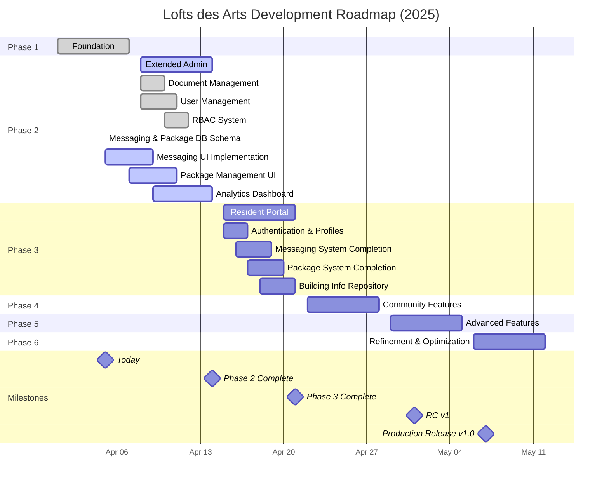

# Lofts des Arts Website Development Roadmap

This roadmap outlines the planned development trajectory for the Lofts des Arts condominium website, with detailed tasks, deliverables, and timelines for each phase.

*Last Updated: April 5, 2025*

## Development Timeline

## Phase 1: Foundation (April 1-7, 2025) ✅
**Objective:** Establish core platform infrastructure and basic functionality

### Tasks:
- [x] Initial Next.js 14 project setup with TypeScript and Tailwind CSS
- [x] Supabase integration (Authentication, Database, Storage)
- [x] Admin authentication system with role-based access control
- [x] Public-facing information pages (Home, About, Gallery, Contact)
- [x] Contact form with database storage for inquiries
- [x] Multi-language support implementation (EN/FR)
- [x] Responsive design framework for all device types
- [x] Basic SEO optimization for public pages

### Deliverables:
- [x] Functioning public website with core pages
- [x] Admin dashboard with authentication
- [x] Contact management system
- [x] Technical documentation for infrastructure
- [x] Deployment pipeline configuration

## Phase 2: Extended Admin Capabilities (April 8-14, 2025) 🔄
**Objective:** Expand administrative features for building management

### Tasks:
- [x] Document management system
  - [x] Secure file upload with type validation
  - [x] Category-based organization structure
  - [x] Version control for documents
  - [x] Permission-based access controls
- [x] Enhanced role-based access control (RBAC)
  - [x] Six user roles (SUPER_ADMIN, ADMIN, MANAGER, DOORMAN, SECURITY, RESIDENT)
  - [x] Role capabilities documentation
  - [x] Permission matrix for granular access control
- [x] Database schema for messaging and package systems
  - [x] Conversations and participants structure
  - [x] Messages with attachments and read receipts
  - [x] Package tracking with status history
  - [x] QR code generation infrastructure
- [ ] Enhanced analytics dashboard
  - [x] Visitor metrics and reporting
  - [ ] Inquiry analysis tools
  - [ ] Usage statistics visualization
- [ ] Board announcement publishing system
  - [x] Rich text editor with image support
  - [ ] Scheduling for future publications
  - [ ] Targeting to specific resident groups
- [ ] Emergency notification center
  - [x] Priority levels for notifications
  - [ ] Multiple delivery channels (email, SMS, in-app)
  - [ ] Confirmation tracking for critical alerts
- [ ] Audit logging for administrative actions
  - [x] Comprehensive activity logging
  - [ ] Log visualization and filtering tools
  - [ ] Automated suspicious activity detection
- [x] Admin user management
  - [x] Role-based permission system
  - [x] Account provisioning workflow
  - [x] Password policies and 2FA implementation

### Deliverables:
- [x] Document repository with search functionality
- [x] Comprehensive RBAC system with documentation
- [x] Messaging and package management database schema
- [ ] Interactive analytics dashboard
- [ ] Announcement management system
- [ ] Multi-channel notification system
- [ ] Complete audit trail system
- [x] User administration interface

## Phase 3: Resident Portal (April 15-21, 2025) 🔄
**Objective:** Create resident-specific features and access controls

### Current Status: Pre-work (5% Complete)
- [x] Database schema design for messaging system completed
- [x] Database schema design for package management completed
- [x] Building units and residents database structure implemented
- [x] Role-based access control for residents configured
- [x] User flows documented for messaging and package systems
- [ ] UI/UX mockups in development

### Tasks:
- [ ] Resident authentication system
  - [ ] Self-registration with verification
  - [ ] Unit-based access controls
  - [ ] Password reset and account recovery
- [ ] Profile management for residents
  - [ ] Personal information management
  - [ ] Communication preferences
  - [ ] Household member management
- [ ] Building information and rules repository
  - [ ] Searchable building documentation
  - [ ] Bylaws and regulations access
  - [ ] Amenity information and policies
- [ ] Maintenance request submission and tracking
  - [ ] Request form with category selection
  - [ ] Photo/video attachment capabilities
  - [ ] Status tracking and notifications
  - [ ] Communication thread for each request
- [ ] Internal messaging system
  - [x] Database schema and backend infrastructure
  - [ ] Conversation list and management UI
  - [ ] Message composition interface
  - [ ] File attachments and rich media support
  - [ ] Real-time notifications via WebSockets
- [ ] Package notification system
  - [x] Database schema and backend infrastructure
  - [ ] Package logging interface for staff
  - [ ] QR code generation and scanning
  - [ ] Automated notifications to residents
  - [ ] Pickup confirmation process
- [ ] Directory of services and contacts
  - [ ] Emergency contact information
  - [ ] Local service provider listings
  - [ ] Building staff directory

### Deliverables:
- [ ] Secure resident portal with personalized dashboard
- [ ] Comprehensive profile management system
- [ ] Searchable knowledge base of building information
- [ ] End-to-end maintenance request system
- [ ] Real-time messaging platform
- [ ] Package tracking and notification system
- [ ] Integrated service directory

## Phase 4: Community Features (April 22-28, 2025)
**Objective:** Implement features to enhance community engagement

### Tasks:
- [ ] Events calendar and management
  - [ ] Event creation and management interface
  - [ ] Registration and RSVP functionality
  - [ ] Calendar integration (iCal, Google)
  - [ ] Reminders and notifications
- [ ] Amenity booking system
  - [ ] Visual calendar for availability
  - [ ] Booking rules and time limits
  - [ ] Approval workflows for restricted amenities
  - [ ] Cancellation and modification policies
- [ ] Community bulletin board
  - [ ] Resident posting capabilities
  - [ ] Moderation tools for management
  - [ ] Category-based organization
- [ ] Community forum/discussion boards
  - [ ] Topic-based discussion areas
  - [ ] Moderation tools and flagging system
  - [ ] Rich media support (images, links)
  - [ ] Notification preferences
- [ ] Polls and voting for residents
  - [ ] Poll creation interface
  - [ ] Secure voting mechanisms
  - [ ] Results visualization
  - [ ] Archiving of past polls
- [ ] Photo galleries of building and events
  - [ ] Multi-upload functionality
  - [ ] Album organization
  - [ ] Tagging and search capabilities
  - [ ] Moderation and privacy controls

### Deliverables:
- [ ] Full-featured events management system
- [ ] Interactive amenity booking platform
- [ ] Community bulletin board with moderation
- [ ] Discussion forums with topic management
- [ ] Secure voting and polling system
- [ ] Media gallery with organization tools

## Phase 5: Advanced Features (April 29-May 5, 2025)
**Objective:** Implement cutting-edge functionality and integrations

### Tasks:
- [ ] Mobile app development
  - [ ] Native app for iOS and Android
  - [ ] Push notification integration
  - [ ] Offline capabilities for critical functions
  - [ ] Biometric authentication
- [ ] Real-time building status monitoring
  - [ ] Integration with building systems
  - [ ] Status dashboard with alerts
  - [ ] Historical data and trending
  - [ ] Anomaly detection
- [ ] Integration with building security systems
  - [ ] Visitor management interface
  - [ ] Security camera feed access (if permitted)
  - [ ] Door access logs
  - [ ] Intercom system integration
- [ ] Payment processing for condominium fees
  - [ ] Secure payment gateway integration
  - [ ] Automatic recurring payments
  - [ ] Payment history and receipts
  - [ ] Late payment notifications
- [ ] API integrations with third-party services
  - [ ] Weather services
  - [ ] Local news and alerts
  - [ ] Transit information
  - [ ] Smart building systems
- [ ] Push notifications
  - [ ] Customizable notification preferences
  - [ ] Topic-based subscription
  - [ ] Critical alert override settings
  - [ ] Notification center with history

### Deliverables:
- [ ] Native mobile applications
- [ ] Building systems monitoring dashboard
- [ ] Integrated security management interface
- [ ] Complete payment processing system
- [ ] Third-party service integration hub
- [ ] Comprehensive notification system

## Phase 6: Refinement and Optimization (May 6-12, 2025)
**Objective:** Polish the platform and optimize performance and usability

### Tasks:
- [ ] Performance optimization
  - [ ] Comprehensive performance audit
  - [ ] Image optimization and lazy loading
  - [ ] Code splitting and bundle optimization
  - [ ] Database query optimization
  - [ ] Caching strategy implementation
- [ ] User experience improvements
  - [ ] Usability testing with residents
  - [ ] Interface refinements based on feedback
  - [ ] Interaction design improvements
  - [ ] Streamlined workflows for common tasks
- [ ] Enhanced accessibility features
  - [ ] WCAG 2.1 AA compliance verification
  - [ ] Screen reader optimization
  - [ ] Keyboard navigation improvements
  - [ ] Color contrast and readability enhancements
- [ ] Advanced search capabilities
  - [ ] Full-text search across platform
  - [ ] Faceted search and filtering
  - [ ] Search analytics and improvement
  - [ ] Voice search integration
- [ ] Reporting and analytics refinements
  - [ ] Custom report builder
  - [ ] Data visualization enhancements
  - [ ] Export capabilities (PDF, CSV)
  - [ ] Scheduled report delivery
- [ ] Security auditing and enhancements
  - [ ] Penetration testing
  - [ ] Vulnerability assessment
  - [ ] Security patch management
  - [ ] Data protection review

### Deliverables:
- [ ] Performance optimization report with metrics
- [ ] UX improvement documentation
- [ ] Accessibility compliance certification
- [ ] Enhanced search functionality
- [ ] Comprehensive reporting system
- [ ] Security audit documentation

## Future Considerations (Post-May 2025)
**Objective:** Explore next-generation features for ongoing platform evolution

### Potential Features:
- **Smart Building Integrations**
  - IoT device management
  - Smart home system integration
  - Energy management systems
  - Environmental monitoring

- **AI-Assisted Management Tools**
  - Predictive maintenance suggestions
  - Automated response systems
  - Pattern recognition for building operations
  - Virtual concierge services

- **Virtual/Augmented Reality Building Tours**
  - Virtual property tours for prospective buyers
  - AR maintenance assistance
  - Interactive building map and navigation
  - Historical building visualization

- **Predictive Maintenance Modeling**
  - Equipment lifecycle tracking
  - Maintenance forecasting
  - Cost projection and budgeting
  - Vendor management integration

- **Energy Usage Monitoring and Optimization**
  - Real-time energy consumption tracking
  - Efficiency recommendations
  - Cost saving calculations
  - Sustainability reporting

- **Community Marketplace**
  - Resident-to-resident exchanges
  - Local business partnerships
  - Service provider recommendations
  - Group purchasing opportunities

## Progress Tracking

| Phase | Progress | Timeline Status | Key Features in Development |
|-------|----------|----------------|----------------------------|
| Phase 1 | 100% | Completed | ✓ Next.js setup, ✓ Admin dashboard, ✓ Contact system |
| Phase 2 | 80% | On Track | 🔄 Messaging DB, 🔄 Package DB, 🔄 RBAC system |
| Phase 3 | 5% | Starting | 🟡 UI/UX mockups, 🟡 Messaging UI, 🟡 Package UI |
| Phase 4 | 0% | Not Started | 📅 Events calendar, 📋 Amenity booking |
| Phase 5 | 0% | Not Started | 📱 Mobile app, 🏢 Building systems integration |
| Phase 6 | 0% | Not Started | ⚡ Performance optimization, �� Security audit | 