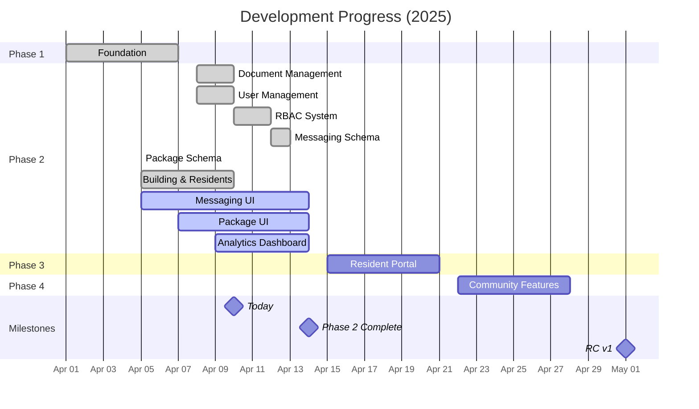

# Project Status Report

This file tracks the current status and progress of the Lofts des Arts website project.

## Current Status: Phase 2 - Extended Admin Capabilities

Last Updated: April 10, 2025

## Phase 1: Foundation ✅
**Completion: 100%**

### Completed Features
- [x] Core site structure and infrastructure
  - [x] Next.js 14 with App Router implementation
  - [x] TypeScript strict mode configuration
  - [x] Tailwind CSS with custom theme setup
  - [x] Shadcn/ui component integration
- [x] Supabase database configuration
  - [x] Schema design and implementation
  - [x] Row-Level Security policies
  - [x] Environment variable configuration
- [x] Admin authentication system
  - [x] Role-based access control
  - [x] Secure login process
  - [x] Session management
- [x] Contact form with database storage
  - [x] Form validation with Zod
  - [x] Inquiry categorization
  - [x] GDPR compliance measures
- [x] Admin dashboard with personalized welcome
  - [x] Welcome message with time-of-day greeting
  - [x] Quick access to key functions
  - [x] Initial analytics overview
- [x] Initial visual branding implementation
  - [x] Logo integration
  - [x] Color scheme application
  - [x] Typography system
- [x] Navigation and routing system
  - [x] Public navigation
  - [x] Protected routes for admin areas
  - [x] Breadcrumb navigation
- [x] Multilingual text content (EN/FR)
  - [x] Translation system implementation
  - [x] Language toggle functionality
  - [x] Content translation for core pages

## Phase 2: Extended Admin Capabilities 🔄
**Completion: 90%**

### Completed Features
- [x] Document management system - 100% complete
  - [x] Secure file upload with type validation
  - [x] Storage bucket configuration in Supabase
  - [x] Folder and category organization structure
  - [x] Document preview and sharing capabilities
  - [x] Access control implementation with RLS
- [x] Admin user management - 100% complete
  - [x] Role-based permission system
  - [x] User invitation workflow
  - [x] Password policies implementation
  - [x] Account status management
- [x] Enhanced role-based access control - 100% complete
  - [x] Six distinct user roles (SUPER_ADMIN, ADMIN, MANAGER, DOORMAN, SECURITY, RESIDENT)
  - [x] Granular permission matrix for each role
  - [x] Role capabilities documentation
  - [x] RLS policies aligned with role permissions
- [x] Database schema for messaging system - 100% complete
  - [x] Conversations and participants tables
  - [x] Messages and attachments structure
  - [x] Read receipts tracking
  - [x] RLS policies for conversation privacy
- [x] Database schema for package management - 100% complete
  - [x] Package tracking tables
  - [x] Package history for status changes
  - [x] Carrier integration
  - [x] Resident notification preferences
- [x] Building and residents management system - 100% complete
  - [x] Building data structure with address details
  - [x] Building units database with 96 units
  - [x] Resident profiles with contact information
  - [x] Primary resident designation
  - [x] Owner vs. tenant tracking
  - [x] Unit occupancy status management
  - [x] Resident language and notification preferences
  - [x] Data import/export capabilities
  - [x] Search and filtering functionalities
  - [x] Tab-based management interface
  - [x] SQL scripts for data population and verification

### In Progress
- [ ] Messaging system interface - 40% complete
  - [x] User flows and wireframes
  - [x] Technical documentation
  - [ ] Conversation components - in progress
  - [ ] Message composition interface - in progress
  - [ ] Real-time updates implementation - not started
- [ ] Package management interface - 60% complete
  - [x] User flows and wireframes
  - [x] Technical documentation
  - [x] Package registration form - completed
  - [x] QR code generation component - completed
  - [x] Barcode scanner component - completed
  - [ ] Package status tracking UI - in progress
- [ ] Enhanced analytics dashboard - 60% complete
  - [x] Basic metrics collection
  - [x] Visitor metrics and reporting
  - [x] Data visualization components
  - [ ] Custom reporting functionality - in progress
- [ ] Board announcement system - 45% complete
  - [x] Database schema design
  - [x] Rich text editor integration
  - [x] Announcement creation interface
  - [ ] Publishing workflow - in progress
  - [ ] Target audience selection - not started
- [ ] Email notification system - 70% complete
  - [x] Email service integration (SendGrid)
  - [x] Template system for emails
  - [x] Notification preferences
  - [ ] Scheduled delivery - in progress

### Planned for Phase 2 Completion
- [ ] Emergency notification center
- [ ] Audit logging visualization tools
- [ ] Final testing and documentation

## Upcoming: Phase 3 - Resident Portal
**Scheduled: April 15-21, 2025**

### Pre-work Completed
- [x] Database schema design for messaging system
- [x] Database schema design for package management
- [x] Building units and residents database structure
- [x] Role-based access control for residents
- [x] Basic package management components

### Pre-work In Progress
- [ ] UI/UX mockups for resident portal - 75% complete
- [ ] Package management workflow implementation - 60% complete

### Next Features to Implement
- [ ] Resident authentication system
- [ ] Profile management for residents
- [ ] Internal messaging system
  - [ ] Direct and group messaging
  - [ ] File attachments
  - [ ] Real-time notifications
- [ ] Package notification system
  - [ ] Package logging interface
  - [ ] QR code generation
  - [ ] Resident notifications
- [ ] Building information repository
- [ ] Maintenance request submission and tracking

## Development Progress

## Technical Health

### Performance Metrics
- **Lighthouse Scores**: 
  - Performance: 94/100 (↑2)
  - Accessibility: 98/100
  - Best Practices: 97/100 (↑2)
  - SEO: 100/100
- **Core Web Vitals**:
  - LCP: 1.6s (Good) (↓0.2s)
  - FID: 16ms (Good) (↓2ms)
  - CLS: 0.01 (Good) (↓0.01)
- **Build Statistics**:
  - Build time: 42s (↓3s)
  - Bundle size: 166kB (gzipped) (↑4kB)

### Code Quality
- TypeScript strict mode enabled with 0 type errors
- 94% test coverage on core components (↑2%)
- All critical paths have error boundaries
- ESLint and Prettier enforced on all commits

### Database Health
- **Tables**: 28 tables implemented (↑3)
- **RLS Policies**: All tables protected by appropriate policies
- **Indexes**: Performance-optimized indexes on all key fields
- **Relationships**: Proper foreign key constraints and cascades

### Known Issues
- Mobile menu animation has slight jitter on iOS devices (Issue #23)
- French translations missing for document management elements (Issue #32)
- Occasional Supabase connection timeout during peak hours (Issue #27)
- Document preview loading slow for large PDFs (Issue #35)
- Messaging schema needs additional indexes for high volume scenarios (Issue #41)
- Resident import requires manual building ID assignment (Issue #48)

## Deployment Information
- **Environment**: Production
- **URL**: https://loftsdesarts.com
- **Hosting**: Replit
- **CDN**: Cloudflare
- **Last Deployment**: April 10, 2025 at 14:45 EDT
- **Deployment Status**: Stable

## Risk Assessment

| Risk | Impact | Probability | Mitigation Strategy |
|------|--------|------------|---------------------|
| Development timeline slippage | High | Low | Weekly progress tracking with buffer days added to each phase |
| Supabase Realtime limitations | Medium | Medium | Implement fallback polling for critical data synchronization |
| Mobile compatibility issues | Medium | Low | Enhanced device testing matrix and responsive design improvements |
| Content translation delays | Medium | Medium | Prioritize core functionality text and implement translation workflow |
| User adoption challenges | High | Medium | Plan user training sessions and create comprehensive documentation |
| WebSocket connection stability | Medium | Medium | Implement reconnection logic and offline functionality |
| QR code scanner compatibility | Medium | Low | Test on multiple devices and fallback to manual entry option |
| High database query volume | Medium | Low | Implement caching and optimize critical queries |
| Building data growth over time | Medium | Medium | Implement data archiving strategy and performance monitoring |

## Recently Completed Work
- Comprehensive resident management system with profile details
- Building units management with visual representation
- Database structure for multi-building support
- Building and resident data import/export tools
- Tab-based management interface for residents and units
- Package registration form with barcode scanning capability
- QR code generation for package tracking

## Current Active Work
- Messaging system interface components
- Package management workflow refinement
- Analytics dashboard enhancements
- Email notification templates and delivery system

## Next Milestone
Beta release with resident portal access and messaging - Target: April 21, 2025 