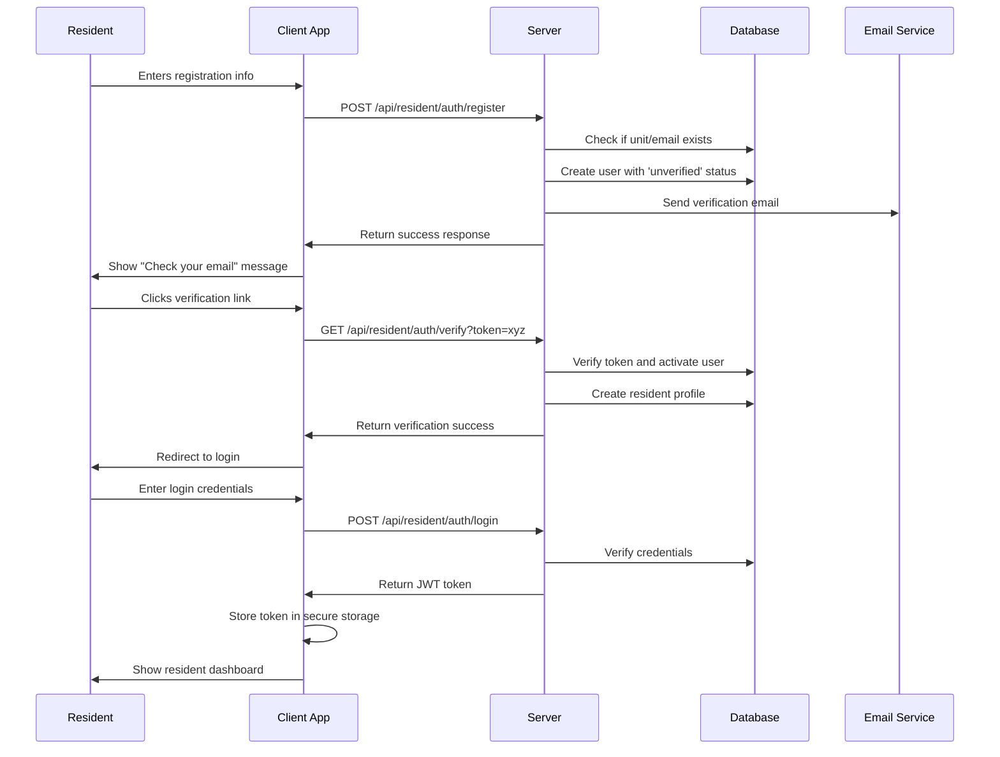

# Session 6 Development Resources: Resident Portal

*Last Updated: April 13, 2025*

## Resident Portal Project Structure

```
loftsdesarts/
├── app/
│   ├── resident/                   # Resident portal routes
│   │   ├── layout.tsx              # Resident layout with navigation
│   │   ├── page.tsx                # Resident dashboard
│   │   ├── auth/                   # Authentication routes
│   │   │   ├── login/              # Login page
│   │   │   ├── register/           # Registration page
│   │   │   ├── verify/             # Email verification
│   │   │   └── reset-password/     # Password reset
│   │   ├── profile/                # Profile management
│   │   │   ├── page.tsx            # Main profile page
│   │   │   ├── edit/               # Edit profile
│   │   │   ├── household/          # Household members
│   │   │   └── preferences/        # User preferences
│   │   ├── messages/               # Messaging system
│   │   │   ├── page.tsx            # Messages dashboard
│   │   │   ├── [conversationId]/   # Individual conversation
│   │   │   └── new/                # New message
│   │   ├── packages/               # Package management
│   │   │   ├── page.tsx            # Package dashboard
│   │   │   └── [packageId]/        # Package details
│   │   ├── building/               # Building information
│   │   │   ├── page.tsx            # Building info dashboard
│   │   │   ├── documents/          # Document repository
│   │   │   ├── rules/              # Building rules
│   │   │   └── faq/                # Frequently asked questions
│   │   └── maintenance/            # Maintenance requests
│   │       ├── page.tsx            # Request dashboard
│   │       ├── new/                # New request
│   │       └── [requestId]/        # Request details
│   ├── api/                        # API endpoints
│   │   ├── resident/               # Resident-specific APIs
│   │   │   ├── auth/               # Authentication endpoints
│   │   │   ├── profile/            # Profile endpoints
│   │   │   ├── messages/           # Messaging endpoints
│   │   │   ├── packages/           # Package endpoints
│   │   │   └── maintenance/        # Maintenance endpoints
```

## Component Structure

```
components/
├── resident/                       # Resident-specific components
│   ├── auth/                       # Authentication components
│   │   ├── RegisterForm.tsx        # Registration form
│   │   ├── LoginForm.tsx           # Login form
│   │   ├── VerificationForm.tsx    # Email verification
│   │   └── PasswordResetForm.tsx   # Password reset
│   ├── profile/                    # Profile components
│   │   ├── ProfileCard.tsx         # Profile summary
│   │   ├── ProfileEditor.tsx       # Profile editing form
│   │   ├── PhotoUploader.tsx       # Profile photo management
│   │   └── HouseholdMembers.tsx    # Household management
│   ├── messaging/                  # Messaging components
│   │   ├── ConversationList.tsx    # List of conversations
│   │   ├── MessageThread.tsx       # Thread of messages
│   │   ├── MessageComposer.tsx     # Message composition
│   │   ├── FileAttachment.tsx      # File attachment
│   │   └── ReadReceipt.tsx         # Read receipt indicator
│   ├── packages/                   # Package components
│   │   ├── PackageList.tsx         # List of packages
│   │   ├── PackageCard.tsx         # Package summary card
│   │   ├── PackageDetails.tsx      # Package details view
│   │   ├── QRCode.tsx              # QR code display
│   │   └── PackageTimeline.tsx     # Status timeline
│   ├── building/                   # Building info components
│   │   ├── DocumentBrowser.tsx     # Document browser
│   │   ├── DocumentViewer.tsx      # Document viewer
│   │   ├── RulesList.tsx           # Building rules list
│   │   └── FAQAccordion.tsx        # FAQ accordions
│   └── maintenance/                # Maintenance components
│       ├── RequestList.tsx         # List of requests
│       ├── RequestForm.tsx         # Request submission
│       ├── RequestDetails.tsx      # Request details
│       └── StatusTracker.tsx       # Status tracking
```

## Database Schema Reference

### Resident Authentication and Profiles

```sql
-- Extended profiles for residents
CREATE TABLE resident_profiles (
  id UUID PRIMARY KEY REFERENCES auth.users(id),
  unit_id UUID REFERENCES building_units(id),
  first_name TEXT NOT NULL,
  last_name TEXT NOT NULL,
  email TEXT NOT NULL UNIQUE,
  phone TEXT,
  photo_url TEXT,
  is_primary BOOLEAN DEFAULT false,
  move_in_date DATE,
  preferred_language TEXT DEFAULT 'en',
  notification_preferences JSONB DEFAULT '{}',
  created_at TIMESTAMP WITH TIME ZONE DEFAULT NOW(),
  updated_at TIMESTAMP WITH TIME ZONE DEFAULT NOW()
);

-- Household members
CREATE TABLE household_members (
  id UUID PRIMARY KEY DEFAULT gen_random_uuid(),
  resident_id UUID REFERENCES resident_profiles(id) ON DELETE CASCADE,
  first_name TEXT NOT NULL,
  last_name TEXT NOT NULL,
  relationship TEXT NOT NULL,
  is_adult BOOLEAN DEFAULT true,
  created_at TIMESTAMP WITH TIME ZONE DEFAULT NOW(),
  updated_at TIMESTAMP WITH TIME ZONE DEFAULT NOW()
);
```

### RLS Policies for Resident Data

```sql
-- Resident profile RLS policies
ALTER TABLE resident_profiles ENABLE ROW LEVEL SECURITY;

-- Residents can view their own profile
CREATE POLICY "Residents can view own profile"
  ON resident_profiles
  FOR SELECT
  USING (id = auth.uid());

-- Residents can update their own profile
CREATE POLICY "Residents can update own profile"
  ON resident_profiles
  FOR UPDATE
  USING (id = auth.uid());

-- Building staff can view all resident profiles
CREATE POLICY "Staff can view all profiles"
  ON resident_profiles
  FOR SELECT
  USING (
    EXISTS (
      SELECT 1 FROM user_roles
      WHERE user_id = auth.uid()
      AND role_name IN ('ADMIN', 'MANAGER', 'STAFF', 'DOORMAN')
    )
  );
```

## API Endpoints Reference

### Authentication Endpoints

```typescript
// /api/resident/auth/register
// POST - Register a new resident
interface RegisterRequest {
  email: string;
  password: string;
  firstName: string;
  lastName: string;
  unitId: string;
  inviteCode?: string;
}

// /api/resident/auth/login
// POST - Login a resident
interface LoginRequest {
  email: string;
  password: string;
}

// /api/resident/auth/verify
// POST - Verify a resident's email
interface VerifyRequest {
  token: string;
}

// /api/resident/auth/reset-password
// POST - Request a password reset
interface ResetPasswordRequest {
  email: string;
}
```

### Profile Management Endpoints

```typescript
// /api/resident/profile
// GET - Get resident profile
// PATCH - Update resident profile
interface ProfileUpdateRequest {
  firstName?: string;
  lastName?: string;
  phone?: string;
  photoUrl?: string;
  preferredLanguage?: string;
  notificationPreferences?: NotificationPreferences;
}

// /api/resident/profile/household
// GET - Get household members
// POST - Add household member
interface HouseholdMemberRequest {
  firstName: string;
  lastName: string;
  relationship: string;
  isAdult: boolean;
}
```

## Authentication Flow Diagram



## Key UI Components

### Resident Dashboard Wireframe

```
+-------------------------------------------------+
|                RESIDENT PORTAL                  |
+-------------------------------------------------+
|     |                                           |
|     | Welcome, [First Name]                     |
|     |                                           |
| NAV | +-------------------+ +-----------------+ |
|     | | PACKAGES          | | MESSAGES        | |
| BAR | | 2 Awaiting Pickup | | 3 Unread        | |
|     | +-------------------+ +-----------------+ |
|     |                                           |
|     | +-------------------+ +-----------------+ |
|     | | MAINTENANCE       | | BUILDING INFO   | |
|     | | 1 Open Request    | | 5 Documents     | |
|     | +-------------------+ +-----------------+ |
|     |                                           |
|     | RECENT ACTIVITY                           |
|     | ------------------------------------------+
|     | > Package delivered - 2 hours ago         |
|     | > New message from Admin - 1 day ago      |
|     | > Maintenance request updated - 2 days ago|
+-------------------------------------------------+
```

### Resident Profile Page Wireframe

```
+-------------------------------------------------+
|                RESIDENT PORTAL                  |
+-------------------------------------------------+
|     |                                           |
|     | MY PROFILE                                |
|     |                                           |
| NAV | +-----------------------+                 |
|     | |  +-------+            |                 |
| BAR | |  | PHOTO |  John Doe  |                 |
|     | |  +-------+  Unit 42   |                 |
|     | |                       |                 |
|     | +-----------------------+                 |
|     |                                           |
|     | PERSONAL INFORMATION                      |
|     | ------------------------------------------+
|     | First Name: John                          |
|     | Last Name: Doe                            |
|     | Email: john.doe@example.com               |
|     | Phone: (555) 123-4567                     |
|     | Language: English                [EDIT]   |
|     |                                           |
|     | HOUSEHOLD MEMBERS                         |
|     | ------------------------------------------+
|     | + Jane Doe (Spouse)                       |
|     | + Alex Doe (Child)                [ADD]   |
|     |                                           |
|     | NOTIFICATION PREFERENCES                  |
|     | ------------------------------------------+
|     | [ ] Email  [✓] SMS  [✓] In-App    [EDIT] |
+-------------------------------------------------+
```

## Technical Documentation References

- [Next.js App Router Documentation](https://nextjs.org/docs)
- [Supabase Row Level Security Guide](https://supabase.com/docs/guides/auth/row-level-security)
- [Supabase Authentication Documentation](https://supabase.com/docs/guides/auth)
- [React Hook Form Documentation](https://react-hook-form.com/get-started)
- [Zod Validation Schema Library](https://github.com/colinhacks/zod)
- [TanStack Query Data Fetching](https://tanstack.com/query/latest/docs/react/overview)
- [Supabase Realtime Documentation](https://supabase.com/docs/guides/realtime/quickstart)
- [WebSocket Notifications Guide](https://developer.mozilla.org/en-US/docs/Web/API/WebSockets_API)

## Design System References

- [Theme-Aware Component Guide](../../../docs/components/components.md)
- [Design System Documentation](../../../docs/design/design.md)
- [Accessibility Guidelines](https://www.w3.org/WAI/WCAG21/quickref/)
- [Mobile Responsiveness Best Practices](https://web.dev/responsive-web-design-basics/)

## Security Considerations

- [OWASP Authentication Best Practices](https://cheatsheetseries.owasp.org/cheatsheets/Authentication_Cheat_Sheet.html)
- [JWT Security Guide](https://jwt.io/introduction)
- [Cross-Site Request Forgery Prevention](https://owasp.org/www-community/attacks/csrf)
- [Content Security Policy](https://developer.mozilla.org/en-US/docs/Web/HTTP/CSP)
- [XSS Prevention Cheat Sheet](https://cheatsheetseries.owasp.org/cheatsheets/Cross_Site_Scripting_Prevention_Cheat_Sheet.html)

## Testing Resources

- [React Testing Library Examples](https://testing-library.com/docs/react-testing-library/example-intro/)
- [Jest Documentation](https://jestjs.io/docs/getting-started)
- [Cypress End-to-End Testing](https://docs.cypress.io/guides/overview/why-cypress)
- [Accessibility Testing Tools](https://www.w3.org/WAI/test-evaluate/tools/list)
- [Lighthouse Performance Testing](https://developers.google.com/web/tools/lighthouse)

By utilizing these resources, we'll ensure a consistent, secure, and high-quality implementation of the Resident Portal features. 