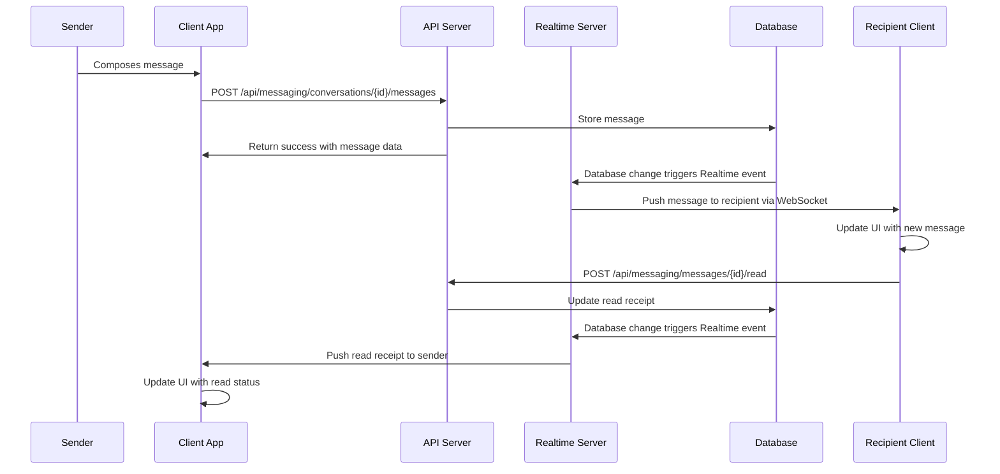
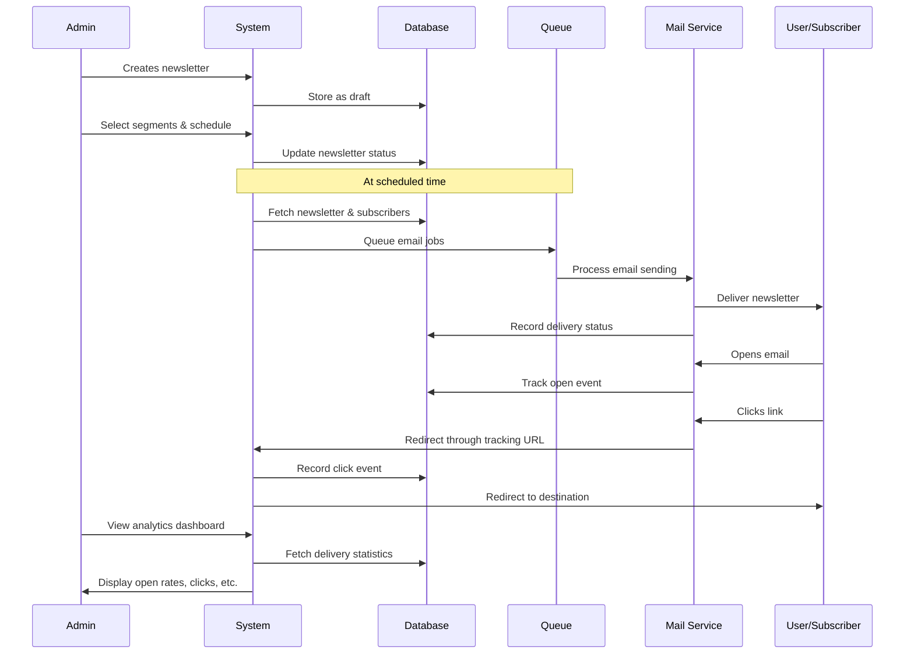

# Session 6 Development Resources: Resident Portal

*Last Updated: April 6, 2025*

## Resident Portal Project Structure

```
loftsdesarts/
├── app/
│   ├── resident/                   # Resident portal routes
│   │   ├── layout.tsx              # Resident layout with navigation
│   │   ├── page.tsx                # Resident dashboard
│   │   ├── auth/                   # Authentication routes
│   │   │   ├── login/              # Login page
│   │   │   ├── register/           # Registration page
│   │   │   ├── verify/             # Email verification
│   │   │   └── reset-password/     # Password reset
│   │   ├── profile/                # Profile management
│   │   │   ├── page.tsx            # Main profile page
│   │   │   ├── edit/               # Edit profile
│   │   │   ├── household/          # Household members
│   │   │   └── preferences/        # User preferences
│   │   ├── messages/               # Messaging system
│   │   │   ├── page.tsx            # Messages dashboard
│   │   │   ├── [conversationId]/   # Individual conversation
│   │   │   └── new/                # New message
│   │   ├── packages/               # Package management
│   │   │   ├── page.tsx            # Package dashboard
│   │   │   └── [packageId]/        # Package details
│   │   ├── building/               # Building information
│   │   │   ├── page.tsx            # Building info dashboard
│   │   │   ├── documents/          # Document repository
│   │   │   ├── rules/              # Building rules
│   │   │   └── faq/                # Frequently asked questions
│   │   └── maintenance/            # Maintenance requests
│   │       ├── page.tsx            # Request dashboard
│   │       ├── new/                # New request
│   │       └── [requestId]/        # Request details
│   ├── api/                        # API endpoints
│   │   ├── resident/               # Resident-specific APIs
│   │   │   ├── auth/               # Authentication endpoints
│   │   │   ├── profile/            # Profile endpoints
│   │   │   ├── messages/           # Messaging endpoints
│   │   │   ├── packages/           # Package endpoints
│   │   │   └── maintenance/        # Maintenance endpoints
```

## Component Structure

```
components/
├── resident/                       # Resident-specific components
│   ├── auth/                       # Authentication components
│   │   ├── RegisterForm.tsx        # Registration form
│   │   ├── LoginForm.tsx           # Login form
│   │   ├── VerificationForm.tsx    # Email verification
│   │   └── PasswordResetForm.tsx   # Password reset
│   ├── profile/                    # Profile components
│   │   ├── ProfileCard.tsx         # Profile summary
│   │   ├── ProfileEditor.tsx       # Profile editing form
│   │   ├── PhotoUploader.tsx       # Profile photo management
│   │   └── HouseholdMembers.tsx    # Household management
│   ├── messaging/                  # Messaging components
│   │   ├── ConversationList.tsx    # List of conversations
│   │   ├── MessageThread.tsx       # Thread of messages
│   │   ├── MessageComposer.tsx     # Message composition
│   │   ├── FileAttachment.tsx      # File attachment
│   │   └── ReadReceipt.tsx         # Read receipt indicator
│   ├── packages/                   # Package components
│   │   ├── PackageList.tsx         # List of packages
│   │   ├── PackageCard.tsx         # Package summary card
│   │   ├── PackageDetails.tsx      # Package details view
│   │   ├── QRCode.tsx              # QR code display
│   │   └── PackageTimeline.tsx     # Status timeline
│   ├── building/                   # Building info components
│   │   ├── DocumentBrowser.tsx     # Document browser
│   │   ├── DocumentViewer.tsx      # Document viewer
│   │   ├── RulesList.tsx           # Building rules list
│   │   └── FAQAccordion.tsx        # FAQ accordions
│   └── maintenance/                # Maintenance components
│       ├── RequestList.tsx         # List of requests
│       ├── RequestForm.tsx         # Request submission
│       ├── RequestDetails.tsx      # Request details
│       └── StatusTracker.tsx       # Status tracking
```

## Database Schema Reference

### Resident Authentication and Profiles

```sql
-- Extended profiles for residents
CREATE TABLE resident_profiles (
  id UUID PRIMARY KEY REFERENCES auth.users(id),
  unit_id UUID REFERENCES building_units(id),
  first_name TEXT NOT NULL,
  last_name TEXT NOT NULL,
  email TEXT NOT NULL UNIQUE,
  phone TEXT,
  photo_url TEXT,
  is_primary BOOLEAN DEFAULT false,
  move_in_date DATE,
  preferred_language TEXT DEFAULT 'en',
  notification_preferences JSONB DEFAULT '{}',
  created_at TIMESTAMP WITH TIME ZONE DEFAULT NOW(),
  updated_at TIMESTAMP WITH TIME ZONE DEFAULT NOW()
);

-- Household members
CREATE TABLE household_members (
  id UUID PRIMARY KEY DEFAULT gen_random_uuid(),
  resident_id UUID REFERENCES resident_profiles(id) ON DELETE CASCADE,
  first_name TEXT NOT NULL,
  last_name TEXT NOT NULL,
  relationship TEXT NOT NULL,
  is_adult BOOLEAN DEFAULT true,
  created_at TIMESTAMP WITH TIME ZONE DEFAULT NOW(),
  updated_at TIMESTAMP WITH TIME ZONE DEFAULT NOW()
);
```

### RLS Policies for Resident Data

```sql
-- Resident profile RLS policies
ALTER TABLE resident_profiles ENABLE ROW LEVEL SECURITY;

-- Residents can view their own profile
CREATE POLICY "Residents can view own profile"
  ON resident_profiles
  FOR SELECT
  USING (id = auth.uid());

-- Residents can update their own profile
CREATE POLICY "Residents can update own profile"
  ON resident_profiles
  FOR UPDATE
  USING (id = auth.uid());

-- Building staff can view all resident profiles
CREATE POLICY "Staff can view all profiles"
  ON resident_profiles
  FOR SELECT
  USING (
    EXISTS (
      SELECT 1 FROM user_roles
      WHERE user_id = auth.uid()
      AND role_name IN ('ADMIN', 'MANAGER', 'STAFF', 'DOORMAN')
    )
  );
```

## Messaging System Database Schema

```sql
-- Create message types enum
CREATE TYPE conversation_type AS ENUM (
  'direct',
  'group',
  'announcement',
  'system'
);

-- Create participant role enum
CREATE TYPE participant_role AS ENUM (
  'owner',
  'admin',
  'member',
  'readonly'
);

-- Create message status enum
CREATE TYPE message_status AS ENUM (
  'sending',
  'sent',
  'delivered',
  'read',
  'failed'
);

-- Conversations Table
CREATE TABLE conversations (
  id UUID PRIMARY KEY DEFAULT uuid_generate_v4(),
  type conversation_type NOT NULL,
  title TEXT,
  created_by UUID NOT NULL REFERENCES auth.users(id) ON DELETE CASCADE,
  created_at TIMESTAMPTZ NOT NULL DEFAULT now(),
  updated_at TIMESTAMPTZ NOT NULL DEFAULT now(),
  last_message_at TIMESTAMPTZ NOT NULL DEFAULT now(),
  metadata JSONB -- Additional conversation metadata (e.g., avatar, mute settings)
);

-- Conversation Participants Table
CREATE TABLE conversation_participants (
  id UUID PRIMARY KEY DEFAULT uuid_generate_v4(),
  conversation_id UUID NOT NULL REFERENCES conversations(id) ON DELETE CASCADE,
  user_id UUID NOT NULL REFERENCES auth.users(id) ON DELETE CASCADE,
  role participant_role NOT NULL DEFAULT 'member',
  joined_at TIMESTAMPTZ NOT NULL DEFAULT now(),
  last_read_at TIMESTAMPTZ,
  is_muted BOOLEAN NOT NULL DEFAULT false,
  created_at TIMESTAMPTZ NOT NULL DEFAULT now(),
  updated_at TIMESTAMPTZ NOT NULL DEFAULT now(),
  UNIQUE(conversation_id, user_id)
);

-- Messages Table
CREATE TABLE messages (
  id UUID PRIMARY KEY DEFAULT uuid_generate_v4(),
  conversation_id UUID NOT NULL REFERENCES conversations(id) ON DELETE CASCADE,
  sender_id UUID NOT NULL REFERENCES auth.users(id) ON DELETE CASCADE,
  content TEXT,
  status message_status NOT NULL DEFAULT 'sent',
  parent_id UUID REFERENCES messages(id) ON DELETE SET NULL,
  is_system_message BOOLEAN NOT NULL DEFAULT false,
  is_edited BOOLEAN NOT NULL DEFAULT false,
  edited_at TIMESTAMPTZ,
  created_at TIMESTAMPTZ NOT NULL DEFAULT now(),
  updated_at TIMESTAMPTZ NOT NULL DEFAULT now(),
  metadata JSONB
);

-- Message Attachments Table
CREATE TABLE message_attachments (
  id UUID PRIMARY KEY DEFAULT uuid_generate_v4(),
  message_id UUID NOT NULL REFERENCES messages(id) ON DELETE CASCADE,
  file_name TEXT NOT NULL,
  file_type TEXT NOT NULL,
  file_size INTEGER NOT NULL,
  file_url TEXT NOT NULL,
  file_path TEXT NOT NULL,
  thumbnail_path TEXT,
  created_at TIMESTAMPTZ NOT NULL DEFAULT now(),
  updated_at TIMESTAMPTZ NOT NULL DEFAULT now()
);

-- Message Read Receipts Table
CREATE TABLE message_read_receipts (
  id UUID PRIMARY KEY DEFAULT uuid_generate_v4(),
  message_id UUID NOT NULL REFERENCES messages(id) ON DELETE CASCADE,
  user_id UUID NOT NULL REFERENCES auth.users(id) ON DELETE CASCADE,
  read_at TIMESTAMPTZ NOT NULL DEFAULT now(),
  created_at TIMESTAMPTZ NOT NULL DEFAULT now(),
  UNIQUE(message_id, user_id)
);

-- Message Reactions Table
CREATE TABLE message_reactions (
  id UUID PRIMARY KEY DEFAULT uuid_generate_v4(),
  message_id UUID NOT NULL REFERENCES messages(id) ON DELETE CASCADE,
  user_id UUID NOT NULL REFERENCES auth.users(id) ON DELETE CASCADE,
  reaction TEXT NOT NULL,
  created_at TIMESTAMPTZ NOT NULL DEFAULT now(),
  UNIQUE(message_id, user_id, reaction)
);
```

## Inquiry System Database Schema

```sql
-- Create inquiry status enum
CREATE TYPE inquiry_status AS ENUM (
  'new',
  'in_progress',
  'waiting_for_info',
  'resolved',
  'closed'
);

-- Create inquiry priority enum
CREATE TYPE inquiry_priority AS ENUM (
  'low',
  'medium',
  'high',
  'urgent'
);

-- Inquiry Categories Table
CREATE TABLE inquiry_categories (
  id UUID PRIMARY KEY DEFAULT uuid_generate_v4(),
  name TEXT NOT NULL,
  description TEXT,
  auto_assign_to UUID REFERENCES auth.users(id) ON DELETE SET NULL,
  is_active BOOLEAN NOT NULL DEFAULT true,
  created_at TIMESTAMPTZ NOT NULL DEFAULT now(),
  updated_at TIMESTAMPTZ NOT NULL DEFAULT now()
);

-- Inquiries Table
CREATE TABLE inquiries (
  id UUID PRIMARY KEY DEFAULT uuid_generate_v4(),
  category_id UUID REFERENCES inquiry_categories(id) ON DELETE SET NULL,
  subject TEXT NOT NULL,
  content TEXT NOT NULL,
  sender_name TEXT NOT NULL,
  sender_email TEXT NOT NULL,
  sender_phone TEXT,
  status inquiry_status NOT NULL DEFAULT 'new',
  priority inquiry_priority NOT NULL DEFAULT 'medium',
  assigned_to UUID REFERENCES auth.users(id) ON DELETE SET NULL,
  is_resident BOOLEAN NOT NULL DEFAULT false,
  resident_id UUID REFERENCES auth.users(id) ON DELETE SET NULL,
  created_at TIMESTAMPTZ NOT NULL DEFAULT now(),
  updated_at TIMESTAMPTZ NOT NULL DEFAULT now(),
  resolved_at TIMESTAMPTZ,
  metadata JSONB
);

-- Inquiry Responses Table
CREATE TABLE inquiry_responses (
  id UUID PRIMARY KEY DEFAULT uuid_generate_v4(),
  inquiry_id UUID NOT NULL REFERENCES inquiries(id) ON DELETE CASCADE,
  user_id UUID REFERENCES auth.users(id) ON DELETE SET NULL,
  content TEXT NOT NULL,
  is_internal BOOLEAN NOT NULL DEFAULT false,
  is_automated BOOLEAN NOT NULL DEFAULT false,
  created_at TIMESTAMPTZ NOT NULL DEFAULT now(),
  updated_at TIMESTAMPTZ NOT NULL DEFAULT now()
);

-- Response Templates Table
CREATE TABLE response_templates (
  id UUID PRIMARY KEY DEFAULT uuid_generate_v4(),
  title TEXT NOT NULL,
  content TEXT NOT NULL,
  category_id UUID REFERENCES inquiry_categories(id) ON DELETE SET NULL,
  created_by UUID REFERENCES auth.users(id) ON DELETE SET NULL,
  is_active BOOLEAN NOT NULL DEFAULT true,
  created_at TIMESTAMPTZ NOT NULL DEFAULT now(),
  updated_at TIMESTAMPTZ NOT NULL DEFAULT now()
);

-- Inquiry Attachments Table
CREATE TABLE inquiry_attachments (
  id UUID PRIMARY KEY DEFAULT uuid_generate_v4(),
  inquiry_id UUID NOT NULL REFERENCES inquiries(id) ON DELETE CASCADE,
  response_id UUID REFERENCES inquiry_responses(id) ON DELETE CASCADE,
  file_name TEXT NOT NULL,
  file_type TEXT NOT NULL,
  file_size INTEGER NOT NULL,
  file_url TEXT NOT NULL,
  file_path TEXT NOT NULL,
  created_at TIMESTAMPTZ NOT NULL DEFAULT now()
);
```

## Newsletter System Database Schema

```sql
-- Create subscriber status enum
CREATE TYPE subscriber_status AS ENUM (
  'pending',
  'active',
  'bounced',
  'unsubscribed'
);

-- Create newsletter status enum
CREATE TYPE newsletter_status AS ENUM (
  'draft',
  'scheduled',
  'sending',
  'sent',
  'cancelled'
);

-- Subscribers Table
CREATE TABLE newsletter_subscribers (
  id UUID PRIMARY KEY DEFAULT uuid_generate_v4(),
  email TEXT NOT NULL UNIQUE,
  first_name TEXT,
  last_name TEXT,
  status subscriber_status NOT NULL DEFAULT 'pending',
  resident_id UUID REFERENCES auth.users(id) ON DELETE SET NULL,
  confirmation_token TEXT UNIQUE,
  preferences JSONB DEFAULT '{}',
  created_at TIMESTAMPTZ NOT NULL DEFAULT now(),
  updated_at TIMESTAMPTZ NOT NULL DEFAULT now(),
  confirmed_at TIMESTAMPTZ,
  unsubscribed_at TIMESTAMPTZ
);

-- Subscriber Lists/Segments Table
CREATE TABLE newsletter_segments (
  id UUID PRIMARY KEY DEFAULT uuid_generate_v4(),
  name TEXT NOT NULL,
  description TEXT,
  is_dynamic BOOLEAN NOT NULL DEFAULT false,
  filter_criteria JSONB,
  created_at TIMESTAMPTZ NOT NULL DEFAULT now(),
  updated_at TIMESTAMPTZ NOT NULL DEFAULT now()
);

-- Segment Subscribers Junction Table
CREATE TABLE segment_subscribers (
  id UUID PRIMARY KEY DEFAULT uuid_generate_v4(),
  segment_id UUID NOT NULL REFERENCES newsletter_segments(id) ON DELETE CASCADE,
  subscriber_id UUID NOT NULL REFERENCES newsletter_subscribers(id) ON DELETE CASCADE,
  created_at TIMESTAMPTZ NOT NULL DEFAULT now(),
  UNIQUE(segment_id, subscriber_id)
);

-- Newsletter Templates Table
CREATE TABLE newsletter_templates (
  id UUID PRIMARY KEY DEFAULT uuid_generate_v4(),
  name TEXT NOT NULL,
  description TEXT,
  subject_template TEXT NOT NULL,
  content_template TEXT NOT NULL,
  created_by UUID REFERENCES auth.users(id) ON DELETE SET NULL,
  is_active BOOLEAN NOT NULL DEFAULT true,
  created_at TIMESTAMPTZ NOT NULL DEFAULT now(),
  updated_at TIMESTAMPTZ NOT NULL DEFAULT now()
);

-- Newsletters Table
CREATE TABLE newsletters (
  id UUID PRIMARY KEY DEFAULT uuid_generate_v4(),
  template_id UUID REFERENCES newsletter_templates(id) ON DELETE SET NULL,
  title TEXT NOT NULL,
  subject TEXT NOT NULL,
  content TEXT NOT NULL,
  status newsletter_status NOT NULL DEFAULT 'draft',
  scheduled_for TIMESTAMPTZ,
  created_by UUID REFERENCES auth.users(id) ON DELETE SET NULL,
  created_at TIMESTAMPTZ NOT NULL DEFAULT now(),
  updated_at TIMESTAMPTZ NOT NULL DEFAULT now(),
  sent_at TIMESTAMPTZ
);

-- Newsletter Delivery/Tracking Table
CREATE TABLE newsletter_deliveries (
  id UUID PRIMARY KEY DEFAULT uuid_generate_v4(),
  newsletter_id UUID NOT NULL REFERENCES newsletters(id) ON DELETE CASCADE,
  subscriber_id UUID NOT NULL REFERENCES newsletter_subscribers(id) ON DELETE CASCADE,
  email TEXT NOT NULL,
  sent_at TIMESTAMPTZ,
  opened_at TIMESTAMPTZ,
  clicked_at TIMESTAMPTZ,
  bounce_type TEXT,
  tracking_pixel_id TEXT UNIQUE,
  metadata JSONB,
  created_at TIMESTAMPTZ NOT NULL DEFAULT now(),
  UNIQUE(newsletter_id, subscriber_id)
);

-- Newsletter Link Tracking Table
CREATE TABLE newsletter_link_clicks (
  id UUID PRIMARY KEY DEFAULT uuid_generate_v4(),
  delivery_id UUID NOT NULL REFERENCES newsletter_deliveries(id) ON DELETE CASCADE,
  original_url TEXT NOT NULL,
  tracking_id TEXT NOT NULL,
  clicked_at TIMESTAMPTZ NOT NULL DEFAULT now(),
  user_agent TEXT,
  ip_address TEXT,
  created_at TIMESTAMPTZ NOT NULL DEFAULT now()
);
```

## API Endpoints Reference

### Authentication Endpoints

```typescript
// /api/resident/auth/register
// POST - Register a new resident
interface RegisterRequest {
  email: string;
  password: string;
  firstName: string;
  lastName: string;
  unitId: string;
  inviteCode?: string;
}

// /api/resident/auth/login
// POST - Login a resident
interface LoginRequest {
  email: string;
  password: string;
}

// /api/resident/auth/verify
// POST - Verify a resident's email
interface VerifyRequest {
  token: string;
}

// /api/resident/auth/reset-password
// POST - Request a password reset
interface ResetPasswordRequest {
  email: string;
}
```

### Messaging API Endpoints

```typescript
// /api/messaging/conversations
// GET - Get all conversations for the current user
// POST - Create a new conversation
interface CreateConversationRequest {
  type: 'direct' | 'group' | 'announcement';
  title?: string;
  participants: string[]; // user IDs
  initialMessage?: string;
  metadata?: Record<string, any>;
}

// /api/messaging/conversations/:id
// GET - Get a specific conversation with messages
// PATCH - Update conversation details
// DELETE - Delete a conversation

// /api/messaging/conversations/:id/messages
// GET - Get messages in a conversation
// POST - Send a new message
interface SendMessageRequest {
  content: string;
  attachments?: Array<{
    name: string;
    size: number;
    type: string;
    data: string; // base64
  }>;
  parentId?: string; // For replies
  metadata?: Record<string, any>;
}

// /api/messaging/conversations/:id/participants
// GET - Get participants in a conversation
// POST - Add participant to a conversation
// DELETE - Remove participant from a conversation

// /api/messaging/messages/:id
// GET - Get a specific message
// PATCH - Edit a message
// DELETE - Delete a message

// /api/messaging/messages/:id/read
// POST - Mark a message as read
```

### Inquiry API Endpoints

```typescript
// /api/inquiries
// GET - Get all inquiries (staff only)
// POST - Create a new inquiry
interface CreateInquiryRequest {
  categoryId: string;
  subject: string;
  content: string;
  senderName: string;
  senderEmail: string;
  senderPhone?: string;
  attachments?: Array<{
    name: string;
    size: number;
    type: string;
    data: string; // base64
  }>;
  metadata?: Record<string, any>;
}

// /api/inquiries/:id
// GET - Get a specific inquiry
// PATCH - Update inquiry status
// DELETE - Delete an inquiry

// /api/inquiries/:id/responses
// GET - Get responses for an inquiry
// POST - Add a response to an inquiry
interface AddResponseRequest {
  content: string;
  isInternal: boolean;
  attachments?: Array<{
    name: string;
    size: number;
    type: string;
    data: string; // base64
  }>;
}

// /api/inquiries/categories
// GET - Get all inquiry categories
// POST - Create a new category (admin only)

// /api/inquiries/templates
// GET - Get response templates
// POST - Create a new template (staff only)
```

### Newsletter API Endpoints

```typescript
// /api/newsletters/subscribe
// POST - Subscribe to newsletters
interface SubscribeRequest {
  email: string;
  firstName?: string;
  lastName?: string;
  preferences?: {
    announcements?: boolean;
    events?: boolean;
    maintenance?: boolean;
    community?: boolean;
  };
}

// /api/newsletters/unsubscribe
// POST - Unsubscribe from newsletters
interface UnsubscribeRequest {
  email: string;
  token: string;
  reason?: string;
}

// /api/newsletters/confirm
// GET - Confirm subscription
// ?token=xyz

// /api/admin/newsletters
// GET - Get all newsletters (admin only)
// POST - Create a new newsletter (admin only)
interface CreateNewsletterRequest {
  templateId?: string;
  title: string;
  subject: string;
  content: string;
  segmentIds: string[];
  scheduledFor?: string; // ISO date string
}

// /api/admin/newsletters/:id
// GET - Get a specific newsletter
// PATCH - Update a newsletter
// DELETE - Delete a newsletter

// /api/admin/newsletters/:id/send
// POST - Send or schedule a newsletter

// /api/admin/newsletters/subscribers
// GET - Get all subscribers
// POST - Manually add a subscriber

// /api/admin/newsletters/segments
// GET - Get all segments
// POST - Create a new segment
```

## Authentication Flow Diagram


## Real-time Messaging Flow Diagram



## Newsletter System Flow Diagram



## Key UI Components

### Resident Dashboard Wireframe

```
+-------------------------------------------------+
|                RESIDENT PORTAL                  |
+-------------------------------------------------+
|     |                                           |
|     | Welcome, [First Name]                     |
|     |                                           |
| NAV | +-------------------+ +-----------------+ |
|     | | PACKAGES          | | MESSAGES        | |
| BAR | | 2 Awaiting Pickup | | 3 Unread        | |
|     | +-------------------+ +-----------------+ |
|     |                                           |
|     | +-------------------+ +-----------------+ |
|     | | MAINTENANCE       | | BUILDING INFO   | |
|     | | 1 Open Request    | | 5 Documents     | |
|     | +-------------------+ +-----------------+ |
|     |                                           |
|     | RECENT ACTIVITY                           |
|     | ------------------------------------------+
|     | > Package delivered - 2 hours ago         |
|     | > New message from Admin - 1 day ago      |
|     | > Maintenance request updated - 2 days ago|
+-------------------------------------------------+
```

### Messaging Interface Wireframe

```
+--------------------------------------------------+
|                 MESSAGING SYSTEM                 |
+--------------------------------------------------+
|       |                                          |
| +-----+------+                                   |
| | Search     |                                   |
| +------------+                                   |
|                                                  |
| CONVERSATIONS | CONVERSATION TITLE               |
| +------------+ +----------------------------------+
| |            | |                                  |
| | John Smith | | John Smith - 10:45 AM            |
| | Hey there! | | Hey there! How can I help you    |
| |            | | with your maintenance request?   |
| +------------+ |                                  |
| |            | |                                  |
| | Management | | You - 10:47 AM                   |
| | Building m.| | I was wondering when the         |
| |            | | technician will arrive. The      |
| +------------+ | request was submitted yesterday. |
| |            | |                                  |
| | Alice B.   | |                                  |
| | Pool party | |                                  |
| |            | |                                  |
| +------------+ |                                  |
| |            | |                                  |
| | Doorman    | |                                  |
| | Package d. | |                                  |
| |            | |                                  |
| +------------+ |                                  |
|                |                                  |
| [+ NEW CONV.]  |                                  |
|                | +------------------------------+ |
|                | | Type a message...           | |
|                | | [EMOJI] [ATTACH]    [SEND]  | |
|                | +------------------------------+ |
+----------------+----------------------------------+
```

### Inquiry Management Interface Wireframe

```
+--------------------------------------------------+
|                INQUIRY MANAGEMENT                |
+--------------------------------------------------+
|       |                                          |
| STATUS       | INQUIRY #12345                    |
| +------------+ +----------------------------------+
| | New (3)    | | Status: In Progress              |
| +------------+ | Category: Maintenance            |
| | Progress(2)| | Priority: Medium                 |
| +------------+ | Created: April 12, 2025          |
| | Waiting(1) | | Assigned to: Jane Admin          |
| +------------+ |                                  |
| | Resolved(8)| | FROM: John Resident              |
| +------------+ | EMAIL: john@example.com          |
| | Closed(12) | | PHONE: (555) 123-4567            |
| +------------+ |                                  |
|                | SUBJECT: Bathroom Leak           |
| CATEGORIES    | |                                 |
| +------------+ | DETAILS:                         |
| | All        | | There is water leaking from the  |
| +------------+ | ceiling in the bathroom. It      |
| | Maintenance| | started yesterday evening.       |
| +------------+ | Please send someone as soon as   |
| | Amenities  | | possible.                        |
| +------------+ |                                  |
| | Security   | | RESPONSES:                       |
| +------------+ | +------------------------------+ |
| | General    | | | Jane Admin - Apr 12, 10:30   | |
| +------------+ | | Thanks for reporting this.   | |
|                | | We've assigned a technician  | |
| [+ ADD CATEG.] | | who will arrive today.       | |
|                | +------------------------------+ |
|                |                                  |
|                | [+ ADD RESPONSE]     [TEMPLATE▼] |
|                | +------------------------------+ |
|                | | Type your response...        | |
|                | |                      [SEND]  | |
|                | +------------------------------+ |
+----------------+----------------------------------+
```

### Newsletter Management Interface Wireframe

```
+--------------------------------------------------+
|              NEWSLETTER MANAGEMENT               |
+--------------------------------------------------+
|       |                                          |
| NEWSLETTERS  | CREATE NEWSLETTER                 |
| +------------+ +----------------------------------+
| | Drafts (2) | | GENERAL SETTINGS                 |
| +------------+ | Title: May Community Update      |
| | Scheduled  | | Subject: Important Updates for   |
| | (1)        | | May 2025                         |
| +------------+ |                                  |
| | Sent (8)   | | Template:                        |
| +------------+ | [Monthly Update Template    ▼]   |
| | Cancelled  | |                                  |
| | (0)        | | CONTENT                          |
| +------------+ | +------------------------------+ |
|                | | <Editor Interface with       | |
| SEGMENTS      | | formatting tools, image      | |
| +------------+ | | insertion, and preview>     | |
| | All Resid. | | |                            | |
| +------------+ | |                            | |
| | Owners     | | +------------------------------+ |
| +------------+ |                                  |
| | Tenants    | | DELIVERY SETTINGS                |
| +------------+ | Segments:                        |
| | Floor 1-4  | | [✓] All Residents               |
| +------------+ | [ ] Owners Only                  |
| | New Resid. | | [ ] Floors 1-4                   |
| +------------+ |                                  |
|                | Schedule:                        |
| TEMPLATES     | ( ) Send immediately              |
| +------------+ | (✓) Schedule for:                |
| | Monthly    | | [May 1, 2025] [10:00 AM]         |
| +------------+ |                                  |
| | Emergency  | | [SAVE DRAFT] [SEND TEST] [SEND]  |
| +------------+ |                                  |
+----------------+----------------------------------+
```

## Key Files to Update in Session 6, Part 2

1. Add missing route handlers for the messaging system:
   - `src/app/admin/messaging/[resident_id]/page.tsx` - Individual resident messaging
   - `src/app/admin/messaging/new/page.tsx` - New conversation

2. Complete these core messaging components:
   - `src/components/messaging/MessageThread.tsx` - Thread view for a conversation
   - `src/components/messaging/MessageComposer.tsx` - Message composition interface
   - `src/components/messaging/FileAttachment.tsx` - File attachment handling
   - `src/services/conversationService.ts` - API methods for conversations

3. Create inquiry system improvements:
   - `src/app/admin/inquiries/page.tsx` - Enhanced inquiry dashboard
   - `src/components/inquiries/InquiryList.tsx` - Improved inquiry list 
   - `src/components/inquiries/InquiryDetail.tsx` - Detailed inquiry view
   - `src/components/inquiries/ResponseComposer.tsx` - Response interface

4. Implement newsletter system foundation:
   - `src/app/admin/newsletters/page.tsx` - Newsletter management dashboard
   - `src/app/api/newsletters/route.ts` - Newsletter API endpoints
   - `src/components/newsletters/NewsletterEditor.tsx` - Newsletter editor
   - `src/components/newsletters/SubscriberManagement.tsx` - Subscriber management

## Technical Documentation References

- [Next.js App Router Documentation](https://nextjs.org/docs)
- [Supabase Row Level Security Guide](https://supabase.com/docs/guides/auth/row-level-security)
- [Supabase Authentication Documentation](https://supabase.com/docs/guides/auth)
- [React Hook Form Documentation](https://react-hook-form.com/get-started)
- [Zod Validation Schema Library](https://github.com/colinhacks/zod)
- [TanStack Query Data Fetching](https://tanstack.com/query/latest/docs/react/overview)
- [Supabase Realtime Documentation](https://supabase.com/docs/guides/realtime/quickstart)
- [WebSocket Notifications Guide](https://developer.mozilla.org/en-US/docs/Web/API/WebSockets_API)
- [Email Template Best Practices](https://mailchimp.com/email-design-guide/)
- [React Email Library](https://react.email/)
- [MJML Email Framework](https://mjml.io/)

## Design System References

- [Theme-Aware Component Guide](../../../docs/components/components.md)
- [Design System Documentation](../../../docs/design/design.md)
- [Accessibility Guidelines](https://www.w3.org/WAI/WCAG21/quickref/)
- [Mobile Responsiveness Best Practices](https://web.dev/responsive-web-design-basics/)

## Security Considerations

- [OWASP Authentication Best Practices](https://cheatsheetseries.owasp.org/cheatsheets/Authentication_Cheat_Sheet.html)
- [JWT Security Guide](https://jwt.io/introduction)
- [Cross-Site Request Forgery Prevention](https://owasp.org/www-community/attacks/csrf)
- [Content Security Policy](https://developer.mozilla.org/en-US/docs/Web/HTTP/CSP)
- [XSS Prevention Cheat Sheet](https://cheatsheetseries.owasp.org/cheatsheets/Cross_Site_Scripting_Prevention_Cheat_Sheet.html)
- [Email Security Best Practices](https://www.ncsc.gov.uk/collection/email-security-and-anti-spoofing)

## Testing Resources

- [React Testing Library Examples](https://testing-library.com/docs/react-testing-library/example-intro/)
- [Jest Documentation](https://jestjs.io/docs/getting-started)
- [Cypress End-to-End Testing](https://docs.cypress.io/guides/overview/why-cypress)
- [Accessibility Testing Tools](https://www.w3.org/WAI/test-evaluate/tools/list)
- [Lighthouse Performance Testing](https://developers.google.com/web/tools/lighthouse)
- [Email Testing Tools](https://www.emailonacid.com/)

By utilizing these resources, we'll ensure a consistent, secure, and high-quality implementation of the Resident Portal features. 