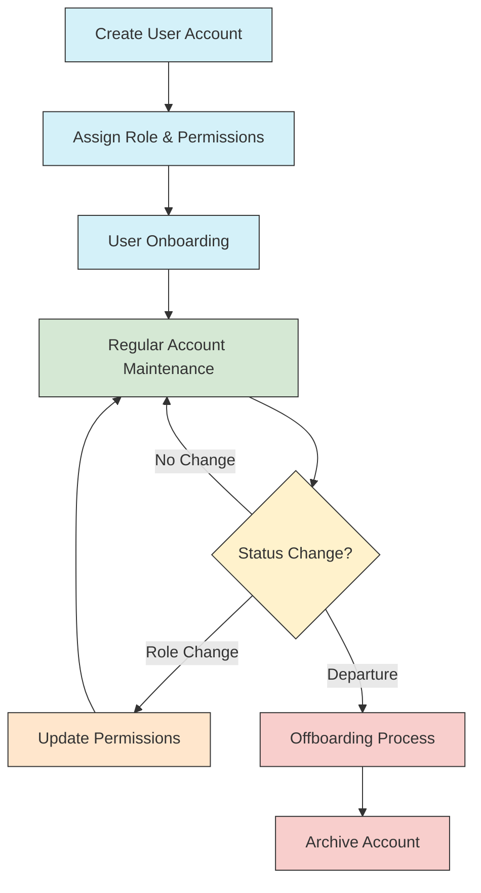
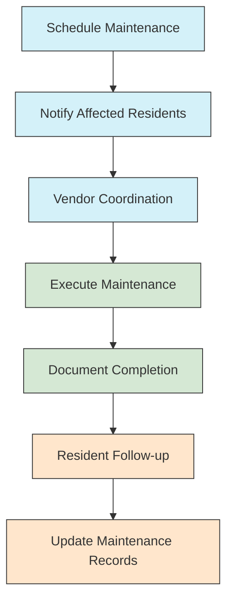

# Administrator Guides

> **Last Updated:** April 7, 2025 | **App Version:** 0.5.0

## Overview

This section contains comprehensive guides for administrative users of the Lofts des Arts platform. These guides are designed to help administrators effectively manage the building, residents, communications, and various systems that keep the condominium running smoothly.

## Contents

This directory contains the following administrator-focused documentation:

### System Administration

- [Admin Dashboard Overview](dashboard-overview.md)
- [System Configuration](system-configuration.md)
- [User Management](user-management.md)
- [Role Management & Permissions](role-management.md)
- [Audit Logs & System Health](audit-logs.md)
- [Backup & Recovery](backup-recovery.md)
- [Security Settings](security-settings.md)

### Building Management

- [Building Profile Management](building-profile.md)
- [Unit & Property Management](unit-management.md)
- [Amenity Management](amenity-management.md)
- [Maintenance Scheduling](maintenance-scheduling.md)
- [Vendor Management](vendor-management.md)
- [Emergency Procedures](emergency-procedures.md)

### Resident Management

- [Resident Onboarding & Offboarding](resident-lifecycle.md)
- [Resident Directory Management](resident-directory.md)
- [Access Control Management](access-control.md)
- [Guest Management](guest-management.md)
- [Pet Registration](pet-registration.md)
- [Vehicle Registration](vehicle-registration.md)

### Communication Tools

- [Announcement System](announcement-system.md)
- [Mass Communication Tools](mass-communication.md)
- [Community Calendar Management](calendar-management.md)
- [Notification Settings](notification-settings.md)
- [Communication Templates](communication-templates.md)

### Financial Tools

- [Invoice Management](invoice-management.md)
- [Payment Processing](payment-processing.md)
- [Budget Tracking](budget-tracking.md)
- [Financial Reporting](financial-reporting.md)
- [Expense Tracking](expense-tracking.md)

### Feature Administration

- [Document Management Administration](../features/document-management/admin-guide.md)
- [Messaging System Administration](../features/messaging-system/admin-guide.md)
- [Package Management Administration](../features/package-management/admin-guide.md)
- [Service Request Administration](../features/service-requests/admin-guide.md)
- [Community Forum Moderation](../features/community-forum/moderation-guide.md)

## Administrative Workflows

Below are common administrative workflows with links to detailed documentation:

### User Lifecycle Management

- [Detailed User Lifecycle Guide](user-lifecycle-guide.md)

### Maintenance Management

- [Detailed Maintenance Process Guide](maintenance-process-guide.md)

## Role-Based Administrative Access

Administrative access to the Lofts des Arts platform is structured according to the following roles, each with specific permissions:

| Role | Description | Access Level | Documentation |
|------|-------------|--------------|---------------|
| **Super Admin** | Complete system access for technical administration | Full system access | [Super Admin Guide](../roles/super-admin/README.md) |
| **Admin** | Building management staff with broad administrative access | Broad administrative access | [Admin Guide](../roles/admin/README.md) |
| **Building Manager** | Day-to-day operational management | Focused operational access | [Manager Guide](../roles/manager/README.md) |
| **Board Member** | Governance and oversight capabilities | Governance-focused access | [Board Member Guide](../roles/board-member/README.md) |
| **Staff** | Limited administrative access for specific functions | Function-specific access | [Staff Guide](../roles/staff/README.md) |

## Administrative Dashboard

The administrative dashboard serves as the command center for all administrative functions:

Key dashboard elements include:

- **Quick Stats**: Overview of building occupancy, pending requests, and alerts
- **Activity Feed**: Recent system events and user activities
- **Task List**: Pending administrative tasks requiring attention
- **Alert Center**: System alerts and critical notifications
- **Quick Actions**: Shortcuts to common administrative functions
- **Calendar View**: Upcoming scheduled events and maintenance
- **System Health**: Platform performance metrics and status

[Detailed Dashboard Guide](dashboard-guide.md)

## Best Practices for Administrators

### Security Best Practices

- Use strong, unique passwords and enable two-factor authentication
- Regularly review audit logs for unusual activities
- Follow the principle of least privilege when assigning permissions
- Perform routine security audits and compliance checks
- Log out of administrative sessions when not in use
- Use secure networks for administrative access
- Keep software and systems updated with security patches

### Data Management Best Practices

- Regularly backup system data according to the backup schedule
- Validate data integrity during imports and exports
- Maintain consistent naming conventions for all records
- Archive rather than delete historical data
- Document all data manipulation procedures
- Follow data retention policies for all information types
- Implement data validation at all entry points

### Effective Administration

- Schedule regular system maintenance during low-usage periods
- Communicate changes to users before implementation
- Maintain detailed documentation of all system modifications
- Test new features in a staging environment before deploying
- Collect and incorporate user feedback for system improvements
- Develop and follow standard operating procedures
- Provide regular training for administrative staff

## Administrative Support Resources

- **Technical Support**: techsupport@loftsdesarts.com or ext. 601
- **Admin Training**: Schedule through the admin portal
- **Documentation Updates**: Submit through the admin feedback form
- **Emergency Support**: Available 24/7 at emergency@loftsdesarts.com or ext. 600

## Changelog

### Version 0.2.0 (April 5, 2025)
- Added comprehensive messaging system administration guides
- Added package management system documentation
- Enhanced RBAC documentation with advanced permission models
- Updated user lifecycle management workflows
- Added detailed audit logging information

### Version 0.1.5 (March 10, 2025)
- Added document management administration guides
- Enhanced security best practices section
- Updated dashboard screenshots and descriptions
- Added maintenance scheduling tools documentation

### Version 0.1.0 (February 15, 2025)
- Initial documentation release
- Basic administration guides for core system functionality
- User management documentation
- Building management fundamentals

## Contributing to Documentation

Administrative team members can contribute to improving these guides by:

1. Submitting documentation enhancement requests through the admin portal
2. Adding notes on unclear or outdated procedures
3. Suggesting new workflows or best practices
4. Reporting documentation errors or inconsistencies

All contributions will be reviewed by the documentation team before publication. 