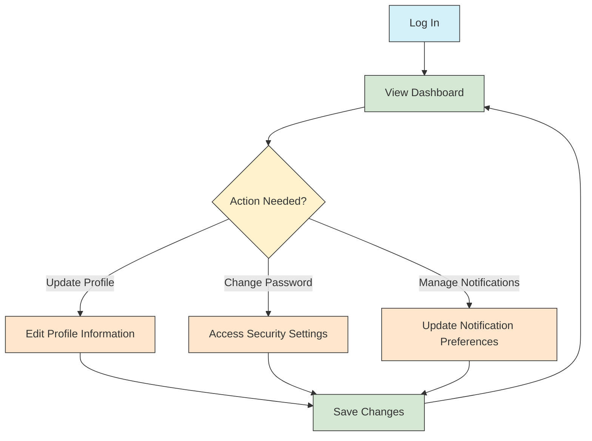
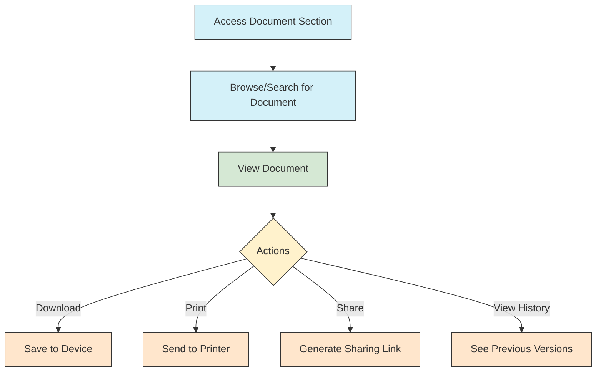

# Common User Guides

> **Last Updated:** April 7, 2025 | **App Version:** 0.5.0

## Overview

This directory contains documentation and guides that are applicable to all users of the Lofts des Arts platform, regardless of their role. These common guides provide essential information about using the platform's core features and understanding fundamental concepts.

## Contents

### Getting Started

- [Platform Overview](platform-overview.md)
- [Account Creation & Setup](account-setup.md)
- [Login & Authentication](login-authentication.md)
- [Password Management](password-management.md)
- [Two-Factor Authentication](two-factor-auth.md)
- [User Profile Management](profile-management.md)
- [Notification Preferences](notification-preferences.md)

### Core Features

- [Dashboard Navigation](dashboard-navigation.md)
- [User Interface Guide](ui-guide.md)
- [Search Functionality](search-functionality.md)
- [Mobile App Guide](mobile-app-guide.md)
- [Keyboard Shortcuts](keyboard-shortcuts.md)
- [Accessibility Features](accessibility-features.md)

### Common Tasks

- [Updating Personal Information](updating-information.md)
- [Managing Notifications](managing-notifications.md)
- [Using the Calendar](using-calendar.md)
- [Basic Messaging](basic-messaging.md)
- [Document Viewing & Download](document-handling.md)
- [Form Submission](form-submission.md)

### Conventions & Standards

- [File Naming Conventions](naming-conventions.md)
- [Date & Time Formats](date-time-formats.md)
- [Tagging System](tagging-system.md)
- [Status Indicators](status-indicators.md)
- [Icon Reference](icon-reference.md)
- [Terminology Glossary](terminology.md)

## Universal Features Across All Roles

Regardless of your role in the Lofts des Arts platform, you'll have access to these fundamental features:

### Personal Profile

Every user has a personal profile that includes:

- **Contact Information**: Your registered email, phone, and address
- **Communication Preferences**: How and when you receive notifications
- **Security Settings**: Password and two-factor authentication management
- **Profile Picture**: Your visual identifier in the system
- **Account History**: Record of your account activity
- **Language Preferences**: Interface language and region settings

[Detailed Profile Guide](profile-management.md)

### Notifications Center

The unified notifications center provides:

- **System Alerts**: Important system-wide announcements
- **Personal Notifications**: Messages directed specifically to you
- **Activity Updates**: Changes relevant to your interests or responsibilities
- **Reminders**: Upcoming events, deadlines, or required actions
- **Customization Options**: Control over notification types and delivery methods

[Notifications Guide](managing-notifications.md)

### Basic Messaging

All users have access to the fundamental messaging capabilities:

- **Direct Messaging**: One-to-one communication with other users
- **Message Center**: Central location for all communications
- **Basic Formatting**: Text styling options for clarity
- **File Attachments**: Ability to share documents in messages
- **Search Functionality**: Find historical messages and conversations
- **Read Receipts**: Confirmation when messages are viewed
- **Reply & Forward**: Standard message management options

[Basic Messaging Guide](basic-messaging.md)

## Platform Navigation

### Main Dashboard

```
┌───────────────────────────────────────────────────────────────┐
│ LOFTS DES ARTS                                  [User ▼] [⚙️] │
├─────────┬─────────────────────────────────────────────────────┤
│         │                                                     │
│  MAIN   │                                                     │
│  MENU   │               DASHBOARD CONTENT                     │
│         │                                                     │
│  • Home │               - Announcements                       │
│  • Msgs │               - Calendar                            │
│  • Docs │               - Tasks/Actions                       │
│  • Cal  │               - Quick Stats                         │
│  • Tools│               - Recent Activities                   │
│         │                                                     │
├─────────┼─────────────────────────────────────────────────────┤
│ FOOTER: Contact • Help • Privacy • Terms • Version            │
└───────────────────────────────────────────────────────────────┘
```

The basic navigation structure remains consistent across all user roles, with role-specific features appearing in the appropriate sections.

[Detailed Navigation Guide](dashboard-navigation.md)

## Common Workflows

### Basic Account Management



[Account Management Guide](account-management.md)

### Document Access



[Document Handling Guide](document-handling.md)

## Platform-Wide Standards

### Status Indicators

All features in the Lofts des Arts platform use consistent status indicators:

| Indicator | Color | Meaning |
|-----------|-------|---------|
| ● | Green | Active / Complete / Available |
| ● | Yellow | Pending / In Progress / Warning |
| ● | Red | Urgent / Error / Unavailable |
| ● | Blue | Informational / New |
| ● | Gray | Inactive / Archived / Not Applicable |

[Complete Status Indicator Reference](status-indicators.md)

### Time Standards

- All dates displayed in format: MMM DD, YYYY (e.g., Apr 5, 2025)
- All times displayed in: 12-hour format with AM/PM
- Calendar events include timezone information when relevant
- Users can customize their preferred time format in settings
- System logs use 24-hour format for technical accuracy

[Date & Time Format Guide](date-time-formats.md)

## Accessibility Features

The Lofts des Arts platform complies with WCAG 2.1 AA standards and includes:

- **Screen Reader Compatibility**: Full support for popular screen readers
- **Keyboard Navigation**: Complete keyboard control of all features
- **Text Sizing**: Adjustable text size without loss of functionality
- **Color Contrast**: High contrast mode for improved readability
- **Focus Indicators**: Clear visual indicators of current focus
- **Alt Text**: Descriptive alternative text for all images
- **Form Assistance**: Clear form labels and error messaging
- **Video Captions**: Closed captioning for all video content

[Detailed Accessibility Guide](accessibility-features.md)

## Technical Requirements

### Supported Browsers

- Chrome (version 90 and later)
- Firefox (version 88 and later)
- Safari (version 14 and later)
- Edge (version 90 and later)
- Opera (version 76 and later)

### Mobile Support

- iOS (version 14 and later)
- Android (version 10 and later)
- Dedicated mobile apps available for both platforms
- Responsive web design for browser access on mobile devices

### Minimum Requirements

- Internet connection: 1 Mbps or faster
- Screen resolution: 1280x720 or higher recommended
- Cookies and JavaScript enabled
- PDF viewer for document access
- 1 GB of available storage for mobile app installation

[Technical Requirements Guide](technical-requirements.md)

## Getting Help

### Self-Help Resources

- [Frequently Asked Questions](faq.md)
- [Troubleshooting Guide](troubleshooting.md)
- [Video Tutorials](video-tutorials.md)
- [Platform Updates](platform-updates.md)

### Support Channels

- **General Support**: support@loftsdesarts.com or ext. 500
- **Technical Issues**: techsupport@loftsdesarts.com or ext. 501
- **Account Problems**: accounts@loftsdesarts.com or ext. 502
- **In-App Help**: "Help" button available in all sections
- **Support Hours**: Mon-Fri, 8AM-8PM; Sat, 9AM-5PM; Emergency support available 24/7

## Changelog

### Version 0.2.0 (April 5, 2025)
- Added comprehensive document management guides
- Updated messaging system documentation
- Enhanced accessibility features section
- Added keyboard shortcuts reference
- Expanded troubleshooting guides

### Version 0.1.0 (February 15, 2025)
- Initial documentation release
- Basic user guides for core platform features
- Account management documentation
- Navigation and UI guidelines 