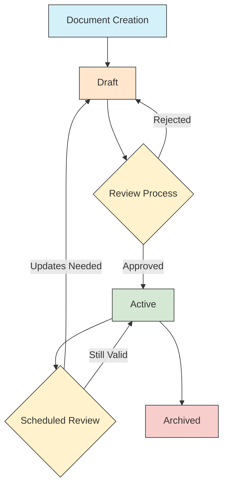

# Document Management System

**Last Updated:** April 7, 2025 | **App Version:** 0.5.0

## Overview

The Lofts des Arts Document Management System provides a centralized platform for storing, organizing, accessing, and distributing important documents related to the condominium. This system enables role-based access to documents, version control, and document lifecycle management while maintaining security and compliance with legal requirements.

## Key Features

### Document Organization

- **Hierarchical Structure**: Documents are organized in a logical folder structure
- **Smart Categories**: Documents are automatically categorized based on content and metadata
- **Custom Tags**: Custom tagging system for enhanced searchability
- **Multiple Views**: List, grid, and calendar views for different document types
- **Related Documents**: Automatic linking of related documents

### Document Access Control

- **Role-Based Access**: Access to documents is controlled by user roles
- **Permission Levels**: Granular permission settings (view, download, edit, approve, delete)
- **Sharing Options**: Secure sharing with internal and external users
- **Access Logs**: Complete audit trail of document access and actions
- **Temporary Access**: Time-limited access for specific users or roles

### Document Types

| Document Type | Description | Primary Users |
|--------------|-------------|---------------|
| **Governance** | Board meeting minutes, bylaws, resolutions | Board Members, Management |
| **Financial** | Budgets, financial statements, audit reports | Board Members, Management, Owners |
| **Legal** | Contracts, insurance policies, legal notices | Board Members, Management |
| **Property** | Floor plans, warranties, maintenance records | Management, Staff, Contractors |
| **Resident** | Welcome packets, handbooks, community guidelines | All Residents |
| **Forms** | Request forms, complaint forms, authorization forms | All Users |
| **Notices** | Announcements, event flyers, maintenance notices | All Users |

### Document Workflows

- **Approval Workflows**: Multi-step approval processes for critical documents
- **Review Cycles**: Scheduled document reviews and updates
- **Expiration Handling**: Automatic notification of document expiration
- **Version Control**: Complete history of document versions
- **Change Tracking**: Visual comparison between document versions

## User Interface

### Dashboard Widgets

- **Recent Documents**: Quick access to recently viewed documents
- **Pending Actions**: Documents requiring user action
- **Favorite Documents**: User-bookmarked important documents
- **Expiring Documents**: Documents approaching expiration
- **Recently Updated**: Recently modified documents

### Search Capabilities

- **Full-Text Search**: Search within document contents
- **Advanced Filters**: Filter by document type, date, author, etc.
- **Saved Searches**: Save and reuse common search parameters
- **Quick Previews**: Preview documents without downloading
- **Bulk Actions**: Perform actions on multiple documents

## Document Lifecycle Management

### Stages

1. **Creation**: New document upload or generation
2. **Draft**: Initial document version before approval
3. **Review**: Document under evaluation by authorized users
4. **Active**: Approved and published document
5. **Archived**: Historical document no longer in active use

## Role-Specific Access

Different user roles have varying levels of access to documents:

### Super Admin
- Full access to all documents
- System configuration and permission management
- Document template management
- Audit log review

### Admin/Management
- Access to all operational documents
- Document workflow management
- Limited access to confidential board documents
- Document sharing and distribution

### Board Member
- Access to governance, financial, and legal documents
- Meeting minutes and resolutions
- Strategic planning documents
- Committee materials

### Building Staff
- Building maintenance documents
- Service manuals and guides
- Resident information as needed for service
- Emergency procedures

### Resident Owner
- Building bylaws and rules
- Community announcements
- Financial reports
- Meeting notices and minutes
- Unit-specific documents

### Resident Tenant
- Building rules and regulations
- Community announcements
- Tenant handbook
- Service request forms

### Contractor
- Project specifications
- Relevant building plans
- Safety protocols
- Contract documents

### Guest
- Shared documents only
- Visitor information
- Event details when invited

## Security Features

- **Encryption**: AES-256 encryption for documents at rest
- **Secure Sharing**: Password-protected external sharing
- **Watermarking**: Dynamic watermarks for sensitive documents
- **DLP Controls**: Data loss prevention for sensitive content
- **Two-Factor Authentication**: Additional security for sensitive document access
- **Secure Deletion**: Compliant document destruction processes

## Integrations

The Document Management System integrates with:

- **Messaging System**: Share documents via internal messaging
- **Package Management**: Link delivery documentation to packages
- **Maintenance System**: Attach documents to service requests
- **Calendar**: Link documents to scheduled events
- **Email**: Send document notifications via email
- **Mobile App**: Access documents on mobile devices
- **Export Options**: Export to PDF, print, and sharing options

## Common Tasks

### Uploading Documents

1. Navigate to the document section
2. Select "Upload Document"
3. Choose file(s) from your computer
4. Complete metadata form (document type, description, tags)
5. Set access permissions
6. Submit for review if required

### Searching for Documents

1. Use the search bar at the top of the document section
2. Enter keywords or use advanced search
3. Apply filters as needed
4. Sort results by relevance, date, or title
5. Preview documents before opening

### Managing Document Access

1. Locate the document in the system
2. Select "Manage Access"
3. Add/remove users or roles
4. Set permission levels
5. Add expiration date if temporary access
6. Save changes

### Document Version Control

1. Locate the document in the system
2. Select "Upload New Version"
3. Choose updated file
4. Add version notes
5. Submit for approval if required
6. Previous versions remain accessible in history

## Troubleshooting

| Issue | Resolution |
|-------|------------|
| **Cannot access document** | Verify your role permissions, contact document owner |
| **Document not found** | Check search terms, filters, or ask administrator |
| **Cannot upload document** | Verify file format and size limitations |
| **Version conflict** | Review version history, contact document owner |
| **Export/print issues** | Try different format, check browser settings |

## Best Practices

- **Naming Conventions**: Use clear, consistent file names
- **Metadata Completion**: Always complete document metadata fields
- **Regular Cleanup**: Archive outdated documents
- **Sensitive Content**: Use appropriate security settings for sensitive information
- **Version Management**: Always upload new versions rather than creating duplicates
- **Document Previews**: Preview documents before downloading
- **Search Optimization**: Use relevant tags and descriptions
- **Expiration Dates**: Set appropriate expiration dates for time-sensitive documents

## Future Enhancements

- Advanced OCR for improved searchability
- AI-powered document categorization
- Digital signature integration
- Automated compliance checks
- Enhanced mobile experience
- Document analytics dashboard
- Expanded integration with property management systems

## References

- [Document Management System User Guide](../document-management/user-guide.md)
- [Document Retention Policy](../../legal/document-retention-policy.md)
- [Document Security Standards](../../legal/document-security-standards.md)
- [Document Naming Conventions](../../common/naming-conventions.md) 