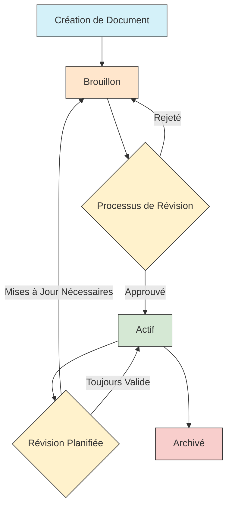

# Système de Gestion de Documents

> **Dernière mise à jour :** 7 avril 2025 | **Version :** 0.2.0

## Aperçu

Le Système de Gestion de Documents des Lofts des Arts fournit une plateforme centralisée pour stocker, organiser, accéder et distribuer des documents importants liés à la copropriété. Ce système permet un accès aux documents basé sur les rôles, le contrôle des versions et la gestion du cycle de vie des documents tout en maintenant la sécurité et la conformité avec les exigences légales.

## Fonctionnalités Clés

### Organisation des Documents

- **Structure Hiérarchique** : Les documents sont organisés dans une structure logique de dossiers
- **Catégories Intelligentes** : Les documents sont automatiquement catégorisés en fonction du contenu et des métadonnées
- **Tags Personnalisés** : Système de balisage personnalisé pour une recherche améliorée
- **Vues Multiples** : Vues en liste, en grille et en calendrier pour différents types de documents
- **Documents Connexes** : Liaison automatique de documents connexes

### Contrôle d'Accès aux Documents

- **Accès Basé sur les Rôles** : L'accès aux documents est contrôlé par les rôles d'utilisateur
- **Niveaux d'Autorisation** : Paramètres d'autorisation granulaires (afficher, télécharger, modifier, approuver, supprimer)
- **Options de Partage** : Partage sécurisé avec des utilisateurs internes et externes
- **Journaux d'Accès** : Piste d'audit complète des accès et actions sur les documents
- **Accès Temporaire** : Accès limité dans le temps pour des utilisateurs ou rôles spécifiques

### Types de Documents

| Type de Document | Description | Utilisateurs Principaux |
|-----------------|-------------|-------------------------|
| **Gouvernance** | Procès-verbaux des réunions du conseil, règlements, résolutions | Membres du Conseil, Gestion |
| **Financier** | Budgets, états financiers, rapports d'audit | Membres du Conseil, Gestion, Propriétaires |
| **Juridique** | Contrats, polices d'assurance, avis juridiques | Membres du Conseil, Gestion |
| **Propriété** | Plans d'étage, garanties, registres d'entretien | Gestion, Personnel, Entrepreneurs |
| **Résident** | Trousses de bienvenue, manuels, directives communautaires | Tous les Résidents |
| **Formulaires** | Formulaires de demande, formulaires de plainte, formulaires d'autorisation | Tous les Utilisateurs |
| **Avis** | Annonces, dépliants d'événements, avis d'entretien | Tous les Utilisateurs |

### Flux de Travail des Documents

- **Flux d'Approbation** : Processus d'approbation en plusieurs étapes pour les documents critiques
- **Cycles de Révision** : Examens et mises à jour planifiés des documents
- **Gestion des Expirations** : Notification automatique de l'expiration des documents
- **Contrôle de Version** : Historique complet des versions de documents
- **Suivi des Modifications** : Comparaison visuelle entre les versions de documents

## Interface Utilisateur

### Widgets du Tableau de Bord

- **Documents Récents** : Accès rapide aux documents récemment consultés
- **Actions en Attente** : Documents nécessitant une action de l'utilisateur
- **Documents Favoris** : Documents importants marqués par l'utilisateur
- **Documents en Expiration** : Documents approchant de l'expiration
- **Récemment Mis à Jour** : Documents récemment modifiés

### Capacités de Recherche

- **Recherche en Texte Intégral** : Recherche dans le contenu des documents
- **Filtres Avancés** : Filtrage par type de document, date, auteur, etc.
- **Recherches Enregistrées** : Enregistrement et réutilisation de paramètres de recherche courants
- **Aperçus Rapides** : Prévisualisation des documents sans téléchargement
- **Actions Groupées** : Exécution d'actions sur plusieurs documents

## Gestion du Cycle de Vie des Documents

### Étapes

1. **Création** : Téléchargement ou génération d'un nouveau document
2. **Brouillon** : Version initiale du document avant approbation
3. **Révision** : Document en cours d'évaluation par des utilisateurs autorisés
4. **Actif** : Document approuvé et publié
5. **Archivé** : Document historique qui n'est plus en utilisation active

## Accès Spécifique aux Rôles

Différents rôles d'utilisateurs ont des niveaux d'accès variables aux documents :

### Super Admin
- Accès complet à tous les documents
- Configuration du système et gestion des autorisations
- Gestion des modèles de documents
- Examen du journal d'audit

### Admin/Gestion
- Accès à tous les documents opérationnels
- Gestion des flux de travail des documents
- Accès limité aux documents confidentiels du conseil
- Partage et distribution de documents

### Membre du Conseil
- Accès aux documents de gouvernance, financiers et juridiques
- Procès-verbaux des réunions et résolutions
- Documents de planification stratégique
- Documents de comité

### Personnel de l'Immeuble
- Documents d'entretien du bâtiment
- Manuels de service et guides
- Informations sur les résidents selon les besoins du service
- Procédures d'urgence

### Propriétaire Résident
- Règlements et règles de l'immeuble
- Annonces communautaires
- Rapports financiers
- Avis de réunion et procès-verbaux
- Documents spécifiques à l'unité

### Locataire Résident
- Règles et règlements de l'immeuble
- Annonces communautaires
- Manuel du locataire
- Formulaires de demande de service

### Entrepreneur
- Spécifications du projet
- Plans pertinents du bâtiment
- Protocoles de sécurité
- Documents contractuels

### Invité
- Documents partagés uniquement
- Informations pour les visiteurs
- Détails des événements en cas d'invitation

## Fonctionnalités de Sécurité

- **Chiffrement** : Chiffrement AES-256 pour les documents au repos
- **Partage Sécurisé** : Partage externe protégé par mot de passe
- **Filigrane** : Filigranes dynamiques pour les documents sensibles
- **Contrôles DLP** : Prévention de la perte de données pour le contenu sensible
- **Authentification à Deux Facteurs** : Sécurité supplémentaire pour l'accès aux documents sensibles
- **Suppression Sécurisée** : Processus de destruction de documents conformes

## Intégrations

Le Système de Gestion de Documents s'intègre avec :

- **Système de Messagerie** : Partage de documents via la messagerie interne
- **Gestion des Colis** : Liaison de la documentation de livraison aux colis
- **Système de Maintenance** : Joindre des documents aux demandes de service
- **Calendrier** : Lier des documents aux événements programmés
- **Email** : Envoi de notifications de documents par email
- **Application Mobile** : Accès aux documents sur les appareils mobiles
- **Options d'Exportation** : Exportation vers PDF, impression et options de partage

## Tâches Courantes

### Téléchargement de Documents

1. Accédez à la section documents
2. Sélectionnez "Télécharger un Document"
3. Choisissez le(s) fichier(s) depuis votre ordinateur
4. Remplissez le formulaire de métadonnées (type de document, description, tags)
5. Définissez les autorisations d'accès
6. Soumettez pour révision si nécessaire

### Recherche de Documents

1. Utilisez la barre de recherche en haut de la section documents
2. Entrez des mots-clés ou utilisez la recherche avancée
3. Appliquez des filtres selon les besoins
4. Triez les résultats par pertinence, date ou titre
5. Prévisualisez les documents avant de les ouvrir

### Gestion de l'Accès aux Documents

1. Localisez le document dans le système
2. Sélectionnez "Gérer l'Accès"
3. Ajoutez/supprimez des utilisateurs ou des rôles
4. Définissez les niveaux d'autorisation
5. Ajoutez une date d'expiration si l'accès est temporaire
6. Enregistrez les modifications

### Contrôle de Version des Documents

1. Localisez le document dans le système
2. Sélectionnez "Télécharger une Nouvelle Version"
3. Choisissez le fichier mis à jour
4. Ajoutez des notes de version
5. Soumettez pour approbation si nécessaire
6. Les versions précédentes restent accessibles dans l'historique

## Dépannage

| Problème | Résolution |
|----------|------------|
| **Impossible d'accéder au document** | Vérifiez vos autorisations de rôle, contactez le propriétaire du document |
| **Document introuvable** | Vérifiez les termes de recherche, les filtres ou demandez à l'administrateur |
| **Impossible de télécharger un document** | Vérifiez le format et les limitations de taille du fichier |
| **Conflit de version** | Examinez l'historique des versions, contactez le propriétaire du document |
| **Problèmes d'exportation/impression** | Essayez un format différent, vérifiez les paramètres du navigateur |

## Meilleures Pratiques

- **Conventions de Nommage** : Utilisez des noms de fichiers clairs et cohérents
- **Complétion des Métadonnées** : Complétez toujours les champs de métadonnées des documents
- **Nettoyage Régulier** : Archivez les documents obsolètes
- **Contenu Sensible** : Utilisez des paramètres de sécurité appropriés pour les informations sensibles
- **Gestion des Versions** : Téléchargez toujours de nouvelles versions plutôt que de créer des doublons
- **Aperçus de Documents** : Prévisualisez les documents avant de les télécharger
- **Optimisation de la Recherche** : Utilisez des tags et descriptions pertinents
- **Dates d'Expiration** : Définissez des dates d'expiration appropriées pour les documents sensibles au temps

## Améliorations Futures

- OCR avancé pour une meilleure recherche
- Catégorisation de documents assistée par IA
- Intégration de signature numérique
- Vérifications automatisées de conformité
- Expérience mobile améliorée
- Tableau de bord d'analyse de documents
- Intégration étendue avec les systèmes de gestion immobilière

## Références

- [Guide Utilisateur du Système de Gestion de Documents](../document-management/user-guide_FR.md)
- [Politique de Conservation des Documents](../../legal/document-retention-policy_FR.md)
- [Normes de Sécurité des Documents](../../legal/document-security-standards_FR.md)
- [Conventions de Nommage des Documents](../../common/naming-conventions_FR.md)

---

[English Version](./overview.md) 