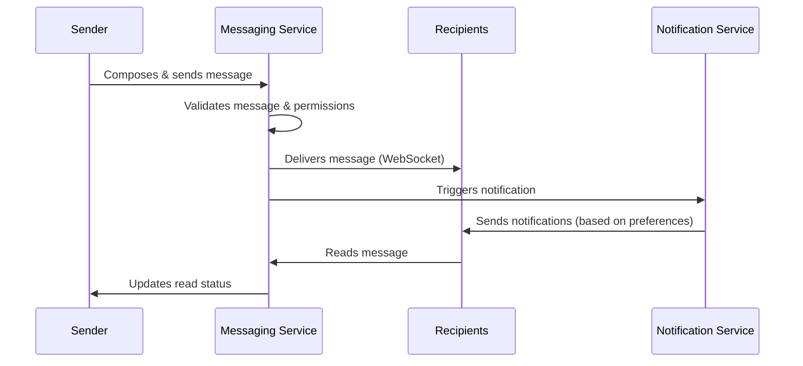

# Messaging System Overview
**Last Updated:** April 7, 2025 | **App Version:** 0.5.0

The Lofts des Arts messaging system enables real-time communication between residents, management, and staff. This centralized platform facilitates efficient communication while maintaining proper access controls based on user roles.

## System Capabilities

- **Real-time Messaging**: Instant message delivery via WebSockets (< 2s latency)
- **Multi-channel Communication**: Direct messages, group conversations, and building-wide announcements
- **Rich Content Support**: Text formatting, links, file attachments, and emoji reactions
- **Notification Management**: Customizable notification preferences across multiple devices
- **Message Organization**: Conversation threading, search functionality, and message categorization
- **Security & Privacy**: End-to-end encryption for sensitive communications
- **Access Controls**: Role-based messaging permissions and conversation visibility
- **Mobile Support**: Full messaging functionality on mobile devices

## Conversation Types

The messaging system supports four distinct conversation types:

### 1. Direct Messages

One-to-one conversations between individual users:
- Private, secure communication
- Read receipts and typing indicators
- File sharing (up to 10MB)
- Persistent history and searchable archive

### 2. Group Conversations

Multi-user discussions for specific purposes:
- **Committee Groups**: For board and committee members
- **Staff Groups**: For building staff communication
- **Floor/Section Groups**: For residents in specific building areas
- **Interest Groups**: For resident-created special interest discussions
- **Project Groups**: For temporary initiatives or planning

Group features include:
- Member management and permissions
- Pinned important messages
- Group file repository
- Event scheduling
- Polls and quick votes

### 3. Announcements

Official communications from management to residents:
- Building-wide or targeted announcements
- Priority levels (Standard, Important, Critical)
- Scheduling for future publication
- Required acknowledgment for critical messages
- Delivery tracking and analytics

### 4. System Notifications

Automated messages regarding system events:
- Package notifications
- Maintenance updates
- Document additions
- Security alerts
- Payment confirmations

## User Interface

### Message Center

The central messaging interface provides:
- Unified inbox for all conversation types
- Conversation list with previews and status indicators
- Filtering and sorting options
- Unread message tracking
- Conversation search functionality

### Conversation View

The conversation interface includes:
- Message history with timestamps
- Real-time updates and typing indicators
- Rich text editor with formatting controls
- File attachment capabilities
- Reply threading and reactions
- User presence indicators

### Notification Center

The notification management panel allows users to:
- Configure notification preferences by conversation type
- Set quiet hours and do-not-disturb periods
- Choose notification methods (in-app, email, SMS)
- Manage notification digest frequency
- Set up keyword-based notification triggers

## Role-Specific Capabilities

The messaging system adapts to user roles with appropriate permissions:

### Administrative Roles

| Role | Capabilities |
|------|--------------|
| **SUPER_ADMIN** | Full system access including message monitoring, conversation creation/deletion for all users, global announcements |
| **ADMIN** | Comprehensive access to create any conversation type, send building-wide announcements, view conversation analytics |
| **MANAGER** | Can create staff groups, send announcements, communicate with all residents, access message tracking |
| **BOARD_MEMBER** | Can communicate with management, other board members, and create committee conversations |

### Staff Roles

| Role | Capabilities |
|------|--------------|
| **STAFF** | Can send direct messages to residents regarding maintenance, participate in staff groups |
| **DOORMAN** | Can send package notifications, communicate with residents about visitors, participate in staff communications |
| **CONTRACTOR** | Limited messaging with management and staff related to specific projects |

### Resident Roles

| Role | Capabilities |
|------|--------------|
| **RESIDENT_OWNER** | Can message management, staff, and other residents; create interest groups; receive all announcements |
| **RESIDENT_TENANT** | Similar to owners but may have limited access to certain management communications |
| **GUEST** | Highly restricted messaging with sponsoring resident and limited staff communication |

## Message Flow

## Privacy & Security

The messaging system implements several layers of protection:

- **End-to-End Encryption**: For sensitive communications
- **Message Retention**: Configurable retention policies by conversation type
- **Access Controls**: Role-based restrictions on conversation visibility
- **Data Protection**: Compliance with privacy regulations
- **Conversation Backups**: Regular backups of message history
- **Audit Logging**: Tracking of administrative actions

## Integration with Other Systems

The messaging system integrates with other platform components:

- **Package Management**: Automated notifications for package status changes
- **Document Management**: Simplified document sharing in conversations
- **Maintenance Requests**: Updates about service request progress
- **Event Calendar**: Event reminders and RSVP functionality
- **User Directory**: Easy recipient selection and contact information

## Best Practices

### For Management

- Use appropriate announcement priority levels
- Establish consistent communication schedules
- Create logical group structures for different purposes
- Document important decisions from message threads
- Respect quiet hours for non-emergency communications

### For Residents

- Keep notification preferences up-to-date
- Use descriptive subject lines for new conversations
- Utilize appropriate conversation types for different needs
- Report any message delivery issues promptly
- Archive old conversations to keep your inbox organized

## Technical Details

- **Backend**: Supabase Realtime with WebSockets
- **Storage**: PostgreSQL with efficient indexing
- **Real-time Updates**: Push notifications via service workers
- **Attachments**: Supabase Storage with secure access controls
- **Mobile Support**: Progressive Web App with offline capabilities

## Getting Started

- [Setting Up Your Message Preferences](./preferences.md)
- [Creating Your First Conversation](./creating-conversations.md)
- [Sending and Receiving Files](./attachments.md)
- [Managing Notifications](./notifications.md)
- [Messaging Etiquette Guidelines](./etiquette.md)

## Frequently Asked Questions

**Q: Who can see my direct messages?**  
A: Only you and the recipient can see direct messages. System administrators cannot view message content but can see metadata for troubleshooting purposes.

**Q: How long are messages retained?**  
A: Direct messages are retained indefinitely. Announcements are archived after 12 months. System notifications are retained for 3 months.

**Q: Can I delete a message after sending it?**  
A: Yes, you can delete your own messages within 15 minutes of sending. After that, you'll need to contact support for assistance.

**Q: How do I know if someone has read my message?**  
A: Read receipts are displayed as small icons next to each message showing when it was delivered and read.

**Q: Is there a limit to file attachments?**  
A: Yes, individual files are limited to 10MB each, and conversations have a 100MB total storage limit.

## Support & Resources

If you encounter issues with the messaging system:

- **In-app Help**: Click the "?" icon in the messaging interface
- **Technical Support**: support@loftsdesarts.com
- **Training Videos**: Available in the Help Center
- **Feature Requests**: Submit through the Feedback form 