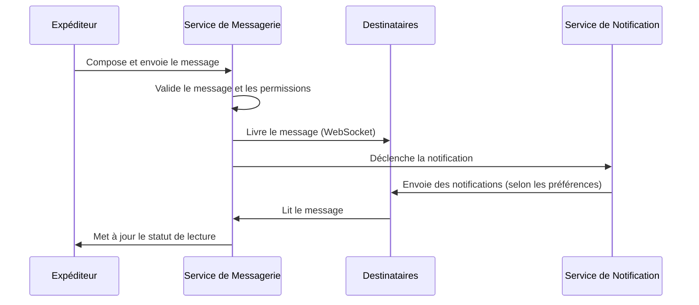

# Aperçu du Système de Messagerie

> **Dernière mise à jour :** 5 avril 2025 | **Version :** 0.2.0

Le système de messagerie de Lofts des Arts permet une communication en temps réel entre les résidents, la direction et le personnel. Cette plateforme centralisée facilite une communication efficace tout en maintenant des contrôles d'accès appropriés basés sur les rôles des utilisateurs.

## Capacités du Système

- **Messagerie en Temps Réel** : Livraison instantanée des messages via WebSockets (latence < 2s)
- **Communication Multi-canaux** : Messages directs, conversations de groupe et annonces à l'échelle du bâtiment
- **Support de Contenu Enrichi** : Formatage de texte, liens, pièces jointes et réactions emoji
- **Gestion des Notifications** : Préférences de notification personnalisables sur plusieurs appareils
- **Organisation des Messages** : Fils de conversation, fonctionnalité de recherche et catégorisation des messages
- **Sécurité et Confidentialité** : Chiffrement de bout en bout pour les communications sensibles
- **Contrôles d'Accès** : Permissions de messagerie basées sur les rôles et visibilité des conversations
- **Support Mobile** : Fonctionnalité de messagerie complète sur appareils mobiles

## Types de Conversations

Le système de messagerie prend en charge quatre types distincts de conversations :

### 1. Messages Directs

Conversations individuelles entre deux utilisateurs :
- Communication privée et sécurisée
- Accusés de réception et indicateurs de frappe
- Partage de fichiers (jusqu'à 10 Mo)
- Historique persistant et archives consultables

### 2. Conversations de Groupe

Discussions multi-utilisateurs à des fins spécifiques :
- **Groupes de Comité** : Pour les membres du conseil et des comités
- **Groupes du Personnel** : Pour la communication du personnel de l'immeuble
- **Groupes d'Étage/Section** : Pour les résidents dans des zones spécifiques du bâtiment
- **Groupes d'Intérêt** : Pour les discussions d'intérêt spécial créées par les résidents
- **Groupes de Projet** : Pour les initiatives temporaires ou la planification

Les fonctionnalités de groupe comprennent :
- Gestion des membres et permissions
- Messages importants épinglés
- Dépôt de fichiers du groupe
- Planification d'événements
- Sondages et votes rapides

### 3. Annonces

Communications officielles de la direction aux résidents :
- Annonces à l'échelle du bâtiment ou ciblées
- Niveaux de priorité (Standard, Important, Critique)
- Planification pour publication future
- Accusé de réception requis pour les messages critiques
- Suivi de livraison et analyses

### 4. Notifications Système

Messages automatisés concernant les événements système :
- Notifications de colis
- Mises à jour de maintenance
- Ajouts de documents
- Alertes de sécurité
- Confirmations de paiement

## Interface Utilisateur

### Centre de Messages

L'interface centrale de messagerie fournit :
- Boîte de réception unifiée pour tous les types de conversations
- Liste des conversations avec aperçus et indicateurs de statut
- Options de filtrage et de tri
- Suivi des messages non lus
- Fonctionnalité de recherche de conversations

### Vue de Conversation

L'interface de conversation comprend :
- Historique des messages avec horodatages
- Mises à jour en temps réel et indicateurs de frappe
- Éditeur de texte enrichi avec contrôles de formatage
- Capacités de pièces jointes
- Fils de réponses et réactions
- Indicateurs de présence des utilisateurs

### Centre de Notifications

Le panneau de gestion des notifications permet aux utilisateurs de :
- Configurer les préférences de notification par type de conversation
- Définir des heures calmes et des périodes ne pas déranger
- Choisir les méthodes de notification (dans l'application, email, SMS)
- Gérer la fréquence des résumés de notifications
- Configurer des déclencheurs de notification basés sur des mots-clés

## Capacités Spécifiques aux Rôles

Le système de messagerie s'adapte aux rôles des utilisateurs avec des permissions appropriées :

### Rôles Administratifs

| Rôle | Capacités |
|------|--------------|
| **SUPER_ADMIN** | Accès complet au système, y compris la surveillance des messages, création/suppression de conversations pour tous les utilisateurs, annonces globales |
| **ADMIN** | Accès complet pour créer tout type de conversation, envoyer des annonces à l'échelle du bâtiment, consulter les analyses de conversations |
| **MANAGER** | Peut créer des groupes de personnel, envoyer des annonces, communiquer avec tous les résidents, accéder au suivi des messages |
| **BOARD_MEMBER** | Peut communiquer avec la direction, les autres membres du conseil et créer des conversations de comité |

### Rôles du Personnel

| Rôle | Capacités |
|------|--------------|
| **STAFF** | Peut envoyer des messages directs aux résidents concernant la maintenance, participer aux groupes du personnel |
| **DOORMAN** | Peut envoyer des notifications de colis, communiquer avec les résidents au sujet des visiteurs, participer aux communications du personnel |
| **CONTRACTOR** | Messagerie limitée avec la direction et le personnel liée à des projets spécifiques |

### Rôles des Résidents

| Rôle | Capacités |
|------|--------------|
| **RESIDENT_OWNER** | Peut envoyer des messages à la direction, au personnel et aux autres résidents ; créer des groupes d'intérêt ; recevoir toutes les annonces |
| **RESIDENT_TENANT** | Similaire aux propriétaires mais peut avoir un accès limité à certaines communications de gestion |
| **GUEST** | Messagerie très restreinte avec le résident sponsor et communication limitée avec le personnel |

## Flux de Messages

## Confidentialité et Sécurité

Le système de messagerie implémente plusieurs niveaux de protection :

- **Chiffrement de Bout en Bout** : Pour les communications sensibles
- **Conservation des Messages** : Politiques de conservation configurables par type de conversation
- **Contrôles d'Accès** : Restrictions basées sur les rôles pour la visibilité des conversations
- **Protection des Données** : Conformité aux réglementations sur la confidentialité
- **Sauvegardes de Conversations** : Sauvegardes régulières de l'historique des messages
- **Journalisation d'Audit** : Suivi des actions administratives

## Intégration avec d'Autres Systèmes

Le système de messagerie s'intègre à d'autres composants de la plateforme :

- **Gestion des Colis** : Notifications automatisées pour les changements de statut des colis
- **Gestion des Documents** : Partage simplifié de documents dans les conversations
- **Demandes de Maintenance** : Mises à jour sur l'avancement des demandes de service
- **Calendrier d'Événements** : Rappels d'événements et fonctionnalité de RSVP
- **Répertoire des Utilisateurs** : Sélection facile des destinataires et informations de contact

## Meilleures Pratiques

### Pour la Direction

- Utiliser des niveaux de priorité d'annonce appropriés
- Établir des horaires de communication cohérents
- Créer des structures de groupe logiques pour différents objectifs
- Documenter les décisions importantes issues des fils de messages
- Respecter les heures calmes pour les communications non urgentes

### Pour les Résidents

- Maintenir à jour les préférences de notification
- Utiliser des lignes d'objet descriptives pour les nouvelles conversations
- Utiliser les types de conversation appropriés pour différents besoins
- Signaler rapidement tout problème de livraison de messages
- Archiver les anciennes conversations pour garder votre boîte de réception organisée

## Détails Techniques

- **Backend** : Supabase Realtime avec WebSockets
- **Stockage** : PostgreSQL avec indexation efficace
- **Mises à Jour en Temps Réel** : Notifications push via service workers
- **Pièces Jointes** : Supabase Storage avec contrôles d'accès sécurisés
- **Support Mobile** : Application Web Progressive avec capacités hors ligne

## Premiers Pas

- [Configuration de Vos Préférences de Message](./preferences_FR.md)
- [Création de Votre Première Conversation](./creating-conversations_FR.md)
- [Envoi et Réception de Fichiers](./attachments_FR.md)
- [Gestion des Notifications](./notifications_FR.md)
- [Lignes Directrices d'Étiquette de Messagerie](./etiquette_FR.md)

## Questions Fréquemment Posées

**Q : Qui peut voir mes messages directs ?**  
R : Seuls vous et le destinataire pouvez voir les messages directs. Les administrateurs système ne peuvent pas voir le contenu des messages mais peuvent voir les métadonnées à des fins de dépannage.

**Q : Combien de temps les messages sont-ils conservés ?**  
R : Les messages directs sont conservés indéfiniment. Les annonces sont archivées après 12 mois. Les notifications système sont conservées pendant 3 mois.

**Q : Puis-je supprimer un message après l'avoir envoyé ?**  
R : Oui, vous pouvez supprimer vos propres messages dans les 15 minutes suivant l'envoi. Après cela, vous devrez contacter le support pour obtenir de l'aide.

**Q : Comment puis-je savoir si quelqu'un a lu mon message ?**  
R : Les accusés de réception sont affichés sous forme de petites icônes à côté de chaque message montrant quand il a été livré et lu.

**Q : Y a-t-il une limite aux pièces jointes ?**  
R : Oui, les fichiers individuels sont limités à 10 Mo chacun, et les conversations ont une limite de stockage totale de 100 Mo.

## Support et Ressources

Si vous rencontrez des problèmes avec le système de messagerie :

- **Aide dans l'Application** : Cliquez sur l'icône "?" dans l'interface de messagerie
- **Support Technique** : support@loftsdesarts.com
- **Vidéos de Formation** : Disponibles dans le Centre d'Aide
- **Demandes de Fonctionnalités** : Soumettez via le formulaire de Commentaires

---

[English Version](./overview.md) 