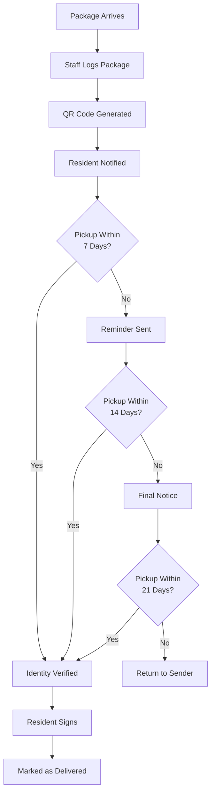

# Package Management System Overview

> **Last Updated:** April 5, 2025 | **Version:** 0.2.0

The Lofts des Arts package management system streamlines the process of receiving, tracking, and delivering packages to residents. This comprehensive system ensures secure and efficient package handling while providing transparency throughout the delivery process.

## System Capabilities

- **Package Logging**: Efficient recording of incoming packages with minimal data entry
- **QR Code Tracking**: Unique QR codes for each package enabling quick scanning and status updates
- **Automated Notifications**: Real-time alerts to residents when packages arrive and reminders for pickup
- **Secure Verification**: Identity verification process for package release
- **Analytics Dashboard**: Package volume trends and staff performance metrics
- **Photo Documentation**: Visual record of package condition upon arrival
- **Mobile Integration**: Smartphone-based package scanning and notification
- **Carrier Integration**: Support for major shipping carrier tracking numbers
- **Location Mapping**: Digital mapping of package storage locations

## User Interface

### For Staff (Doorman, Building Manager, Staff)

The staff interface provides tools for efficient package processing:

- **Package Logging Form**: Quick entry form for new deliveries
- **Package Status Dashboard**: Overview of all packages in the building
- **Resident Directory**: Lookup for resident information
- **QR Code Scanner**: Mobile and desktop scanning capabilities
- **Pickup Processing**: Guided workflow for package release
- **Analytics View**: Statistical data on package volumes and trends

### For Residents

The resident interface offers visibility and convenience:

- **Package Notifications**: Alerts about new deliveries
- **Current Packages**: List of packages awaiting pickup
- **Pickup Authorization**: Tools to allow others to pick up packages
- **Delivery History**: Record of past package deliveries
- **Preference Settings**: Customization of notification preferences
- **Feedback System**: Rating mechanism for the package service

## Package Lifecycle

## Package States

| Status | Description | Actions Available |
|--------|-------------|-------------------|
| **Logged** | Package recorded in system | Generate notification |
| **Notified** | Resident alerted about package | Send reminder, update information |
| **Reminder Sent** | Follow-up notification sent | Send additional reminder, mark for return |
| **In Process** | Pickup currently in progress | Complete or cancel pickup process |
| **Delivered** | Successfully picked up by resident | None (terminal state) |
| **Returned** | Sent back to original sender | None (terminal state) |
| **Problem** | Issue with package identified | Resolve issue, update information |
| **Missing** | Package cannot be located | Initiate search protocol |

## Role-Specific Capabilities

The package system adapts to user roles with appropriate permissions:

### Staff Roles

| Role | Capabilities |
|------|--------------|
| **DOORMAN** | Full package logging, processing pickups, sending notifications, basic reporting |
| **STAFF** | Package logging, processing pickups, basic reporting |
| **MANAGER** | All doorman capabilities plus analytics access, problem resolution, system configuration |
| **ADMIN** | Complete system access including advanced analytics, audit trails, and system settings |

### Resident Roles

| Role | Capabilities |
|------|--------------|
| **RESIDENT_OWNER** | View packages, receive notifications, authorize alternate pickup, delivery preferences |
| **RESIDENT_TENANT** | Same as resident owner |
| **GUEST** | No direct access (can be authorized for pickup by a resident) |

## Notification System

The package system uses a multi-channel notification approach:

- **In-app Notifications**: Real-time alerts in the resident portal
- **Email Notifications**: Detailed delivery information
- **SMS Alerts**: Brief notifications with pickup information (optional)
- **Push Notifications**: Mobile alerts for residents using the app
- **Reminder System**: Automated follow-ups for unclaimed packages

Residents can customize their notification preferences through their profile settings.

## QR Code System

The QR code technology is central to package tracking:

- **Code Generation**: Unique QR code created for each package
- **Information Encoding**: Package ID, recipient, delivery date, and carrier
- **Physical Tags**: Printed on adhesive labels applied to packages
- **Scanning Process**: Quick verification using mobile device or desktop scanner
- **Security Features**: Time-limited validation and encrypted package data

## Package Analytics

The system generates valuable data insights:

- **Volume Trends**: Package volume by day, week, month, and year
- **Carrier Distribution**: Breakdown of packages by delivery service
- **Pickup Timing**: Analysis of resident pickup patterns
- **Staff Performance**: Package processing efficiency metrics
- **Problem Analysis**: Tracking of package issues and resolutions
- **Seasonal Projections**: Forecasting based on historical patterns

## Integration with Other Systems

The package system connects with other platform components:

- **Messaging System**: Delivery notifications and staff communication
- **Resident Directory**: Access to resident contact information
- **Building Map**: Storage location visualization
- **Analytics Dashboard**: Performance reporting
- **Access Control**: Identity verification for package release

## Common Workflows

### Staff: Processing a New Package

1. **Record Package Information**
   - Access the package logging interface
   - Enter basic package information (carrier, tracking number)
   - Select or search for the recipient
   - Classify the package (regular, oversized, perishable)
   - Take a photo of the package condition (optional)
   - Record the storage location

2. **Generate Tracking Information**
   - System assigns a unique package ID
   - QR code is generated for the package
   - Print and affix QR code label to package

3. **Store the Package**
   - Place the package in the assigned storage location
   - Update storage location if needed
   - System sends notification to resident

### Staff: Processing a Package Pickup

1. **Initiate Pickup**
   - Resident requests package at front desk
   - Staff locates package in system using resident name or scans QR code
   - Retrieves package from storage location

2. **Verify Identity**
   - Confirm resident identity with ID or building access card
   - If alternate pickup, verify authorization in system
   - Record verification method in system

3. **Complete Delivery**
   - Resident signs for package (digital or physical)
   - Staff marks package as delivered in system
   - System updates package status and records delivery time

### Resident: Managing Package Delivery

1. **Receive Notification**
   - Get alert through preferred notification channels
   - View package details in resident portal
   - See package photo and delivery information

2. **Plan Pickup**
   - Check front desk hours
   - Optionally schedule pickup time for large items
   - Authorize alternate pickup if needed

3. **Retrieve Package**
   - Visit front desk during operating hours
   - Provide identification
   - Sign for package pickup
   - Rate delivery experience (optional)

## Best Practices

### For Staff

- **Prompt Processing**: Log packages within 30 minutes of delivery
- **Accurate Information**: Double-check recipient names and unit numbers
- **Clear Photos**: Take clear photos of damaged packages
- **Organized Storage**: Store packages logically based on size and pickup timing
- **Thorough Verification**: Always verify ID before releasing packages
- **Regular Audits**: Reconcile physical packages with system records daily
- **Timely Returns**: Process returns promptly for unclaimed packages

### For Residents

- **Timely Pickup**: Collect packages within 3 days when possible
- **Updated Preferences**: Keep notification preferences current
- **Advance Notice**: Provide authorization details in advance for alternate pickup
- **Complete Information**: Give detailed delivery instructions for special items
- **Prompt Reporting**: Report any discrepancies immediately

## Troubleshooting

### Common Issues and Resolutions

| Issue | Resolution |
|-------|------------|
| **QR code won't scan** | Clean scanner, ensure good lighting, manually enter code, reprint label if needed |
| **Package not in system** | Check recent deliveries, verify tracking number with carrier, contact delivery service |
| **Resident not notified** | Check notification settings, verify contact information, send manual notification |
| **Unauthorized pickup attempt** | Verify identity again, contact resident directly, check authorization records |
| **Package in wrong location** | Search all storage areas, check recently delivered packages, verify with staff |

## Training Resources

- [Package Logging Tutorial](./logging.md)
- [QR Code System Guide](./qr-codes.md)
- [Pickup Verification Process](./verification.md)
- [Package Problem Resolution](./problem-resolution.md)
- [Analytics Interpretation Guide](./analytics.md)

## Technical Details

- **QR Technology**: High-density QR codes with error correction
- **Notification Engine**: Multi-channel delivery system with retry capabilities
- **Database**: Structured package records with relational resident data
- **Security**: Role-based access control and encryption for sensitive data
- **Mobile Support**: Progressive Web App with offline processing capabilities

## Support & Resources

If you encounter issues with the package management system:

- **Staff Support**: Contact building manager or system administrator
- **Resident Support**: Submit help request through resident portal
- **Technical Support**: support@loftsdesarts.com
- **Training Materials**: Available in the Help Center
- **Feedback**: Submit suggestions through the system feedback form 