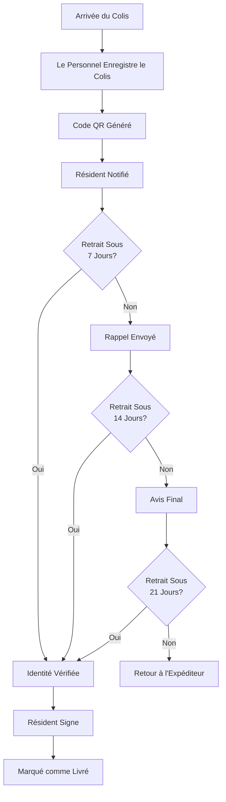

# Aperçu du Système de Gestion des Colis

> **Dernière mise à jour :** 5 avril 2025 | **Version :** 0.2.0

Le système de gestion des colis de Lofts des Arts simplifie le processus de réception, de suivi et de livraison des colis aux résidents. Ce système complet assure une manipulation sécurisée et efficace des colis tout en offrant une transparence tout au long du processus de livraison.

## Capacités du Système

- **Enregistrement des Colis** : Enregistrement efficace des colis entrants avec saisie minimale de données
- **Suivi par Code QR** : Codes QR uniques pour chaque colis permettant un scan rapide et des mises à jour de statut
- **Notifications Automatisées** : Alertes en temps réel aux résidents lors de l'arrivée des colis et rappels pour le retrait
- **Vérification Sécurisée** : Processus de vérification d'identité pour la remise des colis
- **Tableau de Bord Analytique** : Tendances de volume de colis et métriques de performance du personnel
- **Documentation Photographique** : Enregistrement visuel de l'état des colis à l'arrivée
- **Intégration Mobile** : Scan de colis et notification basés sur smartphone
- **Intégration avec Transporteurs** : Support pour les numéros de suivi des principaux transporteurs
- **Cartographie des Emplacements** : Cartographie numérique des lieux de stockage des colis

## Interface Utilisateur

### Pour le Personnel (Concierge, Gestionnaire d'Immeuble, Personnel)

L'interface du personnel fournit des outils pour un traitement efficace des colis :

- **Formulaire d'Enregistrement des Colis** : Formulaire de saisie rapide pour les nouvelles livraisons
- **Tableau de Bord des Statuts de Colis** : Aperçu de tous les colis dans l'immeuble
- **Répertoire des Résidents** : Recherche d'informations sur les résidents
- **Scanner de Code QR** : Capacités de numérisation mobile et de bureau
- **Traitement des Retraits** : Flux de travail guidé pour la remise des colis
- **Vue Analytique** : Données statistiques sur les volumes et tendances des colis

### Pour les Résidents

L'interface résident offre visibilité et commodité :

- **Notifications de Colis** : Alertes concernant les nouvelles livraisons
- **Colis Actuels** : Liste des colis en attente de retrait
- **Autorisation de Retrait** : Outils pour permettre à d'autres de récupérer les colis
- **Historique de Livraison** : Enregistrement des livraisons de colis passées
- **Paramètres de Préférences** : Personnalisation des préférences de notification
- **Système de Feedback** : Mécanisme d'évaluation du service de colis

## Cycle de Vie des Colis

## États des Colis

| Statut | Description | Actions Disponibles |
|--------|-------------|-------------------|
| **Enregistré** | Colis enregistré dans le système | Générer une notification |
| **Notifié** | Résident alerté à propos du colis | Envoyer un rappel, mettre à jour les informations |
| **Rappel Envoyé** | Notification de suivi envoyée | Envoyer un rappel supplémentaire, marquer pour retour |
| **En Cours** | Retrait actuellement en cours | Compléter ou annuler le processus de retrait |
| **Livré** | Récupéré avec succès par le résident | Aucune (état terminal) |
| **Retourné** | Renvoyé à l'expéditeur d'origine | Aucune (état terminal) |
| **Problème** | Problème identifié avec le colis | Résoudre le problème, mettre à jour les informations |
| **Manquant** | Colis introuvable | Initier le protocole de recherche |

## Capacités Spécifiques aux Rôles

Le système de colis s'adapte aux rôles des utilisateurs avec des permissions appropriées :

### Rôles du Personnel

| Rôle | Capacités |
|------|--------------|
| **DOORMAN** | Enregistrement complet des colis, traitement des retraits, envoi de notifications, rapports de base |
| **STAFF** | Enregistrement des colis, traitement des retraits, rapports de base |
| **MANAGER** | Toutes les capacités du concierge plus accès aux analyses, résolution de problèmes, configuration du système |
| **ADMIN** | Accès complet au système, y compris analyses avancées, pistes d'audit et paramètres système |

### Rôles des Résidents

| Rôle | Capacités |
|------|--------------|
| **RESIDENT_OWNER** | Voir les colis, recevoir des notifications, autoriser un retrait alternatif, préférences de livraison |
| **RESIDENT_TENANT** | Identique au propriétaire résident |
| **GUEST** | Pas d'accès direct (peut être autorisé pour le retrait par un résident) |

## Système de Notification

Le système de colis utilise une approche de notification multi-canaux :

- **Notifications dans l'Application** : Alertes en temps réel dans le portail résident
- **Notifications par Email** : Informations détaillées sur la livraison
- **Alertes SMS** : Brèves notifications avec informations de retrait (optionnel)
- **Notifications Push** : Alertes mobiles pour les résidents utilisant l'application
- **Système de Rappel** : Suivis automatisés pour les colis non réclamés

Les résidents peuvent personnaliser leurs préférences de notification via les paramètres de leur profil.

## Système de Code QR

La technologie de code QR est centrale au suivi des colis :

- **Génération de Code** : Code QR unique créé pour chaque colis
- **Encodage d'Information** : ID du colis, destinataire, date de livraison et transporteur
- **Étiquettes Physiques** : Imprimées sur des étiquettes adhésives appliquées aux colis
- **Processus de Scan** : Vérification rapide à l'aide d'un appareil mobile ou d'un scanner de bureau
- **Fonctionnalités de Sécurité** : Validation limitée dans le temps et données de colis cryptées

## Analyses de Colis

Le système génère des informations précieuses :

- **Tendances de Volume** : Volume de colis par jour, semaine, mois et année
- **Distribution par Transporteur** : Répartition des colis par service de livraison
- **Timing de Retrait** : Analyse des habitudes de retrait des résidents
- **Performance du Personnel** : Métriques d'efficacité du traitement des colis
- **Analyse des Problèmes** : Suivi des problèmes de colis et des résolutions
- **Projections Saisonnières** : Prévisions basées sur les modèles historiques

## Intégration avec d'Autres Systèmes

Le système de colis se connecte à d'autres composants de la plateforme :

- **Système de Messagerie** : Notifications de livraison et communication du personnel
- **Répertoire des Résidents** : Accès aux informations de contact des résidents
- **Plan du Bâtiment** : Visualisation de l'emplacement de stockage
- **Tableau de Bord Analytique** : Rapports de performance
- **Contrôle d'Accès** : Vérification d'identité pour la remise des colis

## Flux de Travail Courants

### Personnel : Traitement d'un Nouveau Colis

1. **Enregistrer les Informations du Colis**
   - Accéder à l'interface d'enregistrement des colis
   - Saisir les informations de base du colis (transporteur, numéro de suivi)
   - Sélectionner ou rechercher le destinataire
   - Classifier le colis (régulier, surdimensionné, périssable)
   - Prendre une photo de l'état du colis (optionnel)
   - Enregistrer l'emplacement de stockage

2. **Générer les Informations de Suivi**
   - Le système attribue un ID unique au colis
   - Le code QR est généré pour le colis
   - Imprimer et apposer l'étiquette de code QR sur le colis

3. **Stocker le Colis**
   - Placer le colis dans l'emplacement de stockage assigné
   - Mettre à jour l'emplacement de stockage si nécessaire
   - Le système envoie une notification au résident

### Personnel : Traitement d'un Retrait de Colis

1. **Initier le Retrait**
   - Le résident demande le colis à la réception
   - Le personnel localise le colis dans le système en utilisant le nom du résident ou scan le code QR
   - Récupère le colis de l'emplacement de stockage

2. **Vérifier l'Identité**
   - Confirmer l'identité du résident avec une pièce d'identité ou une carte d'accès au bâtiment
   - Si retrait alternatif, vérifier l'autorisation dans le système
   - Enregistrer la méthode de vérification dans le système

3. **Compléter la Livraison**
   - Le résident signe pour le colis (numérique ou physique)
   - Le personnel marque le colis comme livré dans le système
   - Le système met à jour le statut du colis et enregistre l'heure de livraison

### Résident : Gestion de la Livraison de Colis

1. **Recevoir la Notification**
   - Recevoir une alerte via les canaux de notification préférés
   - Consulter les détails du colis dans le portail résident
   - Voir la photo du colis et les informations de livraison

2. **Planifier le Retrait**
   - Vérifier les heures d'ouverture de la réception
   - Optionnellement planifier l'heure de retrait pour les gros articles
   - Autoriser un retrait alternatif si nécessaire

3. **Récupérer le Colis**
   - Visiter la réception pendant les heures d'ouverture
   - Fournir une identification
   - Signer pour le retrait du colis
   - Évaluer l'expérience de livraison (optionnel)

## Meilleures Pratiques

### Pour le Personnel

- **Traitement Rapide** : Enregistrer les colis dans les 30 minutes suivant la livraison
- **Informations Précises** : Vérifier les noms des destinataires et les numéros d'unité
- **Photos Claires** : Prendre des photos claires des colis endommagés
- **Stockage Organisé** : Stocker les colis de manière logique en fonction de la taille et du moment du retrait
- **Vérification Approfondie** : Toujours vérifier l'ID avant de remettre les colis
- **Audits Réguliers** : Réconcilier quotidiennement les colis physiques avec les enregistrements du système
- **Retours Opportuns** : Traiter rapidement les retours pour les colis non réclamés

### Pour les Résidents

- **Retrait Rapide** : Récupérer les colis dans les 3 jours lorsque possible
- **Préférences Mises à Jour** : Maintenir les préférences de notification à jour
- **Préavis** : Fournir les détails d'autorisation à l'avance pour un retrait alternatif
- **Informations Complètes** : Donner des instructions de livraison détaillées pour les articles spéciaux
- **Signalement Rapide** : Signaler immédiatement toute anomalie

## Dépannage

### Problèmes Courants et Résolutions

| Problème | Résolution |
|-------|------------|
| **Le code QR ne se scanne pas** | Nettoyer le scanner, assurer un bon éclairage, saisir le code manuellement, réimprimer l'étiquette si nécessaire |
| **Colis non dans le système** | Vérifier les livraisons récentes, vérifier le numéro de suivi auprès du transporteur, contacter le service de livraison |
| **Résident non notifié** | Vérifier les paramètres de notification, vérifier les informations de contact, envoyer une notification manuelle |
| **Tentative de retrait non autorisée** | Vérifier à nouveau l'identité, contacter directement le résident, vérifier les registres d'autorisation |
| **Colis au mauvais endroit** | Rechercher dans toutes les zones de stockage, vérifier les colis récemment livrés, vérifier auprès du personnel |

## Ressources de Formation

- [Tutoriel d'Enregistrement de Colis](./logging_FR.md)
- [Guide du Système de Code QR](./qr-codes_FR.md)
- [Processus de Vérification de Retrait](./verification_FR.md)
- [Résolution de Problèmes de Colis](./problem-resolution_FR.md)
- [Guide d'Interprétation des Analyses](./analytics_FR.md)

## Détails Techniques

- **Technologie QR** : Codes QR haute densité avec correction d'erreur
- **Moteur de Notification** : Système de livraison multi-canaux avec capacités de réessai
- **Base de Données** : Enregistrements de colis structurés avec données résidentielles relationnelles
- **Sécurité** : Contrôle d'accès basé sur les rôles et cryptage pour les données sensibles
- **Support Mobile** : Application Web Progressive avec capacités de traitement hors ligne

## Support et Ressources

Si vous rencontrez des problèmes avec le système de gestion des colis :

- **Support du Personnel** : Contacter le gestionnaire d'immeuble ou l'administrateur système
- **Support des Résidents** : Soumettre une demande d'aide via le portail résident

---

[English Version](./overview.md) 