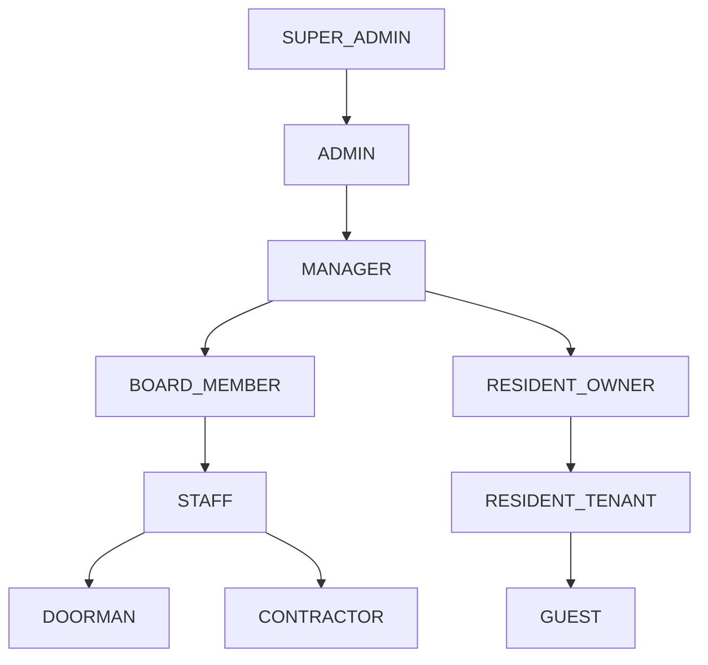
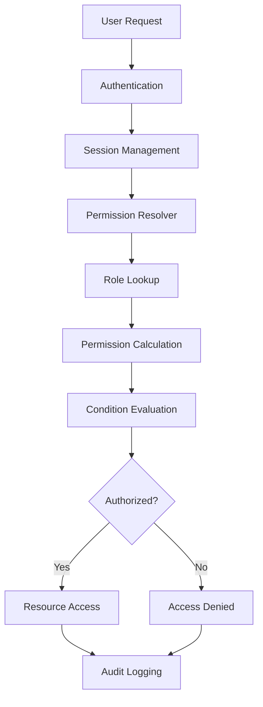
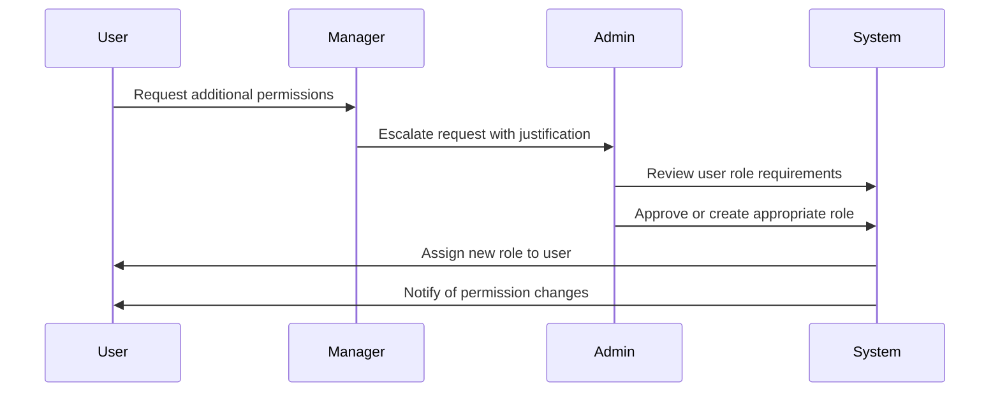
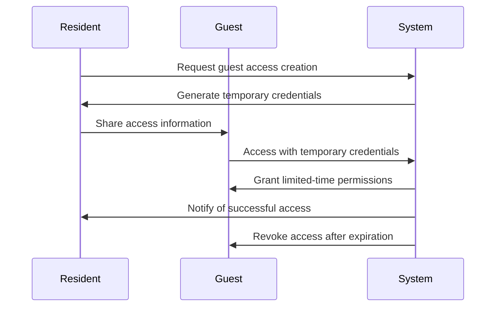

# Role-Based Access Control (RBAC) System Overview

> **Last Updated:** April 5, 2025 | **Version:** 0.2.0

The Lofts des Arts platform implements a comprehensive Role-Based Access Control (RBAC) system that manages user permissions throughout the application. This system ensures that users have appropriate access to features and data based on their role within the condominium community.

## System Principles

- **Least Privilege**: Users receive only the permissions necessary for their responsibilities
- **Role Hierarchy**: Structured permission inheritance between related roles
- **Permission Atomicity**: Fine-grained control over specific actions and resources
- **Dynamic Authorization**: Context-aware permission evaluation
- **Auditability**: Comprehensive logging of permission changes and access attempts
- **Segregation of Duties**: Critical operations require multiple roles
- **Self-Service Elements**: Users can manage certain permissions within their scope

## Role Hierarchy

The RBAC system implements a hierarchical structure where roles inherit permissions from roles below them in the hierarchy:



## Role Definitions

| Role | Description | Typical Users | Permission Level |
|------|-------------|---------------|------------------|
| **SUPER_ADMIN** | Complete system access | System administrators, developers | Complete access to all features, including technical configuration |
| **ADMIN** | Condominium administration | Building administrators | Full access to administrative functions with minor technical limitations |
| **MANAGER** | Building operations management | Property managers | Comprehensive access to day-to-day operational features |
| **BOARD_MEMBER** | Governance oversight | Board of directors | Administrative access focused on governance and financial features |
| **STAFF** | Building maintenance and operations | Maintenance personnel | Limited administrative access to service-related features |
| **DOORMAN** | Front desk and package management | Lobby staff | Specialized access to visitor and package features |
| **CONTRACTOR** | External service provision | Service providers | Highly restricted access to specific service areas |
| **RESIDENT_OWNER** | Condominium unit owner | Unit owners | Full resident access plus ownership-specific features |
| **RESIDENT_TENANT** | Rental unit resident | Tenants | Standard resident access to building resources |
| **GUEST** | Temporary platform visitor | Visitors, prospective buyers | Minimal access to shared resources |

## Permission Structure

Permissions are structured as a combination of:

- **Actions**: Operations a user can perform (view, create, edit, delete, approve, etc.)
- **Resources**: Objects or data that actions apply to (documents, profiles, messages, packages, etc.)
- **Conditions**: Contextual requirements for permission application (time, location, ownership, etc.)

### Permission Format

Permissions follow a standardized format:

```
<action>:<resource>:<condition>
```

Examples:
- `view:document:all` - Can view all documents
- `edit:profile:self` - Can edit own profile only
- `approve:maintenance:unit` - Can approve maintenance for assigned units
- `create:announcement:building` - Can create building-wide announcements

## Permission Categories

Permissions are organized into functional categories:

### User Management
- User creation and modification
- Role assignment and management
- Profile information access
- Account status control

### Content Management
- Website content editing
- Document management
- Gallery and media management
- Announcement creation

### Communication
- Message sending capabilities
- Conversation creation
- Recipient restrictions
- Announcement broadcasting

### Building Operations
- Maintenance request management
- Amenity booking administration
- Package handling
- Visitor management

### Financial Functions
- Payment processing
- Financial report access
- Budget management
- Fee assessment

### System Administration
- Configuration settings
- System monitoring
- Integration management
- Security controls

## Role-Specific Permission Examples

### Administrative Roles

| Role | Key Permissions | Limitations |
|------|----------------|-------------|
| **SUPER_ADMIN** | All system permissions without restriction | None |
| **ADMIN** | User management, content control, all operational features | Cannot modify system configuration or code |
| **MANAGER** | Resident management, building operations, communication | Limited financial and technical access |
| **BOARD_MEMBER** | Document approval, financial oversight, policy management | Cannot directly modify resident data |

### Operational Roles

| Role | Key Permissions | Limitations |
|------|----------------|-------------|
| **STAFF** | Service request management, basic resident communication | No administrative or financial access |
| **DOORMAN** | Package and visitor management, resident communication | Limited to front desk operations |
| **CONTRACTOR** | Access to assigned service areas and documentation | Highly restricted, time-limited access |

### Resident Roles

| Role | Key Permissions | Limitations |
|------|----------------|-------------|
| **RESIDENT_OWNER** | Document access, service requests, full messaging | Cannot access administrative features |
| **RESIDENT_TENANT** | Basic document access, service requests, messaging | Cannot access certain ownership documents |
| **GUEST** | Minimal feature access, specific shared resources | Very limited system interaction |

## UI Adaptation

The user interface dynamically adapts based on user permissions:

- **Menu Visibility**: Navigation options appear or hide based on access rights
- **Action Buttons**: Interactive elements display only for authorized actions
- **Form Fields**: Input options vary based on editing permissions
- **Content Display**: Information visibility adjusts to view permissions
- **Contextual Guidance**: Help text reflects available user capabilities

## Permission Management

### Administrative Interface

Administrators manage permissions through a dedicated interface:

- **Role Management**: Create, edit, and disable roles
- **Permission Assignment**: Add or remove permissions from roles
- **Role Assignment**: Assign users to appropriate roles
- **Custom Roles**: Create specialized roles for unique requirements
- **Temporary Access**: Grant time-limited role assignments
- **Role Cloning**: Create new roles based on existing templates
- **Bulk Operations**: Manage permissions for multiple users simultaneously

### Self-Service Capabilities

Some permission management is delegated to users:

- **Resident Owners**: Can grant temporary access to guests
- **Board Members**: Can assign committee permissions
- **Managers**: Can adjust staff role assignments
- **Users**: Can manage notification and privacy preferences

## Security Measures

The RBAC system implements several security controls:

- **Permission Verification**: Server-side validation of all access attempts
- **Cross-Site Request Forgery Protection**: Prevents unauthorized commands
- **Session Management**: Automatic timeout of inactive sessions
- **Access Logs**: Detailed recording of permission usage
- **Lockout Protection**: Prevents brute force permission testing
- **Change Approval**: Critical permission changes require verification

## Implementation Architecture



The RBAC system is implemented using:

- **Database Layer**: Role and permission storage in PostgreSQL
- **API Layer**: Permission enforcement in API routes
- **Row-Level Security**: PostgreSQL RLS policies for data access control
- **UI Components**: Permission-aware interface elements
- **Middleware**: Request interception for validation

## Audit and Compliance

The system maintains comprehensive records for oversight:

- **Permission Changes**: Tracking of all role and permission modifications
- **Access Logs**: Record of resource access by users
- **Denied Attempts**: Documentation of unauthorized access attempts
- **User Role History**: Timeline of role assignments and changes
- **Administrative Actions**: Logging of permission management activities

## Best Practices

### For Administrators

- **Regular Audits**: Review role assignments and permissions quarterly
- **Role Consolidation**: Minimize custom roles where possible
- **Permission Testing**: Verify role capabilities after changes
- **Documentation**: Maintain clear documentation of role purposes
- **Temporary Access**: Use time-limited roles for contractors
- **Principle of Least Privilege**: Assign minimal necessary permissions

### For Users

- **Account Security**: Protect credentials to prevent permission misuse
- **Permission Awareness**: Understand your access limitations
- **Delegation**: Use proper channels for actions beyond your permissions
- **Reporting**: Alert administrators about incorrect permissions
- **Session Management**: Log out when not using the system

## Technical Implementation

The RBAC system is built using several technical components:

- **Supabase RLS**: Database-level access control policies
- **Custom Middleware**: API route protection
- **Context Providers**: React context for permission-aware UI
- **Permission Hooks**: Custom React hooks for component-level control
- **JWT Claims**: Role information embedded in authentication tokens

## Common Workflows

### Permission Escalation Request



### Temporary Access Grant



## Frequently Asked Questions

**Q: How do I request additional permissions?**  
A: Contact your building manager or administrator with a specific request and justification for the needed permissions.

**Q: Can I have multiple roles simultaneously?**  
A: Yes, users can have multiple roles, and they receive the combined permissions of all assigned roles.

**Q: How often are permissions updated?**  
A: Permission changes take effect immediately upon being saved by an administrator.

**Q: How can I see what permissions I have?**  
A: Navigate to your profile and select "My Permissions" to view a breakdown of your access rights.

**Q: What should I do if I can't access a feature I need?**  
A: Contact the building manager or system administrator to request access to the feature.

## Training Resources

- [Permission System Basics](./permissions.md)
- [Role Management Guide](./role-management.md)
- [Security Best Practices](./security.md)
- [Permission Auditing Guide](./auditing.md)
- [Custom Role Creation](./custom-roles.md)

## Support & Resources

If you encounter issues with the RBAC system:

- **Administrators**: Contact technical support at admin-support@loftsdesarts.com
- **Residents**: Contact your building manager for permission inquiries
- **Documentation**: Complete system documentation available to administrators
- **Training**: Role-specific training available through the Help Center 