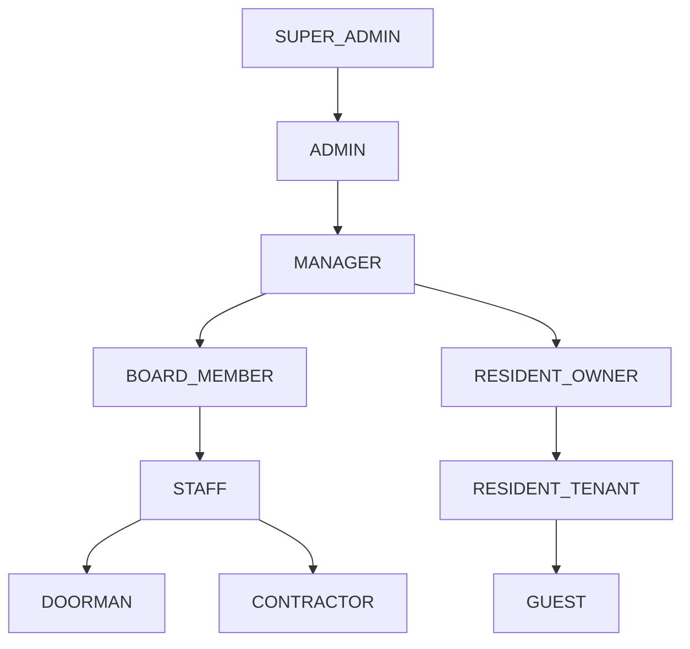
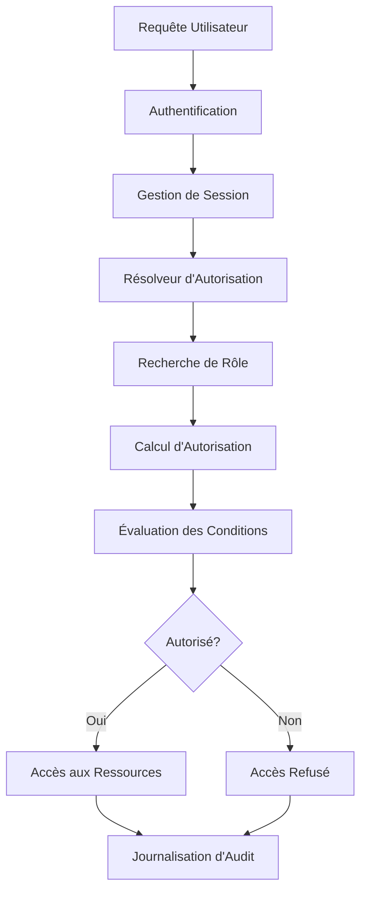

# Aperçu du Système de Contrôle d'Accès Basé sur les Rôles (RBAC)

> **Dernière mise à jour :** 7 avril 2025 | **Version :** 0.2.0

La plateforme Lofts des Arts implémente un système complet de Contrôle d'Accès Basé sur les Rôles (RBAC) qui gère les autorisations des utilisateurs dans toute l'application. Ce système garantit que les utilisateurs disposent d'un accès approprié aux fonctionnalités et aux données en fonction de leur rôle au sein de la communauté de copropriété.

## Principes du Système

- **Privilège Minimal** : Les utilisateurs reçoivent uniquement les autorisations nécessaires à leurs responsabilités
- **Hiérarchie des Rôles** : Héritage structuré des autorisations entre les rôles liés
- **Atomicité des Autorisations** : Contrôle précis sur des actions et ressources spécifiques
- **Autorisation Dynamique** : Évaluation des autorisations sensible au contexte
- **Auditabilité** : Journalisation complète des modifications d'autorisation et des tentatives d'accès
- **Séparation des Tâches** : Les opérations critiques nécessitent plusieurs rôles
- **Éléments en Libre-Service** : Les utilisateurs peuvent gérer certaines autorisations dans leur périmètre

## Hiérarchie des Rôles

Le système RBAC implémente une structure hiérarchique où les rôles héritent des autorisations des rôles situés en dessous d'eux dans la hiérarchie :



## Définitions des Rôles

| Rôle | Description | Utilisateurs Typiques | Niveau d'Autorisation |
|------|-------------|----------------------|------------------------|
| **SUPER_ADMIN** | Accès complet au système | Administrateurs système, développeurs | Accès complet à toutes les fonctionnalités, y compris la configuration technique |
| **ADMIN** | Administration de copropriété | Administrateurs d'immeuble | Accès complet aux fonctions administratives avec des limitations techniques mineures |
| **MANAGER** | Gestion des opérations d'immeuble | Gestionnaires immobiliers | Accès complet aux fonctionnalités opérationnelles quotidiennes |
| **BOARD_MEMBER** | Surveillance de la gouvernance | Conseil d'administration | Accès administratif axé sur les fonctionnalités de gouvernance et financières |
| **STAFF** | Maintenance et opérations d'immeuble | Personnel de maintenance | Accès administratif limité aux fonctionnalités liées au service |
| **DOORMAN** | Réception et gestion des colis | Personnel de la réception | Accès spécialisé aux fonctionnalités de visiteurs et de colis |
| **CONTRACTOR** | Prestation de services externes | Prestataires de services | Accès très restreint à des zones de service spécifiques |
| **RESIDENT_OWNER** | Propriétaire d'unité de copropriété | Propriétaires d'unités | Accès complet de résident plus fonctionnalités spécifiques à la propriété |
| **RESIDENT_TENANT** | Résident d'unité locative | Locataires | Accès standard de résident aux ressources de l'immeuble |
| **GUEST** | Visiteur temporaire de la plateforme | Visiteurs, acheteurs potentiels | Accès minimal aux ressources partagées |

## Structure des Autorisations

Les autorisations sont structurées comme une combinaison de :

- **Actions** : Opérations qu'un utilisateur peut effectuer (voir, créer, modifier, supprimer, approuver, etc.)
- **Ressources** : Objets ou données auxquels les actions s'appliquent (documents, profils, messages, colis, etc.)
- **Conditions** : Exigences contextuelles pour l'application des autorisations (temps, emplacement, propriété, etc.)

### Format d'Autorisation

Les autorisations suivent un format standardisé :

```
<action>:<ressource>:<condition>
```

Exemples :
- `view:document:all` - Peut voir tous les documents
- `edit:profile:self` - Peut modifier uniquement son propre profil
- `approve:maintenance:unit` - Peut approuver la maintenance pour les unités assignées
- `create:announcement:building` - Peut créer des annonces à l'échelle de l'immeuble

## Catégories d'Autorisations

Les autorisations sont organisées en catégories fonctionnelles :

### Gestion des Utilisateurs
- Création et modification d'utilisateurs
- Attribution et gestion des rôles
- Accès aux informations de profil
- Contrôle du statut du compte

### Gestion de Contenu
- Édition du contenu du site web
- Gestion des documents
- Gestion de la galerie et des médias
- Création d'annonces

### Communication
- Capacités d'envoi de messages
- Création de conversations
- Restrictions des destinataires
- Diffusion d'annonces

### Opérations d'Immeuble
- Gestion des demandes de maintenance
- Administration des réservations d'équipements
- Gestion des colis
- Gestion des visiteurs

### Fonctions Financières
- Traitement des paiements
- Accès aux rapports financiers
- Gestion du budget
- Évaluation des frais

### Administration Système
- Paramètres de configuration
- Surveillance du système
- Gestion de l'intégration
- Contrôles de sécurité

## Exemples d'Autorisations Spécifiques aux Rôles

### Rôles Administratifs

| Rôle | Autorisations Clés | Limitations |
|------|-------------------|-------------|
| **SUPER_ADMIN** | Toutes les autorisations système sans restriction | Aucune |
| **ADMIN** | Gestion des utilisateurs, contrôle du contenu, toutes les fonctionnalités opérationnelles | Ne peut pas modifier la configuration système ou le code |
| **MANAGER** | Gestion des résidents, opérations d'immeuble, communication | Accès financier et technique limité |
| **BOARD_MEMBER** | Approbation des documents, supervision financière, gestion des politiques | Ne peut pas modifier directement les données des résidents |

### Rôles Opérationnels

| Rôle | Autorisations Clés | Limitations |
|------|-------------------|-------------|
| **STAFF** | Gestion des demandes de service, communication de base avec les résidents | Pas d'accès administratif ou financier |
| **DOORMAN** | Gestion des colis et des visiteurs, communication avec les résidents | Limité aux opérations de réception |
| **CONTRACTOR** | Accès aux zones de service assignées et à la documentation | Accès très restreint et limité dans le temps |

### Rôles des Résidents

| Rôle | Autorisations Clés | Limitations |
|------|-------------------|-------------|
| **RESIDENT_OWNER** | Accès aux documents, demandes de service, messagerie complète | Ne peut pas accéder aux fonctionnalités administratives |
| **RESIDENT_TENANT** | Accès de base aux documents, demandes de service, messagerie | Ne peut pas accéder à certains documents de propriété |
| **GUEST** | Accès minimal aux fonctionnalités, ressources partagées spécifiques | Interaction très limitée avec le système |

## Adaptation de l'Interface Utilisateur

L'interface utilisateur s'adapte dynamiquement en fonction des autorisations de l'utilisateur :

- **Visibilité du Menu** : Les options de navigation apparaissent ou se cachent en fonction des droits d'accès
- **Boutons d'Action** : Les éléments interactifs s'affichent uniquement pour les actions autorisées
- **Champs de Formulaire** : Les options de saisie varient en fonction des autorisations de modification
- **Affichage du Contenu** : La visibilité des informations s'ajuste aux autorisations de consultation
- **Orientation Contextuelle** : Le texte d'aide reflète les capacités disponibles pour l'utilisateur

## Gestion des Autorisations

### Interface Administrative

Les administrateurs gèrent les autorisations via une interface dédiée :

- **Gestion des Rôles** : Créer, modifier et désactiver des rôles
- **Attribution des Autorisations** : Ajouter ou supprimer des autorisations des rôles
- **Attribution des Rôles** : Assigner des utilisateurs aux rôles appropriés
- **Rôles Personnalisés** : Créer des rôles spécialisés pour des exigences uniques
- **Accès Temporaire** : Accorder des attributions de rôle limitées dans le temps
- **Clonage de Rôle** : Créer de nouveaux rôles basés sur des modèles existants
- **Opérations en Masse** : Gérer les autorisations pour plusieurs utilisateurs simultanément

### Capacités en Libre-Service

Certaines gestions d'autorisations sont déléguées aux utilisateurs :

- **Propriétaires Résidents** : Peuvent accorder un accès temporaire aux invités
- **Membres du Conseil** : Peuvent attribuer des autorisations de comité
- **Gestionnaires** : Peuvent ajuster les attributions de rôle du personnel
- **Utilisateurs** : Peuvent gérer les préférences de notification et de confidentialité

## Mesures de Sécurité

Le système RBAC implémente plusieurs contrôles de sécurité :

- **Vérification des Autorisations** : Validation côté serveur de toutes les tentatives d'accès
- **Protection Contre la Falsification de Requêtes Intersites** : Empêche les commandes non autorisées
- **Gestion des Sessions** : Expiration automatique des sessions inactives
- **Journaux d'Accès** : Enregistrement détaillé de l'utilisation des autorisations
- **Protection Contre le Verrouillage** : Empêche les tests de force brute sur les autorisations
- **Approbation des Modifications** : Les modifications d'autorisations critiques nécessitent une vérification

## Architecture d'Implémentation



Le système RBAC est implémenté à l'aide de :

- **Couche de Base de Données** : Stockage des rôles et autorisations dans PostgreSQL
- **Couche API** : Application des autorisations dans les routes API
- **Sécurité au Niveau des Lignes** : Politiques RLS PostgreSQL pour le contrôle d'accès aux données
- **Composants UI** : Éléments d'interface tenant compte des autorisations
- **Middleware** : Interception des requêtes pour validation

## Audit et Conformité

Le système maintient des enregistrements complets pour la supervision :

- **Modifications d'Autorisations** : Suivi de toutes les modifications de rôles et d'autorisations
- **Journaux d'Accès** : Enregistrement de l'accès aux ressources par les utilisateurs
- **Tentatives Refusées** : Documentation des tentatives d'accès non autorisées
- **Historique des Rôles Utilisateur** : Chronologie des attributions et modifications de rôles
- **Actions Administratives** : Journalisation des activités de gestion des autorisations

## Meilleures Pratiques

### Pour les Administrateurs

- **Audits Réguliers** : Examiner les attributions de rôles et les autorisations trimestriellement
- **Consolidation des Rôles** : Minimiser les rôles personnalisés lorsque possible
- **Test des Autorisations** : Vérifier les capacités des rôles après les modifications
- **Documentation** : Maintenir une documentation claire des objectifs des rôles
- **Accès Temporaire** : Utiliser des rôles limités dans le temps pour les entrepreneurs
- **Principe du Moindre Privilège** : Attribuer les autorisations minimales nécessaires

### Pour les Utilisateurs

- **Sécurité du Compte** : Protéger les identifiants pour éviter l'utilisation abusive des autorisations
- **Connaissance des Autorisations** : Comprendre vos limitations d'accès
- **Délégation** : Utiliser les canaux appropriés pour les actions au-delà de vos autorisations
- **Signalement** : Alerter les administrateurs en cas d'autorisations incorrectes
- **Gestion des Sessions** : Se déconnecter lorsque vous n'utilisez pas le système

## Implémentation Technique

Le système RBAC est construit à l'aide de plusieurs composants techniques :

- **Supabase RLS** : Politiques de contrôle d'accès au niveau de la base de données
- **Middleware Personnalisé** : Protection des routes API
- **Fournisseurs de Contexte** : Contexte React pour l'interface utilisateur tenant compte des autorisations
- **Hooks d'Autorisation** : Hooks React personnalisés pour le contrôle au niveau des composants
- **Revendications JWT** : Informations de rôle intégrées dans les jetons d'authentification

## Flux de Travail Courants

### Demande d'Escalade d'Autorisation

1. L'utilisateur identifie un besoin d'accès supplémentaire
2. L'utilisateur soumet une demande via le formulaire d'accès
3. Le superviseur ou administrateur reçoit une notification
4. La demande est évaluée selon les politiques
5. L'approbation ou le refus est communiqué
6. En cas d'approbation, le rôle temporaire est attribué
7. L'action est enregistrée dans les journaux d'audit

### Révision Périodique des Autorisations

1. Les administrateurs reçoivent des rappels de révision trimestriels
2. Un rapport d'utilisation des autorisations est généré
3. Les rôles et utilisateurs inactifs sont identifiés
4. Les anomalies d'accès sont signalées
5. Les ajustements recommandés sont proposés
6. Les modifications approuvées sont appliquées
7. Un rapport d'audit est généré pour conformité

## Questions Fréquemment Posées

**Q: Pourquoi ne puis-je pas accéder à certaines fonctionnalités?**
R: L'accès est déterminé par votre rôle. Si vous avez besoin d'accéder à des fonctionnalités supplémentaires, contactez votre administrateur.

**Q: Comment puis-je demander des autorisations supplémentaires?**
R: Utilisez l'option "Demander un Accès" dans le menu de profil et spécifiez les fonctionnalités nécessaires.

**Q: Puis-je avoir plusieurs rôles?**
R: Généralement, un utilisateur est assigné à un seul rôle principal, bien que des rôles temporaires puissent être ajoutés pour des besoins spécifiques.

**Q: Que dois-je faire si je constate que j'ai trop d'accès?**
R: Signalez-le immédiatement à votre administrateur système pour que vos autorisations puissent être ajustées.

**Q: Comment la confidentialité est-elle maintenue?**
R: Le système RBAC garantit que les utilisateurs ne peuvent accéder qu'aux données pour lesquelles ils ont une raison légitime.

## Ressources Additionnelles

- [Guide Administrateur du Système RBAC](../../admin/rbac-administration_FR.md)
- [Formation sur les Rôles et Autorisations](../../common/rbac-training_FR.md)
- [Politique de Sécurité](../../legal/security-policy_FR.md)
- [Guide des Meilleures Pratiques RBAC](../../admin/rbac-best-practices_FR.md)

---

[English Version](./overview.md) 