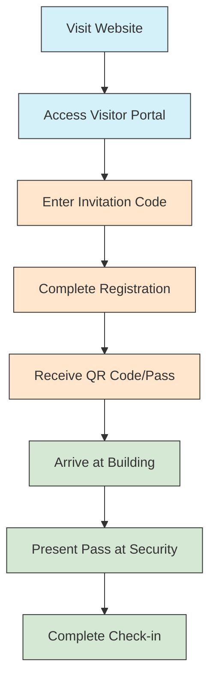
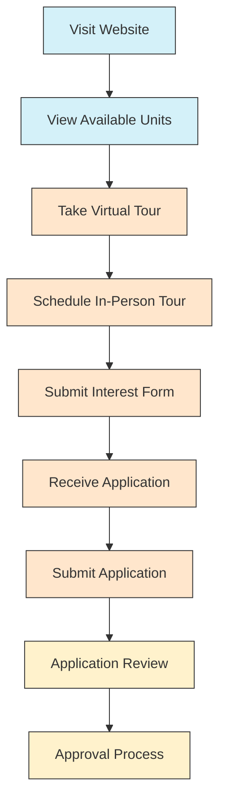
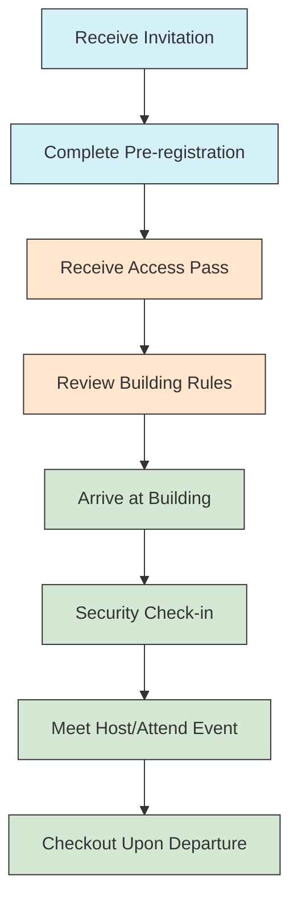
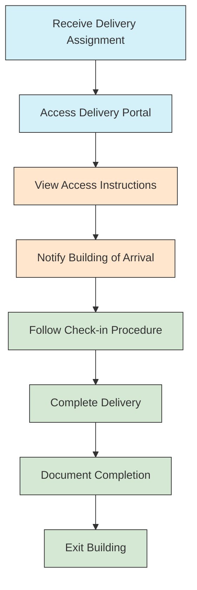

# Public User Guides

> **Last Updated:** April 5, 2025 | **Version:** 0.2.0

## Overview

This section contains documentation for the publicly accessible features of the Lofts des Arts platform. These guides are designed for users who do not have registered accounts but need to interact with certain public-facing aspects of the system. This includes prospective residents, visitors, delivery personnel, and other community members.

## Contents

### General Information

- [About Lofts des Arts](about.md)
- [Building History](building-history.md)
- [Location & Amenities](location-amenities.md)
- [Contact Information](contact-information.md)
- [Frequently Asked Questions](faq.md)
- [Accessibility Information](accessibility.md)

### Prospective Residents

- [Available Units](available-units.md)
- [Application Process](application-process.md)
- [Rental Information](rental-information.md)
- [Purchasing Information](purchasing-information.md)
- [Virtual Tour Guide](virtual-tour.md)
- [Request Information Form](request-information.md)

### Visitors & Guests

- [Visitor Registration](visitor-registration.md)
- [Check-in Procedures](check-in.md)
- [Building Access Guide](building-access.md)
- [Parking Information](visitor-parking.md)
- [Building Rules for Visitors](visitor-rules.md)
- [Event Guest Information](event-guests.md)

### Delivery & Service

- [Delivery Instructions](delivery-instructions.md)
- [Service Provider Registration](service-registration.md)
- [Loading Dock Information](loading-dock.md)
- [Package Room Procedures](package-room.md)
- [Food Delivery Guidelines](food-delivery.md)
- [Moving Procedures](moving-procedures.md)

### Emergency & Safety

- [Public Emergency Procedures](public-emergency.md)
- [Building Safety Features](safety-features.md)
- [ADA Accessibility](ada-accessibility.md)
- [Emergency Contact Information](emergency-contacts.md)
- [Weather Emergency Guidelines](weather-emergency.md)

## Public Features of the Platform

### Main Public Website

The Lofts des Arts public website provides essential information without requiring login:

- Building overview and history
- Photo gallery of common areas and sample units
- General amenity information
- Contact details for management
- Basic FAQ section
- Current availability of units (if any)
- News and announcements
- Neighborhood information
- Virtual tour booking

### Visitor Management System

External users can access the visitor management system to:

- Register as an expected visitor
- Complete pre-registration forms
- Receive QR code or visitor pass via email
- Get directions and parking information
- View visitor policies and requirements
- Schedule visits during permissible hours

### Delivery Management

Delivery personnel can use the public delivery portal to:

- Access delivery instructions
- Notify residents of arrival
- Document delivery with photos
- Get directions to loading dock or delivery entrance
- Contact front desk for assistance
- Register for recurring delivery access

### Event Access

Public users invited to events can:

- View event details and location
- Register attendance
- Download passes for entry
- Access building maps
- View event-specific rules and information
- Contact event organizers

## User Journeys

### Prospective Resident Journey

### Visitor Journey

### Delivery Personnel Journey

## Building Access Information

### Main Entrance

- **Location**: 123 Arts Boulevard
- **Hours**: Staffed 24/7
- **Security**: Photo ID required for all visitors
- **Accessibility**: ADA compliant entrance with automatic doors
- **Check-in Requirement**: All visitors must check in at the security desk

### Visitor Parking

- **Location**: Underground garage, Level P1
- **Visitor Spaces**: Numbered 1-20
- **Hours**: 6:00 AM - 11:00 PM
- **Registration**: Required at security desk
- **Validation**: Required for exit
- **Time Limit**: 4 hours maximum (unless extended by resident)
- **Oversized Vehicles**: Special arrangements required

### Loading Dock

- **Location**: East side of building, accessible from Arts Avenue
- **Hours**: Monday-Friday: 8:00 AM - 6:00 PM, Saturday: 9:00 AM - 5:00 PM
- **Reservations**: Required for moves and large deliveries
- **Height Clearance**: 12 feet
- **Contact**: loadingdock@loftsdesarts.com or ext. 705
- **Special Instructions**: No overnight parking

## Important Public Contacts

### General Inquiries

- **Front Desk**: frontdesk@loftsdesarts.com or (555) 123-4567
- **Sales Office**: sales@loftsdesarts.com or (555) 123-4568
- **Rental Office**: rentals@loftsdesarts.com or (555) 123-4569
- **Management Office**: management@loftsdesarts.com or (555) 123-4560

### Visitor Assistance

- **Security Desk**: security@loftsdesarts.com or (555) 123-4570
- **Concierge**: concierge@loftsdesarts.com or (555) 123-4571
- **Events Coordinator**: events@loftsdesarts.com or (555) 123-4572

### Delivery & Service

- **Package Room**: packages@loftsdesarts.com or (555) 123-4573
- **Loading Dock**: loadingdock@loftsdesarts.com or (555) 123-4574
- **Maintenance (emergency only)**: maintenance@loftsdesarts.com or (555) 123-4575

## Rules for Public Access

### General Conduct

- All visitors must have a specific purpose for being on the property
- Photography of the building interior is prohibited without permission
- Proper attire is required in all common areas
- Smoking is prohibited throughout the property
- Pets must be leashed and under control at all times
- No solicitation of any kind is permitted

### Security Protocols

- All visitors must present ID at security desk
- Visitors may only access areas specifically authorized
- Visitors must be accompanied by their host in restricted areas
- Visitor passes must be visible at all times
- Security cameras are in operation throughout public areas
- Building staff may request ID verification at any time

## Public Resources

- [Building Map (Public Areas)](../assets/public-map.pdf)
- [Visitor Code of Conduct](../assets/visitor-conduct.pdf)
- [Transportation Options](../assets/transportation.pdf)
- [Neighborhood Guide](../assets/neighborhood-guide.pdf)
- [Event Spaces Information](../assets/event-spaces.pdf)
- [Accessibility Guide](../assets/accessibility-guide.pdf)

## Upcoming Public Events

For information about upcoming public events at Lofts des Arts, please visit our [Events Calendar](https://loftsdesarts.com/events) or contact the events coordinator at events@loftsdesarts.com.

## Changelog

### Version 0.2.0 (April 5, 2025)
- Added detailed visitor registration process
- Updated delivery management system documentation
- Enhanced building maps and access information
- Added virtual tour booking system guide
- Updated contact information and hours of operation
- Added ADA accessibility information

### Version 0.1.0 (February 15, 2025)
- Initial public documentation release
- Basic visitor information
- Building overview
- Contact details
- General FAQs 