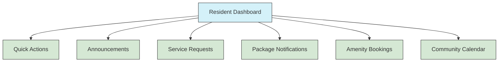
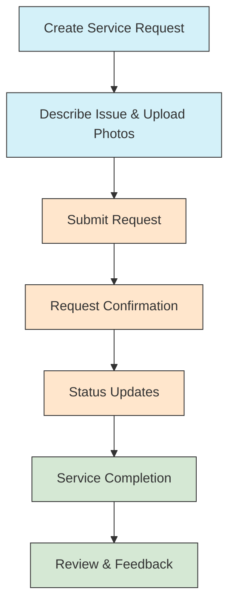
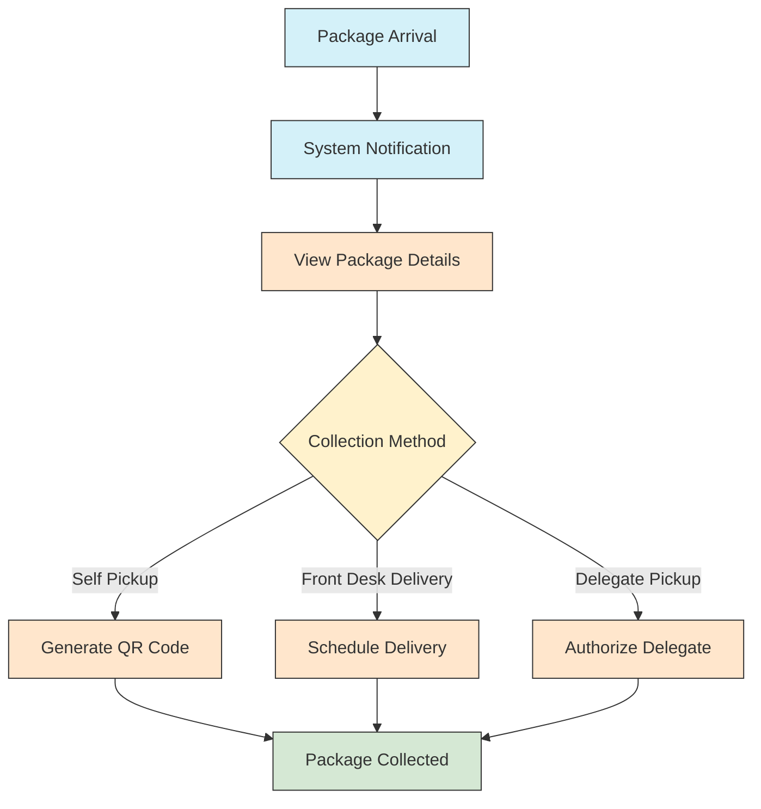
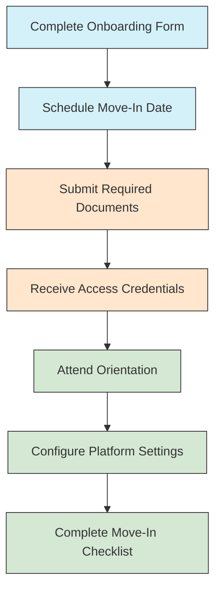
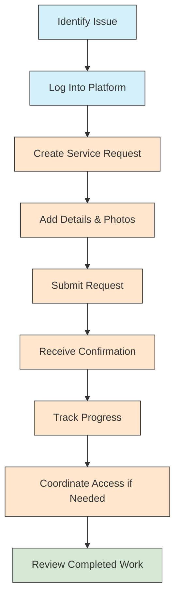

# Resident User Guides

> **Last Updated:** April 5, 2025 | **Version:** 0.2.0

## Overview

This directory contains comprehensive documentation designed for all residents of Lofts des Arts, encompassing both owners and tenants. These guides cover the essential features, services, and processes relevant to living in the building, helping residents make the most of their residential experience.

## Contents

This directory contains guides organized into the following categories:

### Getting Started

- [Resident Onboarding](onboarding.md)
- [Dashboard Overview](dashboard-overview.md)
- [Profile Setup](profile-setup.md)
- [Mobile App Installation](mobile-app.md)
- [FAQ for New Residents](new-resident-faq.md)

### Building Information

- [Building Amenities](amenities.md)
- [Building Hours & Access](building-hours.md)
- [Floor Plans & Maps](floor-plans.md)
- [Emergency Procedures](emergency-procedures.md)
- [Building Rules & Regulations](rules-regulations.md)
- [Waste Management & Recycling](waste-recycling.md)

### Services & Requests

- [Maintenance Requests](maintenance-requests.md)
- [Package Management](package-management.md)
- [Guest Registration](guest-registration.md)
- [Amenity Reservations](amenity-reservations.md)
- [Service Provider Access](service-provider-access.md)
- [Special Accommodations](special-accommodations.md)

### Community

- [Community Calendar](community-calendar.md)
- [Community Forum](community-forum.md)
- [Resident Directory](resident-directory.md)
- [Event Planning](event-planning.md)
- [Neighborhood Resources](neighborhood-resources.md)
- [Local Services Directory](local-services.md)

### Communication

- [Announcement System](announcement-system.md)
- [Messaging Platform](messaging-platform.md)
- [Notification Preferences](notification-preferences.md)
- [Emergency Contacts](emergency-contacts.md)
- [Communicating with Management](management-communication.md)

### Document & Information Management

- [Important Documents](important-documents.md)
- [Forms & Templates](forms-templates.md)
- [Document Submission](document-submission.md)
- [Privacy & Data Management](privacy-data.md)
- [Digital Storage](digital-storage.md)

## Role-Specific Guides

For more detailed information specific to resident roles, please see:

- [Resident Owner Guide](../roles/resident-owner/README.md) - For condominium owners
- [Resident Tenant Guide](../roles/resident-tenant/README.md) - For tenants renting units

## Features for All Residents

All residents, regardless of owner or tenant status, have access to these core features:

### Resident Dashboard

The resident dashboard provides a personalized overview with quick access to important information and common tasks.

[Detailed Dashboard Guide](dashboard-overview.md)

### Service Request System

The service request system allows all residents to:

- Submit maintenance and service requests
- Track the status of submitted requests
- Communicate with maintenance staff
- Upload photos or documents related to issues
- Schedule service appointments
- Rate and review completed service
- Access service history for their unit

[Service Request Guide](maintenance-requests.md)

### Package Management

All residents can use the package management system to:

- Receive notifications when packages arrive
- View package details and delivery information
- Coordinate package pickup or delivery to unit
- Authorize others to collect packages
- Manage package history
- Set delivery preferences

[Package Management Guide](package-management.md)

### Amenity Reservations

Residents can book and manage building amenities:

- View amenity availability in real-time
- Make reservations for available time slots
- Cancel or modify existing reservations
- Receive reminders about upcoming reservations
- View amenity rules and guidelines
- Report issues with amenities
- Pay any applicable fees for premium amenities

[Amenity Booking Guide](amenity-reservations.md)

### Guest Management

The guest management system allows residents to:

- Pre-register guests for building access
- Generate temporary access passes
- Receive notifications when guests arrive
- Manage recurring visitors
- Review guest history
- Set guest access limitations
- Coordinate with front desk for special accommodations

[Guest Registration Guide](guest-registration.md)

## Common Resident Workflows

### Moving In Process

[Complete Move-In Guide](moving-in.md)

### Service Request Process

[Service Request Guide](maintenance-requests.md)

## Building Rules & Information

Living at Lofts des Arts comes with specific guidelines designed to ensure a harmonious community environment. Key policies include:

### Noise & Quiet Hours

- **Quiet Hours**: 10:00 PM - 8:00 AM on weekdays, 11:00 PM - 9:00 AM on weekends
- **Construction/Renovation Work**: Permitted only Monday-Friday, 9:00 AM - 5:00 PM
- **Moving Hours**: 9:00 AM - 5:00 PM, Monday-Saturday (no Sunday moves)
- **Notification Requirements**: 48-hour advance notice for parties or gatherings

### Common Areas

- **Lobby Use**: Not for extended gatherings or meetings
- **Hallway Restrictions**: No personal items in hallways
- **Elevator Etiquette**: Priority for residents with mobility challenges
- **Pet Restrictions**: Pets must be leashed in all common areas
- **Smoking Policy**: No smoking in any common areas, including balconies

### Guest Policies

- **Registration Requirement**: All guests must be registered
- **Overnight Guests**: Limited to 14 consecutive days without special permission
- **Short-term Rentals**: Prohibited per condominium bylaws
- **Guest Parking**: Limited spaces available with reservation

For complete rules and regulations, please refer to the [Building Rules & Regulations](rules-regulations.md) document.

## Emergency Procedures

In case of emergency:

1. **Fire**: Exit using stairs, not elevators. Gather at designated meeting point.
2. **Medical Emergency**: Call 911, then notify front desk.
3. **Security Concerns**: Contact security desk (ext. 700) or emergency line (ext. 777).
4. **Water Leaks/Flooding**: Turn off water supply if possible, contact front desk immediately.
5. **Power Outage**: Emergency lighting will activate. Follow staff instructions.
6. **Elevator Malfunction**: Use emergency call button, remain calm.
7. **Severe Weather**: Follow building shelter protocols.

[Detailed Emergency Procedures](emergency-procedures.md)

## Important Contacts

### Building Management

- **Front Desk**: frontdesk@loftsdesarts.com or ext. 700
- **Building Manager**: manager@loftsdesarts.com or ext. 701
- **Maintenance**: maintenance@loftsdesarts.com or ext. 702
- **Security**: security@loftsdesarts.com or ext. 703

### Emergency Contacts

- **Emergency Line (24/7)**: emergency@loftsdesarts.com or ext. 777
- **Police, Fire, Medical**: 911
- **Poison Control**: 1-800-222-1222
- **Building Emergency**: ext. 777

### Service Providers

- **Internet Provider**: service@provider.com or 1-800-XXX-XXXX
- **Utilities Support**: support@utilities.com or 1-800-XXX-XXXX
- **Package Room**: packages@loftsdesarts.com or ext. 704

## Resources & Downloads

- [Resident Handbook](../documents/resident-handbook.pdf)
- [Move-In Checklist](../documents/move-in-checklist.pdf)
- [Service Request Form](../documents/service-request-form.pdf)
- [Guest Registration Form](../documents/guest-registration-form.pdf)
- [Building Maps](../documents/building-maps.pdf)
- [Emergency Contact Form](../documents/emergency-contact-form.pdf)

## Changelog

### Version 0.2.0 (April 5, 2025)
- Added comprehensive messaging system guides
- Updated package management documentation
- Enhanced service request workflow with images
- Added detailed guest management procedures
- Updated emergency contact information
- Expanded amenity reservation guides

### Version 0.1.0 (February 15, 2025)
- Initial documentation release
- Basic resident guides for core building features
- Move-in procedures
- Building rules overview
- Emergency procedures 