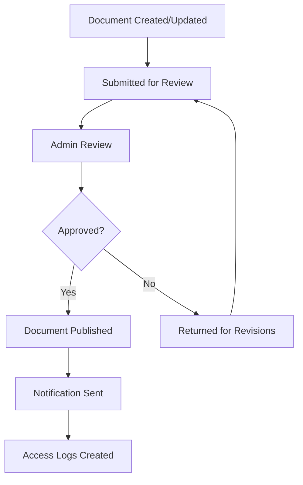
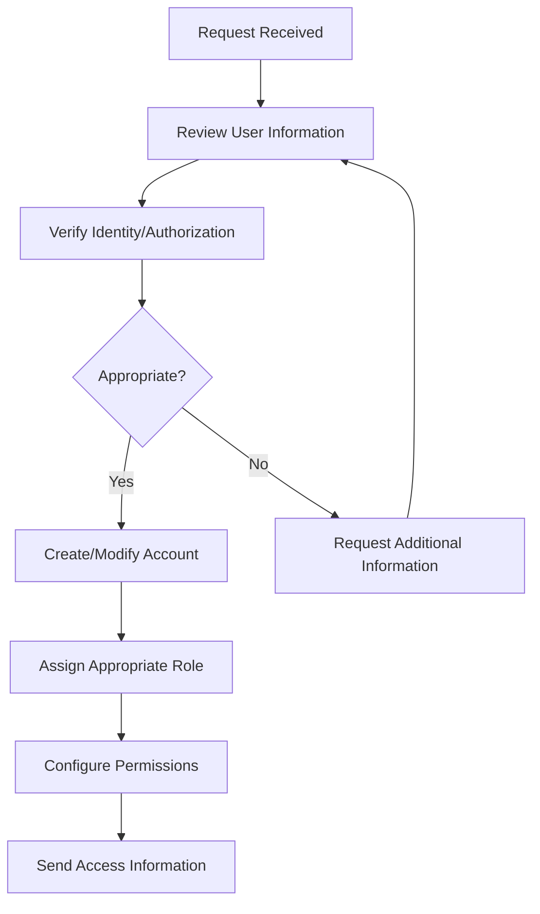

# Administrator User Guide

> **Last Updated:** April 5, 2025 | **Role:** ADMIN

## Role Overview

As an **Administrator** at Lofts des Arts, you have comprehensive access to manage the condominium's digital platform. While you don't have access to technical system configuration (reserved for Super Admins), you have full control over day-to-day operations, user management, content, and all resident-facing features of the platform.

## Responsibilities

- User and resident account management
- Content management for the website and digital resources
- Document organization and access control
- Package management system oversight
- Building communication and announcements
- Resident support and request management
- Analytics and reporting review
- Managing staff and operational tasks
- Security and access control administration

## Dashboard Overview

Your dashboard provides a comprehensive overview of building operations:

- **User Management**: Recent user activity and account statuses
- **Content Updates**: Status of website content and pending changes
- **Document Activity**: Recently added or modified documents
- **Package Overview**: Summary of package activity and status
- **Communication Center**: Recent announcements and important messages
- **Task Management**: Assigned and pending administrative tasks
- **Analytics**: Key performance metrics for building operations

## Available Features

### User Management

- **Resident Accounts**: Create and manage resident profiles
- **Staff Management**: Assign roles and permissions to staff members
- **Directory Administration**: Maintain the building directory
- **Role Assignment**: Assign appropriate access levels to users
- **Profile Verification**: Verify resident information accuracy

### Content Management

- **Website Editor**: Update and maintain the public-facing website
- **News & Announcements**: Create and publish building news
- **Gallery Management**: Update the building's photo gallery
- **Event Calendar**: Manage the community event calendar
- **Resource Library**: Maintain resident resources and information

### Document System

- **Document Library**: Organize and manage all building documents
- **Access Control**: Set permissions for document access
- **Version Management**: Maintain document versions and updates
- **Template Library**: Create and maintain document templates
- **Approval Workflows**: Manage document approval processes

### Communication Center

- **Announcements**: Create building-wide or targeted announcements
- **Message Center**: Communicate with residents and staff
- **Email Campaigns**: Send scheduled communications
- **Notification Management**: Configure system notifications
- **Survey Creation**: Create and distribute resident surveys

### Building Operations

- **Service Request Management**: Oversee maintenance requests
- **Amenity Booking**: Manage common area reservations
- **Package System**: Oversee package management operations
- **Visitor Management**: Configure visitor access policies
- **Building Status Updates**: Communicate facility status

### Analytics & Reporting

- **Usage Reports**: Review platform usage statistics
- **Resident Engagement**: Track resident participation
- **Document Analytics**: Monitor document access patterns
- **Communication Metrics**: Analyze communication effectiveness
- **Custom Reports**: Generate specialized reports as needed

## Common Tasks

### User Management

1. **Creating a New Resident Account**:
   - Navigate to `Users > Add New User`
   - Select the appropriate role (Resident Owner or Resident Tenant)
   - Enter user details and contact information
   - Assign to specific unit(s)
   - Configure notification preferences
   - Send welcome email with login instructions

2. **Managing Staff Accounts**:
   - Navigate to `Users > Staff Management`
   - Create accounts for building staff with appropriate roles
   - Configure access permissions
   - Set working hours and contact information
   - Assign responsibilities and areas of coverage

3. **Deactivating a User**:
   - Navigate to `Users > All Users`
   - Locate the user to deactivate
   - Select `Deactivate Account`
   - Choose reason for deactivation
   - Determine data handling (archive or transfer)
   - Confirm deactivation

### Document Management

1. **Creating a Document Folder Structure**:
   - Navigate to `Documents > Manage Folders`
   - Create main categories for document organization
   - Set up subcategories as needed
   - Configure access permissions for each folder
   - Create folder descriptions and usage guidelines

2. **Uploading Important Documents**:
   - Navigate to `Documents > Upload`
   - Select appropriate folder for the document
   - Upload file and add relevant metadata
   - Set access permissions
   - Notify relevant users about new document

3. **Managing Document Versions**:
   - Navigate to `Documents > All Documents`
   - Locate document requiring update
   - Select `Manage Versions`
   - Upload new version
   - Add version notes
   - Set previous version handling (archive or replace)

### Communication Management

1. **Creating a Building Announcement**:
   - Navigate to `Communications > Announcements`
   - Create new announcement with clear subject line
   - Compose message content
   - Set priority level (Standard, Important, Critical)
   - Select target audience (All residents, specific floors, etc.)
   - Schedule publishing time if needed
   - Enable acknowledgment tracking if required

2. **Managing Message Groups**:
   - Navigate to `Communications > Message Groups`
   - Create functional groups (Board, Maintenance, Social, etc.)
   - Add relevant members to each group
   - Configure group settings and permissions
   - Create group description and usage guidelines

3. **Running a Resident Survey**:
   - Navigate to `Communications > Surveys`
   - Create new survey with clear objective
   - Add questions and response options
   - Set survey duration
   - Select target participants
   - Send notifications
   - Monitor participation and results

### Package Management

1. **System Configuration**:
   - Navigate to `Services > Package System > Settings`
   - Configure notification preferences
   - Set up package storage locations
   - Establish retention policies
   - Configure staff permissions

2. **Monitoring Package Status**:
   - Navigate to `Services > Package Dashboard`
   - Review current package inventory
   - Check for overdue pickups
   - Monitor staff performance metrics
   - Generate package activity reports

## Administrative Workflows

### Document Approval Process

### User Account Management

## Troubleshooting

### Common Issues

| Issue | Resolution |
|-------|------------|
| **User access problems** | Verify role assignment, check permission settings, confirm email accuracy |
| **Document access issues** | Check folder permissions, verify document availability, confirm user has appropriate role |
| **Notification failures** | Verify contact information, check notification settings, ensure delivery service is operational |
| **Report generation errors** | Confirm data sources are available, check query parameters, verify user has reporting permissions |
| **Content publishing problems** | Check approval status, verify publishing permissions, ensure content meets guidelines |

## Best Practices

- **Regular Audits**: Review user accounts, permissions, and document access quarterly
- **Documentation**: Maintain clear records of administrative decisions and policy changes
- **Communication Clarity**: Ensure announcements are clear, concise, and appropriately targeted
- **Training**: Provide regular refresher training for staff on system features
- **Backup Procedures**: Know how to access and restore system backups when needed
- **Security Awareness**: Stay alert for unusual account activity or access patterns
- **Resident Engagement**: Regularly solicit feedback on system usability and features
- **Process Documentation**: Document common administrative workflows for consistency

## Important Contacts

- **Super Administrator**: superadmin@loftsdesarts.com or ext. 100
- **Technical Support**: techsupport@loftsdesarts.com or ext. 101
- **Building Manager**: manager@loftsdesarts.com or ext. 102
- **Board President**: boardpresident@loftsdesarts.com or ext. 103
- **Emergency Services**: 911 or building security at ext. 104

## Resources

- [Administrative Policy Manual](../../documents/admin-policy-manual.md)
- [User Role Definitions](../../features/rbac/roles.md)
- [Document Management Best Practices](../../features/document-management/best-practices.md)
- [Communication Guidelines](../../common/communication-guidelines.md)
- [Reporting & Analytics Guide](../../admin/reporting.md)
- [Emergency Response Procedures](../../admin/emergency-procedures.md)

## System Updates

The administrative interface is regularly updated with new features and improvements. Major updates will be announced through:

- Admin dashboard notifications
- Email to all administrators
- Release notes in the Help Center
- Optional training sessions

## Support Channels

If you encounter issues requiring advanced support:
- **System Support**: Contact Super Administrator
- **Technical Issues**: Submit a technical support ticket
- **User Guidance**: Access the Admin Help Center
- **Training Request**: Schedule additional training through the Help Portal 