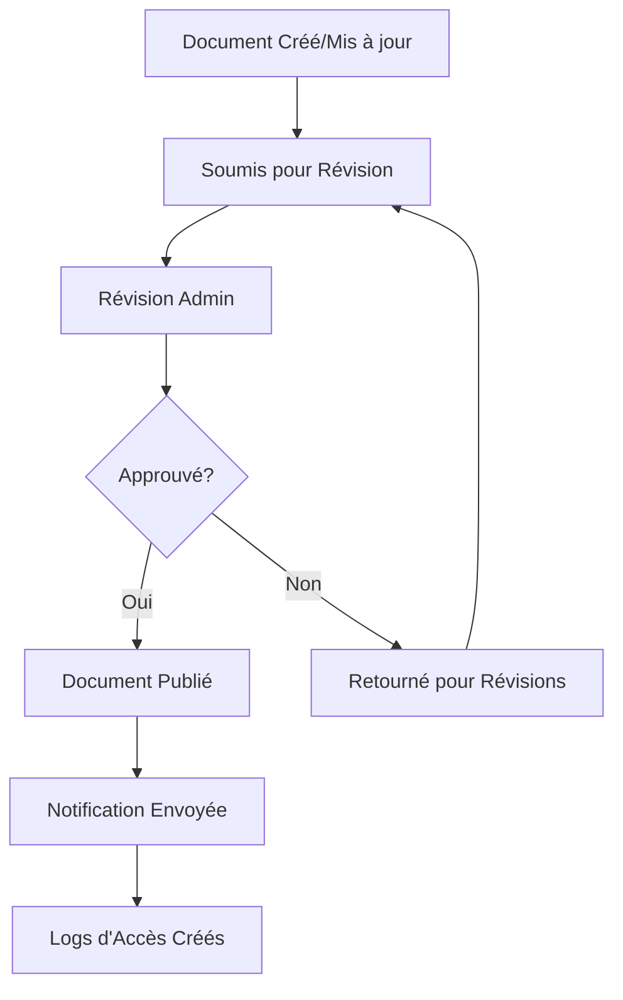
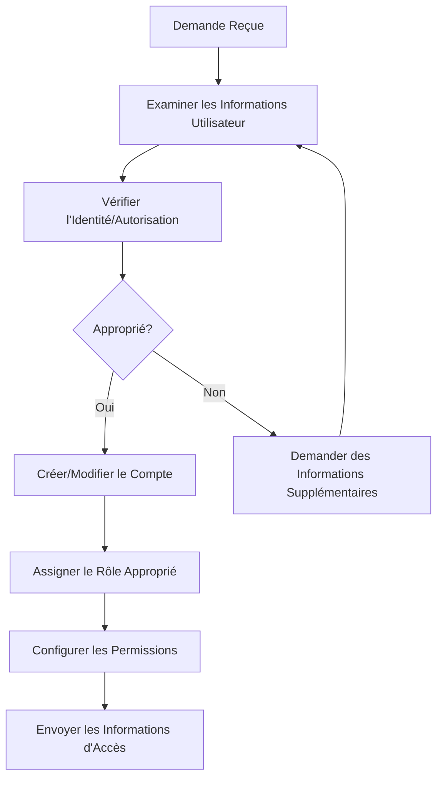

# Guide de l'Utilisateur Administrateur

> **Dernière mise à jour :** 5 avril 2025 | **Rôle :** ADMIN

## Aperçu du Rôle

En tant qu'**Administrateur** à Lofts des Arts, vous disposez d'un accès complet pour gérer la plateforme numérique de la copropriété. Bien que vous n'ayez pas accès à la configuration technique du système (réservée aux Super Admins), vous avez un contrôle total sur les opérations quotidiennes, la gestion des utilisateurs, le contenu et toutes les fonctionnalités de la plateforme destinées aux résidents.

## Responsabilités

- Gestion des comptes utilisateurs et résidents
- Gestion du contenu pour le site web et les ressources numériques
- Organisation des documents et contrôle d'accès
- Supervision du système de gestion des colis
- Communication du bâtiment et annonces
- Support aux résidents et gestion des demandes
- Révision des analyses et rapports
- Gestion du personnel et des tâches opérationnelles
- Administration de la sécurité et du contrôle d'accès

## Aperçu du Tableau de Bord

Votre tableau de bord fournit une vue d'ensemble complète des opérations du bâtiment :

- **Gestion des Utilisateurs** : Activité récente des utilisateurs et statuts des comptes
- **Mises à Jour de Contenu** : Statut du contenu du site web et changements en attente
- **Activité des Documents** : Documents récemment ajoutés ou modifiés
- **Aperçu des Colis** : Résumé de l'activité et du statut des colis
- **Centre de Communication** : Annonces récentes et messages importants
- **Gestion des Tâches** : Tâches administratives assignées et en attente
- **Analyses** : Métriques de performance clés pour les opérations du bâtiment

## Fonctionnalités Disponibles

### Gestion des Utilisateurs

- **Comptes Résidents** : Créer et gérer les profils des résidents
- **Gestion du Personnel** : Assigner des rôles et permissions aux membres du personnel
- **Administration de l'Annuaire** : Maintenir l'annuaire du bâtiment
- **Attribution des Rôles** : Assigner des niveaux d'accès appropriés aux utilisateurs
- **Vérification des Profils** : Vérifier l'exactitude des informations des résidents

### Gestion de Contenu

- **Éditeur de Site Web** : Mettre à jour et maintenir le site web public
- **Actualités & Annonces** : Créer et publier des actualités du bâtiment
- **Gestion de la Galerie** : Mettre à jour la galerie photo du bâtiment
- **Calendrier d'Événements** : Gérer le calendrier des événements communautaires
- **Bibliothèque de Ressources** : Maintenir les ressources et informations pour les résidents

### Système de Documents

- **Bibliothèque de Documents** : Organiser et gérer tous les documents du bâtiment
- **Contrôle d'Accès** : Définir les permissions pour l'accès aux documents
- **Gestion des Versions** : Maintenir les versions et mises à jour des documents
- **Bibliothèque de Modèles** : Créer et maintenir des modèles de documents
- **Flux d'Approbation** : Gérer les processus d'approbation des documents

### Centre de Communication

- **Annonces** : Créer des annonces à l'échelle du bâtiment ou ciblées
- **Centre de Messages** : Communiquer avec les résidents et le personnel
- **Campagnes d'Email** : Envoyer des communications programmées
- **Gestion des Notifications** : Configurer les notifications système
- **Création de Sondages** : Créer et distribuer des sondages aux résidents

### Opérations du Bâtiment

- **Gestion des Demandes de Service** : Superviser les demandes de maintenance
- **Réservation des Commodités** : Gérer les réservations des espaces communs
- **Système de Colis** : Superviser les opérations de gestion des colis
- **Gestion des Visiteurs** : Configurer les politiques d'accès des visiteurs
- **Mises à Jour de l'État du Bâtiment** : Communiquer l'état des installations

### Analyses & Rapports

- **Rapports d'Utilisation** : Examiner les statistiques d'utilisation de la plateforme
- **Engagement des Résidents** : Suivre la participation des résidents
- **Analyses de Documents** : Surveiller les modèles d'accès aux documents
- **Métriques de Communication** : Analyser l'efficacité des communications
- **Rapports Personnalisés** : Générer des rapports spécialisés selon les besoins

## Tâches Courantes

### Gestion des Utilisateurs

1. **Créer un Nouveau Compte Résident** :
   - Naviguer vers `Utilisateurs > Ajouter Nouvel Utilisateur`
   - Sélectionner le rôle approprié (Propriétaire Résident ou Locataire Résident)
   - Saisir les détails de l'utilisateur et les informations de contact
   - Assigner à une/des unité(s) spécifique(s)
   - Configurer les préférences de notification
   - Envoyer un email de bienvenue avec les instructions de connexion

2. **Gérer les Comptes du Personnel** :
   - Naviguer vers `Utilisateurs > Gestion du Personnel`
   - Créer des comptes pour le personnel du bâtiment avec les rôles appropriés
   - Configurer les permissions d'accès
   - Définir les heures de travail et les informations de contact
   - Assigner les responsabilités et les zones de couverture

3. **Désactiver un Utilisateur** :
   - Naviguer vers `Utilisateurs > Tous les Utilisateurs`
   - Localiser l'utilisateur à désactiver
   - Sélectionner `Désactiver le Compte`
   - Choisir la raison de la désactivation
   - Déterminer la gestion des données (archiver ou transférer)
   - Confirmer la désactivation

### Gestion des Documents

1. **Créer une Structure de Dossiers de Documents** :
   - Naviguer vers `Documents > Gérer les Dossiers`
   - Créer les catégories principales pour l'organisation des documents
   - Mettre en place des sous-catégories selon les besoins
   - Configurer les permissions d'accès pour chaque dossier
   - Créer des descriptions de dossiers et des directives d'utilisation

2. **Télécharger des Documents Importants** :
   - Naviguer vers `Documents > Télécharger`
   - Sélectionner le dossier approprié pour le document
   - Télécharger le fichier et ajouter les métadonnées pertinentes
   - Définir les permissions d'accès
   - Notifier les utilisateurs concernés du nouveau document

3. **Gérer les Versions de Documents** :
   - Naviguer vers `Documents > Tous les Documents`
   - Localiser le document nécessitant une mise à jour
   - Sélectionner `Gérer les Versions`
   - Télécharger la nouvelle version
   - Ajouter des notes de version
   - Définir la gestion de la version précédente (archiver ou remplacer)

### Gestion des Communications

1. **Créer une Annonce pour le Bâtiment** :
   - Naviguer vers `Communications > Annonces`
   - Créer une nouvelle annonce avec un objet clair
   - Rédiger le contenu du message
   - Définir le niveau de priorité (Standard, Important, Critique)
   - Sélectionner le public cible (Tous les résidents, étages spécifiques, etc.)
   - Programmer l'heure de publication si nécessaire
   - Activer le suivi de confirmation si requis

2. **Gérer les Groupes de Messages** :
   - Naviguer vers `Communications > Groupes de Messages`
   - Créer des groupes fonctionnels (Conseil, Maintenance, Social, etc.)
   - Ajouter les membres pertinents à chaque groupe
   - Configurer les paramètres et permissions de groupe
   - Créer une description de groupe et des directives d'utilisation

3. **Réaliser un Sondage auprès des Résidents** :
   - Naviguer vers `Communications > Sondages`
   - Créer un nouveau sondage avec un objectif clair
   - Ajouter des questions et options de réponse
   - Définir la durée du sondage
   - Sélectionner les participants cibles
   - Envoyer les notifications
   - Surveiller la participation et les résultats

### Gestion des Colis

1. **Configuration du Système** :
   - Naviguer vers `Services > Système de Colis > Paramètres`
   - Configurer les préférences de notification
   - Configurer les emplacements de stockage des colis
   - Établir les politiques de conservation
   - Configurer les permissions du personnel

2. **Surveiller le Statut des Colis** :
   - Naviguer vers `Services > Tableau de Bord des Colis`
   - Examiner l'inventaire actuel des colis
   - Vérifier les retraits en retard
   - Surveiller les métriques de performance du personnel
   - Générer des rapports d'activité de colis

## Flux de Travail Administratifs

### Processus d'Approbation des Documents

### Gestion des Comptes Utilisateurs

## Dépannage

### Problèmes Courants

| Problème | Résolution |
|-------|------------|
| **Problèmes d'accès utilisateur** | Vérifier l'attribution du rôle, vérifier les paramètres de permission, confirmer l'exactitude de l'email |
| **Problèmes d'accès aux documents** | Vérifier les permissions de dossier, vérifier la disponibilité du document, confirmer que l'utilisateur a le rôle approprié |
| **Échecs de notification** | Vérifier les informations de contact, vérifier les paramètres de notification, s'assurer que le service de livraison est opérationnel |
| **Erreurs de génération de rapports** | Confirmer que les sources de données sont disponibles, vérifier les paramètres de requête, vérifier que l'utilisateur a les permissions de rapport |
| **Problèmes de publication de contenu** | Vérifier le statut d'approbation, vérifier les permissions de publication, s'assurer que le contenu respecte les directives |

## Meilleures Pratiques

- **Audits Réguliers** : Examiner trimestriellement les comptes utilisateurs, les permissions et l'accès aux documents
- **Documentation** : Maintenir des enregistrements clairs des décisions administratives et des changements de politique
- **Clarté de Communication** : S'assurer que les annonces sont claires, concises et correctement ciblées
- **Formation** : Fournir régulièrement une formation de rappel pour le personnel sur les fonctionnalités du système
- **Procédures de Sauvegarde** : Savoir comment accéder et restaurer les sauvegardes système en cas de besoin
- **Conscience de Sécurité** : Rester vigilant face à une activité de compte ou des modèles d'accès inhabituels
- **Engagement des Résidents** : Solliciter régulièrement des retours sur l'utilisabilité et les fonctionnalités du système
- **Documentation des Processus** : Documenter les flux de travail administratifs courants pour la cohérence

## Contacts Importants

- **Super Administrateur** : superadmin@loftsdesarts.com ou poste 100
- **Support Technique** : techsupport@loftsdesarts.com ou poste 101
- **Gestionnaire d'Immeuble** : manager@loftsdesarts.com ou poste 102
- **Président du Conseil** : boardpresident@loftsdesarts.com ou poste 103
- **Services d'Urgence** : 911 ou sécurité du bâtiment au poste 104

## Ressources

- [Manuel de Politique Administrative](../../documents/admin-policy-manual_FR.md)
- [Définitions des Rôles Utilisateurs](../../features/rbac/roles_FR.md)
- [Meilleures Pratiques de Gestion des Documents](../../features/document-management/best-practices_FR.md)
- [Directives de Communication](../../common/communication-guidelines_FR.md)
- [Guide de Rapports & Analyses](../../admin/reporting_FR.md)
- [Procédures d'Intervention d'Urgence](../../admin/emergency-procedures_FR.md)

## Mises à Jour du Système

Consultez régulièrement cette section pour les informations sur les mises à jour de plateforme récentes et à venir.

---

[English Version](./README.md) 