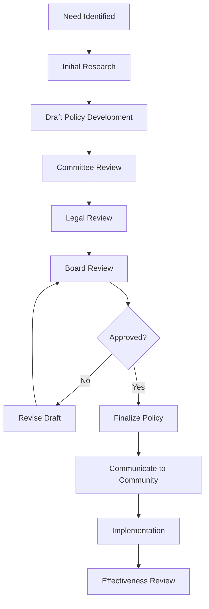
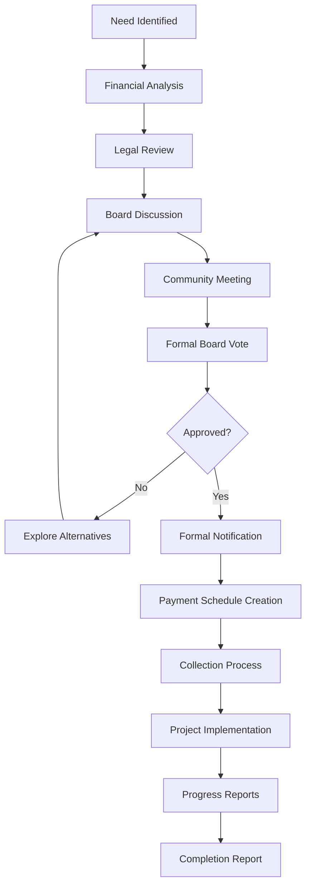

# Board Member User Guide

> **Last Updated:** April 7, 2025 | **App Version:** 0.5.0 | **Role:** BOARD_MEMBER

## Role Overview

As a **Board Member** at Lofts des Arts, you have specialized access to governance features of the platform. Your role focuses on financial oversight, policy decisions, strategic planning, and community leadership. The digital platform provides you with tools to effectively fulfill your fiduciary responsibilities while maintaining appropriate separation from day-to-day operations.

## Responsibilities

- Financial oversight and budget approval
- Policy development and revision
- Strategic planning and decision-making
- Community governance leadership
- Document review and approval
- Meeting participation and governance
- Committee oversight and coordination
- Special project leadership
- Resident communication on governance matters
- Compliance monitoring and enforcement

## Dashboard Overview

Your dashboard provides a governance-focused view of the condominium:

- **Financial Summary**: Key financial metrics and budget status
- **Policy Updates**: Recent and pending policy changes
- **Meeting Schedule**: Upcoming board and committee meetings
- **Document Approvals**: Items awaiting board review or approval
- **Resident Communications**: Recent communications with the community
- **Project Status**: Overview of board-approved projects
- **Compliance Tracking**: Status of regulatory compliance items

## Available Features

### Financial Oversight

- **Budget Dashboard**: Review current financial performance
- **Financial Reports**: Access to monthly and annual financial statements
- **Budget Planning**: Tools for annual budget development
- **Expenditure Review**: Oversight of major expenditures
- **Reserve Fund Monitoring**: Status of reserve funds and investments

### Governance Tools

- **Policy Management**: Review and approve community policies
- **Resolution Tracking**: Monitor implementation of board resolutions
- **Board Meeting Tools**: Agenda building and minute management
- **Voting System**: Electronic voting for board decisions
- **Term Tracking**: Monitor board position terms and elections

### Document Management

- **Governance Library**: Access to governing documents and records
- **Document Approval**: Review and approve official documents
- **Committee Records**: Access to committee minutes and reports
- **Legal Repository**: Access to legal opinions and correspondence
- **Historical Archives**: Review of past board actions and decisions

### Communication Features

- **Board Announcements**: Create formal board communications
- **Resident Messages**: Receive and respond to governance inquiries
- **Committee Coordination**: Communicate with committee chairs
- **Management Direction**: Provide guidance to property management
- **Annual Meeting**: Tools for annual meeting preparation

### Project Oversight

- **Project Dashboard**: Status of board-approved projects
- **Contractor Selection**: Review vendor proposals and contracts
- **Timeline Monitoring**: Track project milestones and deadlines
- **Budget Oversight**: Monitor project spending against budget
- **Quality Assurance**: Review project outcomes and deliverables

## Common Tasks

### Financial Responsibilities

1. **Reviewing Monthly Financial Reports**:
   - Navigate to `Governance > Financial Reports`
   - Select the month to review
   - Examine income and expense statements
   - Compare actuals to budget
   - Review cash flow and balance sheet
   - Note any questions for treasurer or management
   - Document concerns for board discussion

2. **Budget Planning Participation**:
   - Navigate to `Governance > Budget Planning`
   - Review historical financial data
   - Examine proposed budget allocations
   - Add comments and suggestions
   - Participate in budget discussion thread
   - Vote on preliminary and final budget approvals
   - Monitor budget implementation

3. **Reserve Fund Review**:
   - Navigate to `Governance > Reserve Fund`
   - Review current reserve balance and allocations
   - Examine recent reserve expenditures
   - Review reserve study recommendations
   - Compare funding levels to recommended targets
   - Participate in funding level discussions
   - Vote on reserve fund actions

### Governance Activities

1. **Preparing for Board Meetings**:
   - Navigate to `Meetings > Board Meetings`
   - Review upcoming meeting agenda
   - Access related documents and materials
   - Submit agenda items or modifications
   - Review previous meeting minutes
   - Prepare discussion points on agenda items
   - Set attendance status and participation method

2. **Policy Review and Approval**:
   - Navigate to `Governance > Policies`
   - Review policies pending board approval
   - Examine policy history and previous versions
   - Add comments and suggested revisions
   - Discuss policy implications with other board members
   - Vote on policy approval
   - Monitor policy implementation and effectiveness

3. **Committee Oversight**:
   - Navigate to `Governance > Committees`
   - Review committee membership and leadership
   - Examine committee meeting minutes and reports
   - Provide guidance on committee initiatives
   - Approve committee recommendations
   - Participate in assigned committee activities
   - Evaluate committee effectiveness

### Communication Tasks

1. **Responding to Resident Governance Inquiries**:
   - Navigate to `Communications > Resident Messages`
   - Review governance-related inquiries
   - Consult relevant policies or documents
   - Coordinate response with board president if needed
   - Provide clear, policy-based responses
   - Document significant resident concerns for board discussion
   - Maintain appropriate confidentiality

2. **Creating Board Communications**:
   - Navigate to `Communications > Board Announcements`
   - Select announcement type (resolution, policy update, etc.)
   - Draft announcement content
   - Obtain necessary approvals from board president
   - Set publication date and distribution method
   - Monitor resident feedback and questions
   - Prepare follow-up communications if needed

## Governance Workflows

### Policy Development Process

### Special Assessment Process

## Troubleshooting

### Common Issues

| Issue | Resolution |
|-------|------------|
| **Meeting access problems** | Verify meeting link, check calendar invitation, contact board secretary |
| **Document access issues** | Confirm permissions, verify document is published, contact administrator |
| **Voting system difficulties** | Check email for voting links, verify account status, contact board secretary |
| **Financial report questions** | Contact treasurer or property manager for clarification |
| **Communication delivery concerns** | Verify recipient list, check announcement settings, confirm with management |

## Best Practices

- **Preparation**: Review all meeting materials before board meetings
- **Confidentiality**: Maintain appropriate confidentiality of sensitive matters
- **Objectivity**: Base decisions on the best interests of the entire community
- **Participation**: Attend all board meetings and participate actively
- **Delegation**: Respect the role of committees and management
- **Consistency**: Apply rules and policies consistently
- **Transparency**: Support clear communication with the community
- **Financial Discipline**: Maintain strict oversight of financial matters
- **Education**: Stay informed about condominium governance best practices
- **Boundaries**: Respect the distinction between governance and management

## Important Contacts

- **Board President**: president@loftsdesarts.com or ext. 300
- **Board Secretary**: secretary@loftsdesarts.com or ext. 301
- **Board Treasurer**: treasurer@loftsdesarts.com or ext. 302
- **Property Manager**: manager@loftsdesarts.com or ext. 303
- **Legal Counsel**: legal@loftsdesarts.com or ext. 304
- **Administrative Support**: admin@loftsdesarts.com or ext. 305

## Resources

- [Condominium Bylaws](../../documents/governance/bylaws.md)
- [Condominium Declaration](../../documents/governance/declaration.md)
- [Rules and Regulations](../../documents/governance/rules.md)
- [Board Member Handbook](../../documents/governance/handbook.md)
- [Committee Charters](../../documents/governance/committees.md)
- [Condominium Act Summary](../../documents/governance/condo-act.md)

## Board Training

- **New Member Orientation**: Available on-demand in the Learning Center
- **Financial Literacy**: Online modules for board financial responsibilities
- **Legal Responsibilities**: Training on fiduciary duties and liability
- **Effective Meetings**: Guidelines for productive board discussions
- **Strategic Planning**: Resources for long-term community planning

## Support Channels

If you encounter issues requiring assistance:
- **Governance Support**: Contact Board President or Secretary
- **Technical Issues**: Contact Administrative Support
- **Legal Questions**: Consult Legal Counsel through proper channels
- **Financial Clarifications**: Contact Board Treasurer 