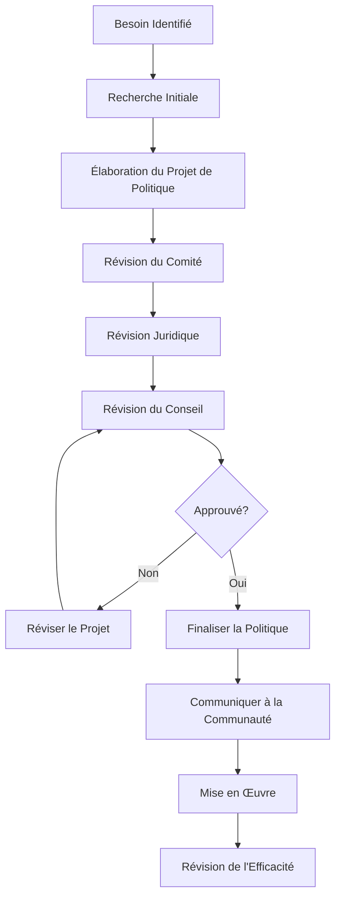
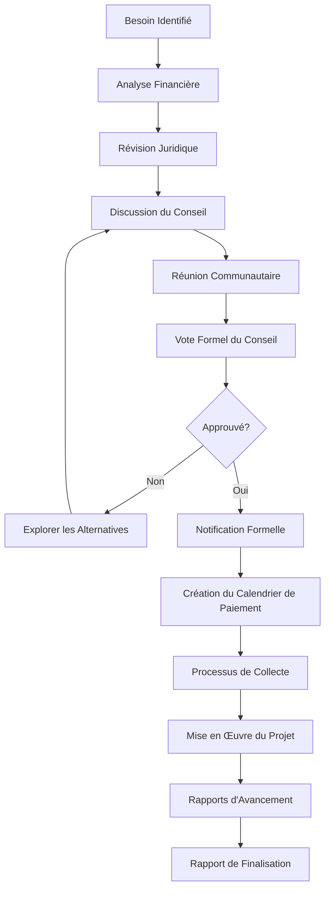

# Guide de l'Utilisateur Membre du Conseil

> **Dernière mise à jour :** 7 avril 2025 | **Version de l'Application :** 0.5.0 | **Rôle :** BOARD_MEMBER

## Aperçu du Rôle

En tant que **Membre du Conseil** à Lofts des Arts, vous disposez d'un accès spécialisé aux fonctionnalités de gouvernance de la plateforme. Votre rôle se concentre sur la surveillance financière, les décisions de politique, la planification stratégique et le leadership communautaire. La plateforme numérique vous fournit des outils pour remplir efficacement vos responsabilités fiduciaires tout en maintenant une séparation appropriée des opérations quotidiennes.

## Responsabilités

- Surveillance financière et approbation du budget
- Élaboration et révision des politiques
- Planification stratégique et prise de décision
- Leadership en matière de gouvernance communautaire
- Révision et approbation des documents
- Participation aux réunions et gouvernance
- Supervision et coordination des comités
- Direction de projets spéciaux
- Communication avec les résidents sur les questions de gouvernance
- Surveillance et application de la conformité

## Aperçu du Tableau de Bord

Votre tableau de bord fournit une vue axée sur la gouvernance de la copropriété :

- **Résumé Financier** : Indicateurs financiers clés et statut du budget
- **Mises à Jour des Politiques** : Changements récents et en attente des politiques
- **Calendrier des Réunions** : Réunions à venir du conseil et des comités
- **Approbations de Documents** : Éléments en attente de révision ou d'approbation par le conseil
- **Communications avec les Résidents** : Communications récentes avec la communauté
- **Statut des Projets** : Aperçu des projets approuvés par le conseil
- **Suivi de la Conformité** : Statut des éléments de conformité réglementaire

## Fonctionnalités Disponibles

### Surveillance Financière

- **Tableau de Bord Budgétaire** : Examiner la performance financière actuelle
- **Rapports Financiers** : Accès aux états financiers mensuels et annuels
- **Planification Budgétaire** : Outils pour le développement du budget annuel
- **Révision des Dépenses** : Supervision des dépenses majeures
- **Surveillance du Fonds de Réserve** : État des fonds de réserve et des investissements

### Outils de Gouvernance

- **Gestion des Politiques** : Réviser et approuver les politiques communautaires
- **Suivi des Résolutions** : Surveiller la mise en œuvre des résolutions du conseil
- **Outils de Réunion du Conseil** : Élaboration de l'ordre du jour et gestion des procès-verbaux
- **Système de Vote** : Vote électronique pour les décisions du conseil
- **Suivi des Mandats** : Surveiller les mandats des postes du conseil et les élections

### Gestion des Documents

- **Bibliothèque de Gouvernance** : Accès aux documents et registres de gouvernance
- **Approbation des Documents** : Réviser et approuver les documents officiels
- **Registres des Comités** : Accès aux procès-verbaux et rapports des comités
- **Dépôt Juridique** : Accès aux avis juridiques et à la correspondance
- **Archives Historiques** : Examen des actions et décisions passées du conseil

### Fonctionnalités de Communication

- **Annonces du Conseil** : Créer des communications formelles du conseil
- **Messages des Résidents** : Recevoir et répondre aux demandes de gouvernance
- **Coordination des Comités** : Communiquer avec les présidents des comités
- **Direction de la Gestion** : Fournir des orientations à la gestion immobilière
- **Assemblée Annuelle** : Outils pour la préparation de l'assemblée annuelle

### Supervision des Projets

- **Tableau de Bord des Projets** : Statut des projets approuvés par le conseil
- **Sélection des Entrepreneurs** : Examiner les propositions et contrats des fournisseurs
- **Suivi des Échéanciers** : Suivre les jalons et délais des projets
- **Surveillance Budgétaire** : Surveiller les dépenses des projets par rapport au budget
- **Assurance Qualité** : Examiner les résultats et livrables des projets

## Tâches Courantes

### Responsabilités Financières

1. **Examen des Rapports Financiers Mensuels** :
   - Naviguer vers `Gouvernance > Rapports Financiers`
   - Sélectionner le mois à examiner
   - Examiner les états des revenus et dépenses
   - Comparer les données réelles au budget
   - Examiner le flux de trésorerie et le bilan
   - Noter les questions pour le trésorier ou la direction
   - Documenter les préoccupations pour discussion au conseil

2. **Participation à la Planification Budgétaire** :
   - Naviguer vers `Gouvernance > Planification Budgétaire`
   - Examiner les données financières historiques
   - Examiner les allocations budgétaires proposées
   - Ajouter des commentaires et suggestions
   - Participer au fil de discussion sur le budget
   - Voter sur les approbations préliminaires et finales du budget
   - Surveiller la mise en œuvre du budget

3. **Examen du Fonds de Réserve** :
   - Naviguer vers `Gouvernance > Fonds de Réserve`
   - Examiner le solde actuel et les allocations de réserve
   - Examiner les dépenses récentes de réserve
   - Examiner les recommandations de l'étude de réserve
   - Comparer les niveaux de financement aux objectifs recommandés
   - Participer aux discussions sur le niveau de financement
   - Voter sur les actions du fonds de réserve

### Activités de Gouvernance

1. **Préparation aux Réunions du Conseil** :
   - Naviguer vers `Réunions > Réunions du Conseil`
   - Examiner l'ordre du jour de la prochaine réunion
   - Accéder aux documents et matériels connexes
   - Soumettre des points à l'ordre du jour ou des modifications
   - Examiner les procès-verbaux des réunions précédentes
   - Préparer des points de discussion sur les points à l'ordre du jour
   - Définir le statut de présence et la méthode de participation

2. **Révision et Approbation des Politiques** :
   - Naviguer vers `Gouvernance > Politiques`
   - Examiner les politiques en attente d'approbation du conseil
   - Examiner l'historique des politiques et les versions précédentes
   - Ajouter des commentaires et des révisions suggérées
   - Discuter des implications des politiques avec les autres membres du conseil
   - Voter sur l'approbation de la politique
   - Surveiller la mise en œuvre et l'efficacité de la politique

3. **Supervision des Comités** :
   - Naviguer vers `Gouvernance > Comités`
   - Examiner les membres et la direction des comités
   - Examiner les procès-verbaux et rapports des réunions des comités
   - Fournir des orientations sur les initiatives des comités
   - Approuver les recommandations des comités
   - Participer aux activités des comités assignés
   - Évaluer l'efficacité des comités

### Tâches de Communication

1. **Répondre aux Demandes de Gouvernance des Résidents** :
   - Naviguer vers `Communications > Messages des Résidents`
   - Examiner les demandes liées à la gouvernance
   - Consulter les politiques ou documents pertinents
   - Coordonner la réponse avec le président du conseil si nécessaire
   - Fournir des réponses claires, basées sur les politiques
   - Documenter les préoccupations importantes des résidents pour discussion au conseil
   - Maintenir une confidentialité appropriée

2. **Création de Communications du Conseil** :
   - Naviguer vers `Communications > Annonces du Conseil`
   - Sélectionner le type d'annonce (résolution, mise à jour de politique, etc.)
   - Rédiger le contenu de l'annonce
   - Obtenir les approbations nécessaires du président du conseil
   - Définir la date de publication et la méthode de distribution
   - Surveiller les commentaires et questions des résidents
   - Préparer des communications de suivi si nécessaire

## Flux de Travail de Gouvernance

### Processus de Développement des Politiques

### Processus d'Évaluation Spéciale

## Dépannage

### Problèmes Courants

| Problème | Résolution |
|-------|------------|
| **Problèmes d'accès aux réunions** | Vérifier le lien de la réunion, vérifier l'invitation du calendrier, contacter le secrétaire du conseil |
| **Problèmes d'accès aux documents** | Confirmer les permissions, vérifier que le document est publié, contacter l'administrateur |
| **Difficultés avec le système de vote** | Vérifier les liens de vote dans l'email, vérifier le statut du compte, contacter le secrétaire du conseil |
| **Questions sur les rapports financiers** | Contacter le trésorier ou le gestionnaire immobilier pour des clarifications |
| **Préoccupations de livraison des communications** | Vérifier la liste des destinataires, vérifier les paramètres d'annonce, confirmer avec la direction |

## Meilleures Pratiques

- **Préparation** : Examiner tous les documents de réunion avant les réunions du conseil
- **Confidentialité** : Maintenir une confidentialité appropriée des questions sensibles
- **Objectivité** : Baser les décisions sur les meilleurs intérêts de toute la communauté
- **Participation** : Assister à toutes les réunions du conseil et participer activement
- **Délégation** : Respecter le rôle des comités et de la direction
- **Cohérence** : Appliquer les règles et politiques de manière cohérente
- **Transparence** : Soutenir une communication claire avec la communauté
- **Discipline Financière** : Maintenir une surveillance stricte des questions financières
- **Éducation** : Rester informé des meilleures pratiques de gouvernance en copropriété
- **Limites** : Respecter la distinction entre gouvernance et gestion

## Contacts Importants

- **Président du Conseil** : president@loftsdesarts.com ou poste 300
- **Secrétaire du Conseil** : secretary@loftsdesarts.com ou poste 301
- **Trésorier du Conseil** : treasurer@loftsdesarts.com ou poste 302
- **Gestionnaire Immobilier** : manager@loftsdesarts.com ou poste 303
- **Conseiller Juridique** : legal@loftsdesarts.com ou poste 304
- **Support Administratif** : admin@loftsdesarts.com ou poste 305

## Ressources

- [Règlements de Copropriété](../../documents/governance/bylaws_FR.md)
- [Déclaration de Copropriété](../../documents/governance/declaration_FR.md)
- [Règles et Réglementations](../../documents/governance/rules_FR.md)
- [Manuel du Membre du Conseil](../../documents/governance/handbook_FR.md)
- [Chartes des Comités](../../documents/governance/committees_FR.md)
- [Résumé de la Loi sur les Copropriétés](../../documents/governance/condo-act_FR.md)

## Formation du Conseil

- **Orientation des Nouveaux Membres** : Disponible à la demande dans le Centre d'Apprentissage
- **Littératie Financière** : Modules en ligne pour les responsabilités financières du conseil
- **Responsabilités Juridiques** : Formation sur les devoirs fiduciaires et la responsabilité
- **Réunions Efficaces** : Directives pour des discussions productives au conseil
- **Planification Stratégique** : Ressources pour la planification à long terme de la communauté

## Canaux de Support

Si vous avez besoin d'aide dans l'exercice de vos fonctions de membre du conseil, plusieurs options de support sont disponibles :

- **Support Technique** : Pour les problèmes liés à la plateforme, contactez techsupport@loftsdesarts.com
- **Questions de Gouvernance** : Pour les questions de procédure, contactez le président ou le secrétaire du conseil
- **Questions Juridiques** : Pour les conseils juridiques, travaillez par l'intermédiaire du président pour contacter le conseiller juridique
- **Formation Supplémentaire** : Pour des ressources éducatives, visitez le Centre d'Apprentissage dans le portail du conseil

---

[English Version](./README.md) 