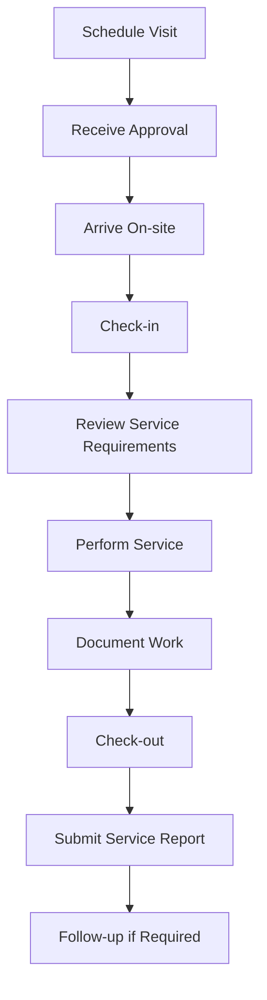
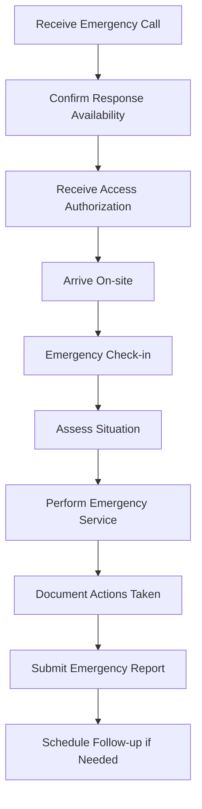

# Contractor User Guide

> **Last Updated:** April 5, 2025 | **Role:** CONTRACTOR

## Role Overview

As a **Contractor** at Lofts des Arts, you have limited access to specific service areas and documentation related to your contracted work. This role is designed for external service providers who need temporary access to building information, service areas, and limited communication with management and staff.

## Access Period

Your access to the Lofts des Arts platform is time-limited based on your service contract. Access is automatically granted at the start of your contract period and expires when your contract ends, unless extended by building management.

## Responsibilities

- Performing contracted services according to agreements
- Accessing relevant building information and documentation
- Communicating with building management about service delivery
- Documenting completed work and service records
- Submitting required reports and certifications
- Following building access and security protocols
- Adhering to Lofts des Arts contractor policies
- Maintaining confidentiality of building information
- Scheduling service visits through the platform
- Providing updates on project progress

## Dashboard Overview

Your contractor dashboard provides focused access to information relevant to your services:

- **Contract Details**: Summary of your service agreement and scope
- **Service Schedule**: Calendar of your scheduled service visits
- **Document Access**: Building documents related to your service area
- **Management Messages**: Communications from building management
- **Service Reports**: Forms for submitting service records
- **Building Access**: Building access instructions and protocols
- **Contact Information**: Key contacts for service coordination

## Available Features

### Project Information

- **Contract Details**: View your contract scope and requirements
- **Service Area Information**: Access details about your service areas
- **Building Specifications**: View technical specifications relevant to your work
- **Historical Service Records**: Review previous service history in your area
- **Project Timeline**: Track milestones and deadlines for your services

### Service Management

- **Visit Scheduling**: Schedule and manage your service visits
- **Service Reporting**: Submit reports on completed work
- **Progress Updates**: Provide updates on ongoing projects
- **Issue Documentation**: Report issues discovered during service
- **Material Tracking**: Document materials used for services

### Communication Tools

- **Management Messages**: Receive and send messages to building management
- **Staff Coordination**: Limited communication with relevant staff
- **Service Notifications**: Send notifications about service impacts
- **Access Requests**: Request special access when needed
- **Emergency Contacts**: Access key contacts for urgent situations

### Documentation Access

- **Service Manuals**: Access equipment manuals in your service area
- **Building Plans**: View relevant building plans and specifications
- **Safety Information**: Access building safety protocols
- **Compliance Documents**: Submit required compliance documentation
- **Service History**: View history of your company's previous services

## Common Tasks

### Service Visit Management

1. **Scheduling a Service Visit**:
   - Navigate to `Services > Schedule Visit`
   - Review available time slots
   - Select preferred date and time
   - Specify service purpose and requirements
   - Note any special access needs
   - Indicate expected duration
   - Submit for approval
   - Receive confirmation notification

2. **Checking in for a Service Visit**:
   - Use the mobile app when arriving on site
   - Navigate to `Services > Check-in`
   - Scan QR code at building entrance or use GPS verification
   - Review service details and safety information
   - Confirm check-in
   - Receive any last-minute instructions
   - Proceed to service location

3. **Submitting a Service Report**:
   - After completing service, navigate to `Services > Reports`
   - Select `New Service Report`
   - Complete all required fields
   - Document work performed in detail
   - Note any parts replaced or materials used
   - Take and attach photos of completed work
   - Include recommendations for future maintenance
   - Submit report to management
   - Retain confirmation number

### Documentation Management

1. **Accessing Service Documentation**:
   - Navigate to `Documents > Service Areas`
   - Select your relevant service area
   - Browse available documentation
   - Use search function for specific information
   - Download necessary files
   - Note any document restrictions
   - Reference document ID in service reports

2. **Submitting Required Certifications**:
   - Navigate to `Documents > Compliance`
   - Select `Upload Certification`
   - Choose certification type
   - Attach required documentation
   - Enter expiration dates if applicable
   - Add any explanatory notes
   - Submit for verification
   - Monitor approval status

### Communication

1. **Contacting Building Management**:
   - Navigate to `Communications > Management`
   - Select appropriate contact or department
   - Create new message with clear subject line
   - Specify project or service reference numbers
   - Compose detailed message
   - Attach any relevant files
   - Set priority level appropriately
   - Submit message
   - Monitor for response

2. **Providing Project Updates**:
   - Navigate to `Projects > Status Updates`
   - Select your active project
   - Create new update
   - Document current progress percentage
   - Note completed milestones
   - Identify any delays or issues
   - Provide revised timeline if needed
   - Request any needed management decisions
   - Submit update

## Service Workflows

### Standard Service Visit

### Emergency Service Response

## Building Access

### Access Protocols

1. **Standard Access Hours**:
   - Monday to Friday: 8:00 AM - 6:00 PM
   - Saturday: 9:00 AM - 3:00 PM
   - Sunday: No standard access (emergency only)

2. **Check-in Procedure**:
   - Report to front desk upon arrival
   - Present contractor ID and service confirmation
   - Sign in through contractor tablet
   - Receive temporary access credentials
   - Be escorted to service area if required
   - Follow all posted access restrictions

3. **After-Hours Access**:
   - Requires pre-approval from building management
   - Special access code will be provided
   - Security escort may be required
   - Limited to approved service areas only
   - Additional documentation required

## Troubleshooting

### Common Issues

| Issue | Resolution |
|-------|------------|
| **Platform access problems** | Verify contract dates, contact your company administrator, reach out to building management |
| **Document access issues** | Confirm you have permission for specific documents, request access through management |
| **Service area access** | Contact front desk for escort, verify access permissions in your profile |
| **Report submission errors** | Save draft before submitting, check for missing required fields, contact technical support |
| **Schedule conflicts** | Request schedule adjustment, provide alternative dates, contact service coordinator |

## Policies & Requirements

### Contractor Policies

- **Insurance Requirements**: Must maintain current liability insurance on file
- **Identification**: All contractor personnel must wear company ID and visitor badge
- **Conduct**: Professional conduct required at all times
- **Noise Restrictions**: Limit excessive noise between 8:00 AM - 5:00 PM
- **Parking**: Use designated contractor parking area only
- **Equipment**: Pre-approval required for large equipment
- **Cleaning**: Work areas must be cleaned daily
- **Waste Disposal**: Use designated contractor waste disposal areas
- **Security**: Never prop open doors or bypass security systems
- **Resident Interaction**: Direct resident requests to building management

### Safety Requirements

- **Emergency Procedures**: Familiarize yourself with building emergency exits
- **PPE**: Appropriate personal protective equipment required at all times
- **Permits**: Obtain necessary work permits before beginning service
- **Hazardous Materials**: Pre-approval required for all hazardous materials
- **Hot Work**: Specific authorization required for any hot work
- **Incident Reporting**: Report all accidents or incidents immediately
- **Safety Barriers**: Use appropriate barriers around work areas
- **Elevators**: Service elevator must be used for all equipment and materials

## Important Contacts

- **Service Coordinator**: coordinator@loftsdesarts.com or ext. 500
- **Building Manager**: manager@loftsdesarts.com or ext. 501
- **Security Desk**: security@loftsdesarts.com or ext. 502
- **Emergency Services**: 911 or building security at ext. 503
- **Technical Support**: techsupport@loftsdesarts.com or ext. 504

## Resources

- [Contractor Policy Manual](../../documents/contractors/policies.md)
- [Building Access Guide](../../documents/contractors/access.md)
- [Service Area Maps](../../documents/contractors/maps.md)
- [Safety Protocols](../../documents/contractors/safety.md)
- [Service Reporting Guidelines](../../documents/contractors/reporting.md)
- [Equipment Specifications](../../documents/contractors/equipment.md)

## Account Management

- **Account Duration**: Matches your contract term
- **Access Review**: Periodic review of system access
- **Credential Updates**: Update certifications before expiration
- **User Management**: Your company admin can add/remove team members
- **Data Retention**: Your service records remain in the system after your access ends

## Support Channels

If you encounter issues requiring assistance:
- **Service Coordination**: Contact the Service Coordinator
- **Access Issues**: Contact the Security Desk
- **Technical Problems**: Contact Technical Support
- **Contract Questions**: Contact your company administrator
- **Emergency Assistance**: Contact building security 