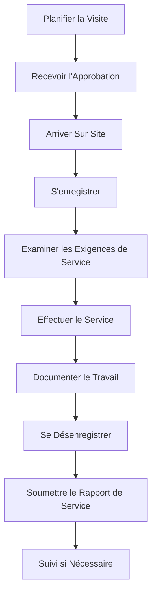
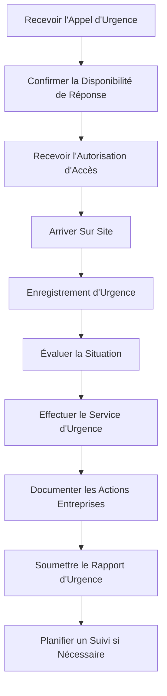

# Guide de l'Utilisateur Prestataire

> **Dernière mise à jour :** 7 avril 2025 | **Version de l'Application :** 0.5.0 | **Rôle :** CONTRACTOR

## Aperçu du Rôle

En tant que **Prestataire** à Lofts des Arts, vous avez un accès limité à des zones de service spécifiques et à la documentation liée à votre travail contractuel. Ce rôle est conçu pour les fournisseurs de services externes qui ont besoin d'un accès temporaire aux informations du bâtiment, aux zones de service et à une communication limitée avec la direction et le personnel.

## Période d'Accès

Votre accès à la plateforme Lofts des Arts est limité dans le temps en fonction de votre contrat de service. L'accès est automatiquement accordé au début de votre période de contrat et expire à la fin de votre contrat, sauf prolongation par la direction du bâtiment.

## Responsabilités

- Exécuter les services contractuels conformément aux accords
- Accéder aux informations et à la documentation pertinentes du bâtiment
- Communiquer avec la direction du bâtiment concernant la prestation de services
- Documenter les travaux réalisés et les registres de service
- Soumettre les rapports et certifications requis
- Respecter les protocoles d'accès et de sécurité du bâtiment
- Adhérer aux politiques des prestataires de Lofts des Arts
- Maintenir la confidentialité des informations du bâtiment
- Planifier les visites de service via la plateforme
- Fournir des mises à jour sur l'avancement du projet

## Aperçu du Tableau de Bord

Votre tableau de bord de prestataire offre un accès ciblé aux informations pertinentes pour vos services :

- **Détails du Contrat** : Résumé de votre contrat de service et de sa portée
- **Calendrier de Service** : Calendrier de vos visites de service programmées
- **Accès aux Documents** : Documents du bâtiment liés à votre domaine de service
- **Messages de la Direction** : Communications de la direction du bâtiment
- **Rapports de Service** : Formulaires pour soumettre les registres de service
- **Accès au Bâtiment** : Instructions et protocoles d'accès au bâtiment
- **Coordonnées** : Contacts clés pour la coordination des services

## Fonctionnalités Disponibles

### Informations sur le Projet

- **Détails du Contrat** : Consulter la portée et les exigences de votre contrat
- **Informations sur la Zone de Service** : Accéder aux détails concernant vos zones de service
- **Spécifications du Bâtiment** : Consulter les spécifications techniques pertinentes pour votre travail
- **Historique des Services** : Examiner l'historique des services précédents dans votre domaine
- **Calendrier du Projet** : Suivre les jalons et les échéances pour vos services

### Gestion des Services

- **Planification des Visites** : Planifier et gérer vos visites de service
- **Rapports de Service** : Soumettre des rapports sur les travaux effectués
- **Mises à Jour de Progression** : Fournir des mises à jour sur les projets en cours
- **Documentation des Problèmes** : Signaler les problèmes découverts pendant le service
- **Suivi du Matériel** : Documenter les matériaux utilisés pour les services

### Outils de Communication

- **Messages de la Direction** : Recevoir et envoyer des messages à la direction du bâtiment
- **Coordination avec le Personnel** : Communication limitée avec le personnel concerné
- **Notifications de Service** : Envoyer des notifications concernant les impacts des services
- **Demandes d'Accès** : Demander un accès spécial lorsque nécessaire
- **Contacts d'Urgence** : Accéder aux contacts clés pour les situations urgentes

### Accès à la Documentation

- **Manuels de Service** : Accéder aux manuels d'équipement dans votre zone de service
- **Plans du Bâtiment** : Consulter les plans et spécifications pertinents du bâtiment
- **Informations de Sécurité** : Accéder aux protocoles de sécurité du bâtiment
- **Documents de Conformité** : Soumettre la documentation de conformité requise
- **Historique de Service** : Consulter l'historique des services précédents de votre entreprise

## Tâches Courantes

### Gestion des Visites de Service

1. **Planifier une Visite de Service** :
   - Naviguer vers `Services > Planifier une Visite`
   - Examiner les créneaux horaires disponibles
   - Sélectionner la date et l'heure préférées
   - Préciser l'objectif et les exigences du service
   - Noter tout besoin d'accès spécial
   - Indiquer la durée prévue
   - Soumettre pour approbation
   - Recevoir une notification de confirmation

2. **Enregistrement pour une Visite de Service** :
   - Utiliser l'application mobile à l'arrivée sur site
   - Naviguer vers `Services > Enregistrement`
   - Scanner le code QR à l'entrée du bâtiment ou utiliser la vérification GPS
   - Examiner les détails du service et les informations de sécurité
   - Confirmer l'enregistrement
   - Recevoir les instructions de dernière minute
   - Se rendre à l'emplacement du service

3. **Soumettre un Rapport de Service** :
   - Après avoir terminé le service, naviguer vers `Services > Rapports`
   - Sélectionner `Nouveau Rapport de Service`
   - Remplir tous les champs obligatoires
   - Documenter en détail les travaux effectués
   - Noter les pièces remplacées ou les matériaux utilisés
   - Prendre et joindre des photos des travaux terminés
   - Inclure des recommandations pour l'entretien futur
   - Soumettre le rapport à la direction
   - Conserver le numéro de confirmation

### Gestion de la Documentation

1. **Accéder à la Documentation de Service** :
   - Naviguer vers `Documents > Zones de Service`
   - Sélectionner votre zone de service pertinente
   - Parcourir la documentation disponible
   - Utiliser la fonction de recherche pour des informations spécifiques
   - Télécharger les fichiers nécessaires
   - Noter toute restriction de document
   - Faire référence à l'ID du document dans les rapports de service

2. **Soumettre les Certifications Requises** :
   - Naviguer vers `Documents > Conformité`
   - Sélectionner `Télécharger une Certification`
   - Choisir le type de certification
   - Joindre la documentation requise
   - Saisir les dates d'expiration si applicable
   - Ajouter des notes explicatives
   - Soumettre pour vérification
   - Surveiller l'état d'approbation

### Communication

1. **Contacter la Direction du Bâtiment** :
   - Naviguer vers `Communications > Direction`
   - Sélectionner le contact ou le département approprié
   - Créer un nouveau message avec un objet clair
   - Spécifier les numéros de référence du projet ou du service
   - Rédiger un message détaillé
   - Joindre des fichiers pertinents
   - Définir le niveau de priorité de manière appropriée
   - Soumettre le message
   - Surveiller la réponse

2. **Fournir des Mises à Jour du Projet** :
   - Naviguer vers `Projets > Mises à Jour de Statut`
   - Sélectionner votre projet actif
   - Créer une nouvelle mise à jour
   - Documenter le pourcentage d'avancement actuel
   - Noter les jalons achevés
   - Identifier les retards ou problèmes éventuels
   - Fournir un calendrier révisé si nécessaire
   - Demander les décisions de gestion nécessaires
   - Soumettre la mise à jour

## Flux de Travail de Service

### Visite de Service Standard

### Réponse de Service d'Urgence

## Accès au Bâtiment

### Protocoles d'Accès

1. **Heures d'Accès Standard** :
   - Lundi au vendredi : 8h00 - 18h00
   - Samedi : 9h00 - 15h00
   - Dimanche : Pas d'accès standard (urgence uniquement)

2. **Procédure d'Enregistrement** :
   - Se présenter à la réception à l'arrivée
   - Présenter la carte d'identité du prestataire et la confirmation de service
   - S'enregistrer via la tablette des prestataires
   - Recevoir des identifiants d'accès temporaires
   - Être escorté jusqu'à la zone de service si nécessaire
   - Respecter toutes les restrictions d'accès affichées

3. **Accès en Dehors des Heures Ouvrables** :
   - Nécessite une approbation préalable de la direction du bâtiment
   - Un code d'accès spécial sera fourni
   - Une escorte de sécurité peut être requise
   - Limité uniquement aux zones de service approuvées
   - Documentation supplémentaire requise

## Dépannage

### Problèmes Courants

| Problème | Résolution |
|-------|------------|
| **Problèmes d'accès à la plateforme** | Vérifier les dates du contrat, contacter l'administrateur de votre entreprise, contacter la direction du bâtiment |
| **Problèmes d'accès aux documents** | Confirmer que vous avez l'autorisation pour des documents spécifiques, demander l'accès via la direction |
| **Accès à la zone de service** | Contacter la réception pour une escorte, vérifier les autorisations d'accès dans votre profil |
| **Erreurs de soumission de rapport** | Enregistrer le brouillon avant de soumettre, vérifier les champs obligatoires manquants, contacter le support technique |
| **Conflits d'horaires** | Demander un ajustement d'horaire, fournir des dates alternatives, contacter le coordinateur de service |

## Politiques et Exigences

### Politiques des Prestataires

- **Exigences d'Assurance** : Doit maintenir une assurance responsabilité civile à jour dans le dossier
- **Identification** : Tout le personnel prestataire doit porter une carte d'identité de l'entreprise et un badge visiteur
- **Conduite** : Une conduite professionnelle est exigée en tout temps
- **Restrictions Sonores** : Limiter le bruit excessif entre 8h00 et 17h00
- **Stationnement** : Utiliser uniquement la zone de stationnement désignée pour les prestataires
- **Équipement** : Approbation préalable requise pour les gros équipements
- **Nettoyage** : Les zones de travail doivent être nettoyées quotidiennement
- **Élimination des Déchets** : Utiliser les zones d'élimination des déchets désignées pour les prestataires
- **Sécurité** : Ne jamais caler les portes ouvertes ou contourner les systèmes de sécurité
- **Interaction avec les Résidents** : Diriger les demandes des résidents vers la direction du bâtiment

### Exigences de Sécurité

- **Procédures d'Urgence** : Se familiariser avec les sorties de secours du bâtiment
- **EPI** : Équipement de protection individuelle approprié requis en tout temps
- **Permis** : Obtenir les permis de travail nécessaires avant de commencer le service
- **Matières Dangereuses** : Approbation préalable requise pour toutes les matières dangereuses
- **Travail à Chaud** : Autorisation spécifique requise pour tout travail à chaud
- **Signalement d'Incidents** : Signaler immédiatement tous les accidents ou incidents
- **Barrières de Sécurité** : Utiliser des barrières appropriées autour des zones de travail
- **Ascenseurs** : L'ascenseur de service doit être utilisé pour tous les équipements et matériaux

## Contacts Importants

- **Coordinateur de Service** : coordinator@loftsdesarts.com ou poste 500
- **Gestionnaire d'Immeuble** : manager@loftsdesarts.com ou poste 501
- **Sécurité** : security@loftsdesarts.com ou poste 502
- **Urgences** : emergencies@loftsdesarts.com ou poste 503
- **Support Technique** : tech-support@loftsdesarts.com ou poste 504

## Ressources et Support

- **Portail des Prestataires** : [contractor.loftsdesarts.com](https://contractor.loftsdesarts.com)
- **FAQ des Prestataires** : Consultez la section d'aide du portail des prestataires
- **Documentation Technique** : Disponible dans la section Documents de votre tableau de bord
- **Formation des Prestataires** : Sessions de formation disponibles sur demande

---

[English Version](./README.md) 