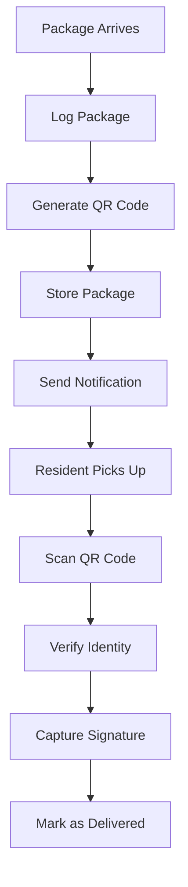
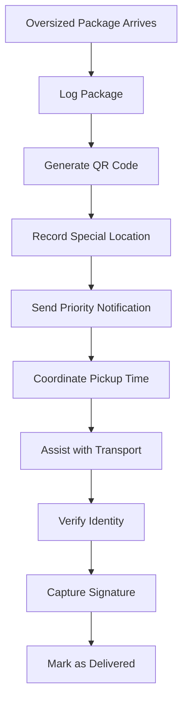

# Doorman User Guide

> **Last Updated:** April 7, 2025 | **App Version:** 0.5.0 | **Role:** DOORMAN

## Role Overview

As a **Doorman** at Lofts des Arts, you are responsible for managing the reception desk, handling package deliveries, managing visitor access, and serving as the first point of contact for residents and visitors. This guide provides information on using the system features relevant to your role.

## Responsibilities

- Receiving and logging packages for residents
- Notifying residents about package arrivals
- Managing package pickup and verification
- Recording visitor information
- Providing building information to visitors
- Handling general inquiries
- Monitoring lobby security
- Supporting resident requests at the front desk

## Dashboard Overview

Your dashboard is designed to provide quick access to the tools you need most frequently:

- **Package Management**: Overview of recently arrived packages and pending pickups
- **Visitor Log**: Current visitors in the building and recent check-ins
- **Resident Directory**: Quick access to resident contact information
- **Announcements**: Important building notifications and updates
- **Task List**: Your assigned tasks and their status

## Available Features

### Package Management

- **Package Logging**: Record new package arrivals
- **QR Code Generation**: Create unique QR codes for package tracking
- **Resident Notifications**: Send automated alerts when packages arrive
- **Pickup Management**: Process and verify package pickups
- **Package History**: View historical package data and status
- **Package Analytics**: Basic package volume reporting

### Visitor Management

- **Visitor Check-In**: Record visitor information and destination
- **Resident Verification**: Confirm visitor authorization with residents
- **Visitor Badges**: Generate temporary visitor badges
- **Expected Visitors**: View list of pre-authorized visitors
- **Visitor History**: Access records of past visitors

### Communication

- **Resident Messaging**: Send direct messages to residents
- **Staff Communication**: Chat with other staff members
- **Emergency Contacts**: Quick access to emergency service contacts
- **Announcement Viewing**: Read building-wide announcements

### Building Information

- **Building Directory**: Access resident unit information
- **Building Map**: View building layout and amenities
- **Event Calendar**: See scheduled building events
- **Service Requests**: View status of maintenance requests

## Common Tasks

### Package Management

1. **Logging a New Package**:
   - Click `Packages > Log New Package`
   - Scan or enter the tracking number
   - Select the resident recipient
   - Choose the package size and type
   - Take a photo of the package (optional)
   - Specify storage location
   - Click `Submit` to generate QR code and notification

2. **Processing a Package Pickup**:
   - Click `Packages > Process Pickup`
   - Scan the package QR code
   - Verify resident identity
   - Capture resident signature
   - Click `Complete Pickup`
   - Package status will update automatically

3. **Managing Package Notifications**:
   - For packages not picked up within 3 days:
     - System automatically sends reminder notification
   - For high-priority packages:
     - Click `Packages > Send Priority Alert`
     - Select the package(s)
     - Click `Send Reminder`

### Visitor Management

1. **Checking in a Visitor**:
   - Click `Visitors > New Check-In`
   - Enter visitor name and contact information
   - Select the resident being visited
   - Take visitor photo
   - Issue visitor badge
   - Record check-in time

2. **Managing Expected Visitors**:
   - Click `Visitors > Expected Today`
   - Review list of pre-authorized visitors
   - Use quick check-in for expected visitors
   - Contact residents for unexpected visitors

3. **Checking Out Visitors**:
   - Click `Visitors > Active Visitors`
   - Find the visitor in the list
   - Click `Check Out`
   - Record check-out time
   - Collect visitor badge

## Package System Workflows

### Regular Package Workflow

### Oversized Package Workflow

## Troubleshooting

### Common Issues

| Issue | Resolution |
|-------|------------|
| **Package scanning failure** | Clean scanner, manually enter tracking number, restart scanner app |
| **Resident not found in system** | Check alternate spellings, search by unit number, contact management |
| **Unable to send notification** | Use alternative contact method, check resident profile for updated info |
| **QR code not printing** | Check printer connection, reload paper, restart printing service |
| **Signature capture issues** | Clean signature pad, reset the device, use paper backup |

### Package Status Issues

| Status | What It Means | How to Resolve |
|--------|---------------|----------------|
| **Pending** | Package logged but notification not sent | Manually send notification or check notification settings |
| **Notified** | Resident alerted, awaiting pickup | No action needed unless over 7 days old |
| **Attempted Pickup** | Resident tried to pick up but issue occurred | Review notes, resolve verification issues |
| **Delivered** | Successfully picked up by resident | No action needed - completed |
| **Returned** | Package returned to sender | Document reason for return, notify resident |
| **Missing** | Package cannot be located | Initiate search protocol, check all storage areas |

## Best Practices

- **Package Processing**: Log packages immediately upon arrival
- **Storage Organization**: Store packages by size and anticipated pickup time
- **ID Verification**: Always verify resident identity before releasing packages
- **Communication**: Maintain clear communication with residents about packages
- **Security**: Never release packages to unauthorized individuals
- **Documentation**: Document any package irregularities or special handling
- **Efficiency**: Process pickups quickly during busy periods
- **Prioritization**: Prioritize perishable or urgent packages

## Important Contacts

- **Building Manager**: Ext. 101 or manager@loftsdesarts.com
- **Maintenance Supervisor**: Ext. 102 or maintenance@loftsdesarts.com
- **Security Office**: Ext. 103 or security@loftsdesarts.com
- **IT Support**: Ext. 104 or it-support@loftsdesarts.com
- **Emergency Services**: 911

## Training Resources

- [Package System Video Tutorial](../../features/package-management/video-tutorials.md)
- [Visitor Management Training Guide](../../features/visitor-management/training.md)
- [Emergency Procedures Handbook](../../security/emergency-procedures.md)
- [Customer Service Best Practices](../../common/customer-service.md)

## Support Channels

If you encounter issues not covered in this guide:
- **Help Desk**: Ext. 105 or help@loftsdesarts.com
- **Technical Support**: IT Support Portal (available on staff computers)
- **Supervisor Assistance**: Contact the building manager directly 