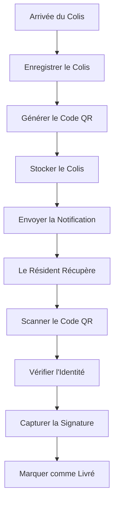
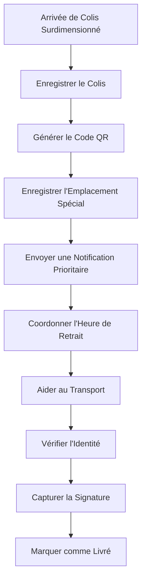

# Guide de l'Utilisateur Portier

> **Dernière mise à jour :** 7 avril 2025 | **Version de l'Application :** 0.5.0 | **Rôle :** DOORMAN

## Aperçu du Rôle

En tant que **Portier** à Lofts des Arts, vous êtes responsable de la gestion de la réception, de la manutention des livraisons de colis, de la gestion de l'accès des visiteurs et vous servez de premier point de contact pour les résidents et les visiteurs. Ce guide fournit des informations sur l'utilisation des fonctionnalités du système pertinentes à votre rôle.

## Responsabilités

- Recevoir et enregistrer les colis pour les résidents
- Notifier les résidents de l'arrivée des colis
- Gérer le retrait et la vérification des colis
- Enregistrer les informations des visiteurs
- Fournir des informations sur le bâtiment aux visiteurs
- Gérer les demandes générales
- Surveiller la sécurité du hall
- Répondre aux demandes des résidents à la réception

## Aperçu du Tableau de Bord

Votre tableau de bord est conçu pour fournir un accès rapide aux outils que vous utilisez le plus fréquemment :

- **Gestion des Colis** : Aperçu des colis récemment arrivés et des retraits en attente
- **Registre des Visiteurs** : Visiteurs actuellement dans le bâtiment et enregistrements récents
- **Répertoire des Résidents** : Accès rapide aux informations de contact des résidents
- **Annonces** : Notifications et mises à jour importantes du bâtiment
- **Liste des Tâches** : Vos tâches assignées et leur statut

## Fonctionnalités Disponibles

### Gestion des Colis

- **Enregistrement des Colis** : Enregistrer les nouvelles arrivées de colis
- **Génération de Code QR** : Créer des codes QR uniques pour le suivi des colis
- **Notifications aux Résidents** : Envoyer des alertes automatisées lorsque des colis arrivent
- **Gestion des Retraits** : Traiter et vérifier les retraits de colis
- **Historique des Colis** : Consulter les données historiques et le statut des colis
- **Analyse des Colis** : Rapports de base sur le volume de colis

### Gestion des Visiteurs

- **Enregistrement des Visiteurs** : Enregistrer les informations des visiteurs et leur destination
- **Vérification auprès des Résidents** : Confirmer l'autorisation des visiteurs auprès des résidents
- **Badges Visiteurs** : Générer des badges temporaires pour visiteurs
- **Visiteurs Attendus** : Consulter la liste des visiteurs pré-autorisés
- **Historique des Visiteurs** : Accéder aux registres des visiteurs passés

### Communication

- **Messagerie avec les Résidents** : Envoyer des messages directs aux résidents
- **Communication avec le Personnel** : Discuter avec les autres membres du personnel
- **Contacts d'Urgence** : Accès rapide aux contacts des services d'urgence
- **Consultation des Annonces** : Lire les annonces à l'échelle du bâtiment

### Informations sur le Bâtiment

- **Répertoire du Bâtiment** : Accéder aux informations des unités des résidents
- **Plan du Bâtiment** : Consulter l'agencement du bâtiment et ses commodités
- **Calendrier des Événements** : Voir les événements programmés du bâtiment
- **Demandes de Service** : Consulter le statut des demandes de maintenance

## Tâches Courantes

### Gestion des Colis

1. **Enregistrer un Nouveau Colis** :
   - Cliquer sur `Colis > Enregistrer un Nouveau Colis`
   - Scanner ou saisir le numéro de suivi
   - Sélectionner le résident destinataire
   - Choisir la taille et le type de colis
   - Prendre une photo du colis (optionnel)
   - Spécifier l'emplacement de stockage
   - Cliquer sur `Soumettre` pour générer le code QR et la notification

2. **Traiter un Retrait de Colis** :
   - Cliquer sur `Colis > Traiter un Retrait`
   - Scanner le code QR du colis
   - Vérifier l'identité du résident
   - Capturer la signature du résident
   - Cliquer sur `Compléter le Retrait`
   - Le statut du colis sera mis à jour automatiquement

3. **Gérer les Notifications de Colis** :
   - Pour les colis non récupérés dans les 3 jours :
     - Le système envoie automatiquement une notification de rappel
   - Pour les colis hautement prioritaires :
     - Cliquer sur `Colis > Envoyer une Alerte Prioritaire`
     - Sélectionner le(s) colis
     - Cliquer sur `Envoyer un Rappel`

### Gestion des Visiteurs

1. **Enregistrer un Visiteur** :
   - Cliquer sur `Visiteurs > Nouvel Enregistrement`
   - Saisir le nom et les coordonnées du visiteur
   - Sélectionner le résident visité
   - Prendre une photo du visiteur
   - Émettre un badge visiteur
   - Enregistrer l'heure d'arrivée

2. **Gérer les Visiteurs Attendus** :
   - Cliquer sur `Visiteurs > Attendus Aujourd'hui`
   - Consulter la liste des visiteurs pré-autorisés
   - Utiliser l'enregistrement rapide pour les visiteurs attendus
   - Contacter les résidents pour les visiteurs inattendus

3. **Enregistrer le Départ des Visiteurs** :
   - Cliquer sur `Visiteurs > Visiteurs Actifs`
   - Trouver le visiteur dans la liste
   - Cliquer sur `Enregistrer le Départ`
   - Enregistrer l'heure de départ
   - Récupérer le badge visiteur

## Flux de Travail du Système de Colis

### Flux de Travail de Colis Régulier

### Flux de Travail de Colis Surdimensionné

## Dépannage

### Problèmes Courants

| Problème | Résolution |
|-------|------------|
| **Échec de numérisation de colis** | Nettoyer le scanner, saisir manuellement le numéro de suivi, redémarrer l'application du scanner |
| **Résident introuvable dans le système** | Vérifier les orthographes alternatives, rechercher par numéro d'unité, contacter la direction |
| **Impossible d'envoyer une notification** | Utiliser une méthode de contact alternative, vérifier le profil du résident pour les informations mises à jour |
| **Code QR ne s'imprime pas** | Vérifier la connexion de l'imprimante, recharger le papier, redémarrer le service d'impression |
| **Problèmes de capture de signature** | Nettoyer le pad de signature, réinitialiser l'appareil, utiliser une copie papier de secours |

### Problèmes de Statut des Colis

| Statut | Signification | Comment Résoudre |
|--------|---------------|----------------|
| **En Attente** | Colis enregistré mais notification non envoyée | Envoyer manuellement la notification ou vérifier les paramètres de notification |
| **Notifié** | Résident alerté, en attente de retrait | Aucune action nécessaire sauf si plus de 7 jours |
| **Tentative de Retrait** | Le résident a essayé de récupérer mais un problème est survenu | Examiner les notes, résoudre les problèmes de vérification |
| **Livré** | Récupéré avec succès par le résident | Aucune action nécessaire - complété |
| **Retourné** | Colis retourné à l'expéditeur | Documenter la raison du retour, notifier le résident |
| **Manquant** | Colis introuvable | Initier le protocole de recherche, vérifier toutes les zones de stockage |

## Meilleures Pratiques

- **Traitement des Colis** : Enregistrer les colis immédiatement à l'arrivée
- **Organisation du Stockage** : Stocker les colis par taille et heure de retrait anticipée
- **Vérification d'Identité** : Toujours vérifier l'identité du résident avant de remettre les colis
- **Communication** : Maintenir une communication claire avec les résidents concernant les colis
- **Sécurité** : Ne jamais remettre de colis à des personnes non autorisées
- **Documentation** : Documenter toute irrégularité ou manipulation spéciale des colis
- **Efficacité** : Traiter les retraits rapidement pendant les périodes d'affluence
- **Priorisation** : Prioriser les colis périssables ou urgents

## Contacts Importants

- **Gestionnaire d'Immeuble** : Poste 101 ou manager@loftsdesarts.com
- **Superviseur de Maintenance** : Poste 102 ou maintenance@loftsdesarts.com
- **Bureau de Sécurité** : Poste 103 ou security@loftsdesarts.com
- **Support Informatique** : Poste 104 ou it-support@loftsdesarts.com
- **Services d'Urgence** : 911

## Ressources de Formation

- [Tutoriel Vidéo du Système de Colis](../../features/package-management/video-tutorials_FR.md)
- [Guide de Formation à la Gestion des Visiteurs](../../features/visitor-management/training_FR.md)
- [Manuel des Procédures d'Urgence](../../security/emergency-procedures_FR.md)
- [Meilleures Pratiques de Service Client](../../common/customer-service_FR.md)

## Canaux de Support

Si vous rencontrez des problèmes non couverts dans ce guide :
- **Service d'Assistance** : Poste 105 ou help@loftsdesarts.com
- **Support Technique** : Portail de Support Informatique (disponible sur les ordinateurs du personnel)
- **Assistance du Superviseur** : Contacter directement le gestionnaire d'immeuble

---

[English Version](./README.md) 