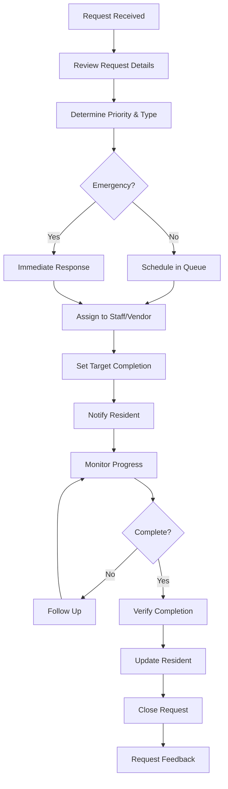
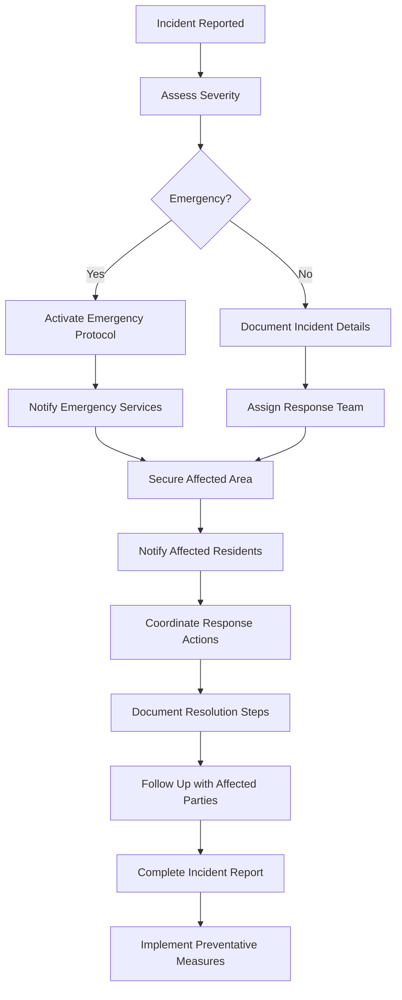

# Building Manager User Guide

> **Last Updated:** April 5, 2025 | **Role:** MANAGER

## Role Overview

As a **Building Manager** at Lofts des Arts, you have comprehensive access to day-to-day operational features of the platform. Your role focuses on practical building management, resident services, maintenance coordination, and operational communication. You serve as the primary point of contact between residents and the administrative team.

## Responsibilities

- Day-to-day building operations management
- Resident request handling and issue resolution
- Staff supervision and task assignment
- Building maintenance coordination
- Amenity and common area management
- Package and delivery oversight
- Resident communication and updates
- Service provider coordination
- Building security monitoring
- Event coordination and planning

## Dashboard Overview

Your dashboard provides a comprehensive view of current building operations:

- **Resident Requests**: Overview of pending and in-progress service requests
- **Staff Tasks**: Current assignments and completion status for building staff
- **Maintenance Calendar**: Scheduled maintenance and service provider visits
- **Package Status**: Summary of recent deliveries and pending pickups
- **Building Alerts**: Notifications about building systems or security issues
- **Announcements**: Recent and scheduled building communications
- **Amenity Bookings**: Current and upcoming common area reservations

## Available Features

### Resident Management

- **Resident Directory**: Access comprehensive resident information
- **Unit Information**: View unit details, occupancy, and configuration
- **Request Management**: Handle and track resident service requests
- **Communication Hub**: Direct messaging with individual residents
- **Profile Updates**: Assist with resident profile modifications

### Staff Coordination

- **Task Assignment**: Create and assign tasks to building staff
- **Schedule Management**: Oversee staff schedules and coverage
- **Performance Tracking**: Monitor task completion and staff efficiency
- **Communication Tools**: Direct and group messaging with staff
- **Training Records**: Access staff training status and certifications

### Building Operations

- **Maintenance Requests**: Create, assign, and track maintenance tasks
- **Vendor Management**: Coordinate with service providers
- **Inspection Reports**: Document building inspections and findings
- **System Monitoring**: Track status of building systems
- **Inventory Management**: Monitor building supplies and equipment

### Amenities & Common Areas

- **Booking Management**: Oversee reservations for common spaces
- **Facility Scheduling**: Manage opening hours and availability
- **Usage Reporting**: Track usage patterns and popularity
- **Maintenance Scheduling**: Coordinate cleaning and upkeep
- **Policy Enforcement**: Ensure compliance with usage policies

### Communication Center

- **Announcements**: Create building announcements and updates
- **Message Center**: Communicate with residents, staff, and management
- **Notification Management**: Configure important alerts
- **Event Communications**: Coordinate information for building events
- **Emergency Alerts**: Initiate and manage urgent communications

### Security & Access

- **Visitor Management**: Oversee visitor registration and access
- **Access Reports**: Review building entry and exit logs
- **Security Incidents**: Document and respond to security concerns
- **Key/Fob Management**: Track distribution of access credentials
- **Security System Monitoring**: Basic oversight of security features

## Common Tasks

### Resident Request Management

1. **Processing a Service Request**:
   - Navigate to `Operations > Service Requests`
   - Review new request details and priority
   - Assign to appropriate staff member or vendor
   - Set target completion date
   - Add any special instructions
   - Update resident on expected timeline
   - Monitor progress until completion
   - Collect feedback after completion

2. **Handling Resident Complaints**:
   - Navigate to `Residents > Communications`
   - Create new case for the complaint
   - Document details and supporting evidence
   - Determine appropriate response action
   - Assign responsibility for resolution
   - Communicate with resident about steps being taken
   - Follow up to ensure satisfactory resolution
   - Document outcome for future reference

3. **Managing Move In/Out**:
   - Navigate to `Residents > Move Management`
   - Schedule move date and time slot
   - Reserve elevator if needed
   - Send move instructions to resident
   - Coordinate with front desk staff
   - Arrange for pre/post move inspection
   - Update resident records after completion
   - Process any related deposits or fees

### Staff Management

1. **Assigning Daily Tasks**:
   - Navigate to `Staff > Task Management`
   - Create task assignments for each staff member
   - Set priorities and completion deadlines
   - Include detailed instructions or requirements
   - Allocate necessary resources
   - Send notifications to staff
   - Monitor task status throughout the day
   - Review completed work

2. **Staff Schedule Management**:
   - Navigate to `Staff > Schedules`
   - View current staffing coverage
   - Identify and address coverage gaps
   - Process time-off requests
   - Create schedule adjustments as needed
   - Publish updated schedules
   - Notify affected staff members
   - Maintain minimum coverage requirements

### Building Operations

1. **Processing Maintenance Requests**:
   - Navigate to `Operations > Maintenance`
   - Review and prioritize incoming requests
   - Determine if in-house staff can handle or external vendor needed
   - Create work orders with detailed instructions
   - Schedule maintenance window
   - Notify affected residents
   - Follow up on completion
   - Document work performed and any ongoing issues

2. **Managing Building Systems**:
   - Navigate to `Operations > Building Systems`
   - Review system status reports
   - Schedule preventative maintenance
   - Document system issues or failures
   - Coordinate with service providers for repairs
   - Update residents on system disruptions
   - Maintain compliance with inspection requirements
   - Review system performance metrics

3. **Vendor Coordination**:
   - Navigate to `Operations > Vendors`
   - Schedule vendor service appointments
   - Process building access for vendors
   - Oversee work performance
   - Verify completion of contracted services
   - Document vendor interactions
   - Process invoice approvals
   - Maintain vendor contact information

### Communication Tasks

1. **Creating Building Announcements**:
   - Navigate to `Communications > Announcements`
   - Create new announcement with clear subject
   - Draft message content
   - Select appropriate priority level
   - Choose target audience (all residents, specific floors, etc.)
   - Add any attachments or links
   - Schedule delivery time
   - Monitor read receipts

2. **Responding to Resident Messages**:
   - Navigate to `Communications > Message Center`
   - Review incoming messages
   - Prioritize based on urgency
   - Research information needed for response
   - Compose clear, helpful reply
   - Include any relevant resources or contacts
   - Set follow-up reminders if needed
   - Document significant communications

## Manager Workflows

### Service Request Process

### Building Incident Response

## Troubleshooting

### Common Issues

| Issue | Resolution |
|-------|------------|
| **Resident access problems** | Verify credentials, reset access if needed, check unit assignment |
| **Staff task assignment failures** | Confirm staff availability, check task parameters, verify staff permissions |
| **Maintenance coordination issues** | Verify vendor contact information, confirm scheduling, check resource availability |
| **Communication delivery problems** | Check resident contact information, verify notification settings, confirm delivery channels |
| **Amenity booking conflicts** | Review reservation system, check for policy compliance, mediate between residents |

## Best Practices

- **Proactive Communication**: Keep residents informed about building matters before they ask
- **Response Time**: Acknowledge all resident requests within 4 business hours
- **Documentation**: Maintain detailed records of all building issues and resolutions
- **Staff Development**: Regularly review staff performance and provide constructive feedback
- **Vendor Relationships**: Maintain professional relationships with service providers
- **System Knowledge**: Stay current on all building systems and maintenance requirements
- **Emergency Preparedness**: Ensure readiness for various emergency scenarios
- **Resident Privacy**: Respect confidentiality of resident information
- **Consistency**: Apply building policies uniformly and fairly
- **Continuous Improvement**: Regularly review processes for potential enhancements

## Important Contacts

- **Super Administrator**: superadmin@loftsdesarts.com or ext. 200
- **Building Administrator**: admin@loftsdesarts.com or ext. 201
- **Maintenance Supervisor**: maintenance@loftsdesarts.com or ext. 202
- **Security Services**: security@loftsdesarts.com or ext. 203
- **Board President**: boardpresident@loftsdesarts.com or ext. 204
- **Emergency Services**: 911 or building security at ext. 205

## Resources

- [Building Operations Manual](../../documents/operations-manual.md)
- [Emergency Response Plan](../../documents/emergency-plan.md)
- [Staff Training Guide](../../documents/staff-training.md)
- [Vendor Contact Directory](../../documents/vendor-directory.md)
- [Building Policies & Procedures](../../documents/building-policies.md)
- [Preventative Maintenance Schedule](../../documents/maintenance-schedule.md)

## Training & Support

- **System Training**: Access building management system tutorials in the Help Center
- **Policy Updates**: Review monthly policy update notifications
- **Professional Development**: Access property management continuing education resources
- **Peer Support**: Connect with managers from other properties in the network
- **Technical Support**: Contact technical support for system assistance

## Support Channels

For issues requiring further assistance:
- **Administrator Support**: Contact the Building Administrator
- **Technical Issues**: Submit a support ticket through the Help Center
- **Emergency Assistance**: Contact emergency services or building security
- **Training Requests**: Schedule additional training through the Learning Portal 