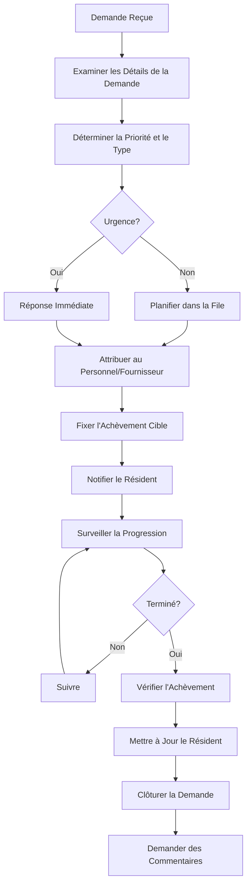
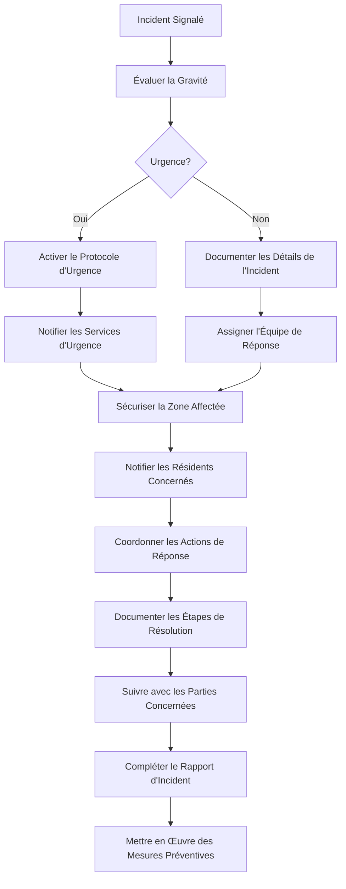

# Guide de l'Utilisateur Gestionnaire d'Immeuble

> **Dernière mise à jour :** 7 avril 2025 | **Version de l'Application :** 0.5.0 | **Rôle :** MANAGER

## Aperçu du Rôle

En tant que **Gestionnaire d'Immeuble** à Lofts des Arts, vous avez un accès complet aux fonctionnalités opérationnelles quotidiennes de la plateforme. Votre rôle se concentre sur la gestion pratique de l'immeuble, les services aux résidents, la coordination de l'entretien et la communication opérationnelle. Vous servez de point de contact principal entre les résidents et l'équipe administrative.

## Responsabilités

- Gestion des opérations quotidiennes de l'immeuble
- Traitement des demandes des résidents et résolution des problèmes
- Supervision du personnel et attribution des tâches
- Coordination de l'entretien de l'immeuble
- Gestion des commodités et des espaces communs
- Supervision des colis et des livraisons
- Communication avec les résidents et mises à jour
- Coordination des prestataires de services
- Surveillance de la sécurité de l'immeuble
- Coordination et planification d'événements

## Aperçu du Tableau de Bord

Votre tableau de bord offre une vue complète des opérations actuelles de l'immeuble :

- **Demandes des Résidents** : Aperçu des demandes de service en attente et en cours
- **Tâches du Personnel** : Attributions actuelles et état d'achèvement pour le personnel de l'immeuble
- **Calendrier d'Entretien** : Entretien programmé et visites des prestataires de services
- **État des Colis** : Résumé des livraisons récentes et des retraits en attente
- **Alertes de l'Immeuble** : Notifications concernant les systèmes de l'immeuble ou les problèmes de sécurité
- **Annonces** : Communications récentes et programmées de l'immeuble
- **Réservations des Installations** : Réservations actuelles et à venir des espaces communs

## Fonctionnalités Disponibles

### Gestion des Résidents

- **Répertoire des Résidents** : Accès aux informations complètes des résidents
- **Informations sur les Unités** : Voir les détails des unités, l'occupation et la configuration
- **Gestion des Demandes** : Traiter et suivre les demandes de service des résidents
- **Centre de Communication** : Messagerie directe avec les résidents individuels
- **Mises à Jour de Profil** : Aider aux modifications des profils des résidents

### Coordination du Personnel

- **Attribution de Tâches** : Créer et attribuer des tâches au personnel de l'immeuble
- **Gestion des Horaires** : Superviser les horaires du personnel et la couverture
- **Suivi des Performances** : Surveiller l'achèvement des tâches et l'efficacité du personnel
- **Outils de Communication** : Messagerie directe et de groupe avec le personnel
- **Dossiers de Formation** : Accéder à l'état de formation et aux certifications du personnel

### Opérations de l'Immeuble

- **Demandes d'Entretien** : Créer, attribuer et suivre les tâches d'entretien
- **Gestion des Fournisseurs** : Coordonner avec les prestataires de services
- **Rapports d'Inspection** : Documenter les inspections de l'immeuble et les constatations
- **Surveillance des Systèmes** : Suivre l'état des systèmes de l'immeuble
- **Gestion des Stocks** : Surveiller les fournitures et l'équipement de l'immeuble

### Commodités et Espaces Communs

- **Gestion des Réservations** : Superviser les réservations pour les espaces communs
- **Planification des Installations** : Gérer les heures d'ouverture et la disponibilité
- **Rapports d'Utilisation** : Suivre les modèles d'utilisation et la popularité
- **Planification de l'Entretien** : Coordonner le nettoyage et l'entretien
- **Application des Politiques** : Assurer la conformité aux politiques d'utilisation

### Centre de Communication

- **Annonces** : Créer des annonces et des mises à jour pour l'immeuble
- **Centre de Messages** : Communiquer avec les résidents, le personnel et la direction
- **Gestion des Notifications** : Configurer des alertes importantes
- **Communications d'Événements** : Coordonner les informations pour les événements de l'immeuble
- **Alertes d'Urgence** : Initier et gérer les communications urgentes

### Sécurité et Accès

- **Gestion des Visiteurs** : Superviser l'enregistrement et l'accès des visiteurs
- **Rapports d'Accès** : Examiner les journaux d'entrée et de sortie de l'immeuble
- **Incidents de Sécurité** : Documenter et répondre aux préoccupations de sécurité
- **Gestion des Clés/Badges** : Suivre la distribution des identifiants d'accès
- **Surveillance du Système de Sécurité** : Supervision de base des fonctionnalités de sécurité

## Tâches Courantes

### Gestion des Demandes des Résidents

1. **Traitement d'une Demande de Service** :
   - Naviguer vers `Opérations > Demandes de Service`
   - Examiner les détails de la nouvelle demande et sa priorité
   - Attribuer au membre du personnel ou au fournisseur approprié
   - Fixer une date cible d'achèvement
   - Ajouter des instructions spéciales si nécessaire
   - Informer le résident du délai prévu
   - Surveiller la progression jusqu'à l'achèvement
   - Recueillir des commentaires après l'achèvement

2. **Traitement des Plaintes des Résidents** :
   - Naviguer vers `Résidents > Communications`
   - Créer un nouveau dossier pour la plainte
   - Documenter les détails et les preuves à l'appui
   - Déterminer l'action de réponse appropriée
   - Attribuer la responsabilité de la résolution
   - Communiquer avec le résident sur les mesures prises
   - Suivre pour assurer une résolution satisfaisante
   - Documenter le résultat pour référence future

3. **Gestion des Emménagements/Déménagements** :
   - Naviguer vers `Résidents > Gestion des Déménagements`
   - Planifier la date et l'heure du déménagement
   - Réserver l'ascenseur si nécessaire
   - Envoyer les instructions de déménagement au résident
   - Coordonner avec le personnel de la réception
   - Organiser l'inspection avant/après le déménagement
   - Mettre à jour les dossiers des résidents après l'achèvement
   - Traiter les dépôts ou frais associés

### Gestion du Personnel

1. **Attribution des Tâches Quotidiennes** :
   - Naviguer vers `Personnel > Gestion des Tâches`
   - Créer des attributions de tâches pour chaque membre du personnel
   - Établir les priorités et les délais d'achèvement
   - Inclure des instructions détaillées ou des exigences
   - Allouer les ressources nécessaires
   - Envoyer des notifications au personnel
   - Surveiller l'état des tâches tout au long de la journée
   - Examiner le travail achevé

2. **Gestion des Horaires du Personnel** :
   - Naviguer vers `Personnel > Horaires`
   - Consulter la couverture actuelle du personnel
   - Identifier et résoudre les lacunes de couverture
   - Traiter les demandes de congé
   - Créer des ajustements d'horaire selon les besoins
   - Publier les horaires mis à jour
   - Notifier les membres du personnel concernés
   - Maintenir les exigences minimales de couverture

### Opérations de l'Immeuble

1. **Traitement des Demandes d'Entretien** :
   - Naviguer vers `Opérations > Entretien`
   - Examiner et prioriser les demandes entrantes
   - Déterminer si le personnel interne peut gérer ou si un fournisseur externe est nécessaire
   - Créer des ordres de travail avec des instructions détaillées
   - Planifier la fenêtre d'entretien
   - Informer les résidents concernés
   - Suivre l'achèvement
   - Documenter le travail effectué et tout problème persistant

2. **Gestion des Systèmes de l'Immeuble** :
   - Naviguer vers `Opérations > Systèmes de l'Immeuble`
   - Examiner les rapports d'état du système
   - Planifier l'entretien préventif
   - Documenter les problèmes ou pannes du système
   - Coordonner avec les prestataires de services pour les réparations
   - Informer les résidents des interruptions du système
   - Maintenir la conformité aux exigences d'inspection
   - Examiner les métriques de performance du système

3. **Coordination des Fournisseurs** :
   - Naviguer vers `Opérations > Fournisseurs`
   - Planifier les rendez-vous de service des fournisseurs
   - Traiter l'accès à l'immeuble pour les fournisseurs
   - Superviser la performance du travail
   - Vérifier l'achèvement des services contractés
   - Documenter les interactions avec les fournisseurs
   - Traiter les approbations de factures
   - Maintenir les coordonnées des fournisseurs

### Tâches de Communication

1. **Création d'Annonces pour l'Immeuble** :
   - Naviguer vers `Communications > Annonces`
   - Créer une nouvelle annonce avec un sujet clair
   - Rédiger le contenu du message
   - Sélectionner le niveau de priorité approprié
   - Choisir le public cible (tous les résidents, étages spécifiques, etc.)
   - Ajouter des pièces jointes ou des liens
   - Planifier l'heure de livraison
   - Surveiller les accusés de lecture

2. **Répondre aux Messages des Résidents** :
   - Naviguer vers `Communications > Centre de Messages`
   - Examiner les messages entrants
   - Prioriser en fonction de l'urgence
   - Rechercher les informations nécessaires pour la réponse
   - Composer une réponse claire et utile
   - Inclure toutes ressources ou contacts pertinents
   - Définir des rappels de suivi si nécessaire
   - Documenter les communications importantes

## Flux de Travail du Gestionnaire

### Processus de Demande de Service

### Réponse aux Incidents dans l'Immeuble

## Dépannage

### Problèmes Courants

| Problème | Résolution |
|-------|------------|
| **Problèmes d'accès des résidents** | Vérifier les identifiants, réinitialiser l'accès si nécessaire, vérifier l'attribution de l'unité |
| **Échecs d'attribution des tâches au personnel** | Confirmer la disponibilité du personnel, vérifier les paramètres de la tâche, vérifier les autorisations du personnel |
| **Problèmes de coordination de l'entretien** | Vérifier les coordonnées du fournisseur, confirmer la planification, vérifier la disponibilité des ressources |
| **Problèmes de livraison des communications** | Vérifier les coordonnées du résident, vérifier les paramètres de notification, confirmer les canaux de livraison |

## Ressources Additionnelles

- **Manuels de Procédure** : Accès aux procédures opérationnelles standard de l'immeuble
- **Formation de Gestion** : Ressources de formation pour les gestionnaires d'immeuble
- **Ressources Légales** : Informations sur les règlements applicables et les meilleures pratiques
- **Formulaires de Gestion** : Accès aux formulaires et documents officiels
- **Contacts d'Urgence** : Liste complète des contacts d'urgence et des fournisseurs de services

## Soutien et Assistance

Si vous rencontrez des problèmes qui ne sont pas couverts dans ce guide :
- **Support Technique** : tech-support@loftsdesarts.com ou poste 201
- **Administration** : admin@loftsdesarts.com ou poste 202
- **Direction** : executive@loftsdesarts.com ou poste 203
- **Support d'Urgence** : Ligne d'urgence 24/7 au poste 911

---

[English Version](./README.md) 