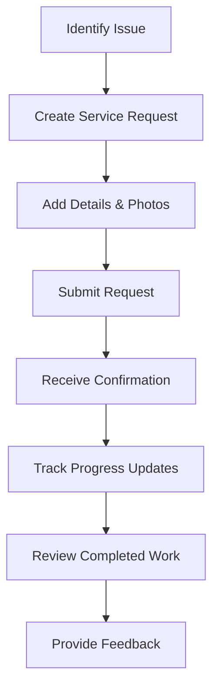
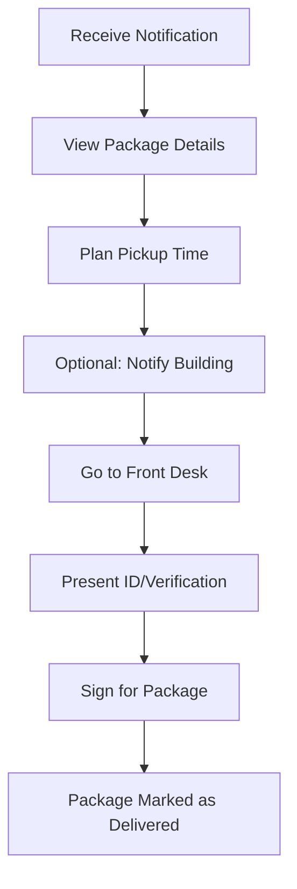

# Resident Owner User Guide

> **Last Updated:** April 7, 2025 | **Role:** RESIDENT_OWNER

## Role Overview

As a **Resident Owner** at Lofts des Arts, you have access to the full suite of resident features available through our digital platform. This guide will help you navigate and utilize the system to enhance your living experience in our community.

## Available Features

### Dashboard & Profile

- **Personalized Dashboard**: Your centralized hub for building updates and personal notifications
- **Profile Management**: Update your contact information and communication preferences
- **Unit Information**: Access details about your condominium unit
- **Account Settings**: Manage your account security and preferences
- **Visitor Pre-authorization**: Pre-register expected visitors

### Communications

- **Messaging System**: Send and receive messages to/from building management and staff
- **Announcements**: View important building-wide announcements
- **Community Forum**: Participate in discussions with other residents
- **Contact Directory**: Access contact information for building management and services
- **Emergency Notifications**: Receive critical alerts about building emergencies

### Package Management

- **Package Notifications**: Receive alerts when packages arrive for you
- **Package Status**: View the status of your current packages
- **Pickup Scheduling**: Indicate when you plan to pick up packages
- **Delivery History**: Access records of all past deliveries
- **Delivery Preferences**: Set preferences for package handling

### Documents & Resources

- **Document Library**: Access important building documents and resources
- **Meeting Minutes**: Review records of board meetings and decisions
- **Bylaws & Regulations**: Reference condominium bylaws and rules
- **Financial Documents**: Access fee statements and financial reports
- **Forms Repository**: Download and submit required forms

### Community Resources

- **Amenity Booking**: Reserve common areas and facilities
- **Event Calendar**: View upcoming building events and activities
- **Service Requests**: Submit and track maintenance requests
- **Community Marketplace**: Buy, sell, or give away items to neighbors
- **Local Resources**: Find information about neighborhood services

## Dashboard Overview

Your personalized dashboard provides at-a-glance information about:

- **Recent Announcements**: Important building updates
- **Package Notifications**: Alerts about packages awaiting pickup
- **Message Center**: Recent communications and unread messages
- **Quick Actions**: Common tasks like submitting service requests
- **Upcoming Events**: Building events and important dates
- **Building Status**: Current information about building systems and amenities

## Common Tasks

### Communication Management

1. **Sending a Message to Management**:
   - Navigate to `Messages > New Message`
   - Select `Building Management` from the recipient dropdown
   - Choose an appropriate category for your message
   - Compose your message with a clear subject line
   - Add attachments if needed (photos, documents)
   - Click `Send`

2. **Viewing Announcements**:
   - Navigate to `Communications > Announcements`
   - Filter announcements by date or category
   - Mark important announcements with a star for easy reference
   - Set notification preferences for new announcements

3. **Participating in Community Discussions**:
   - Navigate to `Communications > Community Forum`
   - Browse existing discussion threads by category
   - Create new discussion topics as needed
   - Follow threads to receive notifications about new comments

### Package Management

1. **Checking Package Status**:
   - Navigate to `Services > Package Tracking`
   - View list of packages currently being held for you
   - See detailed information including delivery date and package size
   - Review package photos if available

2. **Setting Pickup Notifications**:
   - Navigate to `Services > Package Tracking > Preferences`
   - Choose your preferred notification method (email, SMS, in-app)
   - Set quiet hours when you don't want to receive notifications
   - Configure automatic reminders for packages not picked up

3. **Authorizing Alternative Pickup**:
   - Navigate to `Services > Package Tracking > Current Packages`
   - Select the package you want someone else to pick up
   - Click `Authorize Pickup`
   - Enter the name and contact information of the authorized person
   - Set an expiration date for the authorization

### Document Access

1. **Accessing Building Documents**:
   - Navigate to `Documents > Building Library`
   - Browse categories or use the search function
   - Open or download documents as needed
   - Bookmark frequently accessed documents

2. **Submitting Forms**:
   - Navigate to `Documents > Forms`
   - Select the appropriate form category
   - Complete the digital form or download for manual completion
   - Submit completed forms directly through the platform
   - Track submission status and responses

3. **Reviewing Financial Information**:
   - Navigate to `Documents > Financial`
   - Access monthly fee statements
   - View payment history and receipts
   - Download annual financial reports
   - Set up automatic payment options

## Ownership-Specific Features

As a resident owner, you have access to several additional features not available to tenants:

### Unit Management

- **Property Documents**: Access your deed, title, and insurance information
- **Renovation Requests**: Submit and track renovation applications
- **Unit Modifications**: Document changes made to your unit over time
- **Maintenance Records**: Track maintenance history for your unit

### Governance Participation

- **Voting Rights**: Participate in electronic voting for board elections and bylaws
- **Meeting Participation**: Register for annual and special meetings
- **Committee Information**: Join building committees and access meeting information
- **Feedback Surveys**: Provide input on building management and initiatives

### Owner-Specific Documents

- **Condominium Declarations**: Access foundational legal documents
- **Reserve Fund Studies**: Review financial planning for major repairs
- **Insurance Certificates**: Access building insurance documentation
- **Special Assessment Information**: Details about any special assessments

## Workflow Examples

### Service Request Process

### Package Pickup Process

## Troubleshooting

### Common Issues

| Issue | Resolution |
|-------|------------|
| **Login problems** | Reset password, check email for verification link, contact support |
| **Missing notifications** | Check notification settings, verify contact information, check spam folder |
| **Document access issues** | Confirm your account is properly linked to your unit, contact management |
| **Service request errors** | Ensure all required fields are completed, try submitting with smaller image files |
| **Package tracking discrepancies** | Contact front desk, verify package was properly logged in the system |

## Best Practices

- **Profile Maintenance**: Keep your contact information current
- **Regular Check-ins**: Log in weekly to stay updated on building information
- **Document Organization**: Download and save important documents locally
- **Secure Account**: Use a strong password and enable two-factor authentication
- **Timely Communication**: Respond promptly to important messages and announcements
- **Package Management**: Pick up packages within 3 days of notification
- **Meeting Participation**: Attend board meetings to stay informed about building operations
- **Community Engagement**: Participate in building events and initiatives

## Important Contacts

- **Building Manager**: manager@loftsdesarts.com or 555-123-4567
- **Front Desk**: frontdesk@loftsdesarts.com or 555-123-4568
- **Maintenance**: maintenance@loftsdesarts.com or 555-123-4569
- **Board of Directors**: board@loftsdesarts.com
- **Technical Support**: support@loftsdesarts.com or 555-123-4570

## Additional Resources

- [Building Rules & Regulations](../../documents/building-rules.md)
- [Condominium Act Summary](../../documents/condo-act-summary.md)
- [Homeowner Insurance Requirements](../../documents/insurance-requirements.md)
- [Moving Guidelines](../../documents/moving-guidelines.md)
- [Amenity Usage Policies](../../documents/amenity-policies.md)
- [Emergency Preparedness Guide](../../documents/emergency-guide.md)

## Platform Updates

The Lofts des Arts digital platform is regularly updated with new features and improvements. Major updates will be announced through:

- Dashboard notifications
- Email communications
- Building newsletter
- Announcement section

Your feedback helps us improve the platform. Please submit suggestions through the `Feedback` form in your dashboard. 