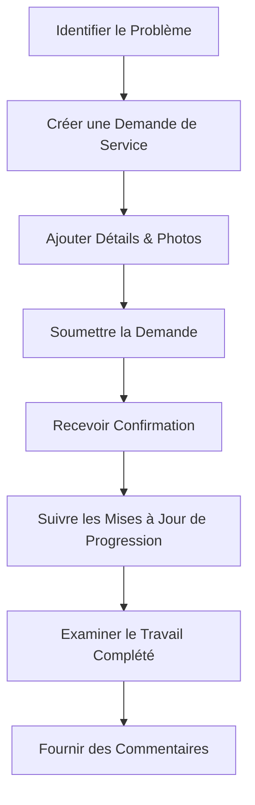
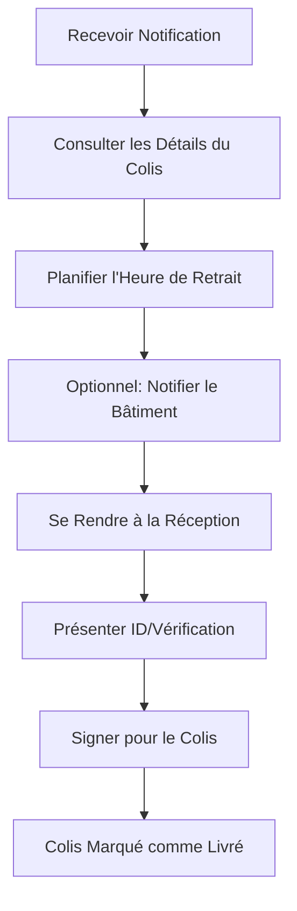

# Guide de l'Utilisateur Propriétaire Résident

> **Dernière mise à jour :** 5 avril 2025 | **Rôle :** RESIDENT_OWNER

## Aperçu du Rôle

En tant que **Propriétaire Résident** à Lofts des Arts, vous avez accès à l'ensemble complet des fonctionnalités résidentielles disponibles via notre plateforme numérique. Ce guide vous aidera à naviguer et à utiliser le système pour améliorer votre expérience de vie dans notre communauté.

## Fonctionnalités Disponibles

### Tableau de Bord & Profil

- **Tableau de Bord Personnalisé** : Votre centre d'informations centralisé pour les mises à jour du bâtiment et les notifications personnelles
- **Gestion de Profil** : Mettre à jour vos informations de contact et préférences de communication
- **Informations d'Unité** : Accéder aux détails concernant votre unité de copropriété
- **Paramètres de Compte** : Gérer la sécurité et les préférences de votre compte
- **Pré-autorisation des Visiteurs** : Pré-enregistrer les visiteurs attendus

### Communications

- **Système de Messagerie** : Envoyer et recevoir des messages vers/depuis la direction et le personnel du bâtiment
- **Annonces** : Consulter les annonces importantes à l'échelle du bâtiment
- **Forum Communautaire** : Participer aux discussions avec d'autres résidents
- **Répertoire de Contacts** : Accéder aux informations de contact pour la direction et les services du bâtiment
- **Notifications d'Urgence** : Recevoir des alertes critiques concernant les urgences du bâtiment

### Gestion des Colis

- **Notifications de Colis** : Recevoir des alertes lorsque des colis arrivent pour vous
- **Statut des Colis** : Consulter le statut de vos colis actuels
- **Planification de Retrait** : Indiquer quand vous prévoyez de récupérer vos colis
- **Historique de Livraison** : Accéder aux enregistrements de toutes les livraisons passées
- **Préférences de Livraison** : Définir des préférences pour la gestion des colis

### Documents & Ressources

- **Bibliothèque de Documents** : Accéder aux documents et ressources importants du bâtiment
- **Procès-verbaux des Réunions** : Consulter les enregistrements des réunions du conseil et des décisions
- **Règlements & Réglementations** : Consulter les règlements et règles de copropriété
- **Documents Financiers** : Accéder aux relevés de frais et aux rapports financiers
- **Répertoire de Formulaires** : Télécharger et soumettre les formulaires requis

### Ressources Communautaires

- **Réservation des Commodités** : Réserver les espaces communs et installations
- **Calendrier d'Événements** : Consulter les événements et activités à venir du bâtiment
- **Demandes de Service** : Soumettre et suivre les demandes de maintenance
- **Marché Communautaire** : Acheter, vendre ou donner des articles aux voisins
- **Ressources Locales** : Trouver des informations sur les services du quartier

## Aperçu du Tableau de Bord

Votre tableau de bord personnalisé fournit des informations en un coup d'œil sur :

- **Annonces Récentes** : Mises à jour importantes du bâtiment
- **Notifications de Colis** : Alertes concernant les colis en attente de retrait
- **Centre de Messages** : Communications récentes et messages non lus
- **Actions Rapides** : Tâches courantes comme la soumission de demandes de service
- **Événements à Venir** : Événements du bâtiment et dates importantes
- **Statut du Bâtiment** : Informations actuelles sur les systèmes et commodités du bâtiment

## Tâches Courantes

### Gestion des Communications

1. **Envoyer un Message à la Direction** :
   - Naviguer vers `Messages > Nouveau Message`
   - Sélectionner `Direction du Bâtiment` dans le menu déroulant des destinataires
   - Choisir une catégorie appropriée pour votre message
   - Composer votre message avec un objet clair
   - Ajouter des pièces jointes si nécessaire (photos, documents)
   - Cliquer sur `Envoyer`

2. **Consulter les Annonces** :
   - Naviguer vers `Communications > Annonces`
   - Filtrer les annonces par date ou catégorie
   - Marquer les annonces importantes avec une étoile pour référence facile
   - Définir les préférences de notification pour les nouvelles annonces

3. **Participer aux Discussions Communautaires** :
   - Naviguer vers `Communications > Forum Communautaire`
   - Parcourir les fils de discussion existants par catégorie
   - Créer de nouveaux sujets de discussion selon les besoins
   - Suivre les fils pour recevoir des notifications sur les nouveaux commentaires

### Gestion des Colis

1. **Vérifier le Statut des Colis** :
   - Naviguer vers `Services > Suivi des Colis`
   - Consulter la liste des colis actuellement conservés pour vous
   - Voir les informations détaillées, y compris la date de livraison et la taille du colis
   - Examiner les photos des colis si disponibles

2. **Configurer les Notifications de Retrait** :
   - Naviguer vers `Services > Suivi des Colis > Préférences`
   - Choisir votre méthode de notification préférée (email, SMS, dans l'application)
   - Définir les heures calmes pendant lesquelles vous ne souhaitez pas recevoir de notifications
   - Configurer des rappels automatiques pour les colis non récupérés

3. **Autoriser un Retrait Alternatif** :
   - Naviguer vers `Services > Suivi des Colis > Colis Actuels`
   - Sélectionner le colis que vous souhaitez faire récupérer par quelqu'un d'autre
   - Cliquer sur `Autoriser le Retrait`
   - Saisir le nom et les informations de contact de la personne autorisée
   - Définir une date d'expiration pour l'autorisation

### Accès aux Documents

1. **Accéder aux Documents du Bâtiment** :
   - Naviguer vers `Documents > Bibliothèque du Bâtiment`
   - Parcourir les catégories ou utiliser la fonction de recherche
   - Ouvrir ou télécharger les documents selon les besoins
   - Mettre en signet les documents fréquemment consultés

2. **Soumettre des Formulaires** :
   - Naviguer vers `Documents > Formulaires`
   - Sélectionner la catégorie de formulaire appropriée
   - Compléter le formulaire numérique ou le télécharger pour complétion manuelle
   - Soumettre les formulaires complétés directement via la plateforme
   - Suivre le statut de soumission et les réponses

3. **Consulter les Informations Financières** :
   - Naviguer vers `Documents > Financier`
   - Accéder aux relevés de frais mensuels
   - Consulter l'historique des paiements et les reçus
   - Télécharger les rapports financiers annuels
   - Configurer les options de paiement automatique

## Fonctionnalités Spécifiques aux Propriétaires

En tant que propriétaire résident, vous avez accès à plusieurs fonctionnalités supplémentaires non disponibles pour les locataires :

### Gestion de l'Unité

- **Documents de Propriété** : Accéder à vos actes, titres et informations d'assurance
- **Demandes de Rénovation** : Soumettre et suivre les demandes de rénovation
- **Modifications de l'Unité** : Documenter les changements apportés à votre unité au fil du temps
- **Registres de Maintenance** : Suivre l'historique de maintenance de votre unité

### Participation à la Gouvernance

- **Droits de Vote** : Participer aux votes électroniques pour les élections du conseil et les règlements
- **Participation aux Réunions** : S'inscrire aux assemblées annuelles et extraordinaires
- **Informations sur les Comités** : Rejoindre les comités du bâtiment et accéder aux informations des réunions
- **Sondages d'Opinion** : Fournir des commentaires sur la gestion du bâtiment et les initiatives

### Documents Spécifiques aux Propriétaires

- **Déclarations de Copropriété** : Accéder aux documents juridiques fondamentaux
- **Études du Fonds de Réserve** : Examiner la planification financière pour les réparations majeures
- **Certificats d'Assurance** : Accéder à la documentation d'assurance du bâtiment
- **Informations sur les Cotisations Spéciales** : Détails sur toutes les cotisations spéciales

## Exemples de Flux de Travail

### Processus de Demande de Service

### Processus de Retrait de Colis

## Dépannage

### Problèmes Courants

| Problème | Résolution |
|-------|------------|
| **Problèmes de connexion** | Réinitialiser le mot de passe, vérifier l'email pour le lien de vérification, contacter le support |
| **Notifications manquantes** | Vérifier les paramètres de notification, vérifier les informations de contact, vérifier le dossier spam |
| **Problèmes d'accès aux documents** | Confirmer que votre compte est correctement lié à votre unité, contacter la direction |
| **Erreurs de demande de service** | S'assurer que tous les champs requis sont complétés, essayer de soumettre avec des fichiers image plus petits |
| **Divergences de suivi de colis** | Contacter la réception, vérifier que le colis a été correctement enregistré dans le système |

## Meilleures Pratiques

- **Maintenance du Profil** : Maintenir vos informations de contact à jour
- **Vérifications Régulières** : Se connecter hebdomadairement pour rester informé des informations du bâtiment
- **Organisation des Documents** : Télécharger et sauvegarder localement les documents importants
- **Compte Sécurisé** : Utiliser un mot de passe fort et activer l'authentification à deux facteurs
- **Communication Opportune** : Répondre rapidement aux messages et annonces importants
- **Gestion des Colis** : Récupérer les colis dans les 3 jours suivant la notification
- **Participation aux Réunions** : Assister aux réunions du conseil pour rester informé des opérations du bâtiment
- **Engagement Communautaire** : Participer aux événements et initiatives du bâtiment

## Contacts Importants

- **Gestionnaire d'Immeuble** : manager@loftsdesarts.com ou 555-123-4567
- **Réception** : frontdesk@loftsdesarts.com ou 555-123-4568
- **Maintenance** : maintenance@loftsdesarts.com ou 555-123-4569
- **Conseil d'Administration** : board@loftsdesarts.com
- **Support Technique** : support@loftsdesarts.com ou 555-123-4570

## Ressources Additionnelles

- [Règles & Réglementations du Bâtiment](../../documents/building-rules_FR.md)
- [Résumé de la Loi sur les Copropriétés](../../documents/condo-act-summary_FR.md)
- [Exigences d'Assurance des Propriétaires](../../documents/insurance-requirements_FR.md)
- [Directives de Déménagement](../../documents/moving-guidelines_FR.md)
- [Politiques d'Utilisation des Commodités](../../documents/amenity-policies_FR.md)
- [Guide de Préparation aux Urgences](../../documents/emergency-guide_FR.md)

## Mises à Jour de la Plateforme

La plateforme numérique de Lofts des Arts est régulièrement mise à jour avec de nouvelles fonctionnalités et améliorations. Les mises à jour majeures seront annoncées via :

- Notifications du tableau de bord
- Communications par email
- Bulletin d'information du bâtiment
- Section des annonces

Vos commentaires nous aident à améliorer la plateforme. Veuillez soumettre vos suggestions via le formulaire `Commentaires` dans votre tableau de bord.

---

[English Version](./README.md) 