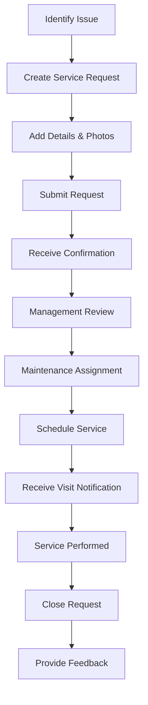
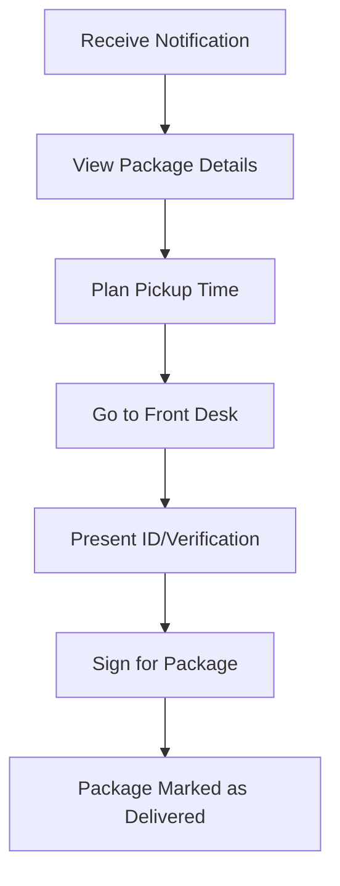

# Resident Tenant User Guide

> **Last Updated:** April 7, 2025 | **App Version:** 0.5.0 | **Role:** RESIDENT_TENANT

## Role Overview

As a **Resident Tenant** at Lofts des Arts, you have access to the digital platform's resident features designed to enhance your living experience. While your access is similar to resident owners, some features specific to property ownership may be limited. This guide will help you navigate the platform effectively as a tenant.

## Available Features

### Dashboard & Profile

- **Personalized Dashboard**: Your central hub for building updates and notifications
- **Profile Management**: Update your contact information and preferences
- **Unit Information**: View details about your rented unit
- **Account Settings**: Manage your account security and settings
- **Visitor Pre-authorization**: Register expected visitors

### Communications

- **Messaging System**: Send and receive messages to/from building management and staff
- **Announcements**: View important building-wide announcements
- **Community Forum**: Participate in resident discussions
- **Contact Directory**: Access contact information for building services
- **Emergency Notifications**: Receive critical alerts

### Package Management

- **Package Notifications**: Receive alerts when packages arrive
- **Package Status**: View current packages awaiting pickup
- **Pickup Authorization**: Authorize others to pick up your packages
- **Delivery History**: Access records of past deliveries
- **Delivery Preferences**: Set preferences for package handling

### Building Services

- **Service Requests**: Submit and track maintenance requests
- **Amenity Booking**: Reserve common areas and facilities
- **Event Calendar**: View upcoming building events
- **Building Notifications**: Receive updates about building operations
- **Local Resources**: Access information about neighborhood services

### Document Access

- **Building Documents**: Access relevant building information
- **Forms Repository**: Download and submit required forms
- **Building Rules**: View condominium rules and regulations
- **Moving Procedures**: Access move-in/move-out guidelines
- **Emergency Information**: Access emergency protocols

## Dashboard Overview

Your personalized dashboard provides at-a-glance information about:

- **Recent Announcements**: Important building updates
- **Package Notifications**: Alerts about packages awaiting pickup
- **Message Center**: Recent communications and unread messages
- **Service Requests**: Status of your maintenance requests
- **Upcoming Events**: Building events and important dates
- **Amenity Bookings**: Your upcoming reservations
- **Building Status**: Current information about building systems

## Common Tasks

### Communication Management

1. **Sending a Message to Management**:
   - Navigate to `Messages > New Message`
   - Select `Building Management` from the recipient dropdown
   - Choose an appropriate category for your message
   - Compose your message with a clear subject line
   - Add attachments if needed (photos, documents)
   - Click `Send`

2. **Viewing Announcements**:
   - Navigate to `Communications > Announcements`
   - Filter announcements by date or category
   - Mark important announcements for easy reference
   - Set notification preferences for new announcements

3. **Participating in Community Discussions**:
   - Navigate to `Communications > Community Forum`
   - Browse existing discussion threads by category
   - Create new discussion topics as needed
   - Follow threads to receive notifications about new comments

### Package Management

1. **Checking Package Status**:
   - Navigate to `Services > Package Tracking`
   - View list of packages currently being held for you
   - See detailed information including delivery date and package size
   - Review package photos if available

2. **Setting Pickup Notifications**:
   - Navigate to `Services > Package Tracking > Preferences`
   - Choose your preferred notification method (email, SMS, in-app)
   - Set quiet hours when you don't want to receive notifications
   - Configure automatic reminders for packages not picked up

3. **Authorizing Alternative Pickup**:
   - Navigate to `Services > Package Tracking > Current Packages`
   - Select the package you want someone else to pick up
   - Click `Authorize Pickup`
   - Enter the name and contact information of the authorized person
   - Set an expiration date for the authorization

### Building Services

1. **Submitting a Maintenance Request**:
   - Navigate to `Services > Maintenance Requests`
   - Click `New Request`
   - Select the request category
   - Provide detailed description of the issue
   - Attach photos if applicable
   - Indicate preferred contact method
   - Specify available access times
   - Submit the request
   - Track status in your dashboard

2. **Booking a Common Area**:
   - Navigate to `Amenities > Bookings`
   - Select the amenity you wish to reserve
   - View availability calendar
   - Choose date and time slot
   - Review amenity rules and guidelines
   - Confirm your booking
   - Receive booking confirmation
   - Add to your personal calendar

3. **Updating Contact Information**:
   - Navigate to `Profile > Personal Information`
   - Review current contact details
   - Update phone numbers, email addresses, or emergency contacts
   - Save changes
   - Verify information with confirmation code if required
   - Receive confirmation of updates

## Service Request Process

## Package Pickup Process

## Tenant-Specific Information

As a tenant, there are some specific aspects of the platform that differ from owner access:

### Lease Information

- **Lease Details**: Access your lease terms and renewal dates
- **Rent Payment**: View rent payment history (payment functionality may be external)
- **Lease Documents**: Access your lease agreement and related documents
- **Move-out Procedures**: Information about the move-out process
- **Property Manager Contact**: Direct access to your property manager

### Access Limitations

As a tenant, you may not have access to:
- Condominium financial reports
- Board meeting minutes
- Voting on condominium matters
- Certain owner-only documents
- Reserve fund information

### Reporting Chain

For building issues:
1. Non-emergency maintenance issues: Submit through the platform
2. Unit-specific concerns: Contact your property manager/owner
3. Emergencies: Contact emergency services first, then building management
4. Building policy questions: Review tenant guidelines or contact management

## Troubleshooting

### Common Issues

| Issue | Resolution |
|-------|------------|
| **Login problems** | Reset password, check email for verification link, contact support |
| **Missing notifications** | Check notification settings, verify contact information, check spam folder |
| **Service request errors** | Ensure all required fields are completed, try submitting with smaller image files |
| **Package notification issues** | Verify your unit number is correct in your profile, check notification settings |
| **Amenity booking conflicts** | Check for blackout periods, review booking rules, contact management for assistance |

## Best Practices

- **Profile Maintenance**: Keep your contact information current
- **Regular Check-ins**: Log in weekly to stay updated on building information
- **Documentation**: Save important communications for your records
- **Secure Account**: Use a strong password and enable two-factor authentication
- **Timely Reporting**: Report maintenance issues promptly to prevent worsening
- **Community Respect**: Follow building rules for common areas and noise
- **Package Pickup**: Collect packages within 3 days of notification
- **Communication**: Maintain professional communication with management
- **Parking Rules**: Adhere to parking regulations and guest parking policies
- **Move Planning**: Schedule moves during designated hours

## Important Contacts

- **Property Manager**: propertymanager@loftsdesarts.com or ext. 600
- **Building Manager**: manager@loftsdesarts.com or ext. 601
- **Front Desk**: frontdesk@loftsdesarts.com or ext. 602
- **Maintenance**: maintenance@loftsdesarts.com or ext. 603
- **Emergency Services**: 911 or building security at ext. 604

## Resources

- [Tenant Handbook](../../documents/residents/tenant-handbook.md)
- [Building Rules & Regulations](../../documents/residents/rules.md)
- [Move Procedures](../../documents/residents/moving.md)
- [Amenity Guidelines](../../documents/residents/amenities.md)
- [Maintenance Request Guide](../../documents/residents/maintenance.md)
- [Emergency Preparedness](../../documents/residents/emergency.md)

## Tenant Rights

- **Privacy**: Your personal information is protected
- **Maintenance**: Right to timely repairs and maintenance
- **Quiet Enjoyment**: Right to reasonable peace and quiet
- **Safety**: Right to a safe living environment
- **Communication**: Right to receive building notifications
- **Amenity Access**: Equal access to building amenities

## Support Channels

If you encounter issues requiring assistance:
- **Platform Support**: Click the Help icon in the dashboard
- **Technical Issues**: techsupport@loftsdesarts.com
- **Account Problems**: accounts@loftsdesarts.com
- **Urgent Building Issues**: Contact front desk or building management
- **Feedback**: Submit suggestions through the feedback form 