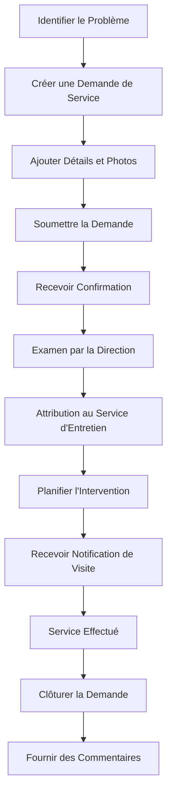
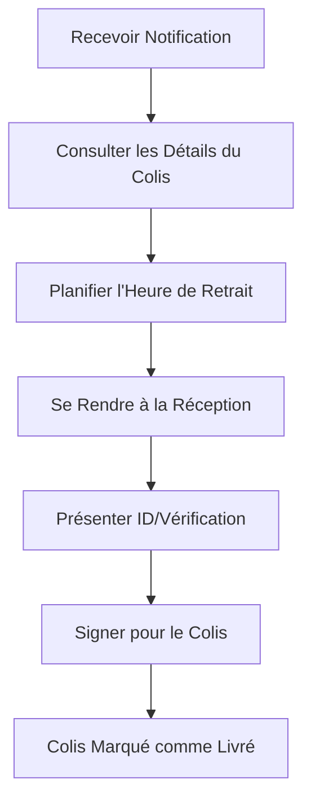

# Guide de l'Utilisateur Résident Locataire

> **Dernière mise à jour :** 7 avril 2025 | **Version de l'Application :** 0.5.0 | **Rôle :** RESIDENT_TENANT

## Aperçu du Rôle

En tant que **Résident Locataire** à Lofts des Arts, vous avez accès aux fonctionnalités résidentielles de la plateforme numérique conçues pour améliorer votre expérience de vie. Bien que votre accès soit similaire à celui des propriétaires résidents, certaines fonctionnalités spécifiques à la propriété peuvent être limitées. Ce guide vous aidera à naviguer efficacement sur la plateforme en tant que locataire.

## Fonctionnalités Disponibles

### Tableau de Bord et Profil

- **Tableau de Bord Personnalisé** : Votre centre de contrôle pour les mises à jour et notifications de l'immeuble
- **Gestion de Profil** : Mettre à jour vos coordonnées et préférences
- **Informations sur l'Unité** : Consulter les détails de votre unité louée
- **Paramètres du Compte** : Gérer la sécurité et les paramètres de votre compte
- **Pré-autorisation des Visiteurs** : Enregistrer les visiteurs attendus

### Communications

- **Système de Messagerie** : Envoyer et recevoir des messages à/de la direction et du personnel de l'immeuble
- **Annonces** : Consulter les annonces importantes à l'échelle de l'immeuble
- **Forum Communautaire** : Participer aux discussions entre résidents
- **Répertoire des Contacts** : Accéder aux coordonnées des services de l'immeuble
- **Notifications d'Urgence** : Recevoir des alertes critiques

### Gestion des Colis

- **Notifications de Colis** : Recevoir des alertes lorsque des colis arrivent
- **État des Colis** : Consulter les colis actuels en attente de retrait
- **Autorisation de Retrait** : Autoriser d'autres personnes à récupérer vos colis
- **Historique des Livraisons** : Accéder aux enregistrements des livraisons passées
- **Préférences de Livraison** : Définir les préférences pour la manipulation des colis

### Services de l'Immeuble

- **Demandes de Service** : Soumettre et suivre les demandes d'entretien
- **Réservation d'Installations** : Réserver des espaces communs et des installations
- **Calendrier des Événements** : Consulter les événements à venir dans l'immeuble
- **Notifications de l'Immeuble** : Recevoir des mises à jour sur les opérations de l'immeuble
- **Ressources Locales** : Accéder aux informations sur les services du quartier

### Accès aux Documents

- **Documents de l'Immeuble** : Accéder aux informations pertinentes de l'immeuble
- **Référentiel de Formulaires** : Télécharger et soumettre les formulaires requis
- **Règles de l'Immeuble** : Consulter les règles et règlements de la copropriété
- **Procédures de Déménagement** : Accéder aux directives d'emménagement/déménagement
- **Informations d'Urgence** : Accéder aux protocoles d'urgence

## Aperçu du Tableau de Bord

Votre tableau de bord personnalisé fournit des informations en un coup d'œil sur :

- **Annonces Récentes** : Mises à jour importantes de l'immeuble
- **Notifications de Colis** : Alertes concernant les colis en attente de retrait
- **Centre de Messages** : Communications récentes et messages non lus
- **Demandes de Service** : État de vos demandes d'entretien
- **Événements à Venir** : Événements de l'immeuble et dates importantes
- **Réservations d'Installations** : Vos réservations à venir
- **État de l'Immeuble** : Informations actuelles sur les systèmes de l'immeuble

## Tâches Courantes

### Gestion des Communications

1. **Envoyer un Message à la Direction** :
   - Naviguer vers `Messages > Nouveau Message`
   - Sélectionner `Direction de l'Immeuble` dans le menu déroulant des destinataires
   - Choisir une catégorie appropriée pour votre message
   - Composer votre message avec un objet clair
   - Ajouter des pièces jointes si nécessaire (photos, documents)
   - Cliquer sur `Envoyer`

2. **Consulter les Annonces** :
   - Naviguer vers `Communications > Annonces`
   - Filtrer les annonces par date ou catégorie
   - Marquer les annonces importantes pour référence facile
   - Définir les préférences de notification pour les nouvelles annonces

3. **Participer aux Discussions Communautaires** :
   - Naviguer vers `Communications > Forum Communautaire`
   - Parcourir les fils de discussion existants par catégorie
   - Créer de nouveaux sujets de discussion au besoin
   - Suivre les fils pour recevoir des notifications sur les nouveaux commentaires

### Gestion des Colis

1. **Vérifier l'État des Colis** :
   - Naviguer vers `Services > Suivi des Colis`
   - Consulter la liste des colis actuellement conservés pour vous
   - Voir les informations détaillées, y compris la date de livraison et la taille du colis
   - Examiner les photos des colis si disponibles

2. **Configurer les Notifications de Retrait** :
   - Naviguer vers `Services > Suivi des Colis > Préférences`
   - Choisir votre méthode de notification préférée (email, SMS, dans l'application)
   - Définir les heures de silence pendant lesquelles vous ne souhaitez pas recevoir de notifications
   - Configurer des rappels automatiques pour les colis non retirés

3. **Autoriser un Retrait Alternatif** :
   - Naviguer vers `Services > Suivi des Colis > Colis Actuels`
   - Sélectionner le colis que vous souhaitez faire récupérer par quelqu'un d'autre
   - Cliquer sur `Autoriser le Retrait`
   - Saisir le nom et les coordonnées de la personne autorisée
   - Définir une date d'expiration pour l'autorisation

### Services de l'Immeuble

1. **Soumettre une Demande d'Entretien** :
   - Naviguer vers `Services > Demandes d'Entretien`
   - Cliquer sur `Nouvelle Demande`
   - Sélectionner la catégorie de la demande
   - Fournir une description détaillée du problème
   - Joindre des photos si applicable
   - Indiquer la méthode de contact préférée
   - Spécifier les heures d'accès disponibles
   - Soumettre la demande
   - Suivre l'état dans votre tableau de bord

2. **Réserver un Espace Commun** :
   - Naviguer vers `Installations > Réservations`
   - Sélectionner l'installation que vous souhaitez réserver
   - Consulter le calendrier de disponibilité
   - Choisir la date et le créneau horaire
   - Examiner les règles et directives d'utilisation
   - Confirmer votre réservation
   - Recevoir la confirmation de réservation
   - Ajouter à votre calendrier personnel

3. **Mettre à Jour les Coordonnées** :
   - Naviguer vers `Profil > Informations Personnelles`
   - Examiner les coordonnées actuelles
   - Mettre à jour les numéros de téléphone, adresses email ou contacts d'urgence
   - Enregistrer les modifications
   - Vérifier les informations avec un code de confirmation si nécessaire
   - Recevoir la confirmation des mises à jour

## Processus de Demande de Service

## Processus de Retrait de Colis

## Informations Spécifiques aux Locataires

En tant que locataire, certains aspects de la plateforme diffèrent de l'accès des propriétaires :

### Informations sur le Bail

- **Détails du Bail** : Accéder aux conditions de votre bail et aux dates de renouvellement
- **Paiement du Loyer** : Consulter l'historique des paiements de loyer (la fonctionnalité de paiement peut être externe)
- **Documents du Bail** : Accéder à votre contrat de bail et aux documents connexes
- **Procédures de Départ** : Informations sur le processus de déménagement
- **Contact du Gestionnaire Immobilier** : Accès direct à votre gestionnaire immobilier

### Limitations d'Accès

En tant que locataire, vous n'aurez peut-être pas accès à :
- Rapports financiers de la copropriété
- Procès-verbaux des réunions du conseil
- Vote sur les questions de copropriété
- Certains documents réservés aux propriétaires
- Informations sur le fonds de réserve

### Chaîne de Signalement

Pour les problèmes liés à l'immeuble :
1. Problèmes d'entretien non urgents : Soumettre via la plateforme
2. Préoccupations spécifiques à l'unité : Contacter votre gestionnaire immobilier/propriétaire
3. Urgences : Contacter d'abord les services d'urgence, puis la direction de l'immeuble
4. Questions sur les politiques de l'immeuble : Consulter les directives pour locataires ou contacter la direction

## Dépannage

### Problèmes Courants

| Problème | Résolution |
|-------|------------|
| **Problèmes de connexion** | Réinitialiser le mot de passe, vérifier l'email pour le lien de vérification, contacter le support |
| **Notifications manquantes** | Vérifier les paramètres de notification, vérifier les coordonnées, vérifier le dossier de spam |
| **Erreurs de demande de service** | S'assurer que tous les champs obligatoires sont remplis, essayer de soumettre avec des fichiers image plus petits |
| **Problèmes de notification de colis** | Vérifier que le numéro de votre unité est correct dans votre profil, vérifier les paramètres de notification |
| **Conflits de réservation d'installations** | Vérifier les périodes d'indisponibilité, consulter les règles de réservation, contacter la direction pour assistance |

## Meilleures Pratiques

- **Maintenance du Profil** : Maintenir vos coordonnées à jour
- **Vérifications Régulières** : Se connecter chaque semaine pour rester informé des informations de l'immeuble
- **Documentation** : Conserver les communications importantes pour vos dossiers
- **Compte Sécurisé** : Utiliser un mot de passe fort et activer l'authentification à deux facteurs
- **Signalement Rapide** : Signaler rapidement les problèmes d'entretien pour éviter qu'ils ne s'aggravent
- **Respect de la Communauté** : Respecter les règles de l'immeuble pour les espaces communs et le bruit
- **Retrait des Colis** : Récupérer les colis dans les 3 jours suivant la notification
- **Communication** : Maintenir une communication professionnelle avec la direction
- **Règles de Stationnement** : Respecter les règlements de stationnement et les politiques de stationnement pour visiteurs
- **Planification des Déménagements** : Planifier les déménagements pendant les heures désignées

## Contacts Importants

- **Gestionnaire Immobilier** : propertymanager@loftsdesarts.com ou poste 600
- **Gestionnaire d'Immeuble** : manager@loftsdesarts.com ou poste 601
- **Réception** : frontdesk@loftsdesarts.com ou poste 602
- **Entretien** : maintenance@loftsdesarts.com ou poste 603
- **Services d'Urgence** : 911 ou sécurité de l'immeuble au poste 604

## Ressources

- [Manuel du Locataire](../../documents/residents/tenant-handbook_FR.md)
- [Règles et Règlements de l'Immeuble](../../documents/residents/rules_FR.md)
- [Procédures de Déménagement](../../documents/residents/moving_FR.md)
- [Directives d'Utilisation des Installations](../../documents/residents/amenities_FR.md)
- [Guide de Demande d'Entretien](../../documents/residents/maintenance_FR.md)
- [Préparation aux Urgences](../../documents/residents/emergency_FR.md)

## Droits des Locataires

- **Confidentialité** : Vos informations personnelles sont protégées
- **Entretien** : Droit à des réparations et à un entretien en temps opportun
- **Jouissance Paisible** : Droit à une tranquillité raisonnable
- **Sécurité** : Droit à un environnement de vie sûr
- **Communication** : Droit de recevoir les notifications de l'immeuble
- **Accès aux Installations** : Accès égal aux installations de l'immeuble

## Canaux de Support

Si vous rencontrez des problèmes non couverts dans ce guide :
- **Support Technique** : tech-support@loftsdesarts.com ou poste 605
- **Service Client** : customer-service@loftsdesarts.com ou poste 606
- **Support de l'Application** : app-support@loftsdesarts.com ou poste 607
- **Assistance à la Réception** : Disponible 24/7 à la réception principale

---

[English Version](./README.md) 