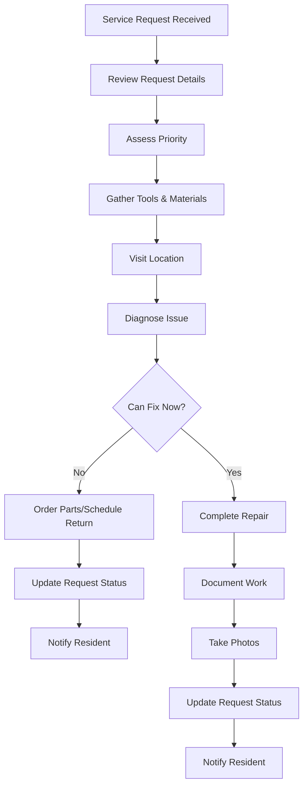
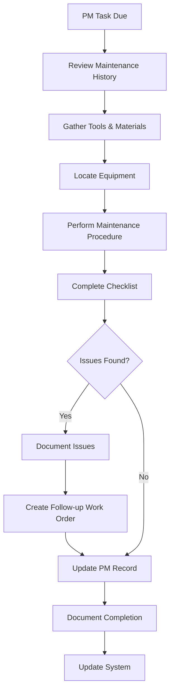

# Staff User Guide

> **Last Updated:** April 7, 2025 | **App Version:** 0.5.0 | **Role:** STAFF

## Role Overview

As a **Staff** member at Lofts des Arts, you have access to service-related features of the platform to perform maintenance, support residents, and assist with day-to-day building operations. Your role focuses on executing assigned tasks, responding to service requests, and maintaining the building's functionality and appearance.

## Responsibilities

- Addressing resident maintenance requests
- Performing scheduled preventative maintenance
- Managing building cleanliness and appearance
- Supporting building amenity operations
- Assisting with package handling when needed
- Ensuring building security protocols
- Communicating with residents about service issues
- Documenting completed work and maintenance records
- Monitoring building systems
- Reporting issues to management

## Dashboard Overview

Your dashboard provides a task-oriented view of your daily responsibilities:

- **Task List**: Your assigned tasks for the day and their priority
- **Service Requests**: New and in-progress resident requests
- **Maintenance Schedule**: Scheduled maintenance tasks
- **Announcements**: Important updates from management
- **Team Communication**: Messages from other staff and management
- **Building Status**: Current status of key building systems
- **Time Tracking**: Record of your work hours and tasks

## Available Features

### Service Request Management

- **Request Queue**: View and manage incoming service requests
- **Task Details**: Access detailed information about each request
- **Work Order Management**: Create and update work orders
- **Parts and Supplies**: Request and track maintenance supplies
- **Photo Documentation**: Take photos of issues and completed work
- **Resident Communication**: Send updates about service requests
- **Service History**: View historical service records by unit or area

### Maintenance Tools

- **Preventative Maintenance**: Schedule and track routine maintenance
- **System Checklists**: Follow guided inspection procedures
- **Maintenance Logs**: Document completed maintenance activities
- **Equipment Records**: Access information about building equipment
- **Maintenance Manuals**: View technical documentation
- **Inspection Forms**: Complete digital inspection forms
- **Compliance Tracking**: Ensure required maintenance is completed on schedule

### Communication Features

- **Staff Messaging**: Communicate with team members and management
- **Resident Updates**: Send status updates to residents
- **Emergency Alerts**: Receive critical information
- **Shift Notes**: Share information between shifts
- **Vendor Coordination**: Communicate with authorized vendors
- **Task Clarification**: Request additional information about assignments
- **Issue Reporting**: Escalate problems to management

### Building Systems

- **System Monitoring**: View status of building systems
- **Alarm Acknowledgment**: Respond to system alerts
- **Control Access**: Basic control of building systems
- **Issue Reporting**: Document system problems
- **Usage Monitoring**: Track utility usage and consumption
- **HVAC Management**: Basic temperature control functions
- **Security Checks**: Perform security system checks

## Common Tasks

### Service Request Management

1. **Processing a New Service Request**:
   - Navigate to `Service > Requests`
   - Review new requests in your assignment queue
   - Select a request to view details
   - Evaluate priority and requirements
   - Accept the assignment
   - Gather necessary tools and parts
   - Visit the location and assess the issue
   - Complete the repair or maintenance
   - Document work performed and materials used
   - Take photos of completed work
   - Update the request status
   - Notify resident of completion

2. **Scheduling Follow-up Work**:
   - Navigate to `Service > Active Requests`
   - Find the request requiring follow-up
   - Select `Schedule Follow-up`
   - Specify reason for follow-up
   - Determine parts or resources needed
   - Select preferred date and time
   - Add notes about special requirements
   - Submit follow-up request
   - Notify resident of planned return visit

3. **Requesting Parts or Supplies**:
   - Navigate to `Maintenance > Supplies`
   - Search for required part or supply
   - Check current inventory
   - Select `Request Item` if not in stock
   - Specify quantity needed
   - Indicate priority level
   - Associate with service request number
   - Submit request to management
   - Track request status

### Scheduled Maintenance

1. **Completing a Preventative Maintenance Task**:
   - Navigate to `Maintenance > Scheduled Tasks`
   - View your assigned maintenance tasks
   - Select task to view detailed instructions
   - Review maintenance history for the equipment
   - Gather necessary tools and materials
   - Perform maintenance according to procedure
   - Complete digital checklist for each step
   - Document findings and actions taken
   - Report any concerns or future needs
   - Update maintenance record with completion date
   - Attach photos of completed work

2. **Conducting System Inspections**:
   - Navigate to `Building > Inspections`
   - Select scheduled inspection from the list
   - Open the digital inspection form
   - Follow inspection protocol step by step
   - Record readings and observations
   - Note any deficiencies or concerns
   - Take photos of issues discovered
   - Complete the inspection form
   - Submit findings to management
   - Create follow-up tasks for identified issues

### Common Area Maintenance

1. **Managing Amenity Areas**:
   - Navigate to `Building > Common Areas`
   - Review daily tasks for each amenity
   - Check cleanliness and functionality
   - Inspect equipment for damage or wear
   - Clean and organize as required
   - Restock supplies as needed
   - Document completion of routine tasks
   - Report any issues requiring attention
   - Update amenity status for residents

2. **Responding to Common Area Issues**:
   - Navigate to `Service > Common Areas`
   - Review reported issues
   - Assess priority and response time
   - Gather appropriate tools and supplies
   - Address the issue according to guidelines
   - Document actions taken
   - Update area status
   - Report completion to management

## Maintenance Workflows

### Service Request Process

### Preventative Maintenance Workflow

## Troubleshooting

### Common Issues

| Issue | Resolution |
|-------|------------|
| **Parts unavailable** | Document needed parts, create order request, schedule follow-up, inform resident |
| **Access issues** | Contact resident to arrange access, reschedule if needed, notify management if persistent |
| **Task app errors** | Restart app, manually document work, report issue to IT support |
| **Complex repairs** | Document findings, take photos, request assistance from specialized maintenance |
| **Resident disputes** | Remain professional, document concerns, refer to management for resolution |

## Equipment & Systems Guide

| System | Common Issues | Basic Troubleshooting |
|--------|---------------|------------------------|
| **HVAC** | Uneven temperature, noise, poor airflow | Check filters, verify thermostat settings, inspect vents, check for obstructions |
| **Plumbing** | Leaks, clogs, water pressure | Locate shutoff valves, use appropriate plungers/augers, check aerators |
| **Electrical** | Outages, tripped breakers, fixture issues | Reset breakers, test GFCI outlets, check bulbs and connections |
| **Appliances** | Not running, poor performance, error codes | Verify power connections, clean filters, document error codes |
| **Door/Lock Systems** | Access issues, alignment problems | Check batteries, inspect hardware, lubricate moving parts |

## Best Practices

- **Communication**: Keep residents informed about service timing and status
- **Documentation**: Thoroughly document all work performed
- **Follow-up**: Ensure problems are fully resolved before closing requests
- **Efficiency**: Plan your route to minimize travel time between tasks
- **Time Management**: Prioritize emergency repairs appropriately
- **Safety First**: Always follow safety protocols and use PPE
- **Tool Care**: Maintain and organize your tools properly
- **Cleanliness**: Leave work areas clean after completion
- **Professional Conduct**: Maintain professional appearance and behavior
- **Continuous Learning**: Stay updated on building systems and repair techniques

## Important Contacts

- **Building Manager**: manager@loftsdesarts.com or ext. 400
- **Maintenance Supervisor**: supervisor@loftsdesarts.com or ext. 401
- **Front Desk**: frontdesk@loftsdesarts.com or ext. 402
- **Security**: security@loftsdesarts.com or ext. 403
- **Emergency Services**: 911 or building security at ext. 404
- **IT Support**: itsupport@loftsdesarts.com or ext. 405

## Resources

- [Maintenance Procedures Manual](../../documents/maintenance/procedures.md)
- [Building Systems Guide](../../documents/maintenance/systems.md)
- [Tool and Equipment Catalog](../../documents/maintenance/equipment.md)
- [Safety Protocols](../../documents/maintenance/safety.md)
- [Parts and Suppliers List](../../documents/maintenance/parts.md)
- [Troubleshooting Guides](../../documents/maintenance/troubleshooting.md)

## Training Resources

- **Systems Training**: Access specific building system training modules
- **Safety Courses**: Required safety training and certifications
- **Equipment Tutorials**: Instructions for specialized equipment
- **Service Standards**: Guidelines for resident interaction
- **Procedure Updates**: Regular updates on maintenance procedures

## Support Channels

If you encounter issues requiring assistance:
- **Maintenance Supervisor**: Contact for technical assistance
- **Building Manager**: Escalate resident concerns or complex issues
- **IT Support**: Contact for app or system issues
- **Emergency Services**: Call for situations requiring immediate assistance 