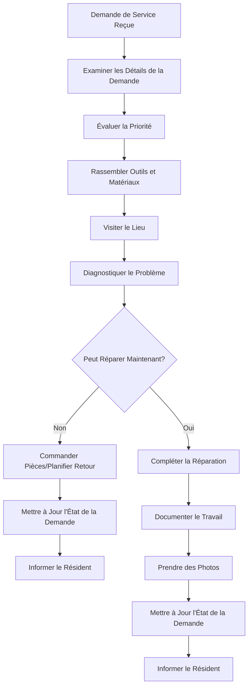
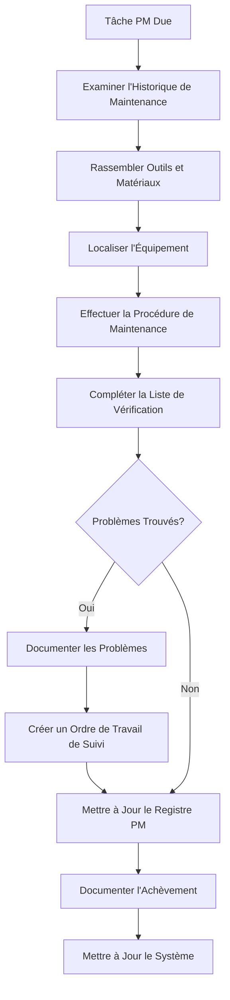

# Guide de l'Utilisateur Personnel

> **Dernière mise à jour :** 7 avril 2025 | **Version de l'Application :** 0.5.0 | **Rôle :** STAFF

## Aperçu du Rôle

En tant que membre du **Personnel** à Lofts des Arts, vous avez accès aux fonctionnalités de service de la plateforme pour effectuer la maintenance, soutenir les résidents et aider aux opérations quotidiennes du bâtiment. Votre rôle se concentre sur l'exécution des tâches assignées, la réponse aux demandes de service et le maintien de la fonctionnalité et de l'apparence du bâtiment.

## Responsabilités

- Répondre aux demandes de maintenance des résidents
- Effectuer la maintenance préventive programmée
- Gérer la propreté et l'apparence du bâtiment
- Soutenir les opérations des installations du bâtiment
- Aider à la manutention des colis lorsque nécessaire
- Assurer les protocoles de sécurité du bâtiment
- Communiquer avec les résidents concernant les problèmes de service
- Documenter les travaux achevés et les registres de maintenance
- Surveiller les systèmes du bâtiment
- Signaler les problèmes à la direction

## Aperçu du Tableau de Bord

Votre tableau de bord fournit une vue orientée tâches de vos responsabilités quotidiennes :

- **Liste des Tâches** : Vos tâches assignées pour la journée et leur priorité
- **Demandes de Service** : Nouvelles demandes des résidents et celles en cours
- **Calendrier de Maintenance** : Tâches de maintenance programmées
- **Annonces** : Mises à jour importantes de la direction
- **Communication d'Équipe** : Messages d'autres membres du personnel et de la direction
- **État du Bâtiment** : État actuel des principaux systèmes du bâtiment
- **Suivi du Temps** : Enregistrement de vos heures de travail et tâches

## Fonctionnalités Disponibles

### Gestion des Demandes de Service

- **File d'Attente des Demandes** : Voir et gérer les demandes de service entrantes
- **Détails des Tâches** : Accéder aux informations détaillées sur chaque demande
- **Gestion des Ordres de Travail** : Créer et mettre à jour les ordres de travail
- **Pièces et Fournitures** : Demander et suivre les fournitures de maintenance
- **Documentation Photographique** : Prendre des photos des problèmes et des travaux achevés
- **Communication avec les Résidents** : Envoyer des mises à jour concernant les demandes de service
- **Historique de Service** : Consulter les registres de service historiques par unité ou zone

### Outils de Maintenance

- **Maintenance Préventive** : Planifier et suivre la maintenance de routine
- **Listes de Vérification des Systèmes** : Suivre les procédures d'inspection guidées
- **Journaux de Maintenance** : Documenter les activités de maintenance achevées
- **Registres d'Équipement** : Accéder aux informations sur l'équipement du bâtiment
- **Manuels de Maintenance** : Consulter la documentation technique
- **Formulaires d'Inspection** : Remplir des formulaires d'inspection numériques
- **Suivi de Conformité** : S'assurer que la maintenance requise est effectuée selon le calendrier

### Fonctionnalités de Communication

- **Messagerie du Personnel** : Communiquer avec les membres de l'équipe et la direction
- **Mises à Jour pour les Résidents** : Envoyer des mises à jour d'état aux résidents
- **Alertes d'Urgence** : Recevoir des informations critiques
- **Notes de Quart** : Partager des informations entre les quarts de travail
- **Coordination des Fournisseurs** : Communiquer avec les fournisseurs autorisés
- **Clarification des Tâches** : Demander des informations supplémentaires sur les assignations
- **Signalement de Problèmes** : Transmettre les problèmes à la direction

### Systèmes du Bâtiment

- **Surveillance des Systèmes** : Consulter l'état des systèmes du bâtiment
- **Accusé de Réception d'Alarme** : Répondre aux alertes du système
- **Contrôle d'Accès** : Contrôle de base des systèmes du bâtiment
- **Signalement de Problèmes** : Documenter les problèmes de système
- **Surveillance de l'Utilisation** : Suivre l'utilisation et la consommation des services publics
- **Gestion CVC** : Fonctions de base de contrôle de température
- **Vérifications de Sécurité** : Effectuer des vérifications du système de sécurité

## Tâches Courantes

### Gestion des Demandes de Service

1. **Traitement d'une Nouvelle Demande de Service** :
   - Naviguer vers `Service > Demandes`
   - Examiner les nouvelles demandes dans votre file d'assignation
   - Sélectionner une demande pour voir les détails
   - Évaluer la priorité et les exigences
   - Accepter l'assignation
   - Rassembler les outils et pièces nécessaires
   - Visiter le lieu et évaluer le problème
   - Effectuer la réparation ou la maintenance
   - Documenter le travail effectué et les matériaux utilisés
   - Prendre des photos du travail achevé
   - Mettre à jour l'état de la demande
   - Informer le résident de l'achèvement

2. **Planification d'un Travail de Suivi** :
   - Naviguer vers `Service > Demandes Actives`
   - Trouver la demande nécessitant un suivi
   - Sélectionner `Planifier un Suivi`
   - Spécifier la raison du suivi
   - Déterminer les pièces ou ressources nécessaires
   - Sélectionner la date et l'heure préférées
   - Ajouter des notes sur les exigences spéciales
   - Soumettre la demande de suivi
   - Informer le résident de la visite de retour prévue

3. **Demande de Pièces ou Fournitures** :
   - Naviguer vers `Maintenance > Fournitures`
   - Rechercher la pièce ou fourniture requise
   - Vérifier l'inventaire actuel
   - Sélectionner `Demander Article` si non en stock
   - Spécifier la quantité nécessaire
   - Indiquer le niveau de priorité
   - Associer au numéro de demande de service
   - Soumettre la demande à la direction
   - Suivre l'état de la demande

### Maintenance Programmée

1. **Achèvement d'une Tâche de Maintenance Préventive** :
   - Naviguer vers `Maintenance > Tâches Programmées`
   - Consulter vos tâches de maintenance assignées
   - Sélectionner la tâche pour voir les instructions détaillées
   - Examiner l'historique de maintenance de l'équipement
   - Rassembler les outils et matériaux nécessaires
   - Effectuer la maintenance selon la procédure
   - Compléter la liste de vérification numérique pour chaque étape
   - Documenter les découvertes et actions entreprises
   - Signaler toute préoccupation ou besoin futur
   - Mettre à jour le registre de maintenance avec la date d'achèvement
   - Joindre des photos du travail achevé

2. **Réalisation d'Inspections de Système** :
   - Naviguer vers `Bâtiment > Inspections`
   - Sélectionner l'inspection programmée dans la liste
   - Ouvrir le formulaire d'inspection numérique
   - Suivre le protocole d'inspection étape par étape
   - Enregistrer les relevés et observations
   - Noter toute déficience ou préoccupation
   - Prendre des photos des problèmes découverts
   - Compléter le formulaire d'inspection
   - Soumettre les constatations à la direction
   - Créer des tâches de suivi pour les problèmes identifiés

### Maintenance des Espaces Communs

1. **Gestion des Zones d'Installations** :
   - Naviguer vers `Bâtiment > Espaces Communs`
   - Examiner les tâches quotidiennes pour chaque installation
   - Vérifier la propreté et la fonctionnalité
   - Inspecter l'équipement pour détecter les dommages ou l'usure
   - Nettoyer et organiser selon les besoins
   - Réapprovisionner les fournitures si nécessaire
   - Documenter l'achèvement des tâches de routine
   - Signaler tout problème nécessitant attention
   - Mettre à jour l'état des installations pour les résidents

2. **Réponse aux Problèmes d'Espaces Communs** :
   - Naviguer vers `Service > Espaces Communs`
   - Examiner les problèmes signalés
   - Évaluer la priorité et le temps de réponse
   - Rassembler les outils et fournitures appropriés
   - Traiter le problème selon les directives
   - Documenter les actions entreprises
   - Mettre à jour l'état de la zone
   - Signaler l'achèvement à la direction

## Flux de Travail de Maintenance

### Processus de Demande de Service

### Flux de Travail de Maintenance Préventive

## Dépannage

### Problèmes Courants

| Problème | Résolution |
|-------|------------|
| **Pièces non disponibles** | Documenter les pièces nécessaires, créer une demande de commande, planifier un suivi, informer le résident |
| **Problèmes d'accès** | Contacter le résident pour organiser l'accès, replanifier si nécessaire, informer la direction si persistant |
| **Erreurs de l'application de tâches** | Redémarrer l'application, documenter manuellement le travail, signaler le problème au support informatique |
| **Réparations complexes** | Documenter les découvertes, prendre des photos, demander l'assistance de la maintenance spécialisée |
| **Litiges avec les résidents** | Rester professionnel, documenter les préoccupations, référer à la direction pour résolution |

## Guide des Équipements et Systèmes

| Système | Problèmes Courants | Dépannage de Base |
|--------|---------------|------------------------|
| **CVC** | Température inégale, bruit, mauvaise circulation d'air | Vérifier les filtres, vérifier les réglages du thermostat, inspecter les bouches d'aération, vérifier les obstructions |
| **Plomberie** | Fuites, obstructions, pression d'eau | Localiser les vannes d'arrêt, utiliser les ventouses/furets appropriés, vérifier les aérateurs |
| **Électricité** | Pannes, disjoncteurs déclenchés, problèmes de luminaires | Réinitialiser les disjoncteurs, tester les prises GFCI, vérifier les ampoules et connexions |
| **Appareils** | Ne fonctionne pas, mauvaise performance, codes d'erreur | Vérifier les connexions électriques, nettoyer les filtres, documenter les codes d'erreur |
| **Systèmes de Porte/Serrure** | Problèmes d'accès, problèmes d'alignement | Vérifier les piles, inspecter le matériel, lubrifier les pièces mobiles |

## Meilleures Pratiques

- **Communication** : Tenir les résidents informés sur le calendrier et l'état du service
- **Documentation** : Documenter minutieusement tout le travail effectué
- **Suivi** : S'assurer que les problèmes sont complètement résolus avant de clôturer les demandes
- **Efficacité** : Planifier votre itinéraire pour minimiser le temps de déplacement entre les tâches
- **Gestion du Temps** : Prioriser les réparations d'urgence de manière appropriée
- **Sécurité d'Abord** : Toujours suivre les protocoles de sécurité et utiliser l'EPI
- **Soin des Outils** : Maintenir et organiser correctement vos outils
- **Propreté** : Laisser les zones de travail propres après l'achèvement
- **Conduite Professionnelle** : Maintenir une apparence et un comportement professionnels
- **Apprentissage Continu** : Rester à jour sur les systèmes du bâtiment et les techniques de réparation

## Contacts Importants

- **Gestionnaire d'Immeuble** : manager@loftsdesarts.com ou poste 400
- **Superviseur de Maintenance** : supervisor@loftsdesarts.com ou poste 401
- **Réception** : frontdesk@loftsdesarts.com ou poste 402
- **Sécurité** : security@loftsdesarts.com ou poste 403
- **Services d'Urgence** : 911 ou sécurité de l'immeuble au poste 404
- **Support Informatique** : itsupport@loftsdesarts.com ou poste 405

## Ressources Additionnelles

- **Manuels Techniques** : Accès aux manuels d'équipement et aux schémas du bâtiment
- **Formation Vidéo** : Tutoriels sur les procédures de maintenance communes
- **Base de Connaissances** : Solutions aux problèmes fréquemment rencontrés
- **Catalogue de Pièces** : Liste des pièces de rechange couramment utilisées
- **Procédures d'Urgence** : Protocoles pour les situations d'urgence

## Outils et Formations

- **Inventaire des Outils** : Liste des outils disponibles pour le personnel de maintenance
- **Calendrier de Formation** : Opportunités de formation continue
- **Certifications Requises** : Exigences de certification pour diverses tâches
- **Instructions de Sécurité** : Directives pour l'utilisation sécuritaire des équipements et matériaux
- **Assistance Technique** : Ressources pour le soutien technique spécialisé

---

[English Version](./README.md) 